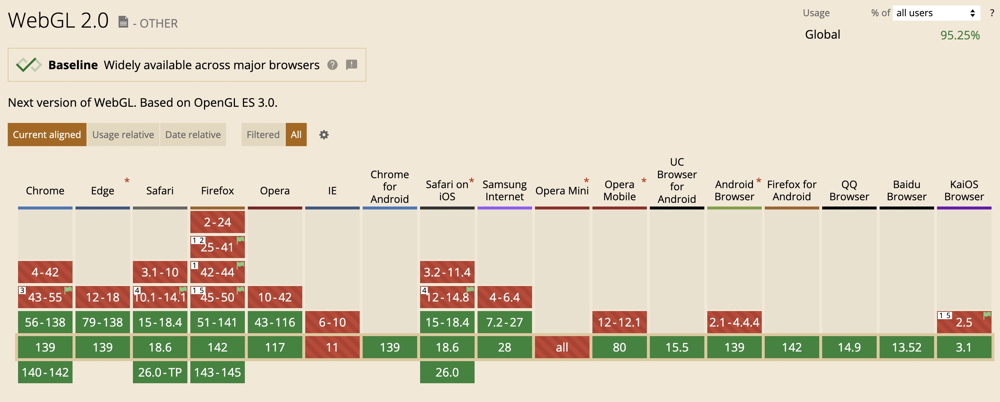
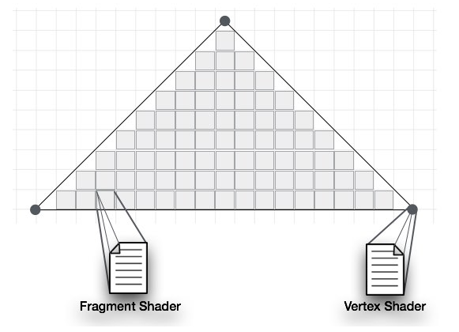
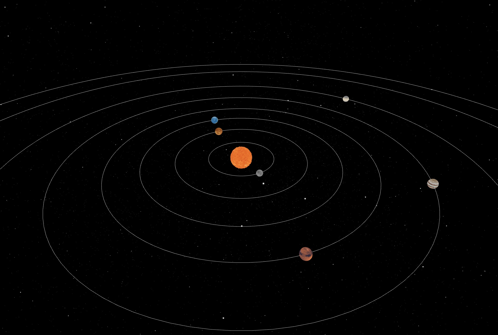
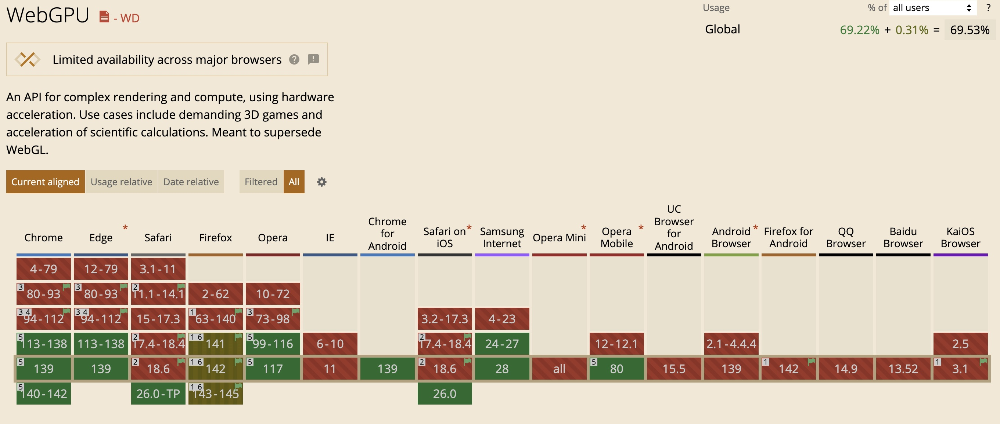

# WebGL (Web Graphics Library)


## WebGL 소개
- 웹 브라우저에서 GPU를 통해 2D와 3D 그래픽을 렌더링할 수 있게 도와주는 low level JavaScript API
(GPU 동작 방식을 직접 제어해야하는, 추상화가 거의 없는 API)

- 과거에는 웹에서 그래픽을 활용하려면 별도의 플러그인이나 소프트웨어 설치가 필요했지만, WebGL의 등장으로 브라우저만으로도 가능해짐
- WebGL은 **OpenGL을** 기반으로 만들어짐

### OpenGL / OpenGL ES / WebGL 관계
- **OpenGL**: C/C++ 같은 네이티브 언어에서 GPU를 직접 제어할 수 있게 해주는 그래픽스 API. 주로 PC, 게임기, 시뮬레이터 등에서 사용
- **OpenGL ES**: 모바일/임베디드 환경용으로 경량화된 버전
- **WebGL**: 이 OpenGL ES를 자바스크립트로 포팅한 API. 즉 브라우저 안에서 GPU에 접근할 수 있도록 만든 표준

### 비교

| 구분 | OpenGL | WebGL |
|------|--------|--------|
| 실행환경 | 네이티브 앱 (C/C++) | 웹 브라우저 (JS) |
| 버전 | OpenGL 3.x, 4.x 등 다양 | OpenGL ES 2.0, 3.0 기반 |
| shader 언어 | GLSL | GLSL ES (거의 동일) |
| 용도 | 게임, CAD, 그래픽 소프트웨어 | 웹사이트, WebApp, 인터랙티브 3D |

WebGL: 웹에서 GLSL 언어로 작성된 셰이더 프로그램을 GPU에 올려 실행할 수 있게 해주는 브릿지

### 호환
- 2011년: WebGL 1.0 (OpenGL ES 2.0 기반)
- 2017년: WebGL 2.0 (OpenGL ES 3.0 기반)




## Shader

- 셰이더(Shader)는 GPU에서 실행되는 작은 프로그램
- 렌더링 파이프라인에서 어디에 그릴지(기하 변환)와 무슨 색으로 그릴지(셰이딩)를 결정
- WebGL에서는 정점 셰이더와 프래그먼트 셰이더 두 종류를 사용

### 정점 셰이더
- 모든 정점마다 호출되어 모델의 3D 정점 좌표를 화면에 그릴 좌표로 변환
- 하는일
  - 정점 변환(모델·뷰·프로젝션 행렬: 이동, 회전, 스케일)
  - 법선(normal) 변환 및 정규화
  - 텍스처 좌표 생성/변환
  - 간단한 조명 계산(필요 시)

###  프래그먼트 셰이더
- 프래그먼트마다 호출되어 최종 색상을 계산
- 하는 일
  - 정점 단계에서 넘어온 값(색, UV, 조명 등)을 연산
  - 안개, 색상, 조명, 그림자 등 픽셀 단위 처리




### 코드 예시
```html
<canvas id="c"></canvas>

<script>
  // [1] WebGL2 컨텍스트 얻기
  const gl = document.getElementById('c').getContext('webgl2');

  // [2] 셰이더

  //정점 셰이더
  const vs = `#version 300 es
  in vec2 a_pos;      // 정점 위치
  void main() {
    gl_Position = vec4(a_pos, 0.0, 1.0);
  }`;

 //프래그먼트 셰이더
  const fs = `#version 300 es
  precision mediump float;
  uniform vec3 u_color;
  out vec4 outColor;
  void main() {
    outColor = vec4(u_color, 1.0);
  }`;

  // [3] 셰이더 컴파일 + 프로그램 링크
  const compile = (type, src) => {
    const s = gl.createShader(type);
    gl.shaderSource(s, src);
    gl.compileShader(s);
    return s;
  };
  const program = gl.createProgram();
  gl.attachShader(program, compile(gl.VERTEX_SHADER, vs));
  gl.attachShader(program, compile(gl.FRAGMENT_SHADER, fs));
  gl.linkProgram(program);
  gl.useProgram(program);

  // [4] 정점 데이터 업로드 (x, y만)
  const verts = new Float32Array([
     0.0,  0.75,  // 위
    -0.8, -0.65,  // 좌하
     0.8, -0.65   // 우하
  ]);
  const vbo = gl.createBuffer();
  gl.bindBuffer(gl.ARRAY_BUFFER, vbo);
  gl.bufferData(gl.ARRAY_BUFFER, verts, gl.STATIC_DRAW);

  // [5] VAO 생성 후 속성 설명 (a_pos)
  const vao = gl.createVertexArray();
  gl.bindVertexArray(vao);

  const a_pos = gl.getAttribLocation(program, 'a_pos');
  gl.enableVertexAttribArray(a_pos);
  gl.vertexAttribPointer(a_pos, 2, gl.FLOAT, false, 0, 0);

  // [6] 색상 uniform 설정 (예: 주황색)
  const u_color = gl.getUniformLocation(program, 'u_color');
  gl.uniform3fv(u_color, [1.0, 0.4, 0.2]);

  // [7] 화면 지우고 그리기
  gl.viewport(0, 0, gl.drawingBufferWidth, gl.drawingBufferHeight);
  gl.clearColor(0.97, 0.98, 1.0, 1.0);
  gl.clear(gl.COLOR_BUFFER_BIT);

  gl.bindVertexArray(vao);
  gl.drawArrays(gl.TRIANGLES, 0, 3);
</script>
```


## WebGL 라이브러리
- WebGL은 강력하지만 너무 로우레벨 API → 버퍼 바인딩, 셰이더 작성, 행렬 계산 등 모든 걸 직접 해야 함
- 기본 도형 하나 그리는 것도 코드가 길고 복잡
- Three.js, Babylon.js, D3.js (with WebGL)
- 추상화된 라이브러리를 사용해서 생산성을 높여보자


### Three.js
- 가장 널리 쓰이는 WebGL 3D 라이브러리
- 카메라, 조명, 재질, 모델 로딩 등 고수준 API 제공
- 복잡한 3D 장면을 간단한 코드로 구현 가능
- WebXR(AR/VR)까지 지원

Three.js에서는 '물체', '빛', '눈'으로 '본다'라는 행위를 정의한다. 이것을 각각 Mesh, Light, Camera라고 부른다.

#### Mesh
Mesh 객체는 형상정보(Geometry)와 재료정보(Material)로 구성되어 있으며, 3D 화면을 구성하는 물체이다. Mesh 객체가 만들어지면 설정값을 통해서 3D 공간상의 위치를 정할 수 있다.

``` javascript
const geometry = new THREE.BoxGeometry(1, 1, 1);//가로,세로,높이
const material = new THREE.MeshBasicMaterial({ color: 0x00ff00 });
const cube = new THREE.Mesh(geometry, material);
cube.position.set(0,0,0)//x,y,z 위치
```

### Light
Light 객체는 빛이다. 전체를 은은하게 비추는 AmbientLight, 한 방향으로 뻗어나가는 DirectionalLight, 특정 부분을 강조할 수 있는 SpotLight 등 다양한 옵션이 있다.

```javascript
const ambientLight = new THREE.AmbientLight("white", 1);//색상, 강도
```

### Camera
Camera 객체는 눈에 해당한다. Scene 객체를 촬영하여 어떻게 보여줄 것인가를 결정한다. 같은 Scene이라고 하더라도, 카메라의 위치 및 기타 설정값들을 통해서 다른 화면을 보여줄 수 있다.

### Scene
Scene 객체는 무대를 나타낸다. 생성한 물체(Mesh)와 빛(Light) 그리고 카메라(Camera)를 추가 해준다.

```javascript
const scene = new THREE.Scene();
scene.add(cube);
scene.add(ambientLight);
scene.add(camera);
```


``` javascript
const camera = new THREE.PerspectiveCamera(
  75, //시야각
  window.innerWidth / window.innerHeight,//종횡비
  0.1, //near
  1000 //far
);
camera.position.set(1, 1, 5);//x,y,z 위치
```


### Renderer

```html
<body>
	<canvas></canvas>
</body>
```

Renderer는 카메라 설정값을 기반으로 Scene에서 보여줄 화면을 계산하고, 브라우저에 해당 화면을 출력해준다.

```javascript
const canvas = document.querySelector("canvas");
const renderer = new THREE.WebGLRenderer({canvas});
renderer.setSize(window.innerWidth, window.innerHeight);//윈도우 전체
renderer.render(scene, camera);
```


### 데모
https://three-solar-system-git-main-hbh4231s-projects.vercel.app/




## WebGPU

### WebGL의 한계
- 2011년에 나온 OpenGL ES → 최신 GPU 기능 활용에 제한적
- WebGL은 싱글스레드 기반이라, 모든 드로우콜 세팅이 메인 스레드에서 처리 => 드로우콜이 많아지면 CPU에 병목 (GPU는 한가)
- GPU 연산 제한: 그래픽 렌더링만 가능, 머신러닝/데이터 연산에는 부적합
- 플랫폼 호환성: 브라우저마다 최적화 차이가 크고, 디버깅 도구 부족

### WebGPU의 등장
- 최신 GPU API(Vulkan, Metal, Direct3D)를 웹에서도 활용
- 멀티스레드 최적화로 CPU 병목 해결
- 범용 GPU 연산 지원 (Compute Shader) → 머신러닝, 과학 계산, 데이터 처리까지 가능

```
WebGL → canvas.getContext("webgl")
WebGPU → canvas.getContext("webgpu")

//three.js
const renderer = new WebGPURenderer({ canvas });
```




#### reference
https://code-masterjung.tistory.com/110
https://velog.io/@h_ani99/WebGL-%EA%B0%9C%EC%9A%94-%EB%B0%8F-%EC%8B%A4%EC%8A%B5
https://dirtycoders.net/what-if-you-were-free-to-render-2d-and-3d-on-the-web-what-is-webgl/#google_vignette
https://roseline.oopy.io/dev/webgl