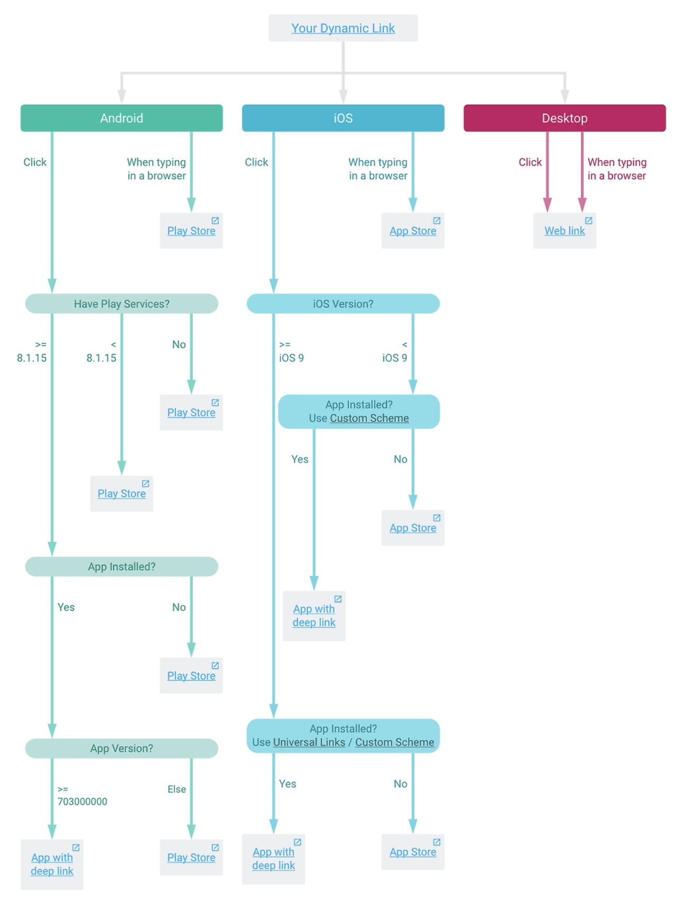

# Deep Link

# 딥링크란?
- 사용자를 앱 내부의 특정 화면으로 이동시키는 링크
- 링크를 클릭하면 앱이 실행되며, 지정된 화면으로 즉시 진입

## 사용 사례
- 메신저 공유: 링크 클릭 시 앱이 실행되고, 공유한 콘텐츠나 게시글을 바로 열 수 있음
- 광고 클릭: 광고 배너를 클릭하면 상품 또는 이벤트 화면으로 바로 이동
- 푸시 알림: 알림 클릭 시 알림함, 쿠폰함 등 기능 페이지로 바로 진입
- 웹 결제 연동: 결제수단 선택 시 관련 앱을 실행하고 결제를 진행
- 추천 링크 공유: 앱 미설치 상태에서 링크 클릭 → 설치 후 추천인 코드나 이벤트 자동 적용

## 기대 효과
- UX 향상: 사용자의 이동 경로를 단축시켜 이탈률을 줄일 수 있음
- 전환율 증가: 원하는 화면으로 직접 유도하여 결제, 가입, 이벤트 참여 등 전환율을 높일 수 있음
- 데이터 전달 가능: URL 파라미터를 통해 token, id, form 입력값 등을 함께 전달할 수 있음

# 딥링크의 종류

## Custom Scheme

- 별다른 제약없이 개발자가 직접 원하는 스킴을 정해서 만들 수 있음

### 동작 원리

#### 1. 앱에 스킴 등록
- 사용할 커스텀 스킴을 Info.plist에 등록
- 앱 설치 시점에 디바이스에 스킴과 앱의 매핑 정보가 등록됨

```swift
<!-- IOS -->
<!-- Info.plist -->
<key>CFBundleURLTypes</key>
<array>
  <dict>
    <key>CFBundleURLSchemes</key>
    <array>
      <string>myapp</string>  <!-- 사용할 스킴 (예: myapp://) -->
    </array>
  </dict>
</array>
```

#### 2. 외부에서 링크 클릭
- 사용자가 메신저, 브라우저, 광고 등에서 아래와 같은 링크 클릭

```json
myapp://product/123?ref=push
```

#### 3. OS가 스킴 처리 가능한 앱 탐색
- 해당 스킴(myapp://)을 처리할 수 있는 앱이 있는지 확인
- 있으면 앱 실행, 없으면 아무 일도 발생하지 않음


#### 4. 앱 실행 및 URL 전달
- 앱 실행 시 URL 정보 전달됨

```swift
<!-- IOS -->
func application(_ app: UIApplication, open url: URL,
                 options: [UIApplication.OpenURLOptionsKey : Any] = [:]) -> Bool {
    // 예: myapp://product/123?ref=push
    let path = url.path         // "/product/123"
    let query = url.query       // "ref=push"

    // 경로 기반으로 라우팅 처리
    routeToScreen(path: path, query: query)
    return true
}
```


#### 한계
- 앱이 설치되어 있을 때만 동작
- 원하는 스킴을 아무나 정의할 수 있음 (스킴에 대한 소유권 개념 없음)
- 동일한 스킴을 여러 앱이 사용하면 충돌 발생
  - Android: 어떤 앱으로 열지 선택 팝업 표시
  - iOS: 마지막에 설치된 앱이 실행 => 다른 앱이 동일한 스킴을 등록해 사용자를 가로채는 방식 가능


#### 앱 미설치 예외 처리

```javascript
useEffect(() => {
  function handler() {
    clearTimeout(timerRef.current);
  }

	// (3) window의 visibilitychange 이벤트가 발생하면 앱이 실행됐다고 가정한다. timeout을 제거한다. 
  window.addEventListener('visibilitychange', handler);
}, []);

const launchApp = (url: string) => {
	// (1) 주어진 딥링크로 앱을 실행한다
  location.href = url;

	// (2) 일정한 시간동안 앱이 실행되지 않으면 특정 기능을 실행하는 timeout을 생성한다 
  timerRef.current = setTimeout(() => {
    onLaunchFail();
  }, 2000);
};
```

## App Link 와 Universal Link
- 2015년 iOS는 Universal Link, Android는 App Link 도입
- https://myapp.com/... 같은 웹 URL을 앱과 연결해, 링크 클릭 시 앱을 실행
- 앱이 설치되어 있지 않으면 자동으로 웹 페이지로 fallback
- 커스텀 스킴(myapp://...)과 달리, 도메인 소유자임을 인증해야 하기 때문에 보안성이 높음
### 동작 원리

#### 1. 도메인에 인증 파일 업로드
##### iOS (Universal Link)
- https://myapp.com/.well-known/apple-app-site-association 파일 업로드
```
{
  "applinks": {
    "apps": [],
    "details": [
      {
        "appID": "ABCDE12345.com.example.myapp",
        "paths": [ "/product/*", "/event/*" ]
      }
    ]
  }
}
```

##### Android (App Link)
- https://myapp.com/.well-known/assetlinks.json 파일 업로드
```
[
  {
    "relation": ["delegate_permission/common.handle_all_urls"],
    "target": {
      "namespace": "android_app",
      "package_name": "com.example.myapp",
      "sha256_cert_fingerprints": [
        "12:34:56:...:AB:CD:EF"
      ]
    }
  }
]
```
- 앱 설치 시 인증 파일(apple-app-site-association / assetlinks.json)을 가져와 로컬에 캐싱
- 링크 클릭 시마다 서버에 요청하지 않음

#### 2. 앱 설정 (도메인 연동)

##### iOS (Universal Link)
- Xcode > Signing & Capabilities > Associated Domains

```swift
applinks:myapp.com
```


##### Android (App Link)
AndroidManifest.xml에 intent-filter와 autoVerify 추가

```kotlin
<intent-filter android:autoVerify="true">
  <action android:name="android.intent.action.VIEW" />
  <category android:name="android.intent.category.DEFAULT" />
  <category android:name="android.intent.category.BROWSABLE" />
  <data android:scheme="https"
        android:host="myapp.com"
        android:pathPrefix="/product" />
        android:pathPrefix="/event" />
</intent-filter>
```


#### 3. https://myapp.com/product/123?ref=push 형태의 링크 클릭

#### 4. OS가 앱 실행 여부 판단
앱이 설치되어 있고, 도메인 인증이 완료돼 있으면 앱 실행, 아니라면 웹 페이지로 fallback

#### 5. 앱 실행 후 URL 전달 및 처리
```swift
func scene(_ scene: UIScene, continue userActivity: NSUserActivity) {
  guard userActivity.activityType == .BrowsingWeb,
        let url = userActivity.webpageURL else { return }

  let path = url.path     // "/product/123"
  let query = url.query   // "ref=push"
  routeToScreen(path: path, query: query)
}
```

### 한계
- 주소창에 링크를 직접 입력하면 동작하지 않음
- 카카오톡, 페이스북, 인스타그램 등 인앱 브라우저에서는 동작이 불안정할 수 있음
- 앱이 설치되어 있지 않으면, 설치 후 다시 링크를 전달해야 하는 번거로움


###  Intent Scheme (Android 전용)
- Android에서 커스텀 스킴 방식의 한계를 보완하기 위해 사용
- 앱이 설치되어 있지 않은 경우에도 fallback URL 지정 가능
- iOS에서는 동작하지 않으며, 일부 브라우저에서는 제한적으로만 지원됨

```
<a href="intent://product/123#Intent;scheme=myapp;package=com.example.myapp;S.browser_fallback_url=https://myapp.com/product/123;end;">
  상품 보기
</a>
```

### Deferred Deep Link
- 앱이 설치되어 있지 않아도, 설치 후 앱 실행 시 원하는 화면으로 이동할 수 있게 해주는 딥링크 방식

#### 직접 구현 한다면..
- 딥링크 클릭 시, 유저가 앱 설치 여부와 관계없이 거치는 중간 페이지를 하나 만든다.
- 이 중간 페이지에서 사용자의 정보를 로컬에 저장(예: 쿠키, 브라우저 localStorage)하거나 서버에 기록한다.
- 앱 설치 후 실행되면, 저장된 정보를 조회해서 유저가 처음에 보려던 콘텐츠로 이동시킨다
=> 구현 복잡도가 높고, 사용자 환경에 따라 동작 보장이 어려움


### Deep Link 서비스

#### Dynamic Link (Firebase)
- 무료, 코드로 동적 링크 생성 가능
- 링크 끝에 ?d=1을 붙이면 디버깅용 분석 페이지 표시됨
- 2025년 8월 25일 서비스 종료..




#### One Link (AppsFlyer)
- 유저가 링크를 클릭한 시점의 정보를 서버에 저장
- 앱 설치 후 실행되면, 해당 정보를 바탕으로 사용자가 보려던 경로로 이동
- 설치, 실행, 전환 이벤트 추적 가능
- 채널/캠페인 단위의 유입 분석 지원

#### 그외 다양한 서비스
- Airbridge – Tracking Link
- Branch – Branch Links
- Adjust – Deeplink Generator
- Kochava – SmartLinks
- Singular – Deep Link Generator
- TUNE (HasOffers) – Tracking Links

#### reference
https://docs.tosspayments.com/resources/glossary/deep-link
https://www.airbridge.io/ko/blog/what-is-deep-link
https://medium.com/prnd/%EB%94%A5%EB%A7%81%ED%81%AC%EC%9D%98-%EB%AA%A8%EB%93%A0%EA%B2%83-feat-app-link-universal-link-deferred-deeplink-61d6cf63a0a5
https://binux.tistory.com/172