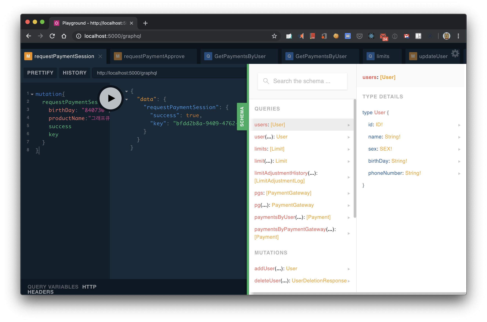
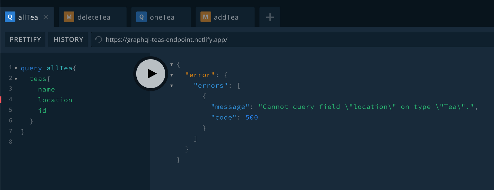

# REST API vs GraphQL (2)

## GraphQL

페이스북이 만든 쿼리 언어이며, REST API의 문제를 해결하기 위해 개발

- 오버패칭
- 언더패칭
- 백엔드 API가 수정될 때마다 API 명세서를 수정해야 함
- 백엔드 API가 수정될 때마다 프론트엔드 코드가 수정될 수 있는 문제

## REST API vs GraphQL

|               | REST API                                 | GraphQL                                |
| ------------- | ---------------------------------------- | -------------------------------------- |
| 호출          | 여러 엔드포인트 호출 (/users, /articles) | 단일 엔드포인트 (/graphql)             |
| 데이터 요청   | 항상 동일한 데이터 구조 (오버패칭)       | 클라이언트가 원하는 데이터만 요청 가능 |
| 데이터 조작   | CRUD (GET, POST, DELETE, UPDATE)         | query(조회), mutation(수정)            |
| 에러 처리 | HTTP 상태 코드로 에러 구분               | `errors` 필드를 통해 에러 정보 제공    |

<br>

## 데이터 요청/조작

#### REST API

: HTTP 메서드(GET, POST, PUT, DELETE)를 사용

- 클라이언트 데이터 요청

```js
axios
  .get(`/api/users/${userId}`)
  .then((response) => setUser(response.data))
  .catch((error) => console.error(error));
axios
  .get(`/api/users/${userId}/friends`)
  .then((response) => setFriens(response.data))
  .catch((error) => console.error(error));
```

#### GraphQL

: 데이터 조회(Query), 수정(Mutation)

- 클라이언트 데이터 요청

```jsx
query {
  user(id: 1) {
    id
    name
    email
    friends {
      name
    }
  }
}
```

```jsx
mutation {
  createUser(user: {id: 3, name: "John", email: "john@test.com"}) {
    id
    name
    email
  }
}

```

- 스키마/타입 정의
  : 어떤 데이터를 요청하고 어떤 방식으로 요청을 보낼 수 있는지 정의

```js
const { ApolloServer, gql } = require('apollo-server');

const typeDefs = gql`
  type User {
    id: Int!
    name: String!
    email: String!
    friends: [Friend]
  }

  type Friend {
    name: String!
    email: String!
  }

  input NewUser {
    id: Int!
    name: String!
    email: String!
  }

  type Query {
    users(): [User]
    user(id: Int!): User
  }

  type Mutation {
    createUser(name: String!, email: String!): User
    deleteUser(userId: ID!): Boolean
  }
```

- 리졸버 (resolvers)
  : GraphQL 서버에서 쿼리, 뮤테이션을 처리하는 함수

```js
const dummyUsers = [{ id: 1, name: 'kim', email: 'kim@test.com', friends: [{ name: 'Lee', email: 'lee@test.com'}, { name: 'Pack', email: 'pack@test.com' }] }, { id: 2, name: 'Lee', email: 'lee@test.com', friends: [{ name: 'kim', email: 'kim@test.com', friends: [] }}]

const resolvers = {
  Query: {
    users: () => {
      return dummyUsers
    },
    user: (_: any, { id }: { id: number }) => {
	    const user = dummyUsers.find(user => user.id === id)
	    return user
    },
  },
  Mutation: {
    createUser: (_: any, { user }: { user: NewUser }) => {
      const newUser = {
        ...user,
        friends: []
      }
      users.push(newUser)
      return newUser
    },
    deleteUser: (_: any: unknown, { id }: { id: number }) => {
      dummyUsers = dummyUsers.filter((user) => user.id !== id)
      return true
    },
  },
  User: {
    friends: (user: User) => {
      return user.friends;
    },
  },
}
```


  #### Apollo-client

  React 애플리케이션에서 GraphQL API와 쉽게 상호작용 가능 (리액트에서 사용할 경우 Redux를 대체 가능)

  ```jsx
  npm i graphql @apollo/client
  ```

  - 설정

  ```jsx
  import { ApolloClient } from '@apollo/client';
  import { ApolloProvider } from '@apollo/client/react';

  const client = new ApolloClient({
    uri: 'https://localhost:8001',
    // + 캐시 기능
    cache: new InMemoryCache(),
  });

  ReactDOM.render(
    <ApolloProvider client={client}>
      <App />
    </ApolloProvider>,
    document.getElementById('root')
  );
  ```

  - 사용

  ```jsx
  import { gql } from '@apollo/client';

  const getUser = gql`
    query user($id: Int!) {
      user(id: $id) {
        id
        name
	email
        friends {
          name
        }
      }
    }
  `;
  ```


- 응답 데이터

```jsx
{
  "data": {
    "user": {
      "id": 1,
      "name": "Kim",
      "email": "kim@test.com",
      "friends": [
        { "name": "Lee" },
        { "name": "Park" }
      ]
    }
  }
}
```

<br>

## API 테스트와 명세

|             | **REST API** | **GraphQL**        |
| ----------- | ------------ | ------------------ |
| 테스트 도구 | Postman      | GraphQL Playground |
| API 명세    | Swagger      | GraphQL Playground |

### GraphQL Playground

[GitHub - graphql/graphql-playground: 🎮 GraphQL IDE for better development workflows (GraphQL Subscriptions, interactive docs & collaboration)](https://github.com/graphql/graphql-playground?tab=readme-ov-file)

- 테스트 & 명세 예시 (이미지 출처: https://tech.kakao.com/posts/364)



<br>

## 에러 처리

#### REST API

- HTTP 상태 코드 (400, 500 Error)

#### GraphQL

- errors 배열에 에러 정보 제공



<br>

++ 추가)

직접 사용해 봤을 때 GraphQL 불편했던 점
- 프론트엔드 코드가 길어질 수 있다. 필요한 필드를 모두 작성해야 함
- 리졸버 관리: 프로젝트가 커질수록 리졸버 관리가 어렵다는 점. 프로젝트가 모든 필드를 한 곳에 정의하면 관리가 힘들기 때문에 보통 모듈 단위로 리졸버를 나눠서 관리합니다.
- 리졸버 네이밍.. 프론트에서 어떤 로직을 처리하는 건지 리졸버 네임을 통해 파악하므로 명확한 네이밍이 중요.. 그래서 리졸버 네임이 길어지는 경우도 많음


