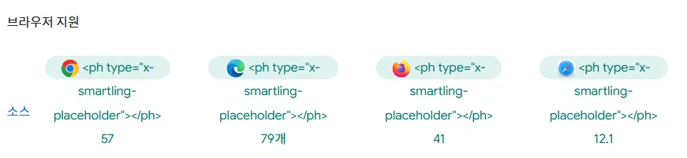
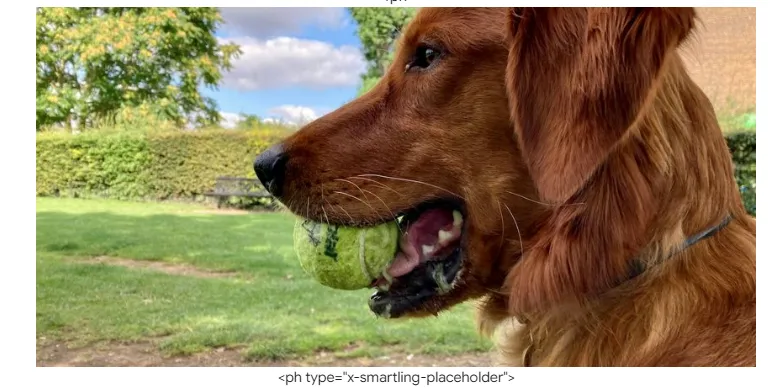
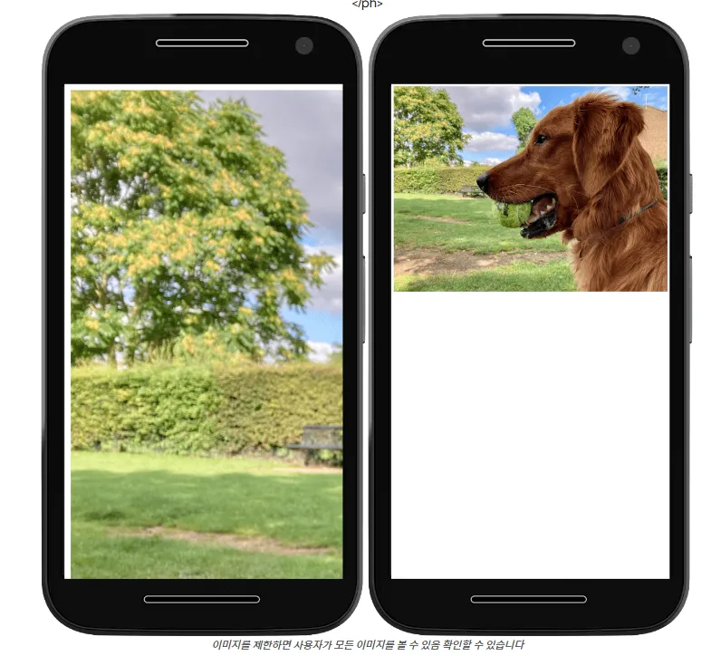

# 반응형 이미지

- 이미지에는 고유한 크기가 있다.
- 이미지가 이미지가 화면보다 넓으면 이미지가 오버플로되므로 사용자가 스크롤해야 모든 것을 볼 수 있다

## 이미지 제한

이미지의 크기를 자체 해상도보다 큰 크기로 요소가 포함된다.

```css
img {
  max-inline-size: 100%;
  block-size: auto;
}

=> 이미지는 부모 요소의 너비를 초과하지 않는다.
=> 이미지의 원래 비율이 유지
=> 이미지는 필요에 따라 축소될 수 있지만, 원래 크기보다 커지지는 않는다.
=> 반응형에 적합
```

- `max-inline-size`
  **`max-inline-size`**는 요소의 인라인 방향(보통 가로 방향)의 최대 크기를 설정
  이미지가 컨테이너보다 커지는 것을 방지하면서도 원래 크기보다 작은 컨테이너에서는 축소될 수 있게 한다.
- `block-size`
  **`block-size`**는 요소의 블록 방향(보통 세로 방향)의 크기를 설정
  **`auto`**로 설정하면 이미지의 원래 종횡비를 유지하면서 높이가 자동으로 조정된다.

)



`aspect-ratio`를 활용하여 다른 가로 세로 비율을 적용할 수 있다.

```css
img {
  max-inline-size: 100%;
  block-size: auto;
  aspect-ratio: 2/1;
}
```


찌그러지거나 늘어나지 않게 하려면 `object-fit` 을 활용한다.

```css
img {
  max-inline-size: 100%;
  block-size: auto;
  aspect-ratio: 2/1;
  object-fit: contain;
}
```


- `object-fit`의 값이 `contain`이면 이미지의 가로세로 비율, 필요한 경우 이미지 주위에 빈 공간을 남겨둔다.

```css
img {
  max-inline-size: 100%;
  block-size: auto;
  aspect-ratio: 2/1;
  object-fit: cover;
}
```



- `object-fit` 값이 `cover`이면 이미지의 가로세로 비율을 조정하고 필요한 경우 이미지를 자른다.

## 이미지 크기를 알고 있다면

[WOQn6K6OQcoElRw0NCkZ.mp4](https://prod-files-secure.s3.us-west-2.amazonaws.com/0506af35-6b8b-4c06-9c1c-7fe328d8aee6/21a2ed15-1b5f-41d7-98f7-0afc3b75aa04/WOQn6K6OQcoElRw0NCkZ.mp4)

```jsx

```

```css
.responsive-image {
  max-inline-size: 100%;
  block-size: auto;
}
```

이미지 크기를 알고 있다면 항상 `width`랑 `height`값을 지정해라!

⇒ 레이아웃 시프트를 방지할 수 있다. 이미지가 로드 되기전에 브라우저가 미리 공간을 확보함

속성 이미지 크기 조정으로 인해 이미지가 다른 크기로 렌더링되는 경우에도 브라우저는 여전히 너비 대 높이 비율을 알고 있으며 적당한 공간을 남겨둘 수 있다.

[sFxDb36aEMvTPIyZHz1O.mp4](https://prod-files-secure.s3.us-west-2.amazonaws.com/0506af35-6b8b-4c06-9c1c-7fe328d8aee6/bf466a25-badd-4ba8-987d-f97df82fc463/sFxDb36aEMvTPIyZHz1O.mp4)

## 로드

스크롤 해야 볼 수 있는 부분의 이미지에는 lazy를 적용하라.

브라우저는 사용자가 충분히 스크롤할 때까지 lazy loading이 적용된 이미지를 로드하지 않는다.

```jsx

```

[jazsyaOjXfHS0g8yUijR.mp4](https://prod-files-secure.s3.us-west-2.amazonaws.com/0506af35-6b8b-4c06-9c1c-7fe328d8aee6/f24bf383-ed93-4b70-97dc-04f3881387b7/jazsyaOjXfHS0g8yUijR.mp4)

- **`loading="lazy"`** 속성은 뷰포트(화면에 보이는 영역) 밖에 있는 이미지에 사용
- 사용자가 스크롤해야만 볼 수 있는 이미지들에 이 속성을 적용하기
- 뷰포트 내에 있거나 바로 근처에 있는 이미지에는 이 속성을 사용하지 않는 것이 좋다. ⇒ 즉시 보여져야하기 때문에
- default는 `loading="eager"`

## 우선순위

[LCP](https://web.dev/articles/lcp?hl=ko) 이미지와 같은 중요한 이미지의 경우

- **`fetchpriority="high"`**를 사용하여 중요한 이미지(예: LCP 이미지)의 로딩 우선순위를 높일 수 있다.

```jsx

```

이렇게 하면 브라우저에 이미지를 즉시 가져오라고 지시한다.

- 일반적으로 브라우저는 레이아웃 완료 후 이미지 우선순위를 결정한다.
- **`fetchpriority="high"`**를 사용하면 브라우저가 레이아웃 완료를 기다리지 않고 즉시 이미지 로딩을 시작한.
- **`fetchpriority="high"`**는 실제로 중요한 이미지에만 사용할 것! LCP나 사용자 경험에 직접적인 영향을 미치는 이미지에만!!

## **`srcset`**

`max-inline-size`: 100% 사용의 한계

- 이 CSS 속성은 이미지가 컨테이너 너비를 초과하지 않도록 한다.

⇒ 불필요하게 큰 이미지를 다운로드 하는 문제를 해결하지는 못함

작은 화면이나 낮은 대역폭을 가진 사용자도 큰 화면용 이미지를 다운로드 하게 된다.

⇒ 불필요한 데이터 사용과 로딩 시간 증가 초래

`srcset`

- 같은 이미지의 여러 크기 버전을 준비
- 브라우저는 사용자의 디바이스 특성(화면 크기, 해상도 등)에 따라 가장 적절한 이미지를 선택

```jsx

```

`sizes`

- 브라우저에 추가 정보를 제공
- 다양한 뷰포트 크기에서 이미지가 어떻게 표시될지 지정
- 미디어 쿼리와 이미지 크기를 쉼표로 구분하여 나열

# 아티클

https://web.dev/learn/design/responsive-images?hl=ko
