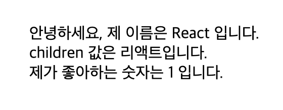
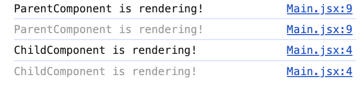
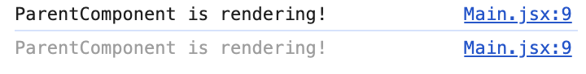
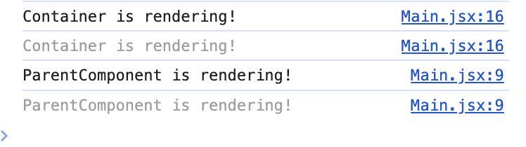
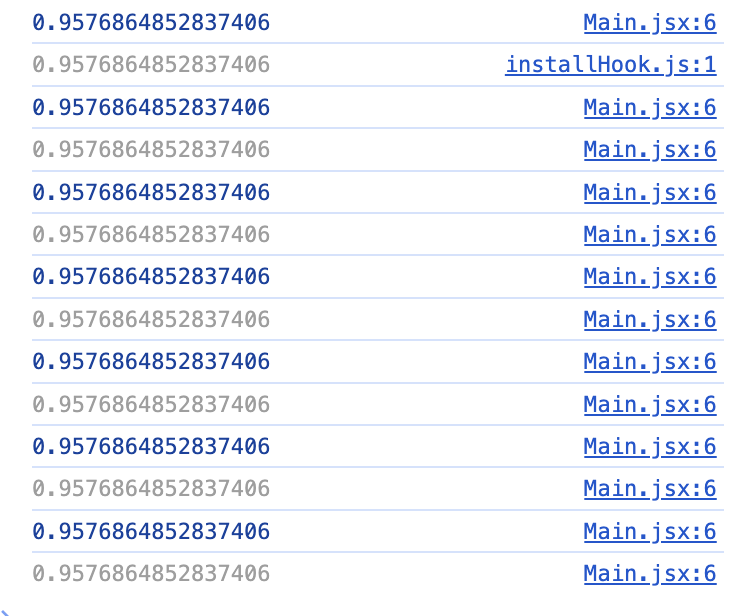

# children prop과 렌더링

### props 사용법

MyComponent.jsx
```jsx

import PropTypes from 'prop-types';

const MyComponent = ({name, favoriteNumber, children}) =>{

return(

  <div>
    안녕하세요, 제 이름은 {name} 입니다. <br />
    children 값은 {children}
    입니다.
    <br />
    제가 좋아하는 숫자는 {favoriteNumber} 입니다.
  </div>

);
};

MyComponent.defaultProps = {
  name: '기본 이름'
};

MyComponent.propTypes = {
  name: PropTypes.string,
  favoriteNumber: PropTypes.number.isRequired
};

export default MyComponent;

```

App.jsx
```jsx

import MyComponent from './MyComponent';

const App = () =>{

return(

  <MyComponent name="React" favoriteNumber={1}>
    리액트
  </MyComponent>

);
};

export default App;

```

결과



children 값으로는 `리액트`
propss는 `name: React , favoriteNumber: 1` 이 들어간걸 확인할 수 있습니다.

> Q. props 와 children의 차이
>
>A.
> **props**
> 
> 어떤 컴포넌트를 import해와서 사용하는 부모(상위) 컴포넌트 (ex. App.js)에서 정하는 값입니다. 부모 컴포넌트에서 설정해서 자식 컴포넌트로 전달하여, 자식 컴포넌트에서 쓰입니다.
> 
>**children**
>
>A 컴포넌트 사이에 B 컴포넌트가 있을 때, A 컴포넌트에서 B 컴포넌트 내용을 보여주려고 사용하는 props입니다.

## children prop과 렌더링

children prop이 렌더링 최적화와 연관이 있다는 [글](https://velog.io/@2ast/React-children-prop%EC%97%90-%EB%8C%80%ED%95%9C-%EA%B3%A0%EC%B0%B0feat.-%EB%A0%8C%EB%8D%94%EB%A7%81-%EC%B5%9C%EC%A0%81%ED%99%94#part-4-%EA%B2%B0%EB%A1%A0-children%EC%97%90-%EB%8C%80%ED%95%9C-%EC%9D%98%EA%B2%AC)을 찾고 공유하고 싶어 정리했습니다.

```jsx
import React, { useState } from "react";

const ChildComponent = () => {
  console.log("ChildComponent is rendering!");
  return <div>Hello World!</div>;
};

const ParentComponent = () => {
  console.log("ParentComponent is rendering!");
  const [toggle, setToggle] = useState(false);
  return (
    <>
      <ChildComponent />
      <button
        onClick={() => {
          setToggle(!toggle);
        }}
      >
        re-render
      </button>
    </>
  );
};

function Root() {
  return (
    <div>
      <ParentComponent />
    </div>
  );
}

export default Root;

```

re-render 버튼을 눌르게 되면, ParentComponent가 리렌더 되는 순간 ChildComponent도 리렌더가 됩니다.

**결과**



이렇게 된다면 childComponent와 무관한 값이 변해도 리렌더링이 되게 됩니다..

이 문제를 해결하기 위해서 React.memo를 사용하기도 하지만,,,

다른 방법이 있다고 합니다!

**children**을 사용하면 됩니다!

**수정된 코드**

```jsx
import React, { useState } from "react";

const ChildComponent = () => {
  console.log("ChildComponent is rendering!");
  return <div>Hello World!</div>;
};

const ParentComponent = ({ children }) => {
  console.log("ParentComponent is rendering!");
  const [toggle, setToggle] = useState(false);
  return (
    <div>
      {children}
      <button
        onClick={() => {
          setToggle(!toggle);
        }}
      >
        re-render
      </button>
    </div>
  );
};

function Root() {
  return (
    <div>
      <ParentComponent>
        <ChildComponent />
      </ParentComponent>
    </div>
  );
}

export default Root;

```


**결과**



아까와 똑같이 re-render 버튼을 눌렀더니, ParentComponent만 리렌더링 되는 것을 확인할 수 있습니다!

### 근데 이와같은 현상이 왜 일어날까요?

표현을 달리 했을 뿐인데 도대체 왜 ParentComponent가 리렌더링 될 때 ChildComponent가 리렌더링 되지 않는걸까요?

### children은 React.memo를 무효화 시킨다!

> Q. React.memo?
>
> A. props가 변하지 않는 한 component의 렌더링을 방지한다.

```jsx

import React, { useState } from "react";

const ChildComponent = () => {
  console.log("ChildComponent is rendering!");
  return <div>Hello World!</div>;
};

const ParentComponent = ({ children }) => {
  console.log("ParentComponent is rendering!");
  return <div>{children}</div>;
};

const ParentMemo = React.memo(ParentComponent);

function Root() {
  console.log("Container is rendering!");
  const [toggle, setToggle] = useState(false);

  return (
    <>
      <ParentMemo>
        <div>Hello World!</div>
      </ParentMemo>
      <button
        onClick={() => {
          setToggle(!toggle);
        }}
      >
        re-redner!
      </button>
    </>
  );
}

export default Root;


```

위 코드는 ParentComponent를 React.memo로 감쌌습니다. 따라서 리렌더링 버튼을 눌렀을 시 "Container is rendering!" 만 뜰 것으로 예상합니다.

**결과**



와 같은 결과가 나왔습니다!

### children이 React.memo를 무효화 시키는 이유

children prop은 매 렌더링마다 값이 달라지기 때문이다!

고로 React.memo가 동작하지 않는다는 것 입니다.

### 다시 한번 개념짚기

jsx 문법에 따라

`<child/>`  와 `React.createElement(Child,null,null)` 은 동일하다.

- React.createElement 는 주어진 arguments를 기반으로
- react element를 새롭게 반환
- react element들은 화면에 어떻게 나타날지 정보를 담은 **object 형태**로 존재
- function component의 return문에 배치되어지면
- react는 이를 해석하고 화면에 그려줌

결론!

- JSX 상의 태그 표현은 사실상 React.creatElement라는 javascript의 다른 코드로, 새로운 react element를 생성해 반환하는 역할
- react element는 단지 화면 정보를 담고 있는 **object**
- react element는 값이 변하지 않는 상수, element의 변경은 곧 새로운 element를 생성함을 의미 (re-render = re-create)

### React.memo 무효화의 비밀

- 매 렌더링마다 react element들은 새롭게 생성, 따라서 object 참조값이 변함
- children으로 전달되는 react element 또한 매번 새롭게 생성되므로 prop이 변경되었다고 판단

### ParentComponent가 re-render 할 때 children은 렌더링 되지 않는 이유!

```jsx

import React, { useState } from "react";

const ChildComponent = () => {
  console.log("ChildComponent is rendering!");
  return <div>Hello World!</div>;
};

const ParentComponent = ({ children }) => {
  console.log("ParentComponent is rendering!");
  const [toggle, setToggle] = useState(false);
  return (
  <div>
 		{children}
        <button onClick={()=>{setToggle(!toggle)}}>
        	re-render
        </button>
    </div>
  );
};

function Root() {
  return (
    <div>
    	<Parent children={<Child/>}/>
    </div>
  );
}

export default Root;

```

- ParentComponent는 children으로 ChildComponent를 받고 있습니다. 
  - 정확히 말하자면 화면 정보를 담고 있는 object 형태의 react element를 받고 있습니다. 

- 해당 element의 출처는 React.createElement 함수의 반환값 입니다. 
  - 즉, Root component가 렌더링 될 때 React.creatElement(Child,null,null)을 실행하여 그 반환값을 children으로 넘겨주고 있는 것 입니다. 

-> 쉽게 말해서 React.createElement는 object를 반환하는 함수, children은 object 그 자체 인 것 입니다.

**결론**

React.creatElement(Child,null,null) 이 실행되는 것은
Root가 렌더링되며 Parent에 props을 넘겨줄 때 뿐입니다!

_ParentComponent의 chlidren은 애초에 object 형태인 상수로 전달받았기 때문에 렌더링 이전과 비교해도 값이 달라질 리가 없습니다.
따라서, Parent가 리렌더링 된다고 해도, 이전 렌더링에서 전달받은 children 값을 그대로 사용합니다._

> **리마인드**
>
> react element는 값이 변하지 않는 상수입니다.


실험으로 Parent가 리렌더링 될 때 정말로 props로 받은 값들이 갱신되지 않고 이전 렌더링에서 받은 값을 그대로 사용하는지 확인하는 실험입니다.

```jsx

import React, { useState } from "react";

const ParentComponent = ({ value }) => {
  const [toggle, setToggle] = useState(false);

  console.log(value);

  return (
    <div>
      <button
        onClick={() => {
          setToggle(!toggle);
        }}
      >
        re-render
      </button>
    </div>
  );
};

function Root() {
  const randomNumber = () => {
    return Math.random();
  };
  return (
    <div>
      <ParentComponent value={randomNumber()} />
    </div>
  );
}

export default Root;


```

**결과**



실제로 계속 같은 값이 나오는 것을 확인할 수 있습니다.

### 결론!

- React.createElement는 매번 새로운 **object를 반환하는 함수**, children은 그 결과 반환된 **object**
- children prop은 한번 전달된 prop은 상위 컴포넌트가 리렌더 되지 않는한 갱신되지 않고 유지
- 이전 렌더 시점과 비교해서 react element가 달라지지 않았다면, 그 내용이 변경되지 않았다고 판단해 리렌더링 하지 않음

### 언제 써야할까?

- Container가 빈번하게 렌더링 되지 않을 때
- 반복적으로 쓰이는 디자인 레이아웃을 제작할 때 -> _보통 이때 사용_

### 참고 블로그

[[말로 풀어쓴 React] props(properties), children](https://velog.io/@donggu/%EB%AC%B8%EA%B3%BC%EC%83%9D%EC%9D%B4-%EC%84%A4%EB%AA%85%ED%95%98%EB%8A%94-React-propsproperties-children)
[React) children prop에 대한 고찰(feat. 렌더링 최적화)](https://velog.io/@2ast/React-children-prop%EC%97%90-%EB%8C%80%ED%95%9C-%EA%B3%A0%EC%B0%B0feat.-%EB%A0%8C%EB%8D%94%EB%A7%81-%EC%B5%9C%EC%A0%81%ED%99%94#part-4-%EA%B2%B0%EB%A1%A0-children%EC%97%90-%EB%8C%80%ED%95%9C-%EC%9D%98%EA%B2%AC)