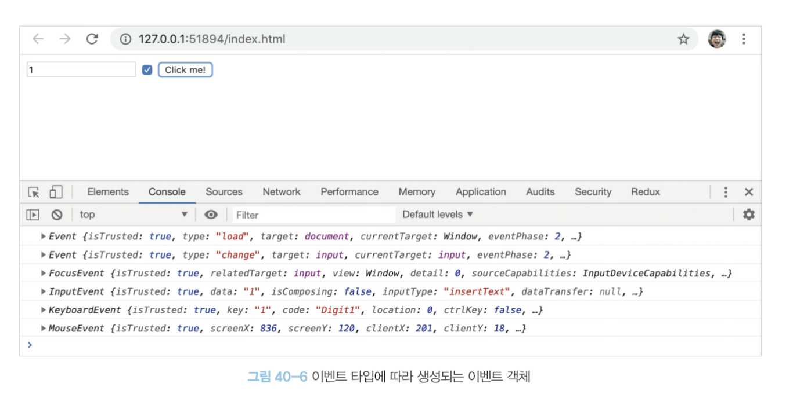

# 이벤트 객체

이벤트가 발생하면 이벤트에 관련한 다양한 정보를 담고 잇는 이벤트 객체가 동적으로 생성됩니다. **생성된 이벤트 객체는 이벤트 핸들러의 첫 번째 인수로 전달됩니다.**

클릭 이벤트에 의해 생성된 이벤트 객체는 이벤트 핸들러의 첫 번째 인수로 전달되어 매개변수 e에 암묵적으로 할당됩니다. 이는 브라우저가 이벤트 핸들러를 호출할 때 이벤트 객체를 인수로 전달하기 때문입니다. 따라서 이벤트 객체를 전달받으려면 이벤트 핸들러를 정의할 때 이벤트 객체를 전달받을 매개변수를 명시적으로 선언해야 합니다. 위 예제에서는 e라는 이름으로 매개변수를 선언했지만 다른 이름을 사용해도 상관없습니다.

이벤트 핸들러 어트리뷰트 방식으로 이벤트 핸들러를 등록했다면 위와 같이 `event`를 통해 이벤트 객체를 전달받을 수 있습니다.

이벤트 핸들러 어트리뷰트 방식의 경우 이벤트 객체를 전달받으려면 이벤트 핸들러의 첫 번째 매개변수 이름이 반드시 `event`여야 합니다. 만약 `event`가 아닌 다른 이름으로 매개변수를 선언하면 이벤트 객체를 전달 받을 수 없습니다. (이는 이벤트 핸들러 어트리뷰트 값은 사실 암묵적으로 생성되는 이벤트 핸들러의 함수 몸체를 의미하기 때문입니다.)

즉, `onclick="showCoords(event)"` 어트리뷰트는 파싱되어 다음과 같은 함수를 암묵적으로 생성하여 `onclick` 이벤트 프로퍼티에 할당합니다.

## 이벤트 객체의 상속 구조

이벤트 객체는 다음과 같은 상속 구조를 갖습니다.

`Event`,`UIEvent`,`MouseEvent` 등 모두는 생성자 함수입니다.

이처럼 이벤트가 발생하면 암묵적으로 생성되는 이벤트 객체도 생성자 함수에 의해서 생성됩니다. 생성된 이벤트 객체는 생성자 함수와 더불어 생성되는 프로토타입으로 구성된 프로토타입 체인의 일원이 됩니다. 

예를 들어, `click` 이벤트가 발생하면 암묵적으로 생성되는 `MouseEvent` 타입의 이벤트 객체는 다음과 같은 프로토타입 체인의 일원이 됩니다.

이벤트 객체 중 일부는 사용자의 행위에 의해 생성된 것이고 일부는 자바스크립트 코드에 의해 인위적으로 생성된 것 입니다.

`MouseEvent` 타입의 이벤트 객체는 사용자의 마우스 이벤트에 의해서,
`CustomEvent` 타입의 이벤트 객체는 자바스크립트 코드에 의해서 생성된 것 입니다.

`Event` 인터페이스는 DOM 내에서 발생한 이벤트에 의해 생성되는 이벤트 객체를 나타냅니다. `Event` 인터페이스에는 모든 이벤트 객체의 공통 프로퍼티가 정의되어 있고 `FocusEvent`,`MouseEvent`,`KeyboardEvent`,`WheelEvent` 같은 하위 인터페이스에는 이벤트 타입에 따라 고유한 프로퍼티가 정의되어 있습니다.

다음 예제와 같이 이벤트 객체의 프로퍼티는 발생한 이벤트 타입에 따라서 달라집니다.

## 이벤트 객체의 공통 프로퍼티

`Event` 인터페이스, 즉 `Event.prototype`에 정의되어 있는 이벤트 관련 프로퍼티는 `UIEvent`,`CustomEvent`,`MouseEvent` 등 모든 파생 이벤트 객체에 상속됩니다. 즉, `Event` 인터페이스 이벤트 관련 프로퍼티는 모든 이벤트 객체가 상속받는 공통 프로퍼티 입니다.

사용자의 입력에 의해 체크박스 요소의 체크상태가 변경되면 
1. `checked` 프로퍼티의 값이 변경되고 `change` 이벤트가 발생  
2. `Event` 타입의 이벤트 객체가 생성

이벤트 객체의 `target` 프로퍼티는 이벤트를 발생시킨 객체, 즉 `change` 이벤트를 발생시킨 DOM 요소 `$checkbox`이고 이 객체의 `checked` 프로퍼티는 현재의 체크 상태를 나타냅니다.

일반적으로 이벤트 객체의 `target` 프로퍼티와 `currentTarget` 프로퍼티는 동일한 DOM 요소를 가리키지만, 서로 다른 DOM 요소를 가리킬 수도 있습니다.

## 마우스 정보 취득

`click`,`dbclick`,`mousedown`,`mouseup`,`mousemove`,`mouseenter`,`mouseleave` 이벤트가 발생하면 생성되는 `mouseEvent` 타입의 이벤트 객체는 다음과 같은 고유의 프로퍼티를 갖습니다.

예를 들어, DOM 요소를 드래그하여 이동시키는 예제를 만들면,

드래그는 마우스 버튼을 누른 상태에서 마우스를 이동하는 것으로 시작하고 마우스 버튼을 떼면 종료합니다.

따라서 `mousedown` 이벤트가 발생한 상태에서 `mousemove` 이벤트가 발생한 시점에 시작하고 `mouseup` 이벤트가 발생한 시점에 종료합니다.

드래그가 시작되면 드래그 시작 시점, 즉 `mousedown` 이벤트가 발생했을 때의 마우스 포인터 좌표와 드래그를 하고 있는 시점, 즉 `mousedown` 이벤트가 발생했을 때의 마우스 포인터 좌표와 드래그를 하고 있는 시점, 즉 `mousemove` 이벤트가 발생할 때마다의 마우스 포인터 좌표를 비교하여 드래그 대상의 이동 거리를 합니다.

`mouseup` 이벤트가 발생하면 드래그가 종료한 것 입니다. 이때 드래그 대상 요소를 이동시키는 이벤트 핸들러를 제거하는 이동을 멈춥니다.

마우스 포인터 좌표는 `MouseEvent` 타입의 이벤트 객체에서 제공합니다. `mousedown`,`mouseup`,`mousemove` 이벤트가 발생하면 생성되는 `MouseEvent` 타입의 이벤트 개게는 마우스 포인터의 좌표 정보를 나타내는 `screenX/screenY`,`clientX/clientY`,`pageX/pageY`,`offsetX/offsetY` 프로퍼티를 제공합니다. 이 프로퍼티 중에서 `clientX/clientY`는 뷰포트, 즉 웹페이지의 가시 영역을 기준으로 마우스 포인터 좌표를 나타냅니다.

