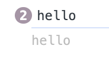

# 함수

## 함수란?

작업을 수행하거나 값을 계산하는 등의 과정을 표현하고, 이를 하나의 블록으로 감싸서 실행 단위로 만들어 놓은 것을 의미합니다.

```jsx
function sum(a,b){
  return a+b
}

sum(10,4) //14
```

## 함수를 정의하는 4가지 방법

### 함수 선언문

일반적으로 사용하는 방식입니다.

```jsx

function add(a,b){
  return a+b
}
```

함수 선언문은 표현식이 아닌 일반 문(statement)로 분류됩니다. 표현식이란 **무언가 값을 산출하는 구문**을 의미합니다. 즉, 앞선 선언으로는 어떠한 값도 표현되지 않았으므로 표현식이 아닌 문으로 분류됩니다.

```jsx
const sum = function add(a,b){
  return a+b
}
```

앞선 함수 선언문은 단순 '선언'이고 어떠한 값도 표현하지 않으므로 표현식과는 다르게 변수에 할당할 수 없는 것이 자연스러워 보이지만 저 코드를 실제 실행시켜보면 잘 작동합니다.

즉, 마치 sum이라는 변수에 sum이라는 함수를 할당하는, 표현식과 같은 작동을 보입니다.

**이유?**

자바스크립트 엔진이 코드의 문맥에 따라 동일한 함수를 문이 아닌 표현식으로 해석하는 경우가 있기 때문입니다.

이름을 가진 형태의 함수 리터럴은 코드 문맥에 따라 전자와 같이 선언문으로도, 후자와 같이 표현식으로도 사용될 수 있습니다!

### 함수 표현식

> 일급 객체?
>
> 다른 객체들에 일반적으로 적용 가능한 연산을 모두 지원하는 객체를 의미합니다.
> 보통 함수에 인자로 넘기기, 수정하기, 변수에 대입하기와 같은 연산을 지원할 때 일급 객체라고 합니다.

자바스크립트에서 함수는 일급 객체입니다.
함수는 다른 함수의 매개변수가 될 수도 있고, 반환값이 될 수도 있고, 앞에서 본 것 처럼 할당도 가능하기 때문에 일급객체 조건을 모두 만족합니다.

```jsx
const sum = function(a,b){
  retrun a+b
}
```

함수에 변수를 할당하는 것이 가능합니다.

함수 표현식에서는 할당하려는 함수의 이름을 생략하는 것이 일반적입니다.(혼란을 피하기 위해서)

```jsx
const sum = function add(a, b) {
    console.log(arguments.callee.name);
    return a + b;
  };

  sum(10, 24);

  add(10, 24);
```


add는 함수 내부에서만 유효한 식별자 일뿐, 함수를 외부에서 호출하는데는 사용할 수 없습니다.

#### 함수 표현식과 선언식의 차이

**호이스팅 여부**

> 호이스팅?
>
> 인터프리터가 코드를 실행하기 전에 함수, 변수, 클래스 또는 임포트(import)의 선언문을 해당 범위의 맨 위로 끌어올리는 것처럼 보이는 현상을 말합니다.
>
> let, const, class를 이용한 선언문 제외

> 함수에서의 호이스팅
>
> 함수 선언문이 마치 코드 맨 앞단에 작성된 것처럼 작동하는 자바스크립트의 특징을 의미합니다.


```jsx
hello();

  function hello() {
    console.log("hello");
  }

  hello();
```



hello 라는 함수를 선언하기 전에 hello를 호출했음에도 잘 작동이 되는 것을 확인할 수 있습니다.

함수의 호이스팅은 함수에 대한 선언을 실행 전에 미리 메모리에 등록하는 작업을 의미합니다. 이러한 함수의 호이스팅이라는 특징 덕분에 함수 선언문이 미리 메모리에 등록됐고, 코드의 순서에 상관없이 정상적으로 함수를 호출할 수 있게 된 것 입니다.

```jsx
  console.log(typeof hello === "undefined");
  hello();

  var hello = function () {
    console.log("hello");
  };

  hello();
```


함수 표현식은, 함수의 호이스팅과는 다르게, 호이스팅 되는 시점에서 var의 경우에는 undefined로 초기화 된다는 차이가 발생합니다.

함수 선언문과 다르게 정상적으로 호출되지 않고, undefined로 남아있는 것을 확인할 수 있습니다.

함수와 다르게 변수는, 런타임 이전에 undefined로 초기화되고, 할당문이 실행되는 시점, 즉 런타임 시점에 함수가 할당되어 작동한다는 것을 알 수 있습니다.

#### 무엇을 사용하는게 좋을까?

**함수 선언문**

함수를 자유롭게 선언하고 어디서든 자유롭게 호출하고 싶거나,
변수 선언과 다르게 명시적으로 함수를 구별하고 싶은 경우

**함수 표현식**

선언전에 사용하는 것이 이상하게 보일 경우,

### Function 생성자

Function 생성자를 활용하는 방법

```jsx
const add = new Function('a','b','return a+b')
```

실제 코딩에서는 거의 사용되지 않으므로 참고만 하면 될 것 같습니다.

### 화살표 함수

ES6에서 새롭게 추가된 방식 입니다.

```jsx
const add = (a,b) => {
  return a+b
}

const add = (a,b) => a+b
```

**앞서 언급한 함수 생성 방식과 몇 가지 큰 차이점이 존재합니다**

1. 화살표 함수에서는 constructor 사용 불가. 생성자 함수로 화살표 함수 사용 불가

```jsx
const Car = (name) => {
  this.name = name
}

const myCar = new Car('하이')
```


2. 화살표 함수에서는 arguments가 존재하지 않습니다.

```jsx
function hello() {
    console.log(arguments);
  }

  hello(1, 2, 3);

  const hi = () => {
    console.log(arguments);
  };

  hi(1, 2);
```


함수 선언문에서는 arguments가 잘 출력됩니다.


화살표형 함수에서는 출력이 잘 안되는 것을 확인할 수 있습니다.

**가장 큰 차이점은 this 바인딩 입니다**

> this?
>
> 자신이 속한 객체나 자신이 생성할 인스턴스를 가리키는 값
> this는 화살표 함수 이전까지는 함수를 정의할 때 결정되는 것이 아니라, 함수가 어떻게 호출되느냐에 따라 동적으로 결정됩니다. 


 함수가 일반 함수로서 호출된다면, 그 내부의 this는 전역 객체를 가르키게 됩니다.

 화살표 함수는 함수 자체의 바인딩을 갖지 않습니다. 화살표 함수 내부에서 this를 참조하면 상위 스코프의 this를 그대로 따르게 됩니다.

 ```jsx
class Component extends React.Component {
  constructor(props) {
    super(props);
    this.state = {
      counter: 1,
    };
  }


functionCountUp();
{
  console.log(this);
  this.setState(()=>({counter: prev.counter + 1}))
}

ArrowFunctionCountUp = () => {
  console.log(this);
  this.setState(()=>({counter: prev.counter + 1}))
}

render(){
  return(
    <div>
      <button onClick={this.functionCountUp}>일반함수</button>
      <button onClick={this.ArrowFunctionCountUp}>화살표 함수</button>
    </div>
  )
}
}
 ```

 두 메서드는 동일한 작업을 하고 있습니다.

 하지만 일반 함수의 this에서는 undefined를,
 화살표 함수에서의 this는 우리가 원하는 대로 클래스의 인스턴스인 this를 기리키는 것을 볼 수 있습니다.

 별도의 작업을 추가로 하지 않고 this에 접근할 수 있는 방법이 바로 **화살표 함수** 입니다.

 #### 바벨을 활용해서 봐보자

> 바벨?
>
> 최신버전으로 작성된 자바스크립트를 이전 문법으로 변환시켜주는 도구

 ```jsx
// 트랜스파일 하기 전
 const hello = () => {
  console.log(this)
 }

 function hi(){
  console.log(this)
 }
 
//트랜스파일된 결과
var _this = void 0

var hello = function hello(){
  console.log(_this)
}

 function hi(){
  console.log(this)
 }

 ```

화살표 함수는 this가 선언되는 시점에 이미 상위 스코프로 결정돼 있어 미리 _this를 받아서 사용합니다.
일반 함수는 호출하는 런타임 시점에 결정되는 this를 그대로 따르는 모습입니다.

화살표 함수의 this는 선언 시점에 결정된다는 일반 함수와 대비되는 큰 차이점이 있기 때문에 단순히 일반 함수의 축약형이라고 보기는 어렵습니다.


### 다양한 함수 살펴보기

#### 즉시 실행 함수

IIFE 라고 부릅니다.
함수를 정의하고 그 즉시 실행합니다.

```jsx
(function (a,b){return a+b})(10,24)

((a,b) => return a+b)(10,24)
```

재호출이 불가능합니다. 고로 이름은 붙이지 않습니다.

해당 특성을 활용하면, 글로벌 스코프를 오염시키지 않는 독립적인 함수 스코프를 운용할 수 있다는 장점을 얻을 수 있습니다. 함수의 선언과 실행이 바로 그 자리에서 일어나므로, 즉시 실행 함수 내부에 있는 값은 그 함수 내부가 아니고서는 접근이 불가능하기 때문입니다.

#### 고차함수

자바스크립트의 함수는 일급객체입니다. 이 특성을 활용하면 함수를 인수로 받거나 결과로 새로운 함수를 반환할 수 있습니다.

이러한 역할을 하는 것이 **고차함수** 입니다.

```jsx
const doubledArray = [1,2,3].map((item)=>item*2)

doubledArray //[2,4,6]

//함수를 반환하는 고차 함수의 예
const add = function(a){
  return function(b){
    return a+b
  }
}

add(1)(3) //4

```

이 특성을 활용하면, 컴포넌트를 인수로 받아 새로운 함수 컴포넌트를 반환하는 고차 함수를 만들 수 있습니다.

### 함수를 만들 시 주의사항

1. 함수의 부수 효과를 최대한 억제하기

함수의 부수효과(side-effect), 즉, 함수 내의 작동으로 인해 함수가 아닌 함수 외부에 영향을 끼치는 것을 의미합니다.

사이드 이펙트 존재 -> 순수함수 (<-> 비순수함수)

> 항상 순수함수로만 짜야하나요?
>
> 아닙니다.
>
> 부수 효과, 즉 사이드 이펙트는 피할 수 없는 요소입니다.
> 이러한 부수 효과를 최대한 억제할 수 잇는 방향으로 함수를 설계해야 합니다.

2. 가능한 한 함수를 작게 만들어라

하나의 함수에서 너무 여러가지 일을 하지 않게 할 것
한 가지 일만 한다면, 그것이 재사용성을 높히는 것

3. 누구나 이해할 수 있는 이름을 붙여라