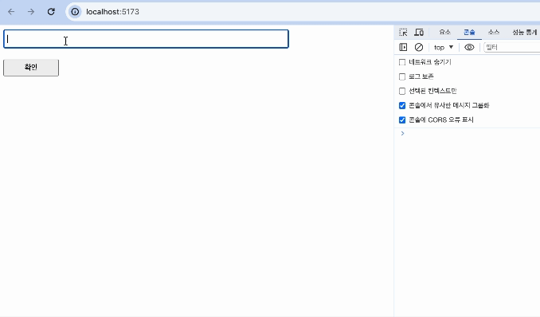
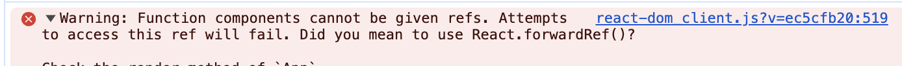
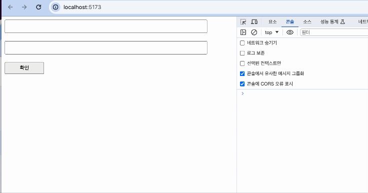
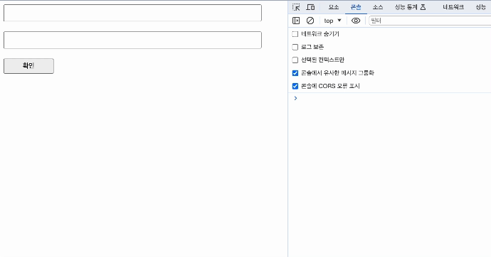
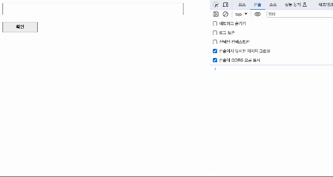

react-hook-form 이것이 무엇이냐 하냐면!

**Isolate Re-renders**

라고 [여기](https://react-hook-form.com/) 들어가보면 대문짝만하게 써져 있습니다.

즉! 얘는 비제어 컴포넌트를 만들기 위해서 있는 라이브러리다! 라고 생각해도 무방합니다. 

## 📍 비제어...제어....?

### 제어 컴포넌트
- 사용자의 입력을 기반으로 자신의 state를 관리하고 업데이트 함
- 폼 데이터는 React 컴포넌트에서 다룸

### 비제어 컴포넌트
- 특정 이벤트가 발생 시 요소 내부의 값을 가져옴
- ref를 사용하면 DOM에서 폼 값을 가져옴

그럼 제어 컴포넌트는 값이 변할 때 마다 리렌더링을 유발시키겠죠?
그럼 그 예시를 직접 확인해보도록 하겠습니다.

## 📍 사용 언어 및 라이브러리

```
- Vite
- Typescript
- Styled-components
```

## 📍 폼 데이터를 제어로 관리!

**Styledbtn.tsx**

```tsx
import styled from "styled-components";
import { ButtonHTMLAttributes } from "react";

interface ButtonProps extends ButtonHTMLAttributes<HTMLButtonElement> {
  width?: string;
  height?: string;
  padding?: string;
}

const StyledBtn = ({ ...rest }: ButtonProps) => {
  const handleClick = () => {
    console.log("click!");
  };

  return <BtnStyle onClick={handleClick} {...rest} />;
};

const BtnStyle = styled.button<ButtonProps>`
  width: ${(props) => props.width || "100px"};
  padding: ${(props) => props.width || "5px"};
`;

export default StyledBtn;

```

**StyledInput.tsx**

```tsx
import styled from "styled-components";
import { InputHTMLAttributes, useState, ChangeEvent } from "react";

interface InputProps extends InputHTMLAttributes<HTMLInputElement> {
  width?: string;
  height?: string;
  padding?: string;
}

const StyledInput = ({ ...rest }: InputProps) => {
  const [value, setValue] = useState<string>("");

  const handle = (e: ChangeEvent<HTMLInputElement>) => {
    setValue(e.target.value);
    console.log(value);
  };

  return <InputStyle onChange={handle} {...rest} />;
};

const InputStyle = styled.input<InputProps>`
  width: ${(props) => props.width || "500px"};
  height: ${(props) => props.width || "20px"};
  padding: ${(props) => props.width || "5px"};
`;

export default StyledInput;

```

**App.tsx**

```tsx
import Layout from "./components/Layout";
import StyledInput from "./components/StyledInput";
import StyledBtn from "./components/StyledBtn";

function App() {
  return (
    <Layout>
      <StyledInput />
      <StyledBtn>확인</StyledBtn>
    </Layout>
  );
}

export default App;

```



_화질구지 죄송해여.._


이렇게 보시는 것 처럼 왈랄라라라라 콘솔이 뜨잖아요!

우리는 '안녕하세요 여러분' 이 값만 필요하지 중간과정은 필요가 없거든요

따라서 이 상황에서는 비제어로 구현하는 것이 성능에 더 좋다!

(저렇게 중간과정이 필요한 경우는 검색창이나 이런것을 사용할 때 쓰면 되겠졍!)

## 📍 그럼 이걸 어케 비제어로...??

방법은 여러가지가 있습니다.

1. HTML `<form>` 태그 이용
2. useRef 이용
3. react-hook-form 이용!

저는 이중에서도 사용하기 편한 3번을 택했습니다!
그리고 react-hook-form에서 제공하는 함수 등도 많습니다!

## react-hook-form

### 설치

`npm install react-hook-form`

### 본격적으로 사용해보기!

**App.tsx**

```tsx
import Layout from "./components/Layout";
import StyledInput from "./components/StyledInput";
import StyledBtn from "./components/StyledBtn";
import { SubmitHandler, useForm } from "react-hook-form";

type Input = {
  example: string;
  exampleRequired: string;
};

function App() {
  const {
    register,
    handleSubmit,
    watch,
    formState: { errors },
  } = useForm<Input>();
  const onSubmit: SubmitHandler<Input> = (data) => {
    console.log(data);
    console.log(watch("example"));
  };

  return (
    <form onSubmit={handleSubmit(onSubmit)}>
      <Layout>
        <StyledInput {...register("example")} />
        <StyledInput {...register("exampleRequired", { required: true })} />
        {errors.exampleRequired && <span>This field is required</span>}
        <StyledBtn type="submit">확인</StyledBtn>
      </Layout>
    </form>
  );
}

export default App;

```

- register
	- 이 메서드는 input 혹은 select 요소에 등록할 수 있도록 해주고 React Hook Form에 validation rules을 적용할 수 있습니다.
- watch
	- 이 메서드는 input의 값을 볼 수 있고 반환해줍니다.
- handleSubmit
	- 이 함수는 form 인증이 성공적으로 되면 form data를 받습니다.
- formState
	- 이 객체는 전체적인 form 상태에 대한 정보를 포함하고 있습니다.
    - isDirty(사용자가 인풋에 어떤 값을 넣으면 true로 바뀜), dirtyFields(모든 필드가 입력되었는지 확인), defaultValues(default 값) ... 등이 있습니다.
    - errors 는 정해진 인증에 따라 에러 여부를 나타냄
    
더 많은 함수, 메서드 등은 [여기](https://react-hook-form.com/docs/useform/formstate)서 확인하세요!

### 🚨 오류 발생...



헉 왤까 했더니

함수형 컴포넌트는 인스턴스를 가지지 않기 때문에 일반적으로 ref를 사용할 수 없다고 합니다! 하지만 React.forwardRef()를 사용하면 ref를 하위 컴포넌트로 전달할 수 있다고 합니다!

**StyledInput.tsx**

```tsx

import styled from "styled-components";
import {
  InputHTMLAttributes,
  useState,
  ChangeEvent,
  forwardRef,
  ForwardedRef,
} from "react";

interface InputProps extends InputHTMLAttributes<HTMLInputElement> {
  width?: string;
  height?: string;
  padding?: string;
  forwardedRef?: ForwardedRef<HTMLInputElement>;
}

const StyledInput = forwardRef<HTMLInputElement, InputProps>((props, ref) => {
  const [value, setValue] = useState<string>("");

  const handle = (e: ChangeEvent<HTMLInputElement>) => {
    setValue(e.target.value);
    console.log(value);
  };

  return <InputStyle ref={ref} onChange={handle} {...props} />;
});

const InputStyle = styled.input<InputProps>`
  width: ${(props) => props.width || "500px"};
  height: ${(props) => props.width || "20px"};
  padding: ${(props) => props.width || "5px"};
`;

export default StyledInput;

```
위와 같이 코드를 변경해줍니다.



잘 동작하는 것을 확인할 수 있습니다!

### 인증 조건 여러개

**App.tsx**

```tsx
import Layout from "./components/Layout";
import StyledInput from "./components/StyledInput";
import StyledBtn from "./components/StyledBtn";
import { SubmitHandler, useForm } from "react-hook-form";

type Input = {
  example: string;
  exampleRequired: string;
};

function App() {
  const {
    register,
    handleSubmit,
    watch,
    formState: { errors },
  } = useForm<Input>({ mode: "onChange" });
  const onSubmit: SubmitHandler<Input> = (data) => {
    console.log(data);
    console.log(watch("example"));
  };

  return (
    <form onSubmit={handleSubmit(onSubmit)}>
      <Layout>
        <StyledInput {...register("example")} />
        <StyledInput
          {...register("exampleRequired", {
            required: "This field is required",
            pattern: {
              value: /^[A-Za-z]+$/i,
              message: "입력 형식이 잘못되었습니다.",
            },
          })}
        />
        {errors.exampleRequired && errors.exampleRequired.message}
        <StyledBtn type="submit">확인</StyledBtn>
      </Layout>
    </form>
  );
}

export default App;

```

required, pattern에 대한 조건 2가지를 걸어주었습니다.
에러메시지는 errors.exampleRequired.message를 사용합니다.

**⚠️ 중요**
useForm에 `{ mode: "onChange" }` 이 코드를 꼭 추가해주어야 합니다. 

그렇지 않으면 submit을 하기 전까진 인증 검사를 하지 않기때문에 "확인" 버튼을 누르기전에는 오류를 잡아낼 수 없습니다. 하지만 위의 모드를 추가해주면 바로 적용이 가능합니다! 



## 📍 FormProvider 이용해보기!

FormProvider를 이용하면 어디서든 form 데이터에 접근할 수 있습니다!

**App.tsx**

```tsx
import Layout from "./components/Layout";
import StyledInput from "./components/StyledInput";
import StyledBtn from "./components/StyledBtn";
import { useForm, FormProvider } from "react-hook-form";

type Input = {
  example: string;
  exampleRequired: string;
};

function App() {
  const methods = useForm<Input>();

  return (
    <Layout>
      <FormProvider {...methods}>
        <StyledInput />
        <StyledBtn>확인</StyledBtn>
      </FormProvider>
    </Layout>
  );
}

export default App;

```

- Form 데이터로 관리할 컴포넌트들을 FormProvider로 감싸줍니다. 이때 전달인자로 useForm을 이용합니다.

**StyledInput.tsx**

```tsx
import styled from "styled-components";
import { InputHTMLAttributes, useEffect } from "react";

import { useFormContext } from "react-hook-form";

interface InputProps extends InputHTMLAttributes<HTMLInputElement> {
  width?: string;
  height?: string;
  padding?: string;
}

const StyledInput = (props: InputProps) => {
  const { register, setValue } = useFormContext();

  useEffect(() => {
    setValue("first", "hi");
  }, []);

  return <InputStyle {...props} {...register("example")} />;
};

const InputStyle = styled.input<InputProps>`
  width: ${(props) => props.width || "500px"};
  height: ${(props) => props.width || "20px"};
  padding: ${(props) => props.width || "5px"};
`;

export default StyledInput;

```

- useFormContext를 이용하여 register 메서드가 이용 가능합니다.

**StyledBtn.tsx**

```tsx
import styled from "styled-components";
import { ButtonHTMLAttributes } from "react";

import { useFormContext } from "react-hook-form";

interface ButtonProps extends ButtonHTMLAttributes<HTMLButtonElement> {
  width?: string;
  height?: string;
  padding?: string;
}

const StyledBtn = ({ ...rest }: ButtonProps) => {
  const { getValues, reset } = useFormContext();

  const handleClick = () => {
    console.log(getValues());
    reset();
    console.log(getValues());
  };

  return <BtnStyle onClick={handleClick} {...rest} />;
};

const BtnStyle = styled.button<ButtonProps>`
  width: ${(props) => props.width || "100px"};
  padding: ${(props) => props.width || "5px"};
`;

export default StyledBtn;

```

- getValue
	- formData를 불러올 수 있습니다.
- setValue
	- formData에 값을 추가하거나 수정할 수 있습니다.

- reset
	- formData가 초기화 됩니다.
	-인자로 defaultValue 객체를 주면 해당 객체로 초기화가 가능합니다.



id가 first에 'hi' 값을 가진 요소가 추가되었습니다.
그리고 reset 함수를 실행하고 나서는
빈 객체로 초기화 되었습니다!

### 🧐 뭘 쓸까...?

저는 FormProvider를 이용해 ref로 값에 접근할 수 없는 컴포넌트들의 값도 setValue를 이용하여 formData로 관리할 수 있었습니다!

적절히 필요한 방향에 따라서 react-hook-form을 이용하면 될 것 같습니다!


