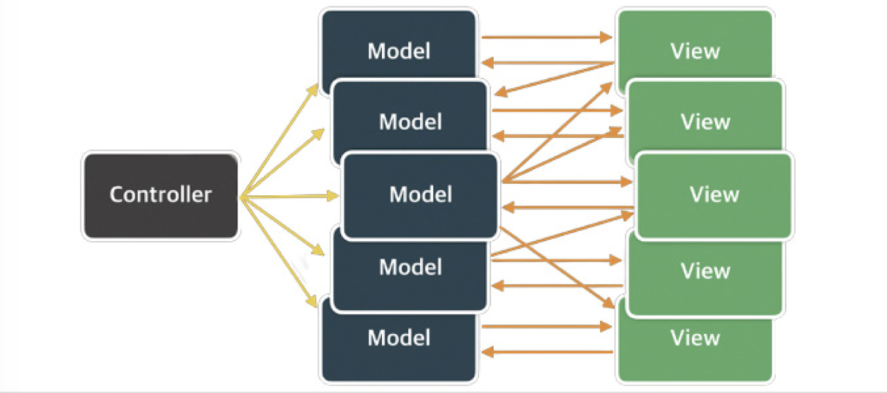
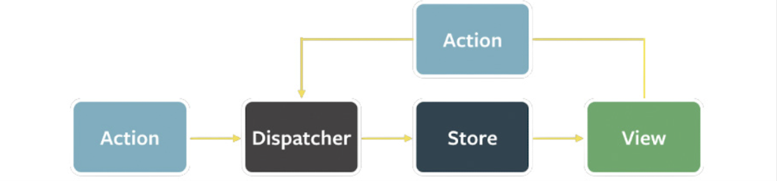
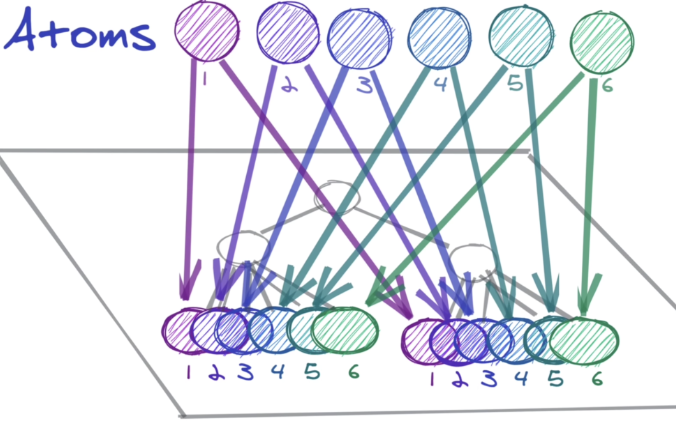
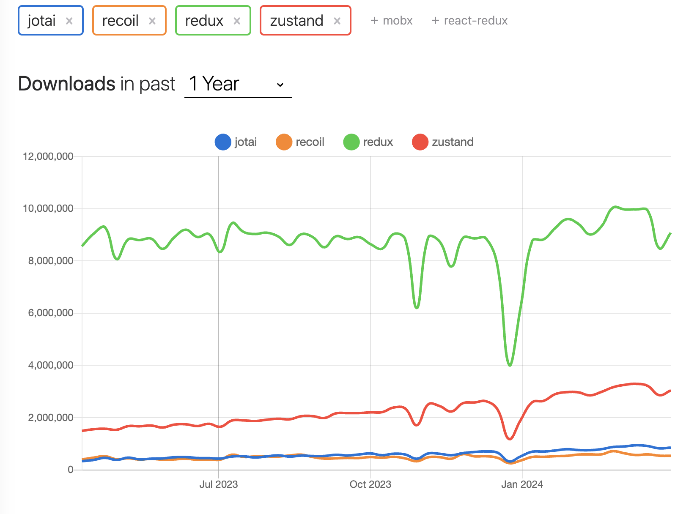
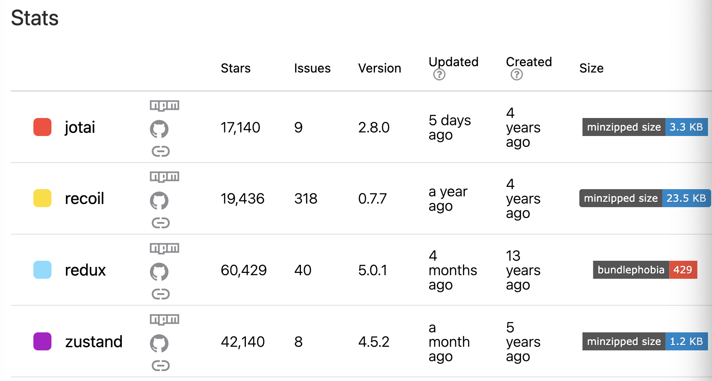
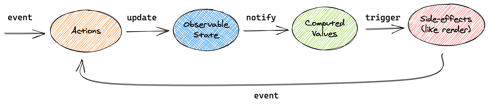

# 상태 관리는 왜 필요한가?

## 상태

어떠한 의미를 지닌 값

에플리케이션의 시나리오에 따라 변경될 수 있는 값

- UI
- URL
- 폼
- 서버에서 가져온 값...

다양한 기능에 띠라 관리해야 할 상태도 점차 증가하고 있습니다.

## 상태관리의 역사

### Flux 패턴의 등장



기존 MVC 패턴은 상태(데이터)가 많아짐에 따라서 복잡도가 증가하게 됩니다.

이 문제의 원인은 바로 **양방향** 이라고 생각했습니다.


**단방향**으로 데이터 흐름을 변경한 것이 Flux 패턴의 시작입니다.

- action: 어떠한 작업을 처리할 액션과 그 액션 발생 시 함께 포함시킬 데이터를 의미합니다. 액션 타입과 데이터를 각각 정의해 이를 디스패처로 보냅니다.
- dispatcher: 액션을 스토어에 보내는 역할을 합니다. 콜백 함수 형태로 앞서 액션이 정의한 타입과 데이터를 모두 스토어에 보냅니다.
- store: 여기에서 실제 상태에 따른 값과 상태를 변경할 수 있는 메서드를 가지고 있습니다. 액션의 타입에 따라 어떻게 이를 변경할지가 정의돼 있습니다.
- view: 리액트의 컴포넌트에 해당하는 부분으로, 스토어에서 만들어진 데이터를 가져와 화면을 렌더링하는 역할으 합니다. 또한 뷰에서도 사용자의 입력이나 행위에 따라 상태를 업데이트하고자 할 수 있을 것 입니다. 이 경우에는 다음 그림처럼 뷰에서 액션을 호출하는 구조로 구성됩니다.
  


### 단방향 데이터

사용자의 입력에 따라 데이터를 갱신하고 화면을 어떻게 업데이트해야 하는지도 코드로 작성해야합니다.

코드의 양이 많아지고 개발자도 수고로워집니다.

데이터의 흐름은 모두 액션이라는 한 방향(단방향)으로 줄어들므로 데이터의 흐름을 추적하기가 용이합니다.

## 리덕스의 등장

리덕스는 Flux 구조에 Elm 아키텍처를 도입했습니다.

### Elm 아키텍처

웹 페이지를 선언적으로 작성하기 위한 언어


Elm으로 HTML을 작성한 예시
```Elm
module Main exposing(..)

import Browser
import Html
import Html.Events exposing (onClick)

---Main

main=
  Browser.sandbox = {init=init, update=update, view=view}

---MODEL

type alias Model = Int

init: Model
init = 0

--UPDATE

type Msg
=Increment
| Decrement

update: Msg -> Model -> Model
update msg model = 
case msg of
Increment -> 
model + 1

Decrement ->
model - 1

--VIEW

view: Model -> Html Msg
view model =
div []
[ button [OnClick Decrement][text "-"]
  , div [] [text(String.fromInt model)]
  , button [onClick Increment ][text "+"]
]

<div>
<button>-</button>
<div>2</div>
<button>-</button>
</div>

```

여기서 주목할 것은 model,update,view 입니다.

- 모델: 애플리케이션의 상태를 의미합니다. 여기서는 Model을 의미하며, 초깃값으로는 0이 주어졌습니다.
- 뷰: 모델을 표현하는 HTML을 말합니다. 여기서는 Model을 인수로 받아서 HTML을 표현합니다.
- 업데이트: 모델을 수정하는 방식을 말합니다. Increment, Decrement 를 선언해 가각의 방식이 어떻게 모델을 수정하는지 나타냈습니다.
  
Elm은 Flux와 마찬가지로 데이터 흐름을 세 가지로 분류하고, 이를 강제해 웹 애플리케이션의 상태를 안정적으로 관리하고자 노력했습니다.

### 리덕스

하나의 상태 객체를 스토어에 저장해 두고, 이 객체를 업데이트하는 작업을 디스패치해 업데이트를 수행합니다.

이러한 작업을 reducer가 하게 되는데, 이 함수의 실행은 웹 애플리케이션 상태에 대한 완전히 새로운 복사본을 반환한 다음, 애플리케이션에 이 새롭게 만들어진 상태를 전파하게 됩니다.

-> props drilling 문제를 해결할 수 있게 되었습니다!

_그렇다고 무조건 좋은건 아님.._

- 보일러 플레이트 코드 많음
  - 근데 이건, tool-kit 나오면서 많이 완화되었다고 합니다!

### Context API와 useContext

리액트 16.3 버전부터 전역 상태를 하위 컴포넌트에 주입할 수 있는 새로운 Context API를 출시했습니다.

_16.3 버전 이전에도 context는 존재했습니다._

**Context API**

```jsx
import React, { createContext } from 'react'; // context api를 사용하기 위해 import

const MyContext = createContext('defaultValue'); // createContext()를 이용해 context 생성

// App 컴포넌트
function App() {
  return (
    <MyContext.Provider value="myValue"> // provider를 사용한 context 제공
      <Child />
    </MyContext.Provider>
  );
}

// Child 컴포넌트
function Child() {
  return (
    <MyContext.Consumer> // consumer를 사용하여 provider의 value값을 사용함
      {(value) => <div>{value}</div>} // Consumer를 사용할 시, 함수를 렌더링 해야한다.
    </MyContext.Consumer>
  );
}
```

- MyApp에 상태가 선언되어 있음(Context로 주입)
- Provider로 주입된 상태는 자식의 자식인 CounterCOmponent에서 사용하고 있습니다.

### useContext 와 함께 사용

```jsx
import React, { createContext, useContext } from 'react';

const MyContext = createContext('defaultValue'); // createContext로 컨텍스트를 만들고

// App 컴포넌트
function App() {
  return (
    <MyContext.Provider value="myValue"> // provider로 컨텍스트를 제공한다.
      <Child />
    </MyContext.Provider>
  );
}

// Child 컴포넌트
function Child() {
  const value = useContext(MyContext); // useContext를 사용하여 value값을 가져온다.
  return <div>{value}</div>;
}
```

- useContext를 이용해 Provider의 Value를 받아오고 있습니다.
  
## 훅의 탄생, React Query와 SWR

  리액트는 16.8 버전에서 함수 컴포넌트에 사용할 수 있는 다양한 훅 API를 추가했습니다.

  이러한 훅의 등장으로 **React Query** 와 **SWR** dl emdwkdgkrp ehlqslek.

  두 라이브러리 모두 외부에서 데이터를 불러오는 fetch를 관리한데 특화된 라이브러리 이지만, API 호출에 대한 상태를 관리하고 있기 때문에 **HTTP** 요청에 특화된 상태 관리 라이브러리라고 볼 수 있습니다.

  **SWR**

  ```jsx
  import React from 'react'
  import useSWR from 'swr'

  const fetcher = (url) => fetch(url).then((res)=>res.json())

  export default function App() {
    const {data,error} = useSWR(
      'url',
      fetcher,
    )

    if(error) return '에러 발생'
    if(!data) return '로딩중...'

    return (
      <div>
        <p>{JSON.stringify(data)}</p>
      </div>
    )
  }
  ```
  useSWR의 첫 번째 인수로 조회할 API 주소, 두 번째 인수로 조회에 사용되는 fetchㅡㄹ ㄹ넘겨줍니다.

  첫번째 인수인 API 주소는 키로도 사용되며, 다른 곳에서 동일한 키로 호출하면 재조회되는게 아니라 캐시의 값을 활용합니다.

## Recoil, Zustand, Jotai, Valtio..에 이르기까지

훅을 활용해 작은 크기의 상태를 효율적으로 관리합니다.

쉽게 말해 react의 단방향 데이터 흐름 특성으로 인해 생기는 불편함을 해소시켜줍니다.
useState를 사용하는 경우, 상태 전달이 번거로웠지만, atom을 이용하여 해당 상태 구조를 정의해주기만 하면, 그 상태를 어느 컴포넌트에서도 쉽게 접근할 수 있습니다.



### 상태관리라이브러리 비교

Redux vs Recoil vs Zustand vs Jotai



다운로드 수는 Redux가 오래된 만큼 가장 높습니다.



업데이트 측면에서는 recoil은 1년동안 업데이트가 되지않았기 때문에 사용하지 않는 편이 좋을 것 같습니다.(개인견해)

사이즈 측면에서는 Zustand가 가장 작습니다.

**Jotai**
상태를 일본말로 하면 Jotai라고 합니다.

- 가벼움
- atomic 한 상태 관리 방식
- Typescript 기본 내장
- recoil과 달리 키를 필요로 하지 않습니다.


초기값 atom으로 생성, useAtom으로 값을 받고 수정합니다.
```jsx
import { atom, useAtom } from 'jotai';
const textAtom = atom('hello');
const Input = () => {
  const [text, setText] = useAtom(textAtom)
  const handleChange = (e) => setText(e.target.value)
  return (
    <input value={text} onChange={handleChange} />
  )
}
```

**Zustand**
독일어로 상태라는 뜻 입니다.

- 유연성과 간결성
  - 아키텍처를 강조하지 않습니다.
- 불필요한 렌더링 최소화
- SSR과 호환성
- 프로바이더가 없습니다.
- 작은 번들 사이즈

```jsx
import create from 'zustand';

// set 함수를 통해서만 상태를 변경할 수 있다
const useStore = create(set => ({
  bears: 0,
  increasePopulation: () => set(state => ({ bears: state.bears + 1 })),
  removeAllBears: () => set({ bears: 0 })
}));
```

스토어를 만들 때는 create 함수를 이용하여 상태와 그 상태를 변경하는 액션을 정의합니다. 그러면 리액트 컴포넌트에서 사용할 수 있는 useStore 훅을 리턴합니다.

```jsx
// 상태를 꺼낸다
function BearCounter() {
  const bears = useStore(state => state.bears);
  return <h1>{bears} around here ...</h1>;
}

// 상태를 변경하는 액션을 꺼낸다
function Controls() {
  const increasePopulation = useStore(state => state.increasePopulation);
  return <button onClick={increasePopulation}>one up</button>;
}
```

컴포넌트에서 useStore 훅을 사용할 때는 스토어에서 상태를 어떤 형태로 꺼내올지 결정하는 셀렉터 함수를 전달해 주어야 합니다. 만약 셀렉터 함수를 전달하지 않는다면 스토어 전체가 리턴됩니다.

### Mobx

**객체 지향 느낌** 이 강하고,
Component 와 State를 연결하는 **Redux** 와 달리 번잡한 보일러 플레이트 코드들을 데코레이터(어노테이션) 제공으로 깔끔하게 합니다.

> 데코레이터?
>
> "데코레이터 함수"의 약자
> 새 함수를 반환하여 전달 된 함수 또는 메서드의 동작을 수정하는 함수

```js
function readOnly(target, key, descriptor) {
  return {
    ...descriptor,
    writable: false,
  };
}
```

1. `targer`은 현재 인스턴스 객체의 클래스
2. `key`는 데코레이터를 적용할 속성 이름
3. `descriptor`는 해당 속성의 설명자 객체

**Mobx 주요 특징**

- redux와 다르게 store에 제한이 없습니다
- 또한 redux에서 해줘야했던 action 선언, reducer, action생성 함수,action type 등 번거로운 작업들은 데코레이터로 간단하게 대체하며 깔끔하게 구성할 수 있습니다.
- Mobx는 절대적으로 필요한 경우에만 state 변경합니다.
  
**Observable**

Rendering 대상이 되는 State를 관찰 대상이라고 칭하고 @observable 데코레이터로 Observable State로 만들어 줍니다. Presentational Component에서 값이 변경될 때 마다 값이 반영 되어 보여지게 됩니다.

```js
@Autobind // javascript this bind를 자동으로 해주는 데코레이터(arrow function 사용 없이)
export default class SearchRiderStore {
  // 라이더 리스트 state를 렌더링 할 것 이고 @observable 데코레이터를 추가하면 선언됩니다.
  @observable
  riderList = [];

  constructor(rootStore) {
    // rootStore를 통하여 다른 store(spring 서비스라고 생각하면 이해가 쉽다.)를 사용 할 수 있다.
    // rootStore.deliveryStore.findAll() <- 이런식으로
    this.rootStore = rootStore;
  }

  @asyncAction
  async *findAllRider(params) {
    const  = yield riderRepositiry.findAll(params);

    if (status === 200) {
      this.riderList = data.map(rider => new RiderModel(data));
    }
  }
}
```

**간단한 예제**

```jsx
import React from "react"
import ReactDOM from "react-dom"
import { makeAutoObservable } from "mobx"
import { observer } from "mobx-react"

// 애플리케이션 상태를 모델링합니다.
class Timer {
    secondsPassed = 0

    constructor() {
        makeAutoObservable(this)
    }

    increase() {
        this.secondsPassed += 1
    }

    reset() {
        this.secondsPassed = 0
    }
}

const myTimer = new Timer()

// observable state를 사용하는 사용자 인터페이스를 구축합니다.
const TimerView = observer(({ timer }) => (
    <button onClick={() => timer.reset()}>Seconds passed: {timer.secondsPassed}</button>
))

ReactDOM.render(<TimerView timer={myTimer} />, document.body)

// 매초마다 Seconds passed: X를 업데이트 합니다.
setInterval(() => {
    myTimer.increase()
}, 1000)
```

리액트 컴포넌트인 TimerView를 감싸고 있는 observer는 observable인 timer.secondsPassed에 의존하여 자동으로 렌더링 됩니다. reactivity 시스템은 나중에 해당 필드가 정확하게 수정될 때 컴포넌트를 다시 렌더링 합니다.

모든 이벤트(onClick, setInterval)는 observable state(myTimer.secondsPassed)를 변경시키는 action(myTimer.increase, myTimer.reset)을 호출합니다. observable state의 변경 사항은 모든 연산과 변경사항에 따라 달라지는 부수 효과(TimerView)에 전파됩니다.



#### 참고블로그

[React (Context API와 useContext)](https://velog.io/@hoonnn/React-Context-API%EC%99%80-useContext)
[[React] Recoil로 상태관리하기_atom, selector](https://velog.io/@minz-cha/React-Recoil%EB%A1%9C-%EC%83%81%ED%83%9C%EA%B4%80%EB%A6%AC%ED%95%98%EA%B8%B0atom-selector)
[Jotai는 조-타이 라고 읽습니다.](https://medium.com/pinkfong/jotai%EB%8A%94-%EC%A1%B0-%ED%83%80%EC%9D%B4-%EB%9D%BC%EA%B3%A0-%EC%9D%BD%EC%8A%B5%EB%8B%88%EB%8B%A4-6498535abe11)
[왜 zustand 를 선택했는가](https://hwani.dev/girok-why-zustand/)
[React 상태 관리 라이브러리 Zustand의 코드를 파헤쳐보자](https://ui.toast.com/posts/ko_20210812)
[자바스크립트 데코레이터 이해하기](https://ui.toast.com/weekly-pick/ko_20200102)
[Mobx 공식문서](https://ko.mobx.js.org/README.html)
[React에서 Mobx 경험기 (Redux와 비교기)](https://techblog.woowahan.com/2599/)