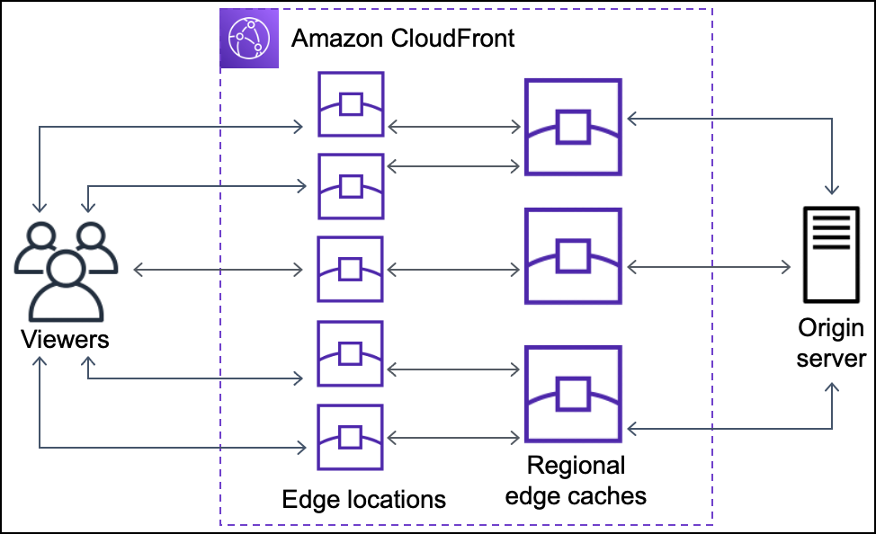
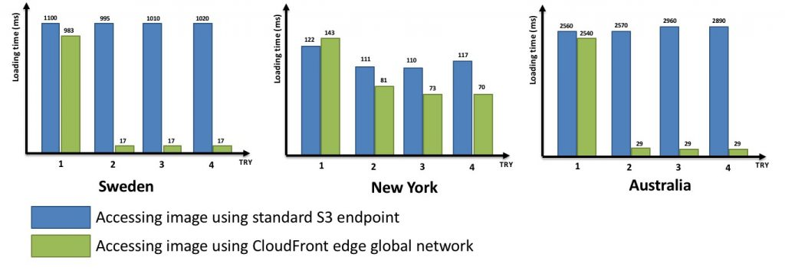
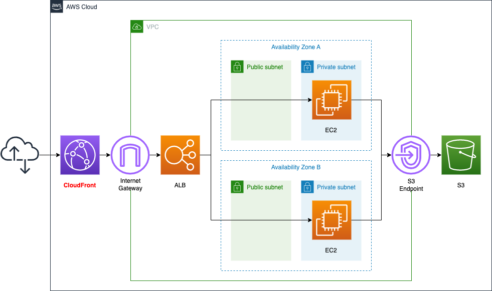
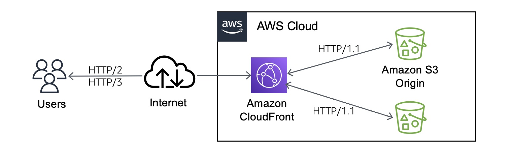

# AWS CloudFront 

# 개념

(attachment:fcf3d140-06de-4b2b-917b-29c6d1f1e4f3:image.png)

CloudFront는 AWS에서 제공하는 CDN서비스입니다. 즉,.html, .css, .js 및 이미지 파일과 같은 정적 및 동적 웹 콘텐츠를 사용자에게 더 빨리 배포하도록 지원하는 웹 서비스입니다. 즉 고속 콘텐츠 전송 네트워크(CDN) 서비스 입니다.

CDN은 Client의 콘텐츠 요청으로 서버에서 받아온 콘텐츠를 **캐싱하고 이후 같은 요청이 왔을 때, 그 캐싱해 둔 것을 제공하는 개념**입니다. 이렇게 함으로써 물리적으로 거리가 먼 곳에도 빠르게 요청을 처리할 수 있고 결과적으로 서버의 부하를 낮출 수 있습니다.

\*CDN(기술적인 개념)

\*CloudFront(AWS에서 제공하는 CDN서비스)

# **Edge Location(POP) / Regional Edge Cache(REC)**

## **Edge Location(POP)**

- CloudFront가 전 세계에 분산 배치한 **최전방 캐시 서버**
- 사용자의 요청을 가장 가까운 엣지 로케이션이 받아 응답
- 사용자가 요청한 콘텐츠의 캐시가 Edge Location에 있다면 멀리 있는 서버에 직접 요청이 아닌 가까운 Edge Location에 저장된 캐시를 불러옴
- 요청 시 캐시가 없으면 → 상위 계층(리전 엣지 캐시) 또는 오리진으로 전달
- 전 세계 주요 도시에 300개 이상 분포

## **Regional Edge Cache(REC)**

- 특정 **리전에만 있는 중간 캐시 계층**
- Edge Location보다 크고 오리진과 Edge Location 사이에 위치
- 엣지 로케이션에 없는 콘텐츠 요청이 있을 때, 오리진까지 가지 않고 **리전 엣지 캐시**에서 먼저 확인
- **더 긴 TTL 캐싱** → 오리진 부하 줄이고, 자주 요청되지 않는 객체라도 일정 기간 저장
- 엣지 로케이션과 오리진 사이에서 완충 역할을 하는 중간 캐시 서버

# 동작 순서

(attachment:bebe3d25-bdc5-4ac0-8147-3cf64d8af062:image.png)

1. 사용자가 어플리케이션에 요청을 한다.
2. DNS는 사용자에게 적합한 Edge Location으로 라우팅 한다.
3. Edge Location에서 캐시를 확인하고 있으면 이것을 사용자에게 반환한다.

### Edge Location, REC에 캐시가 없는 경우

1. 가장 가까운 REC로 캐시가 있는지 요청한다.
2. CloudFront는 오리진으로 요청을 전달한다.
3. 오리진은 '오리진 > REC > Edge Location > CloudFront가 사용자에게 전달' 수순을 밟는다. (캐시도 추가된다.)

### REC에 캐시가 존재하는 경우

1. REC는 콘텐츠를 요청한 Edge Location으로 반환한다.
2. REC로부터 콘텐츠의 첫 번째 바이트가 도착하는 즉시 Edge Location은 이를 사용자에게 반환한다.
3. Edge Location은 나중을 위해 이 콘텐츠 캐시를 저장한다.

# 장점

- AWS 네트워크를 사용하면 사용자의 요청이 반드시 통과해야 하는 네트워크의 수가 줄어들어 성능이 향상
- 파일의 첫 바이트를 로드하는 데 걸리는 지연 시간이 줄어들고 데이터 전송 속도가 빨라진다.
- 파일(객체)의 사본이 전 세계 여러 엣지 로케이션에 유지(또는 캐시)되므로 안정성과 가용성이 향상
- 보안성 향상
  - CloudFront는 기본적으로 HTTPS(TLS)를 사용해 클라이언트 ↔ 엣지 로케이션 ↔ 오리진 서버 간 통신을 암호화
  - 오리진 서버에 대한 종단 간 연결의 보안이 보장됨(https)
  - 서명된 URL 및 쿠키 사용 옵션으로 자체 사용자 지정 오리진에서 프라이빗 콘텐츠를 제공하도록 할 수 있음

(attachment:75484799-36b1-43a5-87dd-1e9857ea60b4:image.png)

# **CloudFront의 Static(정적) / Dynamic(동적) 콘텐츠 처리**

**CloudFront는 다른 CDN과 다르게 '정적' 콘텐츠와 '동적' 콘텐츠를 모두 처리합니다.**

### 정적 콘텐츠

이미지, JS, CSS, 동영상 같은 파일은 대표적으로 캐싱됩니다. 사용자가 서울에서 CloudFront로 접근하면 서울 엣지 서버에 한 번 캐시된 후 그 다음 사용자들은 오리진까지 가지 않고 엣지에서 곧바로 받습니다.

### 동적 콘텐츠

API 응답도 캐싱할 수 있지만, 보통은 데이터가 자주 바뀌기 때문에 정적 캐싱한다면 TTL(time-to-live) 시간 동안 사용자는 새롭게 추가/수정된 데이터를 볼 수 없게 됩니다. 그래서 TTL(time-to-live)을 짧게 두거나 캐싱하지 않는 경우가 많습니다.

# 배포 환경

(attachment:db914653-f0a2-4b40-9e27-9a48b8ec840d:image.png)

1. AWS 콘솔 → CloudFront
2. CloudFront 생성시 Origin 설정 ⇒ ALB DNS 이름 입력 (예: `my-alb-123456.ap-northeast-2.elb.amazonaws.com`)
   즉 origin은 ALB를 바라보고 있음

CloudFront 배포를 설정하면 `d1234abcd.cloudfront.net` 같은 고유한 도메인이 자동으로 발급

사용자 ⇒ CloudFront ⇒ ALB ⇒ 서버 접근

# CloudFront의 재밌는 기능

## **HTTPS 지원 기능**

CloudFront는 오리진에 HTTPS를 지원하지 않아도 HTTPS 통신을 알아서 해주는 기능이 있습니다. 사용자 입장에서 CloudFront와만 HTTPS 프로토콜 통신을 하고, 그 이후 Origin 까지는 HTTP 프로토콜로 통신하는 개념 입니다.

하지만 `d1234abcd.cloudfront.net` 와 같은 cloudfront 도메인을 그대로 쓰는 경우는 없기 때문에 결국 커스텀 도메인을 쓰려면 SSL 인증서를 발급 받는 절차가 필요 합니다.

## **특정 지역 콘텐츠 접근 제한 기능**

CloudFront는 지리적 제한을 할 수 있는 기능이 있습니다. 회사의 비즈니스 사정으로 어느 어느 나라는 콘텐츠에 접근할 수 없도록 구성한다던가 아니면 해킹 등을 우려하여 1차적으로 특정 나라로부터 콘텐츠 접근을 제한할 수 있습니다.

# 궁금한 점

## 프론트 배포시 CloudFront를 어떻게 사용할 수 있을까, 동적 데이터도 캐싱을 할 수 있을까?

프론트엔드 빌드 결과물(JS, CSS, 이미지, 폰트 등)을 CloudFront + S3 조합으로 배포하는 게 가장 흔하고 웹 성능(LCP, FCP 등)이 크게 향상될수 있음. 하지만 동적 콘텐츠를 캐싱하거나 미디어 스트리밍 서비스와 같은 OTT서비스에서는 서버 측 인프라에서 CloudFront를 사용합니다.

> https://docs.aws.amazon.com/ko_kr/AmazonCloudFront/latest/DeveloperGuide/Introduction.html > [https://inpa.tistory.com/entry/AWS-📚-CloudFront-개념-원리-사용-세팅-💯-정리](https://inpa.tistory.com/entry/AWS-%F0%9F%93%9A-CloudFront-%EA%B0%9C%EB%85%90-%EC%9B%90%EB%A6%AC-%EC%82%AC%EC%9A%A9-%EC%84%B8%ED%8C%85-%F0%9F%92%AF-%EC%A0%95%EB%A6%AC) > https://bosungtea9416.tistory.com/entry/AWS-CloudFront
