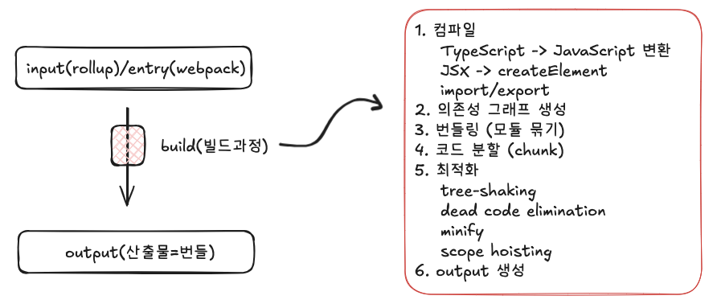

# 번들러(Bundler)

## 개념

모듈 Bundler(번들러)는 일반 브라우저에서 사용하기 위해 자바스크립트와 해당 종속성을 단일 파일로 묶는 도구입니다. **즉 여러개의 파일들을 하나의 파일로 묶어주는 도구**



### 1. 컴파일

- TypeScript 를 JavaScript로 변환
- JSX를 JavaScript로 변환(react v16이전과 이후 방식이 다름)
  createElement는 react v16이전에만 쓰임.
  하는 일: JSX → 함수 호출, 객체 생성, Virtual DOM 표현

  ```jsx
  function App() {
    return <h1>Hello</h1>;
  }

  // 컴파일 후 React 16이전
  function App() {
    return React.createElement("h1", null, "Hello");
  }

  // 컴파일 후 React 16이후
  import { jsx as _jsx } from "react/jsx-runtime";
  _jsx("div", { children: "Hello" });
  ```

- SCSS -> CSS 변환

### 2. 의존성 그래프 생성

- entry부터 시작해서 import 관계를 따라 그린 파일 연결 그래프
- 그래프에 없는 파일은 번들에 포함되지 않음 :tree-shaking
- 그래프가 끊어지는 지점이 Code-Spliting => 새로운 chunk 생성
- 빌드 순서 결정: 의존성이 먼저 처리

### 3. 번들링(모듈 묶기)

- 의존성 그래프에 있는 모듈들을 브라우저/런타임이 실행할 수 있도록 하나의 실행 단위로 재구성하는 과정

### 4. 코드분할(chunk)

- 의존성 그래프를 여러 개의 실행 단위(chunk)로 나누는 전략이자 언제 어떤 코드를 로드할지를 결정하는 단계
- 한번에 내려주게 되면 초기 로딩이 느리고 JS 파싱 비용 큼, 당장 사용 안 하는 코드도 다운로드됨
- 코드분할 기준

  ```jsx
  // 1. Dynamic import
  import("./Chart");
  // 새로운 async chunk 생성

  // 2. 라우트 단위 분할
  const Page = lazy(() => import("./Page"));
  // 페이지 단위 chunk

  // 3. vendor 분리
  react, react - dom;
  ```

- 코드 분할 결과: 파일 개수 증가, 초기 JS 크기 감소, 네트워크 요청 증가

### 5. 최적화

- 실행 결과는 동일하게 유지하면서 코드의 크기·속도를 개선하는 과정
- tree-shaking: 사용하지 않는 export 제거
- dead code elimination(DCE): 실행 불가능한 코드 제거
  ```jsx
  if (false) {
    doSomething();
  }
  ```
- minify: 코드를 최대한 압축
  변수명 축약, 공백 제거, 표현식 단순화
- scope hoisting: 모듈 스코프 평탄화
  원래는 번들러는 모듈 간 변수 충돌을 막기 위해 각 파일을 함수로 감싸서 스코프를 분리.
  하지만 충돌이 없는 여러개의 파일은 하나의 스코프(범위)로 합치는 번들링 최적화 기법

### 6. output 생성

## 번들러가 필요해진 이유

### 기존 브라우저 방식

의존성(import)이라는 개념 없이 파일을 그냥 순서대로 실행

```jsx
<script src="a.js"></script>
<script src="b.js"></script>
```

### 즉 브라우저는 다음 개념들을 알 수 없었습니다.

- ES Module: ES6 import 문법
- import/export
- `<script>` 간 모듈 개념

### 웹이 커지면서 다음과 같은 문제가 발생하기 시작했습니다.

- `window`나 `jQuery`와 같은 전역 스코프 남용

```js
// a.js
window.utils = { sum };

// b.js
window.utils.sum();
```

- 변수 이름 충돌
- 파일 순서 조금만 바뀌어도 에러 발생
- 성능·용량·호환성 요구가 폭증

### 웹이 단순한 페이지가 아니라 다음과 같은 것들을 구현해야했습니다.

- 앱처럼 동작
- 빠른 로딩
- 다양한 기기 지원

### 기술적으로 봤을 때는 다음과 같은 요구사항이 있었습니다.

- 더 작은 파일: 용량 줄이기 (minify)
- 더 빠른 로딩: 여러 파일 → 하나로 (bundling)
- 다양한 브라우저 지원: 최신 문법 → 옛날 문법 (transpile)
- 안 쓰는 코드 제거: tree-shaking, DCE

### webpack 이전에 등장한 grunt, gulp

- 장점
  - 파일 합치기
  - 압축
  - 변환
- 단점
  - 의존성 개념 없음
  - JS 모듈 관계를 이해하지 못함

### 이후 webpack이 등장할 때 가지고 있던 큰 특징

- entry부터 import 추적
- 의존성 그래프 생성
- 실행 가능한 번들 생성

### 현재 브라우저는 import를 지원하는데 왜 번들러를 사용할까?

브라우저의 모듈 로딩만으로는 해결되지 않는 배포 환경의 성능·최적화·호환성 문제를 해결하기 위해 번들러를 사용합니다. \_번들러를 사용하면 당연히 번들링까지 번들러가 하게 됩니다.

- npm 패키지
- 코드 분할
- 최적화
- 레거시 브라우저
- 성능

## Bundler 종류

## Webpack

- 모듈 번들링(Module Bundling): 진입점(entry)에 연결된 모듈들을 분석하여 실행 가능한 하나 이상의 번들로 묶어줍니다.
- 번들 최적화(Automatic Bundle Optimization): 번들 최적화를 통해, 보다 더 작은 번들을 생성하고 그만큼 빠르게 로딩할 수 있습니다.
- 코드 스플리팅(Code Splitting): 모듈을 청크(chunk)로 분리하여, 동적으로 필요한 모듈만 로딩할 수 있습니다.
- 트리 쉐이킹(Tree Shaking): 사용되지 않는 코드를 제거해 번들의 크기를 줄이고 성능을 향상시킬 수 있습니다.
- 개발 서버 실행(Development Server): webpack-dev-server를 통해 코드 변경 시 자동으로 반영되는 개발 환경(HMR)을 구성할 수 있습니다.

## Parcel

- 파셀은 Webpack과 달리 별도의 구성 파일 없이 간단하게 사용할 수 있는 번들러로 최소한의 구성(Zero config)을 지향합니다.

## Rollup

- 롤업은 내부적으로 typescript(ES6)를 사용하고 웹팩은 내부적으로 Commonjs를 사용합니다.

## ESBuild

- Webpack이나 Rollup은 JavaScript기반으로 번들링합니다. 따라서 JavaScript 가 가질수 밖에 없는 성능상의 한계가 있었습니다. ESBuild는 내부적으로 Go로 작성되었고 JS 기반 번들러보다 10배에서 100배까지 빠른 퍼포먼스를 보여줍니다.
- 자체 JavaScript 파서를 사용합니다.

## Vite

- ESBuild의 단점을 보완시킨 라이브러리 입니다.
- esbuild로 파일들을 통합하고 rollup을 통해 번들링합니다.
- 개발 서버 구동 시간이 거의 0에 가까웁니다.
  이유는 개발서버 (즉 로컬서버)에서 브라우저에 `/src/main.ts` 파일만 컴파일하고 그대로 브라우저에 전달. 즉 번들링과 최적화는 안하고 번들링을 브라우저에만 맡김
- 모든 CommonJS 및 UMD 파일을 ESM으로 불러올 수 있도록 변환합니다.
- 별도의 설정이 없이 다양한 리소스 import 가능합니다.
- vite는 기본적으로 ES6을 타겟으로 번들을 생성합니다. (따라서 ES5이하로 타겟을 잡으려면 별도로 polyfill를 다뤄야 합니다.)
