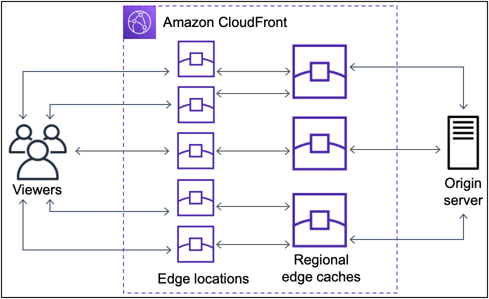

# CDN(Content Delivery Network)

## CDN이란?

CDN은 콘텐츠를 세계에 분산하여 저장한 다음, 요청할 때마다 웹 콘텐츠를 신속하게 전송해 주는 분산 서버 네트워크 시스템입니다. CDN은 캐싱을 통해 웹 페이지, 이미지, 비디오 등의 콘텐츠가 사용자 디바이스에 도달하는 데 걸리는 시간을 최소화합니다.

## 동작방식

CDN에는 아래 세 종류의 서버가 필요합니다.

- 오리진 서버는 웹사이트의 원본 콘텐츠(HTML 파일, 이미지, 비디오, 데이터베이스 등)를 저장하고 있는 중앙 서버입니다. 웹사이트 운영자는 오리진 서버에서 콘텐츠를 업데이트하거나 삭제하고, 오리진 서버를 관리해야 됩니다. (EC2 Instance, S3 Bucket, On-Premise etc...)

- 엣지 서버(엣지 로케이션)는 전 세계 곳곳 위치한 분산 서버이며 오리진 서버의 콘텐츠를 캐싱하고 있고 캐시 정책에 따라 콘텐츠를 업데이트하고 있습니다.
  CDN은 가장 가까운 엣지 서버에서 사용자에게 콘텐츠를 제공하기 때문에 사용자가 최신 콘텐츠를 빠르게 받을 수 있습니다.
  또한 엣지 서버는 CDN 공급업체가 관리합니다.

- 사용자가 오리진 서버에 요청을 보내면 DNS 서버는 사용자를 가장 가까운 엣지 서버로 라우팅해줍니다. DNS 서버는 CDN에서 오리진 서버와 엣지 서버를 연결해주는 역할을 합니다.

## 동작 순서

1. DNS 서버는 사용자의 위치를 기준으로 가장 가까운 엣지 서버(캐싱 서버)의 IP 주소를 반환합니다.
2. 엣지 서버는 요청된 콘텐츠가 캐싱되어 있는지 확인합니다. 엣지 서버에 해당 콘텐츠가 캐싱되어 있지 않거나 캐시된 콘텐츠가 만료됐다면, 오리진 서버에서 최신 콘텐츠를 가져옵니다.
3. 엣지 서버는 사용자에게 콘텐츠 제공합니다.

## CDN 솔루션 업체

- 아마존 웹 서비스(AWS): CloudFront
- 아카마이 테크놀로지: Akamai
- 클라우드플레어: Cloudflare
- 패스틀리: Fastly

## AWS CloudFront를 사용한 CDN

### CloudFront 동작 순서

1. 사용자가 어플리케이션에 요청을 한다.
2. DNS는 사용자에게 적합한 엣지 로케이션으로 라우팅 한다.
3. 엣지 로케이션에서 캐시를 확인하고 있으면 이것을 사용자에게 반환한다.
4. 없으면 가장 가까운 \*REC로 캐시가 있는지 요청한다.
5. 없으면 CloudFront는 오리진으로 요청을 전달한다.
6. 오리진은 '오리진 > REC > Edge Location > CloudFront가 사용자에게 전달' 수순을 밟는다. (캐시도 추가된다)
7. REC에 캐시가 있다면 REC는 콘텐츠를 요청한 Edge Location으로 반환한다.
8. REC로부터 콘텐츠의 첫 번째 바이트가 도착하는 즉시 Edge Location은 이를 사용자에게 반환한다.
9. Edge Location은 나중을 위해 이 콘텐츠 캐시를 저장한다.

그 이후 콘텐츠는 TTL 값 동안 엣지 로케이션에 캐싱되어 낮은 지연시간으로 콘텐츠를 요청할 수 있습니다.

\*REC 리전 엣지 캐시(Regional Edge Cache)
CloudFront의 오리진 서버(CDN)와 엣지 로케이션 사이에 위치해 있다고 볼 수 있습니다.
만일 서비스를 이용하려고 할때, 엣지 로케이션에 컨텐츠가 없는 경우 리전별 엣지 캐시에서 검색 시도합니다.

### CloudFront의 Static(정적) / Dynamic(동적) 콘텐츠 처리

CloudFront는 다른 CDN과 다르게 '정적' 콘텐츠와 '동적' 콘텐츠를 모두 처리합니다.

정적 콘텐츠에는 서버(EC2)가 필요하지 않은 이미지 같은 것이 포함됩니다. 미리 캐싱해둔 뒤, 모든 사용자에게 동일하게 전달해줘도 무방한 데이터에 사용할 수 있습니다.

동적 콘텐츠는 서버가 필요한 콘텐츠를 의미합니다. 즉, 서버가 무언가 해줘야 하는 데이터이며 예를 들면 뒷단의 데이터베이스에서 끌어오는 로그인 자료라던지 혹은 실시간으로 새롭게 추가되는 게시판이 될 수 있습니다. 이런 자료를 정적 캐싱한다면 TTL 시간 동안 사용자는 새롭게 추가/수정된 데이터를 볼 수 없게 됩니다.

이것을 간략하게 AWS 구성해보자면 다음과 같습니다. 서버(EC2)의 연산이 필요한 동적 콘텐츠의 요청을 EC2로 향하게 분산 처리하고 서버가 필요하지 않은 정적 콘텐츠는 S3 버킷 등으로 분산 처리하는 구성을 고려해볼 수 있습니다.

> ref.   > https://docs.tosspayments.com/resources/glossary/cdn   > https://bosungtea9416.tistory.com/entry/AWS-CloudFront
