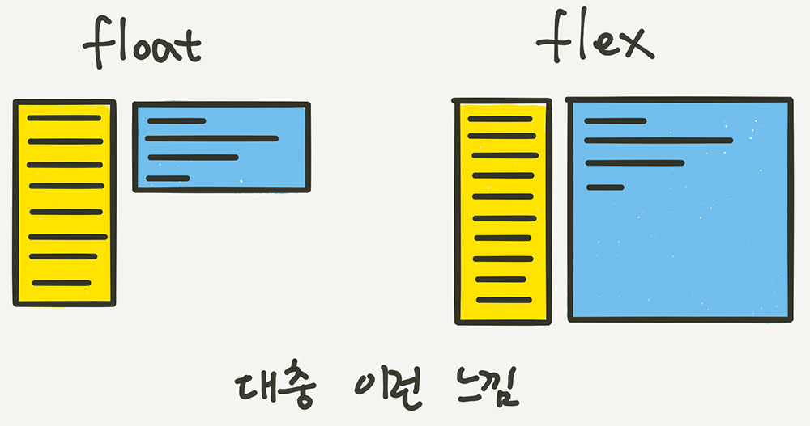

# CSS Flex

```
.container {
	display: flex;
	/* display: inline-flex; */
}
```



Flex 아이템들은 가로 방향으로 배치되고, inline 요소들 처럼 자신이 가진 내용물의 width 만큼만 차지하게 됩니다. height는 컨테이너의 높이만큼 늘어납니다.

## display: inline-flex;


아이템의 배치와 관련이 있다기 보다는, 컨테이너가 주변 요소들과 어떻게 어우러질지 결정하는 값입니다. inline-flex는 inline-block처럼 동작합니다.

---

<br/>


아이템들이 배치된 방향의 축을 메인축(Main Axis),
메인축과 수직인 축을 수직축 또는 교차축(Cross Axis)이라고 부릅니다.

## flex-direction (배치 방향설정)

아이템들이 배치되는 축의 방향을 결정하는 속성입니다. 메인축의 방향을 가로로 할건지 세로로 할건지 정해줍니다.

```
.container {
	flex-direction: row;
	/* flex-direction: column; */
	/* flex-direction: row-reverse; */
	/* flex-direction: column-reverse; */
}
```


### row (기본값)

아이템들이 행(가로) 방향으로 배치됩니다.

### row-reverse

아이템들이 역순으로 가로 배치됩니다.

### column

아이템들이 열(세로) 방향으로 배치됩니다.

### column-reverse

아이템들이 역순으로 세로 배치 됩니다.

## flex-wrap (줄넘김 처리 설정)

컨테이너가 더 이상 아이템들을 한 줄에 담을 여유 공간이 없을 때 아이템 줄바꿈을 어떻게 할지 결정하는 속성입니다.

```
.container {
	flex-wrap: nowrap;
	/* flex-wrap: wrap; */
	/* flex-wrap: wrap-reverse; */
}
```


### nowrap (기본값)

줄바꿈을 하지 않습니다. 넘치면 컨테이너 밖으로 빠져나갑니다.

### wrap

줄바꿈을 합니다. float이나 inline-block으로 배치한 요소들과 비슷하게 동작합니다.

### wrap-reverse

줄바꿈을 하는데, 아이템을 역순으로 배치합니다.

## flex-flow (flex-direction, flex-wrap 합쳐진 속성)

flex-direction과 flex-wrap을 한꺼번에 지정할 수 있는 단축 속성으로 flex-direction, flex-wrap의 순으로 한 칸 떼고 정의하면 됩니다.

```
.container {
	flex-flow: row wrap;
	/* 아래의 두 줄을 줄여 쓴 것 */
	/* flex-direction: row; */
	/* flex-wrap: wrap; */
}
```

# [정렬]

## justify-content (메인축 방향 정렬)

```
.container {
	justify-content: flex-start;
	/* justify-content: flex-end; */
	/* justify-content: center; */
	/* justify-content: space-between; */
	/* justify-content: space-around; */
	/* justify-content: space-evenly; */
}
```


### flex-start (기본값)

아이템들을 시작점으로 정렬합니다.flex-direction이 row(가로 배치)일 때는 왼쪽, column(세로 배치)일 때는 위부터 정렬 됩니다.

### flex-end

아이템들을 끝점으로 정렬합니다. flex-direction이 row(가로 배치)일 때는 오른쪽, column(세로 배치)일 때는 아래로 정렬 됩니다.

### center

아이템들을 가운데로 정렬합니다.

### space-between

아이템들의 “사이(between)”에 균일한 간격을 만들어 줍니다.

### space-around

아이템들의 “둘레(around)”에 균일한 간격을 만들어 줍니다.

### space-evenly

아이템들의 사이와 양 끝에 균일한 간격을 만들어 줍니다.
IE와 엣지(Edge)에서는 지원되지 않습니다

## align-items (교차축 방향 정렬)

```
.container {
	align-items: stretch;
	/* align-items: flex-start; */
	/* align-items: flex-end; */
	/* align-items: center; */
	/* align-items: baseline; */
}
```


### stretch (기본값)

아이템들이 수직축 방향으로 끝까지 늘어납니다.

### flex-start

아이템들을 시작점으로 정렬합니다. flex-direction이 row(가로 배치)일 때는 위, column(세로 배치)일 때는 왼쪽부터 정렬 됩니다.

### flex-end

아이템들을 끝으로 정렬합니다. flex-direction이 row(가로 배치)일 때는 아래, column(세로 배치)일 때는 오른쪽으로 정렬 됩니다.

### center

아이템들을 가운데로 정렬합니다.

### baseline

아이템들을 텍스트 베이스라인 기준으로 정렬합니다.


<br/>

## align-content (여러 행 정렬)

flex-wrap: wrap; (줄바꿈) 이 설정된 상태에서, 아이템들의 행이 2줄 이상 되었을 때의 교차축 방향 정렬을 결정하는 속성입니다. 즉 두줄 이상 있어야지 의미가 있는 속성 입니다.

```
.container {
	flex-wrap: wrap;
	align-content: stretch;
	/* align-content: flex-start; */
	/* align-content: flex-end; */
	/* align-content: center; */
	/* align-content: space-between; */
	/* align-content: space-around; */
	/* align-content: space-evenly; */
}
```

<br/>

# [item 속성]

## flex-basis (유연한 박스의 기본 영역)

flex-basis는 Flex 아이템의 기본 크기를 설정합니다(flex-direction이 row일 때는 너비, column일 때는 높이)

```
.item {
	flex-basis: auto; /* 기본값 */
	/* flex-basis: 0; */
	/* flex-basis: 50%; */
	/* flex-basis: 300px; */
	/* flex-basis: 10rem; */
	/* flex-basis: content; */
}
```

## flex-grow (유연하게 늘리기)

flex-grow는 아이템이 flex-basis의 값보다 커질 수 있는지를 결정하는 속성입니다. flex-grow에는 숫자값이 들어가는데, 몇이든 일단 0보다 큰 값이 세팅이 되면 해당 아이템이 유연한(Flexible) 박스로 변하고 원래의 크기보다 커지며 빈 공간을 메우게 됩니다.
기본값이 0이기 때문에, 따로 적용하기 전까지는 아이템이 늘어나지 않았습니다.

## flex-shrink (유연하게 줄이기)

flex-shrink는 flex-grow와 쌍을 이루는 속성으로, 아이템이 flex-basis의 값보다 작아질 수 있는지를 결정합니다.flex-shrink에는 숫자값이 들어가는데, 몇이든 일단 0보다 큰 값이 세팅이 되면 해당 아이템이 유연한(Flexible) 박스로 변하고 flex-basis보다 작아집니다.
기본값이 1이기 때문에 따로 세팅하지 않았어도 아이템이 flex-basis보다 작아질 수 있었습니다.

## flex (flex-grow, flex-shrink, flex-basis 합쳐진 속성)

flex-grow, flex-shrink, flex-basis를 한 번에 쓸 수 있는 축약형 속성입니다.
이 세 속성들은 서로 관련이 깊기 때문에, 이 축약형을 쓰는 편이 여러모로 편리합니다.

```
.item {
	flex: 1;
	/* flex-grow: 1; flex-shrink: 1; flex-basis: 0%; */
	flex: 1 1 auto;
	/* flex-grow: 1; flex-shrink: 1; flex-basis: auto; */
	flex: 1 500px;
	/* flex-grow: 1; flex-shrink: 1; flex-basis: 500px; */
}
```

## align-self (수직축으로 아이템 정렬)

align-items가 전체 아이템의 수직축 방향 정렬이라면, align-self는 해당 아이템의 수직축 방향 정렬입니다.

```
.item {
	align-self: auto; // (기본값)
	/* align-self: stretch; */
	/* align-self: flex-start; */
	/* align-self: flex-end; */
	/* align-self: center; */
	/* align-self: baseline; */
}
```

기본값은 auto로, 기본적으로 align-items 설정을 상속 받습니다.
align-self는 align-items보다 우선권이 있습니다. auto외의 나머지 값들은 align-items와 동일합니다.


<br/>
<br/>
<br/>

[출처](https://studiomeal.com/archives/197)
