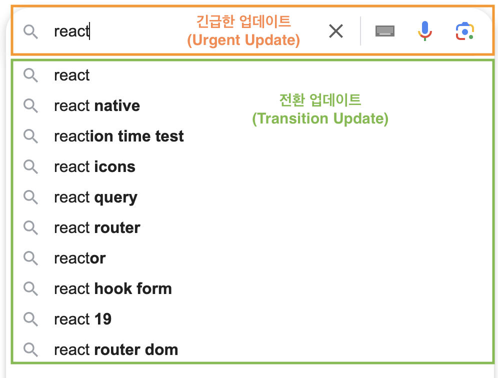
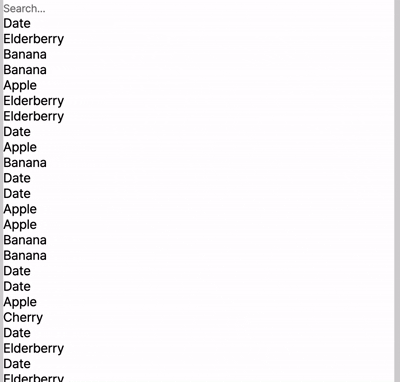
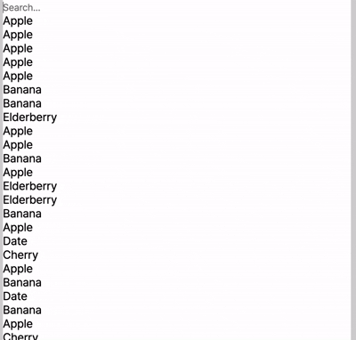

# Concurrent Rendering - 동시성 렌더링

## 동시성과 병렬성의 개념

- 동시성(Concurrency)
  - 동시성은 여러 작업이 겹쳐서 수행되는 방식을 의미합니다.
- 병렬성(Parallelism)
  - 병렬성은 여러 작업이 실제로 동시에 실행되는 방식입니다.


<br/>

React 18에서 도입된 API 중 startTransition, useTransition, useDeferredValue 가 동시성 렌더링을 위해 추가된 기능들 입니다. (React19 현재 최신버전에도 도입되어 있음)
동시성 렌더링을 사용하여 급한 작업과 덜 급한 작업으로 나눠, 급한 작업을 우선 화면에 렌더링 하는 방법으로 사용성 개선을 했습니다.

비동기적인 상태 업데이트가 사용자 인터페이스(UI)의 반응성을 저하시킬 가능성이 있을 때 이를 지연시킬 수 있게 해줍니다. 이 기능을 사용하면 긴 작업이 진행 중일 때, 중요한 UI 업데이트(예: 사용자 입력 처리)는 우선적으로 처리되고, 긴 작업은 뒤로 미뤄져 자연스러운 사용자 경험을 제공합니다.

<br/>

**<예시-검색 기능에서 긴급한 업데이트와 전환 업데이트 분리>**


**<예시-동시성 렌더링을 사용하지 않았을 경우>**

```
import React, { useState } from 'react';

const SearchFilter = () => {
   const [inputValue, setInputValue] = useState<string>('');
  const [searchResult, setSearchResult] = useState<string[]>([]);

 const items = ['Apple', 'Banana', 'Cherry', 'Date', 'Elderberry', 'Fig', 'Grape', 'Honeydew'];

  const handleInputChange = (event) => {
    const { value } = event.target;
    setInputValue(value);
    setSearchResult(Array.from({ length: 10000 }).map(() => items[Math.floor(Math.random() * 5)]));
  };

  return (
    <div>
      <input
        type="text"
        placeholder="Search..."
        value={inputValue}
        onChange={handleInputChange}
        style={{ color: 'gray' }}
      />
      <ul style={{ color: 'black' }}>
        {searchResult.map((item, index) => (
          <li key={index}>{item}</li>
        ))}
      </ul>
    </div>
  );
}

export default SearchFilter;

```

=> 검색창에 입력 값이 늦게 입력 된다.


<br/>

## startTransition

```
startTransition(scope)
```

- scope: () => void: scope 함수 내부에서는 1개 이상의 함수(useState의 반환 값 중 set 함수)가 호출되어야 합니다. scope 함수는 즉시 실행되며, 내부에서 호출한 상태 업데이트들은 모두 전환 업데이트로 처리됩니다.

전환 업데이트 중에 긴급한 업데이트가 들어오면 전환 업데이트는 중단되고 긴급한 업데이트를 먼저 처리하여 UI를 차단하지 않습니다. 아래 코드와 같이 startTransition 함수를 사용할 수 있습니다.

**<예시-startTransition 사용 했을 때>**

```
import React, { useState, startTransition } from 'react';

const SearchFilter = () => {
  const [inputValue, setInputValue] = useState('');
  const [searchResult, setSearchResult] = useState<string[]>([]);

  const items = ['Apple', 'Banana', 'Cherry', 'Date', 'Elderberry', 'Fig', 'Grape', 'Honeydew'];


  const handleInputChange = (event) => {
    const { value } = event.target;
    setInputValue(value);

    // 사용자가 입력할 때, startTransition을 사용하여 필터링을 비동기적으로 처리
    startTransition(() => {
      setSearchResult(Array.from({ length: 10000 }).map(() => items[Math.floor(Math.random() * 5)]));
    });
  };

  return (
    <div>
      <input
        type="text"
        placeholder="Search..."
        value={inputValue}
        onChange={handleInputChange}
        style={{ color: 'gray' }}
      />
      <ul style={{ color: 'black' }}>
        {searchResult.map((item, index) => (
          <li key={index}>{item}</li>
        ))}
      </ul>
    </div>
  );
};

export default SearchFilter;

```

=> 검색창에 입력 값이 빠르게 반영 된다.



<br/>

## useTransition

```
const [isPending, startTransition] = useTransition()
```

- isPending: boolean: 지연 중인 전환이 있는지 여부를 알려주는 플래그입니다.
- startTransition: 상태 업데이트를 전환 업데이트로 처리하는 함수입니다.

isPending 플레그가 있다는 점을 제외하고 startTransition 함수와 동일한 사용성을 가집니다. 아래 코드와 같이 isPending를 사용하여 지연 상태를 표시할 수 있습니다.

**<예시-useTransition 사용 했을 때>**

```
import React, { useState, useTransition } from 'react';

const SearchFilter = () => {
  const [inputValue, setInputValue] = useState('');
  const [searchResult, setSearchResult] = useState<string[]>([]);

  const items = ['Apple', 'Banana', 'Cherry', 'Date', 'Elderberry', 'Fig', 'Grape', 'Honeydew'];

  // startTransition을 사용하여 상태 업데이트를 비동기적으로 처리
  const [isPending, startTransition] = useTransition();

  const handleInputChange = (event) => {
    const { value } = event.target;
    setInputValue(value);

    // 사용자가 입력할 때, startTransition을 사용하여 필터링을 비동기적으로 처리
    startTransition(() => {
      setSearchResult(Array.from({ length: 10000 }).map(() => items[Math.floor(Math.random() * 5)]));
    });
  };

  return (
    <div>
      <input
        type="text"
        placeholder="Search..."
        value={inputValue}
        onChange={handleInputChange}
        style={{ color: 'gray' }}
      />
      {isPending && <p>Loading...</p>} {/* 필터링이 진행 중일 때 로딩 메시지 표시 */}
      <ul style={{ color: 'black' }}>
        {searchResult.map((item, index) => (
          <li key={index}>{item}</li>
        ))}
      </ul>
    </div>
  );
};

export default SearchFilter;
```

=> 검색창에 입력 값이 빠르게 반영 된다.

<br/>

## useDeferredValue

```
const deferredValue = useDeferredValue(value, initialValue?)
```

- value: any: 지연하려는 값이며 모든 타입이 올 수 있습니다.
- initialValue: any: 컴포넌트 초기 렌더링 시 사용할 값입니다. 이 옵션을 생략하면 초기 렌더링 동안 useDeferredValue는 값을 지연시키지 않습니다. 이는 대신 렌더링할 value의 이전 버전이 없기 때문입니다.
- deferredValue: any: 지연된 값 입니다.

startTransition 함수를 사용하기 위해서는 파라미터에 들어갈 함수를 사용해야하는데 함수에 접근할 수 없거나 컴포넌트가 전달받은 props를 지연하고 싶을 경우 useDeferredValue 훅을 사용할 수 있습니다.

**<예시-useDeferredValue 사용 했을 때>**

```
'use client';

import React, { useDeferredValue, useState } from 'react';

const SearchFilter = () => {
  const [inputValue, setInputValue] = useState('');
  const [searchResult, setSearchResult] = useState<string[]>([]);
  const deferredValue = useDeferredValue(searchResult);
  const isStale = searchResult !== deferredValue; // searchResult deferredValue 값이 다를 경우 지연중임

  const items = ['Apple', 'Banana', 'Cherry', 'Date', 'Elderberry', 'Fig', 'Grape', 'Honeydew'];

  const handleInputChange = (event) => {
    const { value } = event.target;
    setInputValue(value);

    setSearchResult(Array.from({ length: 10000 }).map(() => items[Math.floor(Math.random() * 5)]));
  };

  return (
    <div>
      <input
        type="text"
        placeholder="Search..."
        value={inputValue}
        onChange={handleInputChange}
        style={{ color: 'gray' }}
      />
      {isStale && <p>Loading...</p>} {/* 필터링이 진행 중일 때 로딩 메시지 표시 */}
      <ul style={{ color: 'black' }}>
        {deferredValue.map((item, index) => (
          <li key={index}>{item}</li>
        ))}
      </ul>
    </div>
  );
};

export default SearchFilter;

```

<br/>
<br/>
<br/>
- 참고
https://beomy.github.io/tech/react/concurrent-rendering/
