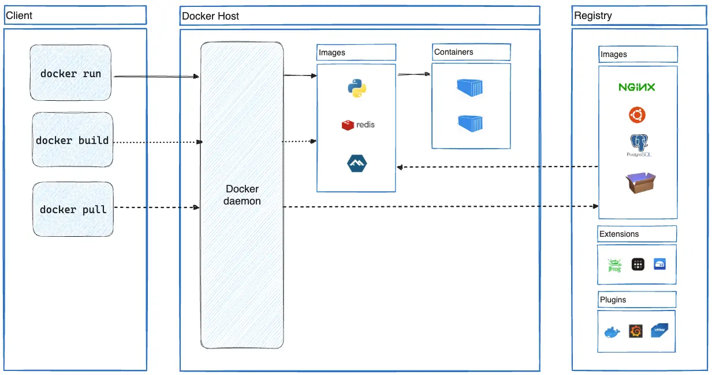
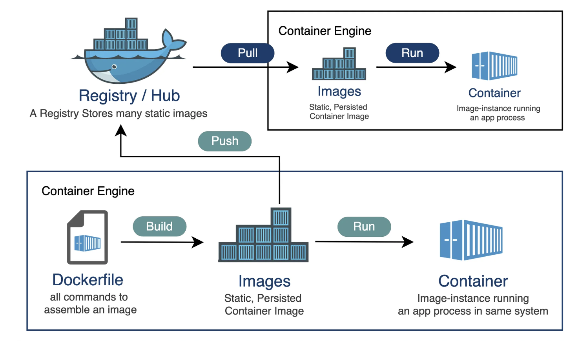
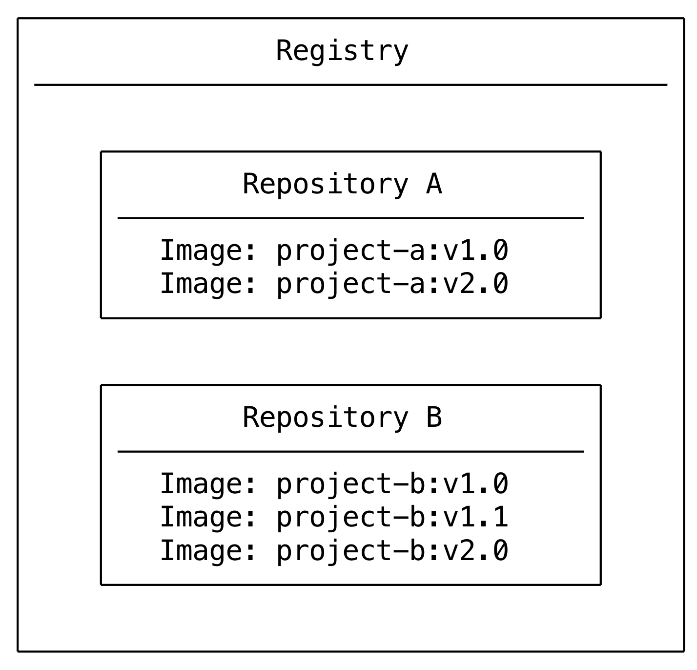
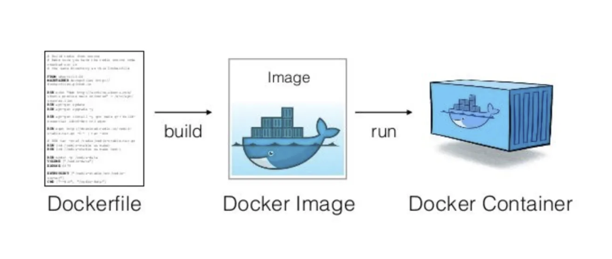

# Docker

## 개념

Docker는 개발자가 컨테이너화된 애플리케이션을 만들고 배포하기 위한 오픈 소스 플랫폼입니다. 가장 큰 장점은 표준화된 환경에서 작업할 수 있도록 하고 개발 라이프 사이클을 간소화하고 애플리케이션이 일관되게 작동하도록 보장합니다. 또한 각 컨테이너는 필요한 모든 소프트웨어를 포함하기 때문에 호스트 환경과 독립적으로 실행됩니다.

2013년 봄 시즌에 Docker 0.9.0으로 공식 릴리즈 되었습니다. <br/>
Docker는 컨테이너라는 경량화된 가상화 기술을 사용하여 애플리케이션을 패키지화하고 실행하는데 중점을 두었습니다.

## 장점

### **개발 환경의 일관성**

### Docker 사용 X

- Node.js 애플리케이션을 개발할 때, 로컬 개발 환경과 배포 환경(e.g: EC2 서버, 다른 개발자 PC, 테스트 서버) 간에 **환경 차이**가 발생할 수 있습니다.

  - 로컬 개발 환경에서 사용하는 Node.js의 버전이 다른 환경에서 사용하는 버전과 다를 수 있습니다. 이로 인해 로컬에서는 잘 작동하는 애플리케이션이 다른 환경에서는 예상치 못한 동작을 할 수 있습니다.
  - OS 차이도 문제가 될 수 있습니다. 로컬은 macOS를 사용하고, 서버는 Linux를 사용하는 경우, Linux에서 잘 동작하는 일부 패키지나 시스템 호출이 macOS에서 동작하지 않을 수 있습니다.

- 여러 개발자가 같은 애플리케이션을 개발할 때, 각자의 **로컬 개발 환경**에 따라 애플리케이션이 다르게 동작할 수 있습니다.

이런 차이로 인해, 개발자는 특정 환경에 맞게 코드를 수정하거나 설정을 변경해야 하는 상황이 발생할 수 있습니다. 심지어 다른 개발자나 팀원과의 협업 시에도 환경에 따라 발생하는 문제들을 해결하기 위한 추가 작업이 필요할 수 있습니다.

### Docker 사용 O

- Docker는 **Dockerfile**에 명시된 명확한 의존성만을 설치하고 **컨테이너화된 환경**을 제공하여 애플리케이션이 실행될 환경을 "기계적으로" 표준화합니다.
  - **이미지**를 기반으로 실행되므로, 로컬 환경, 테스트 서버, 프로덕션 서버 등에서 동일한 환경이 보장됩니다. 즉, Docker 컨테이너 내부에서 실행되는 애플리케이션은 모두 동일한 Node.js 버전, 라이브러리 버전 등을 사용하여 실행됩니다.
  - Docker 이미지가 **OS와 라이브러리, 의존성 버전까지 포함**하므로, 실제 배포 환경에서 동일한 코드가 동일하게 동작하는 것을 보장합니다.

Docker를 사용하지 않으면 개발 환경과 배포 환경 간의 **차이**, **의존성 관리**, **배포 과정**에서 발생할 수 있는 여러 문제들에 대해 해결이 필요하고, 이로 인해 **추가적인 시간과 관리**가 소모됩니다. 반면, Docker를 사용하면 **애플리케이션과 그 환경을 모두 표준화**하여, **개발 환경, 테스트 환경, 배포 환경에서 동일한 환경을 보장**하고, **배포와 확장 과정이 일관되며 간단**해집니다.

따라서 Docker는 **애플리케이션의 일관된 실행 환경을 보장**하고, **배포 및 관리의 효율성을 높이는 데** 유리합니다.

## [Docker Architecture](https://docs.docker.com/get-started/docker-overview/#docker-architecture)

컨테이너나 이미지를 다루는 Docker 명령어는 /usr/bin/docker에 위치한 파일을 통해 실행되지만 Docker 엔진의 프로세스를 확인해보면 /usr/bin/dockerd 파일로 실행되는 것을 알 수 있습니다. <br/>
이는 Docker 명령어가 실제 Docker 엔진이 아닌 클라우드로서의 도구이기 때문입니다.
즉 Docker는 클라이언트-서버 아키텍처를 사용합니다.<br/>
실제로 컨테이너를 생성하고 실행하며 이미지를 관리하는 주체는 서버도커이고, 이는 dockerd 프로세스로서 동작합니다. Docker 엔진은 외부에서 API 입력을 받아 Docker 엔진의 기능을 수행하는데, Docker 프로세스가 실행되어 서버로서 입력을 받을 준비가 된 상태를 Docker 데몬이라고 이야기합니다.<br/>
다른 하나는 Docker 클라이언트입니다. Docker 데몬은 API 입력을 받아 Docker 엔진의 기능을 수행하는데, 이 API를 사용할 수 있도록 CLI를 제공하는 것이 Docker 클라이언트입니다.
Docker 클라이언트와 데몬은 동일한 시스템에서 실행될 수도 있고 Docker 클라이언트를 원격 Docker 데몬에 연결할 수도 있습니다. Docker 클라이언트와 데몬은 REST API, UNIX 소켓 또는 네트워크 인터페이스를 사용하여 통신합니다. 또 다른 Docker 클라이언트는 Docker Compose로 컨테이너 세트로 구성된 애플리케이션으로 작업할 수 있습니다.



## [Docker Client](https://docs.docker.com/get-started/docker-overview/#the-docker-client)

Docker 클라이언트( `docker`)는 많은 Docker 사용자가 Docker와 상호 작용하는 주요 방법입니다. 와 같은 명령을 사용하면 `docker run`클라이언트가 이러한 명령을 로 보내서 `dockerd`실행합니다. 이 `docker`명령은 Docker API를 사용합니다. Docker 클라이언트는 두 개 이상의 데몬과 통신할 수 있습니다.

## [Docker Registry](https://docs.docker.com/get-started/docker-overview/#docker-registries)


Docker 레지스트리는 컨테이너 이미지를 저장하고 공유하기 위한 중앙 집중형 장소입니다. 공개 또는 비공개일 수 있습니다. Docker Hub는 누구나 사용할 수 있는 공개 레지스트리이며 기본 레지스트리이고 개발자들이 이미지를 업로드하고 다운로드할 수 있는 곳입니다. 많은 표준 이미지들이 이미 **Docker Hub**에 저장되어 있어 사용자들이 쉽게 접근하고 사용할 수 있습니다.개인 레지스트리를 직접 실행할 수도 있습니다.

`docker pull`또는 명령을 사용하면 `docker run`Docker는 구성된 레지스트리에서 필요한 이미지를 가져옵니다. `docker push`명령을 사용하면 Docker는 구성된 레지스트리에 이미지를 푸시합니다.

Docker Hub가 인기 있는 옵션이지만 [Amazon Elastic Container Registry(ECR)](https://aws.amazon.com/ecr/) , [Azure Container Registry(ACR)](https://azure.microsoft.com/en-in/products/container-registry) , [Google Container Registry(GCR)](https://cloud.google.com/artifact-registry) 등 다른 많은 컨테이너 레지스트리를 사용할 수 있습니다. 로컬 시스템이나 조직 내부에서 개인 레지스트리를 실행할 수도 있습니다. 예를 들어 Harbor, JFrog Artifactory, GitLab Container Registry 등이 있습니다.

### registry vs repository

registry와 repository는 서로 관련이 있지만 완전히 같은 것은 아닙니다.

registry는 컨테이너 이미지를 저장하고 관리하는 중앙 집중형 위치인 반면 repository 레지스트리 내의 관련 컨테이너 이미지 모음입니다. 프로젝트를 기준으로 이미지를 구성하는 폴더라고 생각하면 됩니다. 각 repository에는 하나 이상의 컨테이너 이미지가 들어 있습니다.



## [Docker Objects](https://docs.docker.com/get-started/docker-overview/#docker-objects)

Docker를 사용하면 이미지, 컨테이너, 네트워크, 볼륨, 플러그인 및 기타 객체를 만들고 사용합니다.

### [Container](https://docs.docker.com/get-started/docker-overview/#containers)

도커 컨테이너는 이미지를 실체화시켜 실제로 실행되는 환경이다. 이는 `이미지의 활성화` 개념을 포함한다. 이미지는 정지된 상태와 같지만, 컨테이너는 이를 실행 중인 상태로 만든다. 따라서 컨테이너는 이미지에 생명을 불어넣는 역할을 한다.

컨테이너는 앱의 각 구성 요소에 대한 격리된 프로세스입니다. 각 구성 요소(프런트엔드 React 앱, Python API 엔진, 데이터베이스)는 자체 격리된 환경에서 실행되며, 머신의 다른 모든 것과 완전히 격리됩니다.

컨테이너는 이미지의 실행 가능한 인스턴스입니다. Docker API 또는 CLI를 사용하여 컨테이너를 생성, 시작, 중지, 이동 또는 삭제할 수 있습니다. 컨테이너를 하나 이상의 네트워크에 연결하거나, 스토리지를 연결하거나, 현재 상태를 기반으로 새 이미지를 생성할 수도 있습니다.

기본적으로 컨테이너는 다른 컨테이너와 호스트 머신에서 비교적 잘 격리됩니다. 컨테이너의 네트워크, 스토리지 또는 기타 기본 하위 시스템이 다른 컨테이너나 호스트 머신에서 얼마나 격리되는지 제어할 수 있습니다.

컨테이너는 이미지와 컨테이너를 만들거나 시작할 때 제공하는 모든 구성 옵션으로 정의됩니다. 컨테이너가 제거되면 영구 저장소에 저장되지 않은 상태의 모든 변경 사항이 사라집니다.

> **Docker container vs VM**

- Docker container
  <br/>
  <br/>
  컨테이너는 실행에 필요한 모든 파일이 있는 독립된 프로세스입니다. 여러 컨테이너를 실행하면 모두 동일한 커널을 공유하여 더 적은 인프라에서 더 많은 애플리케이션을 실행할 수 있습니다.

- VM
  <br/>
  <br/>
  VM은 자체 커널, 하드웨어 드라이버, 프로그램 및 애플리케이션을 갖춘 전체 운영 체제입니다. 단일 애플리케이션만 분리하기 위해 VM을 스핀업하는 것은 많은 리소스를 차지합니다.

### [Images](https://docs.docker.com/get-started/docker-overview/#images)



컨테이너 이미지는 컨테이너를 실행하는 데 필요한 모든 파일, 바이너리, 라이브러리 및 구성을 포함하는 표준화된 패키지입니다.
이미지는 Docker 컨테이너를 실행 시키기 위한 템플릿입니다.
자신의 이미지를 만들거나 다른 사람이 만들어 레지스트리에 게시한 이미지만 사용할 수도 있습니다. **자신의 이미지를 빌드하려면 이미지를 만들고 실행하는 데 필요한 단계를 정의하는 간단한 구문이 있는 Dockerfile을 만듭니다.** Dockerfile의 각 명령어는 이미지에 레이어를 만듭니다. Dockerfile을 변경하고 이미지를 다시 빌드하면 변경된 레이어만 다시 빌드됩니다. 이것이 다른 가상화 기술과 비교했을 때 이미지를 매우 가볍고 작고 빠르게 만드는 요인 중 하나입니다.

Dockerfile 예시

```Dockerfile
# 1. Node.js 이미지를 기반으로 설정
FROM node:16

# 2. 작업 디렉토리 설정
WORKDIR /app

# 3. 의존성 파일 복사 후 의존성 설치
COPY package.json yarn.lock ./
RUN yarn install

# 4. 소스 코드 복사
COPY . .

# 5. 빌드
RUN yarn build

# 6. Next.js 앱을 포트 3000으로 실행
EXPOSE 3000
CMD ["yarn", "start"]

```

## [Docker Desktop](https://docs.docker.com/get-started/docker-overview/#docker-desktop)

Docker Desktop은 컨테이너화된 애플리케이션과 마이크로서비스를 빌드하고 공유할 수 있는 Mac, Windows 또는 Linux 환경을 위한 설치하기 쉬운 애플리케이션입니다. Docker Desktop에는 Docker 데몬( `dockerd`), Docker 클라이언트( `docker`), Docker Compose, Docker Content Trust, Kubernetes 및 Credential Helper가 포함되어 있습니다.

<br/>
<br/>

> ref.
> <br/> https://docs.docker.com/get-started/docker-overview/ > <br/> https://velog.io/@fkstndnjs/Docker-Architecture
