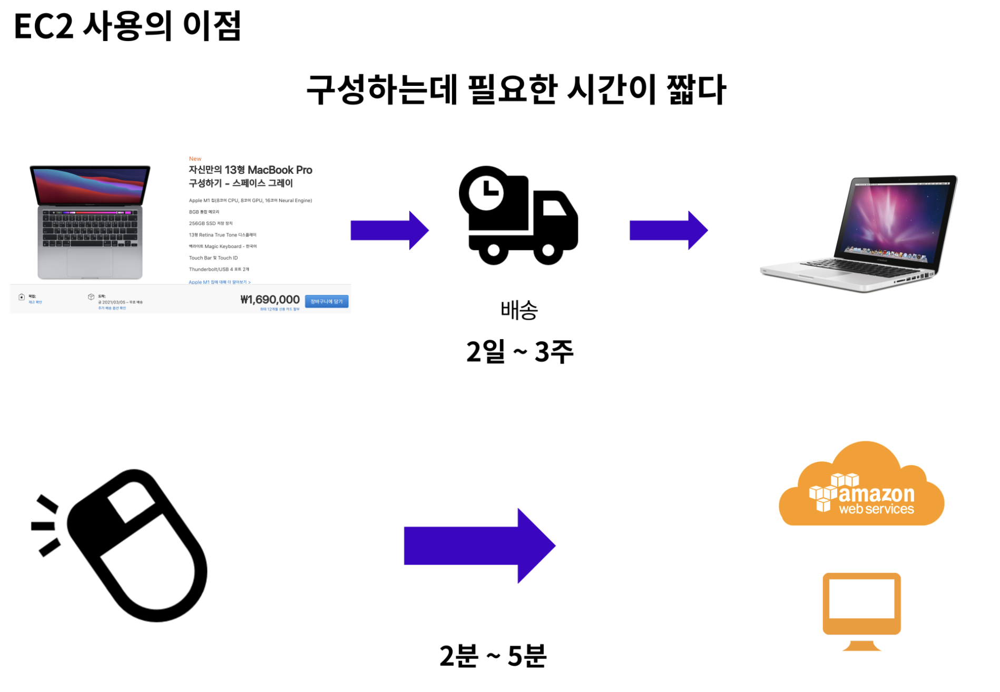
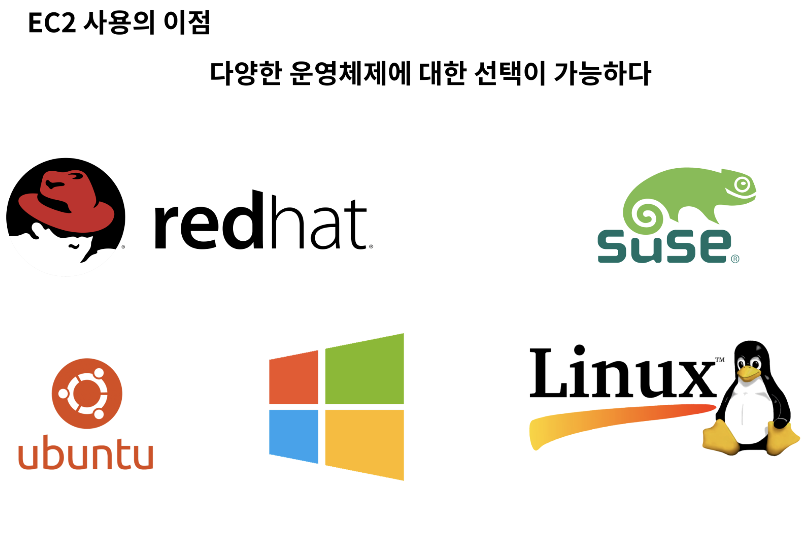
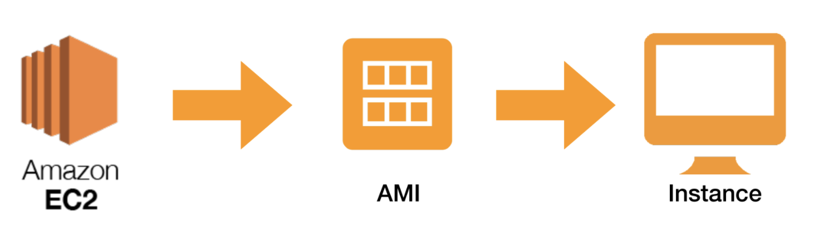
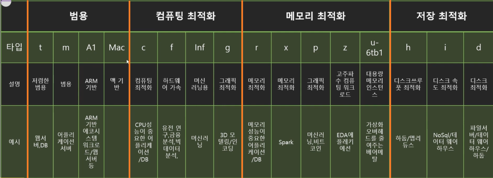
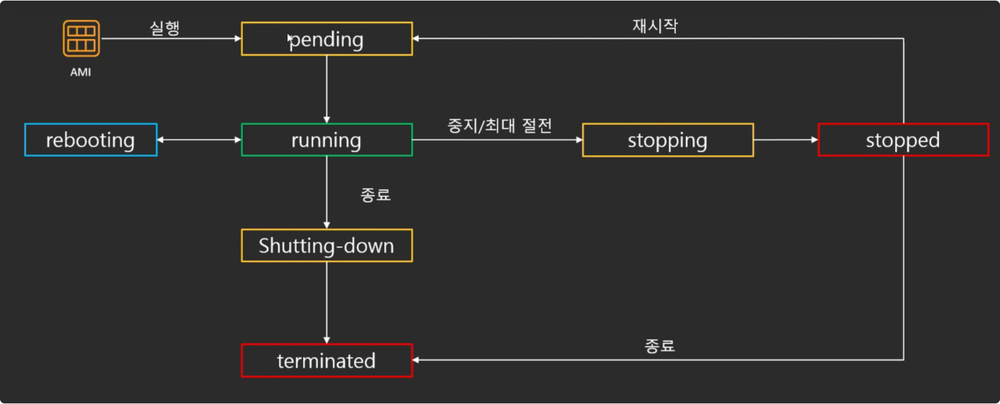
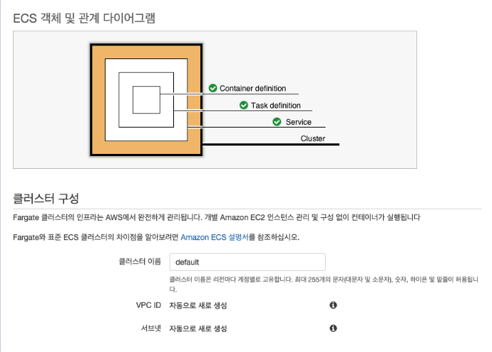
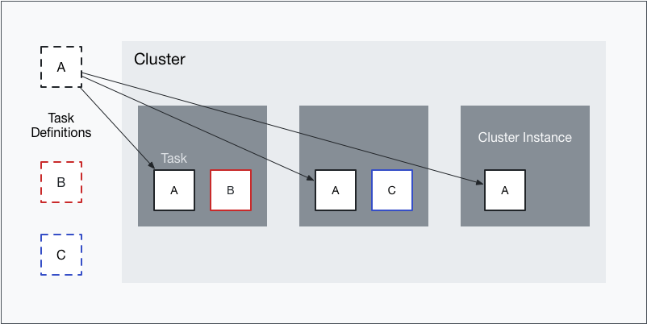
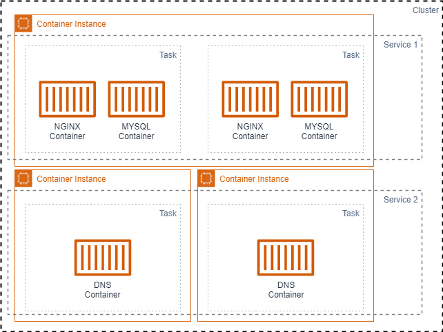
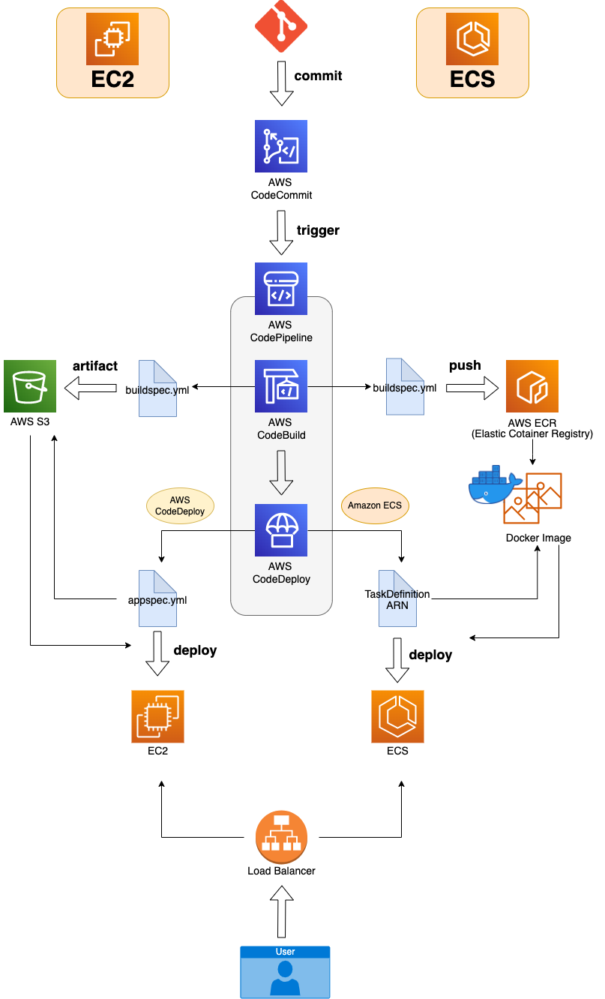

# EC2(Elastic Compute Cloud)

아마존 웹 서비스(AWS)에서 제공하는 클라우드 컴퓨팅 서비스입니다.
클라우드 컴퓨팅은 인터넷(클라우드)을 통해 스토리지, 데이터베이스 등의 컴퓨팅 서비스를 제공하고 AWS에서 원격으로 제어 할 수 있는 가상의 컴퓨터를 한대 빌리는 것이라고 생각하시면 됩니다.
필요에 따라 성능, 용량을 자유롭게 조절하고 비용을 조절할 수 있습니다.(Elastic)

### 장점

### 인스턴스 생성의 의미

AWS EC2 인스턴스를 생성한다는 것은 AMI를 토대로 운영체제, CPU, RAM 혹은 런타임 등이 구성된 컴퓨터를 빌리는 것입니다.

### EC2 인스턴스 유형

- 범용 : vCPU, 메모리, 네트워크, 저장 공간 등이 평균적인 사양으로 제공
- 컴퓨팅 최적화: 다른 인스턴스 패밀리에 비해 메모리 대비 vCPU 비율이 높음
- 메모리 최적화 : 다른 인스턴스 패밀리에 비해 메모리 용량이 큼
- 스토리지 최적화 : 다른 인스턴스 패밀리보다 스토리지 용량이 훨씬 크거나 초고속 I/O가 제공

### 인스턴스 수명주기

AMI로부터 실행이 되고나서 종료될 때까지 EC2가 거치는 과정

1. pending
   제일 처음 AMI가 실행이 되면 준비 상태를 말하며 EC2를 가동하기 위해서 가상머신, ENI, EBS 등이 준비되는 과정입니다.

2. running 상태 내부에서 변경 할 수 있는 행위
   실제로 EC2를 사용 할 수 있는 상태를 말합니다.
   3가지 상태가 존재합니다

- 중지
  - 인스턴스를 잠깐 멈춰두는 것
  - 중지 후 재 시작 할때 퍼블릭 IP가 변경됨 (프라이빗IP는 변경X, 해결하려면 탄력적 IP 사용)
- 재부팅
  - 인스턴스를 다시 시작 하는 것
  - 재부팅 시 퍼블릭IP 변동 X
- 최대 절전모드
  - 메모리 내용을 보존해서 재 시작시 중단지점에서 시작할 수 있는 정지모드

3. shutting-down
   설정에 따라 EBS도 같이 종료 시킬 수도 있고 EBS는 남기고 인스턴스만 종료 할 수 있습니다.

4. terminated
   완전히 종료, 인스턴스가 영구적으로 삭제 됩니다.

### AMI (Amazon Machine Images)

EC2 인스턴스를 시작하는 데 필요한 정보가 들어있는 이미지 즉, EC2의 복사본 이라고 볼 수 있고 인스턴스는 AMI의 사본으로 한 AMI로 여러 인스턴스 실행도 가능합니다.
AMI 선택이라는 것은 운영체제를 선택한다고 보면 됩니다.

### EBS (Elastic Block Store)

인스턴스가 연산에 관한 (CPU,메모리 등) 처리를 한다고 하면, 데이터를 저장하는 역할은 바로 EBS가 한다고 보면 됩니다.
EC2 인스턴스에 장착하여 사용할 수 있는 가상 저장 장치로 EBS는 EC2에 설치된 OS에서 그냥 일반적인 하드디스크나 SSD처럼 인식됩니다. 원하는 크기로 만들 수 있고, 성능 또한 원하는 수치로 설정할 수 있습니다. 또한 사용자가 삭제하기 전까지는 데이터가 안전하게 유지됩니다.

- 기본 개념
  - 볼륨 (volume) : EBS의 가장 기본적인 형태로 OS에서 바로 사용 가능한 형태
  - 이미지 (Image) : AMI, 즉OS가 설치된 형태이며 이 AMI로 EC2 인스턴스를 생성
  - 스냅샷(Snapshot) : EBS 볼륨의 전체 내용 중 특정 시점을 그대로 복사해 저장한 파일(EBS 볼륨의 백업 파일)
  - IOPS(Input/Output Operation Per Second) : 저장 장치의 성능 측정 단위. AWS에서는 추가 비용을 지불하고 높은 성능(IOPS)의 EBS 생성 가능

# ECS(Elastic Container Service)

AWS 에서 제공하는 Container 관리 서비스입니다. 좀 더 쉽게 container를 run, stop 하고 monitoring 할 수 있고 필요에 따라서 AWS 에서 제공하는 Loadbalacner, EC2 Autoscaler, ECR (Elastic Container Registry) 와 함께 사용되어 집니다.

\*비슷한 서비스로 Docker의 Docker Swarm, 구글의 Kubernetes, 하시코프의 Nomad등이 있습니다.

## 요소

### Cluster

서비스가 실행 되는 전체 네트워크라고 할 수 있습니다. 즉 ECS의 클러스터는 Task를 배포하기 위한 인스턴스의 집합 입니다. 스크린샷에서는 하나의 컨테이너와 하나의 태스크가 있는 서비스지만, 다중 컨테이너 앱인 경우에는 하나의 클러스터에 여러 컨테이너를 그룹화 할 수 있습니다.

### Container instance

ECS를 통해서 Task가 배포되는 EC2 인스턴스를 Container Instance라고 합니다. 쿠버네티스의 Worker Node와 비슷한 듯합니다. Container Instance에는 ecs-agent가 설치되고 ecs-agent는 Instance를 Cluster에 묶고, 관리합니다.

### Task

Task는 Task definition과 Task 두 가지가 있습니다.
Task definition은 컨테이너를 실행하기 위해 설정한 내용이며 컨테이너 이미지, 리소스, 포트 설정들을 합니다. docker run 명령과 비슷한 역할을 합니다.
Task는 Task definition에서 정의된 내용을 기반으로 배포된 컨테이너들을 Task라고 하고 Task에는 컨테이너가 하나 있을 수도 있고, 여러 개가 있을 수도 있습니다.

### Service

Task의 상위의 있는 부분입니다. Task를 Cluster에 몇 개나 배포할 것인지 결정하고 외부의 서비스 하기 위해 로드밸런서를 연동합니다. Task가 문제가 생기면 자동으로 새로운 Task를 생성합니다.

# 배포

#### ECR (Elastic Container Registry)

도커 이미지를 저장 및 관리하는 서비스. 도커 허브와 비슷하며 EC2와 비교해서 생각해보면 CodeBuild후 산출물이 S3에 들어간다면 ECS는 ECR에 생성된다고 볼 수 있습니다.

 
 
 
> 출처   https://velog.io/@numberbeen/Amazon-EC2-Elastic-Compute-Cloud-%EA%B0%9C%EB%85%90 https://blogshine.tistory.com/575 > https://velog.io/@wjd489898/AWS-EC2%EC%99%80-ECS%EB%B0%B0%ED%8F%AC-%EB%B9%84%EA%B5%90%ED%95%98%EA%B8%B0
