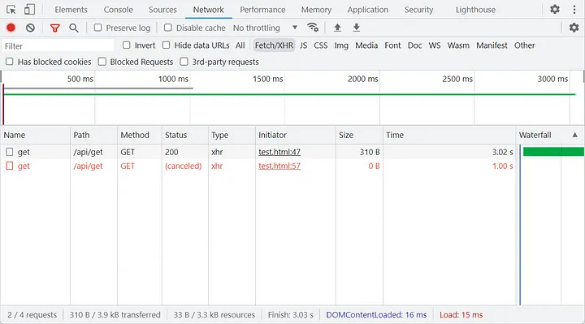
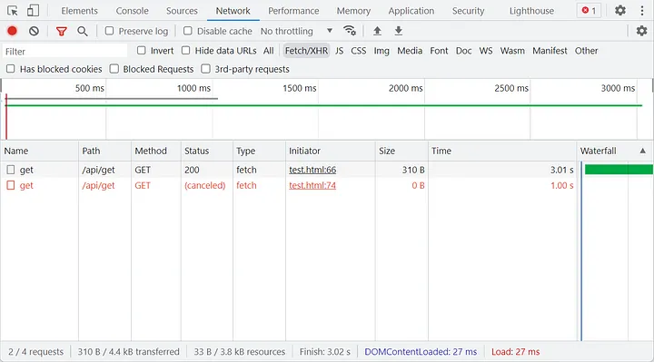
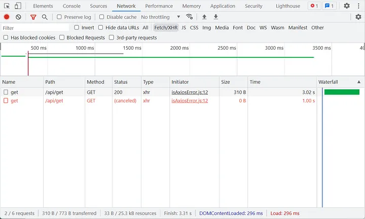

# 자바스크립트 요청 취소

## 자바스크립트 요청 종류

**XMLHttpRequest, Fetch**
<br/>
현재 브라우저에서 리소스를 얻기 위해 제공하는 두 가지 API입니다.

**axios**
<br/>
내부적으로 XMLHttpRequest를 사용하는 인기 있는 3자 Promise 요청 라이브러리입니다.

## XMLHttpRequest 요청 취소

```
const xhr = new XMLHttpRequest();
xhr.open('GET' , 'http://127.0.0.1:3000/api/get', true);
xhr.send();
setTimeout (() => { xhr.abort ( ); }, 1000);
```

XMLHttpRequest.abort()방법은 이미 전송된 경우 요청을 중단합니다. 요청이 중단되면 readyState은 XMLHttpRequest.UNSENT(0) 으로 변경 되고 요청 status코드가 0으로 설정됩니다.



## Fetch 요청 취소

Fetch 요청을 취소하려면 AbortController API를 사용해야 합니다. 생성자를 사용하여 새 AbortController 객체를 만들 수 있습니다. 읽기 전용 속성 AbortController.signal인 AbortSignal 객체 인스턴스가 있는데, 이를 사용하여 DOM 요청(예: fetch 요청)을 취소할 수 있는 상태가 됩니다.
<br/>
<br/>
abort() 를 사용하면, signal가 할당된 웹 요청을 취소할 수 있습니다.

```
const controller = new AbortController();

void (async function () {
    const response = await fetch('http://127.0.0.1:3000/api/get', {
        signal: controller.signal,
    });
    const data = await response.json();
})();

setTimeout(() => {
    controller.abort();
}, 1000);
```



## Axios 요청 취소

Axios에서는 fetch API 방식으로 요청을 취소하는 기능을 v0.22.0지원합니다.

```
const controller = new AbortController();
const API_URL = 'http://127.0.0.1:3000/api/get';

void (async function () {
    const response = await axios.get(API_URL, {
        signal: controller.signal,
    });
    const { data } = response;
})();

setTimeout(() => {
    controller.abort();
}, 1000);
```



# 프로미스의 결과를 폐기 또는 무시하는 방법

현재 자바스크립트의 프로미스는 일반적인 프로미스를 취소하는 API를 제공하지 않습니다.

### 1. Promise.withResolvers() 사용하기

이제 Promise.withResolvers()라는 새로운 API를 사용할 수 있습니다. 이 함수는 새 Promise 객체와 이를 이행(resolve)하거나 거부(reject)할 수 있는 두 개의 함수가 포함된 객체를 반환하고 주로 Promise 를 resolve 시키거나 reject 하는 로직을 Promise 내부가 아닌 외부에서 결정할 수 있도록 해줍니다.
즉, Promise 의 이행 여부를 생성자 내부의 Callback 에서 결정짓지 않고 외부의 컨텍스트에서 결정지을 수 있도록 하는 메서드입니다.

```
// AS-IS
let resolve, reject;
const promise = new Promise((res, rej) => {
  resolve = res;
  reject = rej;
});

// TO-BE
const { promise, resolve, reject } = Promise.withResolvers();
```

```
// AS - IS : Promise 생성자 내부에서 처리
const promise = new Promise((resolve, reject) => {
  fs.unlink(`${imageFile.path}`, (error) => {
    return error ? reject(error) : resolve();
  });
});

// TO - BE : Promise 생성자 외부에서 이행 여부를 결정
const { promise, resolve, reject } = Promise.withResolver();
fs.unlink(`${imageFile.path}`, (error) => {
  return error ? reject(error) : resolve();
})
```

### 2. AbortController 사용하기

```
const buildCancelableTask = <T>(asyncFn: () => Promise<T>) => {
  const abortController = new AbortController();

  return {
    run: () =>
      new Promise()<T>((resolve, reject) => {
        const cancelTask = () => reject(new Error("CanceledError"));

        if (abortController.signal.aborted) {
          cancelTask();
          return;
        }

        asyncFn().then(resolve, reject);

        abortController.signal.addEventListener("abort", cancelTask);
      }),

    cancel: () => {
      abortController.abort();
    },
  };
};
```

첫번째 방법과 유사하지만 AbortController를 사용했다는 점이 다릅니다. 여기서 다른 리스너를 사용할 수도 있지만, AbortController는 cancel을 여러 번 호출해도 'abort' 이벤트가 한 번만 트리거된다는 장점이 있습니다.

<br/>
<br/>
<br/>

> [출처](https://levelup.gitconnected.com/how-to-cancel-a-request-in-javascript-67f98bd1f0f5)

> [출처](https://velog.io/@eunbinn/cancel-promises-javascript)
