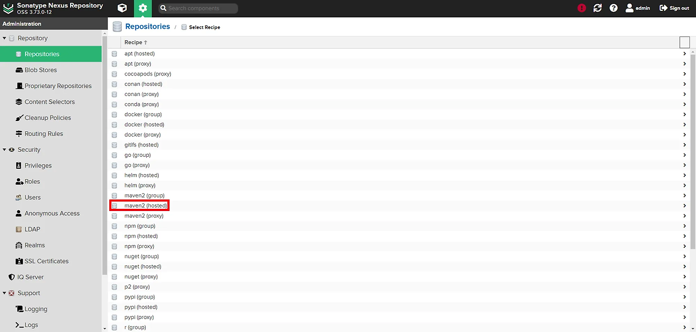

# 개념


- sonatype에서 만든 저장소 ⇒ Sonatype Nexus Repository
- 소프트웨어 아티팩트 저장소 관리 도구
  - Maven, npm, Docker, Yum 등 다양한 포맷 지원
- 다양한 형식을 지원하는 사설 저장소를 만들수 있고 대표적으로 docker image repository, maven repository등이 있다.
- 소프트웨어 저장소 관리 시스템으로, 소프트웨어 개발에서 사용되는 다양한 라이브러리, 의존성 및 아티팩트를 효율적으로 관리하고 저장하는 데 사용

# 필요성

- 회사/단체의 화이트 리스트로 인해 외부 리포지토리에 접속하기 어려운 경우 Proxy 역할
- 특히 비상시 외부 인터넷이 느리거나 리포지토리가 다운되는 등 여러 상황에서도 빠르게 받을 수 있음
- 팀에서 사용하는 공통 라이브러리들을 공유
- 내부적으로 폐쇄망과 같은 환경에서 개발하여 보안상의 이유로 외부망에 있는 저장소에 접근하지 못하는 경우
- 네트워크상의 문제로 외부 네트워크가 느린경우에도 빠르게 사용 가능
- 개발팀에서 공통적으로 사용하는 각종 라이브러리 등을 내부적으로 공유하기 위하여
- 라이브러리들에 대한 효율적인 내부 관리

# 구성



레포지토리를 생성할때 proxy, hosted, group이 있습니다.

## Hosted (사내/자체 산출물 저장소)

- 조직 내부에서 생성한 아티팩트(라이브러리, 모듈)를 저장하고 관리하는 데 사용
- 팀이 빌드해서 배포하는 패키지·이미지·라이브러리를 직접 올려두는 곳
- 중앙 집중화된 저장소로, 조직 내에서 생성된 모든 아티팩트 관리

## proxy (원격 미러/캐시)

- 프록시(Proxy) 리포지토리는 외부의 원격 리포지토리를 캐싱하여, 자주 사용하는 아티팩트를 로컬에 저장하고 관리하는 데 사용
- npm, Maven Central, Docker Hub 같은 원격 저장소를 프록시 해서, 요청이 들어올 때만 원격에서 받아와 캐시하고 이후에는 Nexus 캐시에서 응답 (프리페치로 전부 당겨오진 않음)
- 자주 사용되는 외부 아티팩트를 로컬에 캐싱하여, 네트워크 트래픽을 줄이고 다운로드 속도를 향상
- 외부 리포지토리가 다운되거나 접근 불가능할 때도 로컬 캐시를 통해 아티팩트를 사용 할 수 있음
- 로컬 캐싱을 통해 네트워크 부하를 줄이고, 빌드 시간을 단축
- 자주 사용하는 외부 아티팩트를 로컬에서 제공하여 안정성을 높임

## Group

- 여러 hosted + proxy 저장소를 하나의 URL로 묶어 클라이언트는 한 주소만 바라보게 해주는 가상 저장소운영·보안·설정이 단순
- 여러 리포지토리를 하나로 묶어 접근 통합

# 흐름

```csharp
프로젝트 (Yarn 클라이언트)
        │  .yarnrc.yml의 npmRegistryServer로 HTTP 요청
        ▼
   Nexus (보통 group URL)
        ├─ hosted에서 찾기고 있으면 그걸 반환
        └─ 없으면 proxy 통해 원격(npmjs 등) 조회·캐시 후 반환
```

# 프로젝트 적용

1. 프로젝트에 특정 저장소를 바라보도록 설정

프로젝트 하위에 파일을 생성한뒤 저장소 url 지정

```markdown
//.npmrc 혹은 .yarnrc 이름으로 파일 생성

registry=http://nexusUrl.com/repository/npm-public
\_auth=id:password
```

1. 전역으로 특정 패키지 저장소를 바라보도록 설정

```markdown
//npm
npm config set \_auth id:password
npm config set registry http://nexusUrl.com/repository/npm-public

//yarn
yarn config set \_auth id:password
yarn config set registry http://nexusUrl.com/repository/npm-public
```

```bash
// 설치/조회 레지스트리

// case1. yarn1
yarn config get registry

// case2. yarn berry
yarn config get npmRegistryServer

// 결과
https://registry.yarnpkg.com
```

> 출처 https://dev-youngjun.tistory.com/105
> https://velog.io/@yange/Nexus
> https://im-h-t-e-l.tistory.com/91
> https://ssonzm.tistory.com/130
> [https://velog.io/@hrlrh/Nexus-소개](https://velog.io/@hrlrh/Nexus-%EC%86%8C%EA%B0%9C)
