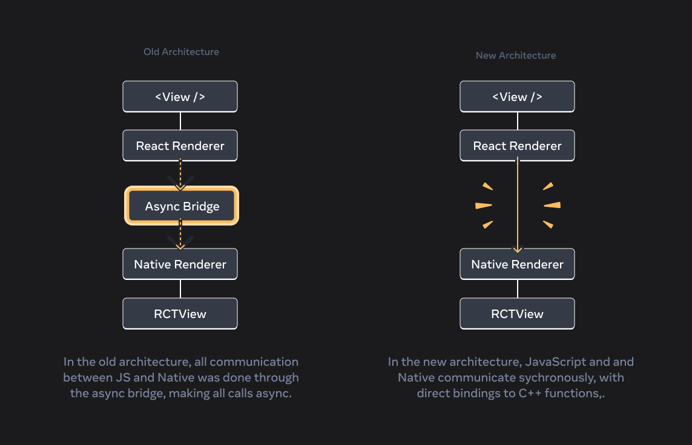

# React Native New Architecture (v0.76)

- [새로운 아키텍처란?](#새로운-아키텍처란)
- [새로운 네이티브 모듈 시스템](#새로운-네이티브-모듈-시스템)
- [새로운 렌더러](#새로운-렌더러)
- [이벤트 루프](#이벤트-루프)
- [브릿지 제거](#브릿지-제거)
- [새로운 기능](#새로운-기능)

## 새로운 아키텍처란?

- 새로운 아키텍처는 React Native의 주요 시스템을 완전히 재작성한 것으로, 컴포넌트 렌더링, JavaScript와 네이티브 추상화 간의 통신, 스레드 간 작업 스케줄링 방식을 포함합니다.
- 이전 아키텍처는 비동기 브릿지를 통해 네이티브 플랫폼과 통신했으나, 새로운 아키텍처는 동기 및 비동기 업데이트를 모두 지원하도록 설계되었습니다.
- 새로운 아키텍처는 네이티브 모듈 시스템, 새로운 렌더러, 이벤트 루프, 브리지 제거의 네 가지 주요 부분으로 구성되었습니다.

## 새로운 네이티브 모듈 시스템

새로운 네이티브 모듈 시스템은 자바스크립트와 네이티브 플랫폼 간 통신 방식을 재설계 했습니다.

- C++로 작성되어 다음과 같은 새로운 기능을 제공합니다.
  - 동기적 네이티브 런타임 액세스
  - 자바스크립트와 네이티브 코드 간 타입 안전성
  - 플랫폼 간 코드 공유
  - 기본적으로 지연 로딩 지원
- 자바스크립트/타입스크립트 API에서 C++ 네이티브 구현의 모든 기능 활용 가능
- Codegen으로 강력한 타입 계약 정의 가능
- 모듈이 필요할 때만 메모리에 로드되어 앱 시작 시간 단축

## 새로운 렌더러

- C++로 재작성되어 다음 이점 제공
  - 업데이트는 다른 우선순위로 다른 스레드에서 렌더링 될 수 있습니다.
  - 레이아웃을 동기적으로 읽을 수 있으며 여러 스레드에서 액세스 할 수 있습니다.
  - 렌더러는 C++로 작성되어 모든 플랫폼에서 공유됩니다.
- 이제 뷰 계층이 변경 불가능한 트리 구조로 저장됨
  - 스레드 안전한 업데이트 처리 가능
  - 사용자 인터페이스의 서로 다른 버전을 나타내는 여러 진행 중 트리 처리 가능
- 낮은 우선순위 업데이트 중단하고 사용자 입력 등 긴급한 것 렌더링한 후 낮은 우선순위 업데이트 재개 가능

## 이벤트 루프

- 새로운 아키텍처는 명확한 이벤트 루프 처리 모델을 구현하여 React DOM과 React Native 간의 차이를 줄였습니다.
- 자바스크립트 스레드에서 작업을 처리하는 잘 정의된 이벤트 루프 프로세싱 모델 구현
  - 이벤트 루프는 업데이트와 이벤트를 예측 가능하게 정렬하여, 낮은 우선순위 업데이트를 긴급 사용자 이벤트로 중단할 수 있음.
- 웹 사양과의 더 긴밀한 연계
- 더 많은 브라우저 기능 지원을 위한 기반 마련

## 브릿지 제거

- 새로운 아키텍처에서는 리액트 네이티브의 브릿지 종속성을 완전히 제거하고 JSI(JavaScript Interface)를 사용하여 자바스크립트와 네이티브 코드 간 직접적이고 효율적인 통신을 구현했습니다.
- 브리지 제거로 인해 시작 시간이 개선되고, 정의되지 않은 동작으로 인한 크래시 감소, 오류 보고 및 디버깅이 용이해짐.

 

 

## 새로운 기능

- Transitions
  - React 18의 새로운 개념인 Transitions는 긴급 업데이트와 비긴급 업데이트를 구분함.
  - 긴급 업데이트는 즉각적인 반응이 필요하며, Transitions 업데이트는 UI를 한 뷰에서 다른 뷰로 전환함.
- Automatic batching 은 더 많은 상태 업데이트를 함께 배치하여 중간 상태 렌더링을 피하고, React Native를 더 빠르고 지연 없이 작동하게 함.
- 새로운 아키텍처는 useLayoutEffect를 통해 레이아웃 정보를 동기적으로 읽고 UI를 같은 프레임에서 업데이트할 수 있도록 지원함.
- 새로운 아키텍처는 React 18에서 도입된 Suspense를 완전히 지원하여, 로딩 상태를 처리하고 사용자 입력에 높은 우선순위를 부여함.

> ref.
>   https://reactnative.dev/docs/getting-started   https://ykss.netlify.app/translation/new_architecture_is_here/   https://news.hada.io/topic?id=17425
