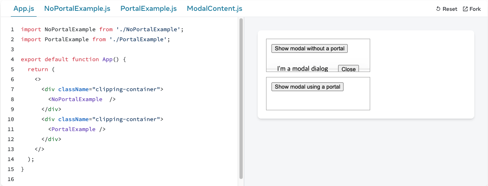
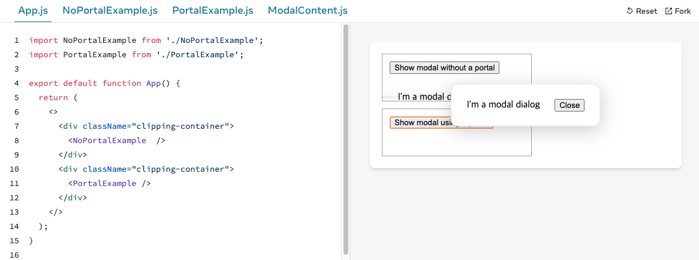

# [React] createPortal

## 개념

Portal은 React 렌더링을 DOM 트리의 다른 부분으로 이동시켜 주는 API 입니다.
이를 통해, 자식 컴포넌트가 부모 컴포넌트의 스타일이나 위치에 영향을 받지 않고 독립적으로 렌더링 됩니다.

포털은 DOM 노드의 물리적 배치만 변경합니다. 다른 모든 면에서 포털에 렌더링하는 JSX는 이를 렌더링하는 React 컴포넌트의 자식 노드 역할을 합니다. 예를 들어, 자식은 부모 트리가 제공하는 컨텍스트에 접근할 수 있으며, 이벤트는 React 트리에 따라 자식에서 부모로 버블링 됩니다.

## 주의 사항

포털의 이벤트는 DOM 트리가 아닌 React 트리에 따라 전파됩니다. 예를 들어, 포털 내부를 클릭했을 때 포털이 `<div onClick>`으로 감싸져 있으면 해당 onClick 핸들러 이벤트가 실행됩니다. 이로 인해 문제가 발생한다면, 포털 내부에서 이벤트 전파를 중지하거나 포털 자체를 React 트리에서 위로 옮기세요.

## 사용법

### createPortal(children, domNode, key?)

createPortal 함수는 다음과 같은 인자를 받습니다.
<br/>

- <b>children:</b>
  JSX 조각 (예: `<div />` 나 `<Component />`), Fragment (`<>...</>`), 문자열이나 숫자, 또는 이들의 배열과 같이 React로 렌더링할 수 있는 모든 것.
- <b>domNode:</b>
  document.getElementById()가 반환하는 것과 같은 일부 DOM 노드. 노드는 이미 존재하고 있어야 합니다. 업데이트 중에 다른 DOM 노드를 전달하면 포털 콘텐츠가 다시 생성됩니다.
- <b>(optional) key:</b>
  포털의 키로 사용할 고유 문자열 또는 숫자

```
import React from 'react';
import ReactDOM from 'react-dom';
import './Modal.css'; // 스타일 파일 예시

const Modal = ({ isOpen, onClose }) => {
  if (!isOpen) return null;

  return ReactDOM.createPortal(
    <div className="modal-overlay">
      <div className="modal-content">
        <h2>모달 제목</h2>
        <p>모달 내용</p>
        <button onClick={onClose}>닫기</button>
      </div>
    </div>,
    document.getElementById('modal-root') // 모달을 렌더링할 DOM 노드
  );
};

const App = () => {
  const [isOpen, setIsOpen] = React.useState(false);

  return (
    <div>
      <h1>메인 페이지</h1>
      <button onClick={() => setIsOpen(true)}>모달 열기</button>
      <Modal isOpen={isOpen} onClose={() => setIsOpen(false)} />
    </div>
  );
};

export default App;
```

createPortal 사용: ReactDOM.createPortal을 사용하여 모달의 내용을 modal-root라는 ID를 가진 DOM 노드에 렌더링합니다. 이 노드는 일반적으로 최상위 요소에 추가해야 합니다.

```
<div id="modal-root"></div>
```

---

<br/>

```
import { useState } from 'react';
import ModalContent from './ModalContent.js';

export default function NoPortalExample() {
  const [showModal, setShowModal] = useState(false);
  return (
    <>
      <button onClick={() => setShowModal(true)}>
        Show modal without a portal
      </button>
      {showModal && (
        <ModalContent onClose={() => setShowModal(false)} />
      )}
    </>
  );
}
```



```
import { useState } from 'react';
import { createPortal } from 'react-dom';
import ModalContent from './ModalContent.js';

export default function PortalExample() {
  const [showModal, setShowModal] = useState(false);
  return (
    <>
      <button onClick={() => setShowModal(true)}>
        Show modal using a portal
      </button>
      {showModal && createPortal(
        <ModalContent onClose={() => setShowModal(false)} />,
        document.body
      )}
    </>
  );
}

```


