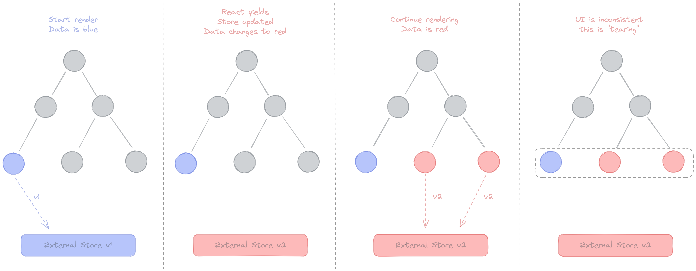
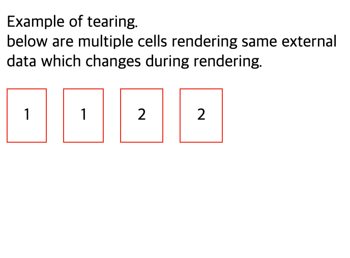

# useSyncExternalStore

## 알아야할 개념

### 외부 저장소(External store)

외부 저장소는 우리가 구독할 수 있는 것입니다.
외부 저장소의 예로는 Redux, Zustand, 전역 변수, 모듈 범위 변수, DOM 상태 등이 있습니다.

### 내부 저장소(Internal store)

내부 저장소에는 props, context, useState, useReducer가 포함됩니다.

### Tearing

Tearing은 시각적(UI) 불일치를 나타냅니다. UI가 동일한 상태에 대해 여러 형태를 나타냄을 의미합니다.

react 18버전부터 UI의 동시적 업데이트를 지원하게 됐는데, 이 과정에서 동일한 데이터 소스에 따라 렌더링이 이뤄지는 두 가지 UI가 있을 때, 기존의 동기적인 업데이트일 경우 순서대로 업데이트가 보장되기 때문에 문제가 없었습니다. 하지만 동시(concurrent)모드가 적용됨에 따라 각 스레드에서 각자가 두개의 UI를 업데이트하다가 하나가 실패할 경우가 발생하거나, 중간에 사용자 입력등으로 인해 업데이트가 중단되는 동작이 생기게 되고, 그런 케이스에 대해 같은 데이터 소스의 UI의 상태가 서로 다른 것을 티어링이 나뉜다고 표현합니다.

<br/>
UI가 동일한 데이터에 대해 두 개의 다른 값을 표시하도록 합니다.


동기 렌더링을 사용하면 UI에서 렌더링되는 색상이 일관됩니다.


concurrent(동시) 렌더링에서 스토어의 데이터 blue를 이용해 처음에 렌더링한 색상은 파란색입니다. 렌더링 도중 React가 스토어를 업데이트하면 데이터는 red으로 업데이트됩니다. React는 업데이트된 값 red를 활용하여 렌더링을 계속합니다.이는 UI의 불일치 즉 티어링을 유발합니다.

## useSyncExternalStore 개념

직관적으로 단어들을 분해해서 살펴보면 use + sync external store, 외부 스토어(external store)와 싱크(sync)를 맞추는 훅 입니다. React 18에서 등장한 신규 훅으로, 리액트가 외부 저장소의 변경사항을 구독할 수 있도록 도와주는 훅입니다.
<br/>
또한 18버전에 들어오면서 리액트는 useTransition, useDeferredValue와 같이 렌더링을 일시중지하거나 뒤로 미루는 등의 동시성 최적화를 도와줄 수 있는 훅들이 사용가능해지면서 외부 저장소의 데이터를 참조하는 컴포넌트를 렌더링할때 같은 시기에 렌더링을 했지만 서로 다른 시점의 데이터를 참조할 수도 있는 Data Tearing 문제가 발생할 수 있게 됐습니다. 동시성 기능과 외부 상태 라이브러리 간의 호환성 문제를 해결하기 위해 useSyncExternalStore가 등장했습니다.

```JavaScript
const snapshot = useSyncExternalStore(
  subscribe: (callback) => Unsubscribe,
  getSnapshot: () => State,
  getServerSnapshot?: () => State
)
```

컴포넌트의 최상위 레벨에서 useSyncExternalStore를 호출하여 외부 데이터 저장소에서 값을 읽습니다.

- `subscribe`

  콜백함수를 받아 스토어에 구독하는 함수입니다. 스토어에 있는 값이 변경되면 콜백함수가 호출되어야 하며, 콜백이 호출되면useSyncExternalStore가 이 훅을 사용하는 컴포넌트를 리렌더링합니다.

- `getSnapshot`

  컴포넌트에 필요한 현재 스토어의 데이터를 반환하는 함수로, 스토어가 변경되지 않았다면 매번 함수를 호출할 때마다 동일한 값을 반환해야합니다. 스토어에서 값이 변경됐다면, 이 값을 이전 값과 Object.is로 비교해 정말로 값이 변경됐다면 컴포넌트를 리렌더링합니다.

- `getServerSnapshot` (optional)

  서버 사이드 렌더링 하이드레이션하는 도중에만 사용됩니다. 서버사이드에서도 사용되는 훅이라면 반드시 이 값을 넘겨줘야하며, 클라이언트의 값과 불일치가 발생할 경우 오류가 발생합니다.

## 예시

### 1. 외부저장소에서 Tearing 방지

```JavaScript

// 전역 상태관리 코드 예시

type Fn = () => void;
type UpdateFn<T> = (state: T) => T;

export type State<T> = {
  getState: () => T;
  setState: (update: UpdateFn<T> | T) => void;
  subscribe: (callback: Fn) => Fn;
};

function isUpdateFn<T>(value: UpdateFn<T> | T): value is UpdateFn<T> {
  return typeof value === 'function';
}

export function externalStore<T>(initialState: T): State<T> {
  let state = initialState;
  const callbacks = new Set<Fn>();

  function subscribe(callback: Fn): Fn {
    callbacks.add(callback);
    return () => callbacks.delete(callback);
  }

  function getState() {
    return state;
  }

  function setState(update: UpdateFn<T> | T) {
    state = isUpdateFn<T>(update) ? update(state) : update;
    callbacks.forEach((cb) => cb());
  }

  return {
    getState,
    setState,
    subscribe,
  };
}
```

```JavaScript
export function useStore<T>(state: State<T>) {
    const store = useSyncExternalStore(
        state.subscribe,
        state.getState,
        state.getState
    )

    return [store, state.setState] as const
}
```

```JavaScript
interface Todo {
  id: number
  title: string
}

const todoStore = externalStore<Todo[]>([])

export const useTodos = () => {
    const [todos, setTodos] = useStore(todoStore)

    const addTodo = (todo: Todo) => {
        setTodos((prev) => [...prev, todo])
    }

    const deleteTodo = (todoId: number) => {
        setTodos((prev) => prev.filter((todo) => todo.id !== todoId))
    }

    return {
      todos,
      addTodo,
      deleteTodo
    }
}
```

```JavaScript
import { useState } from "react";
import { useTodos } from "./useTodoStore";

export const Todos = () => {
  const { todos } = useTodos();

  return (
    <div>
      {todos.map((todo) => (
        <div key={todo.id}>{todo.title}</div>
      ))}
      <AddTodo />
    </div>
  );
};

export const AddTodo = () => {
  const { addTodo } = useTodos();
  const [value, setValue] = useState("");

  const onChange = (e: React.ChangeEvent<HTMLInputElement>) => {
    setValue(e.target.value);
  };

  const onAddTodo = () => {
    addTodo({
      id: Math.random(),
      title: value,
    });
  };

  return (
    <div>
      <input value={value} onChange={onChange} />
      <button onClick={onAddTodo}>추가</button>
    </div>
  );
};
```

### 2.동시성 모드에서 Tearing 방지

```JSX
import { useEffect, startTransition, useCallback, useState } from 'react';

let data = 1
function getData() {
  return data
}

setTimeout(() => data = 2, 100)

function Cell() {
  let start = Date.now()
  // Blocking loop: 메인스레드에서 CPU를 점유하여 다른 작업을 못하도록 막는방식
  while (Date.now() - start < 50) {
  }
  const data = getData()
  return <div style={{padding: '1rem', border: '1px solid red'}}>{data}</div>
}

export default function App() {
  const [showCells, setShowCells] = useState(false)

  useEffect(() => {
    startTransition(() => setShowCells(true))
  }, [])
  return (
    <>
      <p>동시성 모드</p>
      {showCells ? <div style={{display: 'flex', gap: '1rem'}}>
        <Cell/>
        <Cell/>
        <Cell/>
        <Cell/>
      </div> : <p>preparing..</p>}
    </>
  );
}

```



UI의 여러 부분에서 최종적으로 서로 다른 데이터가 커밋되는 티어링 현상이 발생합니다.

```JSX
import { useEffect, useSyncExternalStore, startTransition, useCallback, useState } from 'react';

let data = 1
function getData() {
  return data
}

setTimeout(() => data = 2, 100)

function Cell() {
  let start = Date.now()
  while (Date.now() - start < 50) {
  }
  const data = useSyncExternalStore(() => {return () => {}},getData);
  return <div style={{padding: '1rem', border: '1px solid red'}}>{data}</div>
}

export default function App() {
  const [showCells, setShowCells] = useState(false)

  useEffect(() => {
    startTransition(() => setShowCells(true))
  }, [])
  return (
    <>
      <p>동시성 모드</p>
      {showCells ? <div style={{display: 'flex', gap: '1rem'}}>
        <Cell/>
        <Cell/>
        <Cell/>
        <Cell/>
      </div> : <p>preparing..</p>}
    </>
  );
}
```


렌더링 도중 외부 스토어의 갑싱 변경되더라도 컴포넌트가 항상 동일한 데이터를 사용하도록 보장합니다. 즉 동시모드에서 UI에서 동일한 데이터가 렌더링 되는지 확인하는 역할을 합니다.

> ref.
> <br/> https://github.com/reactwg/react-18/discussions/69 <br/>https://itchallenger.tistory.com/650 <br/> https://doiler.tistory.com/85 <br/> https://velog.io/@woogur29/useSyncExternalStore%EC%9D%98-%EB%82%B4%EB%B6%80-%EB%8F%99%EC%9E%91-%EC%9B%90%EB%A6%AC#%EC%B0%A2%EC%96%B4%EC%A7%90tearing-%EC%98%88%EC%8B%9C-%EC%BD%94%EB%93%9C <br/> https://jser.dev/2023-08-02-usesyncexternalstore/
