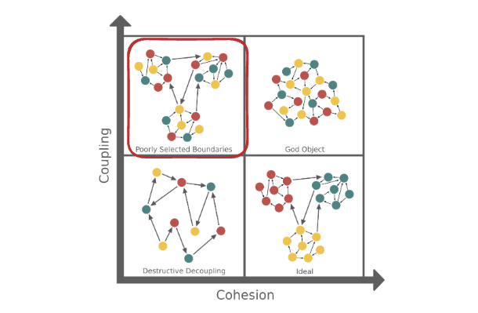
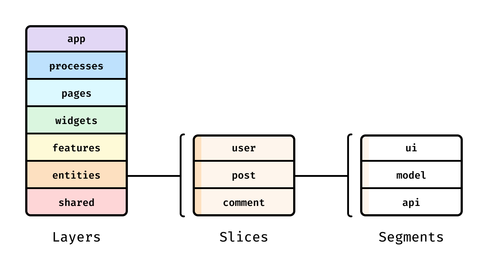
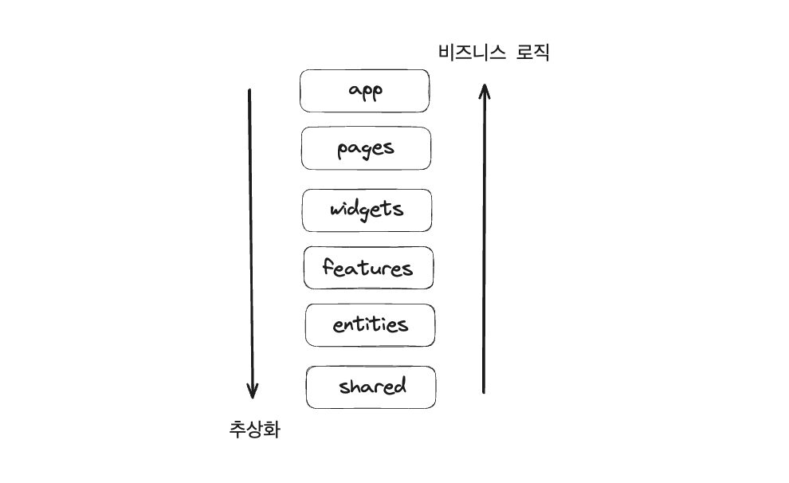

# 기능 주도 아키텍처(Feature Driven Architecture, FDA)

FSD의 모체이며 당시 webflow 회사에 재직중이었던 Oleg Isonen (올레그 이소넨)에 의해 2018 React Day Berlin 컨퍼런스에서 소개되었습니다.

## 좋은 코드의 조건

**Discoverability(검색 용이성)**

**Work parallelisation(작업 병렬화)**

**Controlling shared absractions(공통 개념 컨트롤)** 공통적으로 사용해야만 하는 코드들도 있는데 이런 코드들은 찾기 쉬운 위치에 직관적인 이름으로 작성되어 있어 접근성이 높습니다.

## **FDA에서 위의 목표를 달성하기 위해 주요하게 생각하는 개념**

### **1. Decentralization(분산)**

**모놀리스(Monolith)**

모놀리스의 프론트엔드 폴더 구조란 각 코드를 저장하는 폴더의 배치를 앱에서 맡은 의미적인 기능 즉, 도메인이 아닌 components, utils 이렇게 기술적인 기능으로만 일차원적으로 배치해놓는 걸 의미합니다.

각 코드가 하는 역할별로 폴더에 저장을 해놓았는데 문제는 한 폴더 내부에서 어떤 파일이 앱의 어떤 도메인과 연관이 있는지 파악하기가 매우 어렵습니다.

```tsx
├── components/
|    ├── DeliveryCard
|    ├── DeliveryChoice
|    ├── RegionSelect
|    ├── UserAvatar
├── actions/
|    ├── delivery.js
|    ├── region.js
|    ├── user.js
├── epics/
|    ├── delivery.js
|    ├── region.js
|    ├── user.js
├── constants/
|    ├── delivery.js
|    ├── region.js
|    ├── user.js
├── helpers/
|    ├── delivery.js
|    ├── region.js
|    ├── user.js
├── entities/
|    ├── delivery/
|    |      ├── getters.js
|    |      ├── selectors.js
|    ├── region/
|    ├── user/
```


좌측 상단 첫번째 그래프에서 모놀리틱 구조의 단점이 잘 드러납니다. 의존성 그래프가 복잡해서 추적하기가 어렵고 순환참조가 일어나기가 쉽습니다.

**피쳐 단위로 코드를 나누기**

이를 feature 단위로 잘게 나눕니다. 피쳐는 앱의 피쳐입니다. 사진첩 앱이면 업로드, 액자, 댓글등이 될 수 있습니다.

```tsx
├── features/
    ├── comments
    ├── share
    ├── upload
    ├── follow
```

그리고 피쳐외에도 다음과 같은 타입들이 있습니다. 각 폴더를 타입이라고 부릅니다.

```tsx
├── pages
├── features
├── components
├── utilities
```

### 2. 캡슐화

```tsx
├── features/
|   ├── comments
|   |   ├── privateCommentA.js
|   |   ├── privateCommentB.js
|   |   ├── privateCommentC.js
|   |   ├── index.js
|   ├── share
|   ├── upload
|   ├── follow
├── shared/
```

privateCommentA,B,C는 index.js를 통해서만 다른 모듈에서 참조될 수 있습니다. 여기서 모듈이란 privateCommentA, privateCommentB와 같이 동일한 comments 폴더 계층에 있는 다른 코드들이나 pages와 같은 다른 폴더를 의미합니다.

index.js에 필요한 모듈들만 외부로 노출하므로써 이 코드를 사용하는 다른 사람에게 private 모듈과 public 모듈을 분리하여 전달할 수 있습니다.

## **3. Explicit Sharing**

공통 코드가 변경될 때 버그가 발생하는 것은 테스트코드를 통해 100% 해결할 수 없습니다. 왜냐하면 공통모듈 작성자가 모든 유즈케이스를 100% 예측할 수 없기 때문입니다.

## 4. co-location

한 피쳐 내부에서 쓰이는 도메인 코드가 여러 곳으로 분류되어있으면 코드를 탐색하기가 어렵기 때문에 최대한 image, 상태관리, 테스트트 코드등을 한 폴더 내부에 위치시킵니다.

## **5. de-coupling isolation**

- 피쳐 코드 내부에서 사용하는 코드들은 다른 피쳐 모듈을 의존하면 안됩니다.
- page코드는 다른 page를 의존하면 안됩니다.
- shared 코드가 다른 타입을 의존하면 안됩니다.

# 기능 분할 설계(Feature-Sliced Design, FSD) 아키텍처

## 언제 적용해야 할까

FDA와 마찬가지로 운영기간이 짧거나 작은 규모의 프로젝트라면 적용할 필요 없이 모놀리스 형식으로 프로젝트를 구성해도 충분하며 만약 `점진적으로 소프트웨어 규모가 커질 예정이라면` FSD를 적용할 수 있습니다.

## 구성요소



### Layers



**계층적 구조** 상위 레벨에 있는 레이어는 하위 레벨을 의존성으로 가질 수 있지만 그 반대는 성립될 수 없습니다. 하위 레이어로 갈 수록 추상화과 심화되며 상위 레이어로 갈 수록 비즈니스 로직이 심화됩니다.

앱에서 각 레이어가 맡고 있는 역할을 분명하게 나눔으로 인해 의존성 그래프가 영향을 미치는 범위를 일부분으로 한정시킵니다.

- **app**
  <br/>
  app은 앱의 설정을 맡는 레이어로 여러 모듈에서 재사용하지 않으나 실행시 앱에 고루 영향을 미치는 모듈들을 저장하는 곳입니다. e.g) css-in-js의 theme provider, hoc (router, auth 등), 레이아웃

- **processes**
  <br/>
  deprecated되어 이제 사용하지 않습니다.

- **pages**
  <br/>
  하위 레이어들을 조합하여 완전한 기능을 제공하는 레이어로 앱에서 각 라우터에 해당하는 페이지들을 작성하는 곳입니다. 각 페이지에서 사용하는 스타일 파일도 동일한 폴더에 위치시킵니다.

- **widgets**
  <br/>
  위젯은 하위의 레이어들을 이용해 특정 피쳐에서 사용할 수 있는 UI 블록들을 만드는 곳입니다. widgets 레이어는 선택적 레이어로 불필요하다면 생략할 수 있습니다. <br/>
  이 컴포넌트들은 특정 의존성과 강결합되어있기 때문에 여러 페이지에서 재사용하지 못할 수 있으며 IssuesList, UserProfile등의 앱 내부에서 맡고있는 도메인이 정확하게 구분되어 있습니다.

- **features**
  <br/>버튼 클릭과 같은 유저의 인터렉션과 관련된 로직, 특정 비즈니스 로직이 담겨있는 레이어로 SendComment, AddToCart, UsersSearch등이 있습니다.

- **entities**
  <br/>
  entities 내부에서는 특정 도메인과 연관된 api의 호출 함수가 정의되어 있습니다. 특정 도메인의 모델을 정의하고 그와 연관된 api를 호출하는 api 어뎁터를 작성합니다.

### slices

슬라이스는 FSD의 두번째 계층으로 슬라이스의 이름이 가져야 할 특별 한 규칙은 없습니다. 비즈니스 도메인으로 슬라이스 이름이 정해집니다. (도메인 단위라고 생각하시면 될것 같습니다.)

사진 갤러리 앱을 만든다면 photo, create-album, gallery-page와 같은 슬라이스 이름을,

SNS앱을 만든다면 post, add-user-to-friends, news-feed와 같은 이름을 지을 수 있습니다.

슬라이스 내부에서는 비즈니스와 연관된 로직을 작성할 수 있으며 `app과 shared 레이어에서는` 각각 앱의 전체적인 부분과 연관된 코드를, shared 레이어에서는 깊은 추상화를 가지고 있고 비즈니스 로직을 작성하지 않기 때문에 `slice를 두지 않습니다.`

슬라이스 내부에서는 여러 그룹의 세그먼트를 가질 수 있으나 특정 코드를 세그먼트를 만들지 않고 배치하지 않습니다.

### **segments**

세그먼트는 FSD의 마지막 계층에 있는 요소로 한 도메인 안에서 기술적인 결과를 달성하기 위해 작성합니다.

세그먼트의 이름은 ui, model, lib, api등이 될 수 있으며 예시는 아래와 같습니다.

- **ui**
  <br/>
  UI 컴포넌트
- **model**
  <br/>
  비즈니스 로직, data aggregation 함수들
- **lib**
  <br/>
  infra structural code
- **api**
  <br/>
  backend api를 호출하기 위한 코드들

<br/>
<br/>
<br/>

> [출처](https://velog.io/@jay/fsd)
