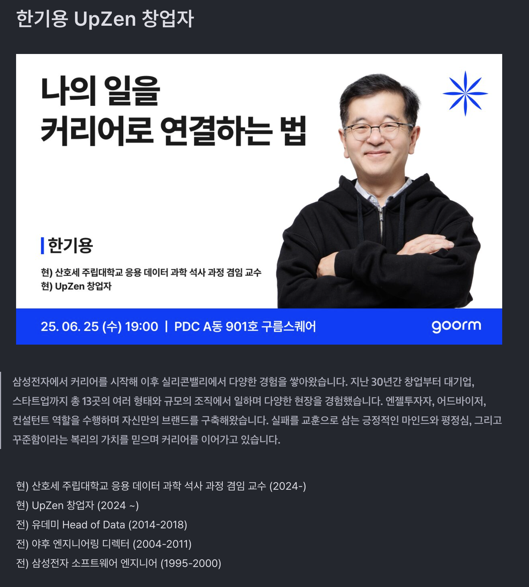

# 나의 일을 커리어로 연결하는 법 (구름 commit) 리뷰

본 포스팅은 [나의 일을 커리어로 연결하는 법 (구름 commit)](https://tech.goorm.io/2506_commit/)를 듣고 요약한 내용입니다.

## 세미나 목차

1. 지금의 일을 커리어로 연결하는 방법
2. 일에 임하는 태도와 성장하는 습관
3. 장기적인 커리어 여정을 위한 인사이트

### 좋은리더란?

- 결정을 질질 끌지 않고 결정을 틀렸다고 생각되면 빠르게 바꾸는 유연함
- 인자하지만 피드백을 줄땐 명확하게 줄 수 있다
- 꼭 외향적일 필요는 없다
- 피드백을 줬을때 바뀌지 않았을때는 경고를 할 필요성은 분명히 존재함

### 그동안의 경험

- 유데미 있을때 주니어들이 한가지 일만 해서 전문성을 길러야하는데 그러지 못한다고 느꼈기 때문에 커리어를 망친다고 생각하는 경우도 있었음
- 모든환경에는 명암이 있음. 즉, 나쁜점만 바라보지 않고 좋은 점도 바라볼 필요가 있음. 나쁜점 보다 좋은점의 합이 더 크면 됨
- 실리콘밸리에서 바라본 동아시아계와 인도계의 차이점
  - 인도계는 열정을 많이 어필하고 본인의 욕망을 분명하게 얘기한다. 반면 동아시아계는 자기검열이 심함
  - 인도계는 내가 승진을 하고 싶은데 무엇이 부족한지 알려달라고 물어본다. 반면 동아시아계는 승진을 하고 싶으면 자기가 생각하는 방향으로 노력해서 결과를 만든뒤에 결과와 함께 제시하려고한다. 결과적으로 무엇이 부족한지 먼저 조언을 구한 쪽이 목표에 도달하는데 더 효율적임
- 30년 동안 13개 회사 다님

### 내 커리어 여정을 바라보는 자세

- 경험을 바라보는 시각이 중요하다. 즉, 경험을 복기를 하고 긴호흡으로 생각하는게 중요
- 길게 보면 어디서 시작하느냐는 그리 중요하지 않음
- 꾸준히 하다보면 결국 본실력이 나옴
- 평정심을 갖는것이 중요
  - 평정심이란 꾸준함과 호기심을 의미.
- 사람 만날때 너무 빨리 판단하려고하지 말것. 내가 이해할수 없는 행동을 하는 사람을 볼때 너무 미워할 필요없고 왜 그런행동을 했는지 이해하려는 노력은 필요
- 왜 내가 원하는 선택을 못할까?
  - 나에 대한 고정관념(내 능력밖인거 같다)-> 기본적으로 발전이란 꾸준함을 가지고 1년 5년 10년 하는것
    잘하고 싶은게 있으면 오래 할 생각을 가지면 좋음
  - 정답 찾기(제대로 준비해서 바로 좋은 결과를 얻고 싶다)-> 정답을 찾으려하지말고 일단 저질러보자
- 결과를 내는데 집중하기
  - 성취하는 경험과 몰두하는 경험→ 자신감
    - 커리어는 결국 자신감
- 커리어 초반엔 지원해서 가지만 커리어 후반에는 평판으로 먹고 삶
- 많은 개발자들이 전문성에 대한 집착을 한다. 하지만 좋은 평판, 영향력이 중요
  - 좋은 평판 긍정적인 태도로 내가 맡은 일을 완수, 개인기 부리지말고 주변에 영향력을 높여라.
  - 개인기는 더하기, 영향력은 곱하기
  - 너무 자주 내가 잘하고 있나 자문 하지마라. 대부분의 경우 안좋은 답을 낸다.
- 인격적인 성숙
  - 인격적인 성숙한 사람을 뽑아서 기술을 가르쳐라(hire character, train skill)
  - 긍정적인 태도
  - 변화를 두려워하지 않는 자세
  - 회고를 통해서 실패한게 있다면 점점 더 나아지는 사람이 되면됨. 우리에겐 회복할 시간이 있음
  - 실수를 인정하는 여유, 모르는것을 모른다고 하는 솔직함
- 전직장에서 화가 났던거를 새회사에 가져가지 말것.
- 복리가 있는 일들 (운동, 배움/학습(호기심), 네트워킹, 책읽기/글쓰기)
- 공부를 불안감이나 조바심으로 하는게 아니라 필요나 호기심으로 해야한다
- 네트워크의 중요성
  - 사람 만날때 호기심 갖기
    - 첫인상에 사로잡히지 않기
  - 좋은 사람과 일하는 환경의 중요성
    - 나와 가장 많은 시간을 보내는 5명이 누구인가?
    - 내관점에서 봤을때 강점의 합이 약점의 합보다 큰지
  - 좋은 평판 유지하기
    - 팀플레이어, 공정한 사람, 긍정적인 사람
  - 도움 요청하고 도움 받기
- 자신의 강점과 약점을 이해하기
  - 강점을 최대화하는 일을 찾기
  - 단, 내 강점이 약점이 되는 순간을 잘 인지하기
- 모든 환경에는 명암이 있음
  - 완벽한 환경은 없음
    - 완벽한 환경을 기대하는 순간 기대가 커짐
- 사기꾼 증후군 (imposter syndrome) 극복하기
- 동료들이 나보다 잘하는것같고 늘 그들과 비교한다면?
  - 생각보다 말만하는 사람 많음. 어제의 나와 비교하는게 중요
- 자신감 갖기
  - 작은 성취를 반복해라
  - 어제의 나와 비교하고 회고 (자아비판은 건강하지 않은 회고)
  - 건강한회고는 잘한것과 못한것의 크기가 비슷해야함 & 작은것도 믿고 칭찬하려는 태도 필요
- 주기적으로 회고하기
  - 매주 혹은 매달 주기적으로 진행
  - 아쉬웠던점은 너무 이입하지 않고 제 3자 입장으로만 생각하기
  - 내 장점이 여전히 장점인가 생각해보면 좋음
  - 감사할 이유 생각하기

### 핵심 키워드

- 자신감
- 평정심(놀라지 않는게 아니라 놀랄 준비가 되어있는것)
- 꾸준함
- 호기심(너무 빠르게 단정짓지 말고 호기심 가지고 바라보는것)

### 느낀점

주니어로서 새로운 조직에 들어갈 때마다, 일을 대하는 나의 방식이 부정당하는 느낌을 종종 받기도 했지만, 결국 내 페이스를 지키며 꾸준히 앞으로 나아가다 보면, 언젠가는 환경이나 유혹이 나를 지배하려 해도 흔들리지 않을 수 있을 것 같다.

> https://tech.goorm.io/commit/
