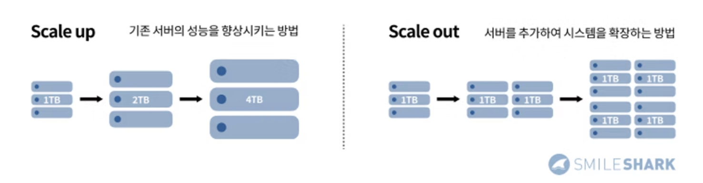
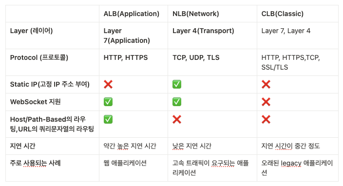

# 로드밸런서(Load Balancer)

## 개념

서버 트래픽을 여러 대의 서버에 고르게 분배하여 특정 서버의 부하를 덜어줍니다. 한 대의 서버로 부하가 집중되지 않도록 트래픽을 균등하게 분산해주어 각각의 서버가 최적의 퍼포먼스를 보일 수 있도록 합니다.

## 스케일 업, 스케일 아웃

서버가 하나인데 많은 트래픽이 몰릴 경우 부하를 감당하지 못하고 서버가 다운되어 서비스가 작동을 멈출 수 있습니다. 이런 문제를 해결하기 위해서 Scale up(스케일업)과 Scale out(스케일아웃) 방식 중 한 가지를 사용해 해결합니다.

**스케일 업**은 기존의 서버를 보다 높은 사양으로 업그레이드 하는 것을 말합니다. 소프트웨어적인 예시로 AWS 의 EC2 인스턴스 사양을 높이는 것을 말합니다.

**스케일 아웃**은 기존 서버만으로 용량이나 성능의 한계에 도달했을 때, 비슷한 사양의 서버를 추가로 연결해 처리할 수 있는 데이터 용량이 증가할 뿐만 아니라 기존 서버의 부하를 분담해 성능 향상의 효과를 기대할 수 있습니다 스케일 아웃방식을 사용할 경우 로드밸런서가 필요 합니다.

서버를 추가로 확장하기 때문에 수평 스케일링(Horizontal Scaling) 이라고 합니다.




## 장점

### 애플리케이션 가용성

서버에서 문제가 발생했을 때 자동으로 감지하고 사용 가능한 서버로 리디렉션 합니다.

- 애플리케이션 가동 중지 없이 애플리케이션 서버 유지 관리 또는 업그레이드 실행
- 백업 사이트에 자동 재해 복구 제공
- 상태 확인을 수행하고 가동 중지를 유발할 수 있는 문제 방지

### 애플리케이션 확장성

로드 밸런서를 사용하여 여러 서버 간에 네트워크 트래픽을 지능적으로 전달할 수 있습니다.

- 한 서버에서 트래픽 병목 현상 방지
- 필요한 경우 다른 서버를 추가하거나 제거할 수 있도록 애플리케이션 트래픽을 예측합니다.
- 안심하고 조정할 수 있도록 시스템에 중복성을 추가합니다.

### 애플리케이션 보안

로드 밸런서에는 인터넷 애플리케이션에 또 다른 보안 계층을 추가할 수 있는 보안 기능이 내장되어 있습니다.

- 트래픽 모니터링 및 악성 콘텐츠 차단
- 공격 트래픽을 여러 백엔드 서버로 자동으로 리디렉션하여 영향 최소화
- 추가 보안을 위해 네트워크 방화벽 그룹을 통해 트래픽 라우팅

### 애플리케이션 성능

로드 밸런서는 응답 시간을 늘리고 네트워크 지연 시간을 줄여 애플리케이션 성능을 향상시킵니다.

- 서버 간에 로드를 균등하게 배포하여 애플리케이션 성능 향상
- 클라이언트 요청을 지리적으로 더 가까운 서버로 리디렉션하여 지연 시간 단축
- 물리적 및 가상 컴퓨팅 리소스의 신뢰성 및 성능 보장

## AWS 로드밸런서 유형



### ALB(Application Load Balancer)

- 웹 서비스에 걸리는 부하를 분산해주는 로드 밸런서
- **HTTP/HTTPS**을 지원한다.
- **Layer 7**에서 동작 (Application 계층에서 동작)
- **고급 라우팅** 기능: **Path-Based Routing**(경로 기반 라우팅), **Host-Based Routing**(호스트 기반 라우팅) , URL **쿼리 문자열**에 따른 라우팅 (밑에서 설명)
- Docker 컨테이너화된 애플리케이션과의 통합을 용이하게 한다.
- 고정 IP 주소(Elastic IP)를 사용할 수 없다.고정 IP 주소를 사용할 수 있는 NLB를 앞에 놓아 고정 IP 주소가 있는 것처럼 사용할 수는 있다.
- **Sticky Session** 사용 가능

### NLB(Network Load Balancer)

- **TCP, UDP, TLS**를 지원한다.
- **Layer 4**에서 동작 (Transport Layer)
- **고성능, 상당히 낮은 Latency(지연)**으로 대량 트래픽을 처리할 수 있다.
- **고정 IP 주소(Elastic IP)**를 사용할 수 있다.27
  - 이로써 클라이언트는 항상 동일한 IP 주소로 연결할 수 있다. (DNS Name과 IP 주소 둘 다 사용 가능)
  - ALB는 고정 IP 주소를 사용할 수 없다
- Lambda는 NLB와 사용 할 수 없다. ALB는 사용가능 (HTTPS 기반의 트래픽을 처리하기 때문에)
- Sticky Session 사용 불가

### CLB(Classic Load Balancer)

가장 오래된 서비스

### ELB(Elastic Load Balancer)

AWS의 로드 밸런스 종류 전체를 통틀어 칭하는 말

### GWLB(Gateway Load Balancer)

트래픽을 체크하는 로드 밸런서


```
[사용자 요청]
↓
[Application Load Balancer]
↓
[Target Group]
↓
[Target (EC2 or ECS Task)]
```

# Target Group (대상 그룹)

- **로드밸런서가 트래픽을 전달할 대상들의 묶음**
- 하나의 Target Group에는 여러 개의 Target(대상)이 등록됨
- Health Check 수행도 이 Target Group 단위로 작동함
- 로드밸런서가 Target Group을 보고 살아있는 대상(Target)으로만 요청을 전달함

## 속성

- 프로토콜 (HTTP/HTTPS)
- 포트 (예: 80, 8080 등)
- 헬스 체크 경로 (`/health`, `/status` 등)

# Target (대상)

- 실제 요청이 전달될 **ECS Task** 또는 **EC2 인스턴스**
- 즉, 로드밸런서 입장에서 보면 **Target = 요청을 처리할 실체**

## 종류

- **ECS Task**: 컨테이너 기반의 앱
- **EC2 인스턴스**: 직접 띄운 웹 서버
- **Lambda 함수**: ALB에서 지원
- **IP 주소**: 네트워크 인터페이스(IP 단위)

 <br/>
> https://www.smileshark.kr/post/what-is-a-load-balancer-a-comprehensive-guide-to-aws-load-balancer > https://jibinary.tistory.com/196 > [https://inpa.tistory.com/entry/AWS-📚-ELB-Elastic-Load-Balancer-개념-원리-구축-세팅-CLB-ALB-NLB-GLB](https://inpa.tistory.com/entry/AWS-%F0%9F%93%9A-ELB-Elastic-Load-Balancer-%EA%B0%9C%EB%85%90-%EC%9B%90%EB%A6%AC-%EA%B5%AC%EC%B6%95-%EC%84%B8%ED%8C%85-CLB-ALB-NLB-GLB) > [https://velog.io/@choidongkuen/서버-Scale-up-과-Scale-out-그리고-로드-밸런서란](https://velog.io/@choidongkuen/%EC%84%9C%EB%B2%84-Scale-up-%EA%B3%BC-Scale-out-%EA%B7%B8%EB%A6%AC%EA%B3%A0-%EB%A1%9C%EB%93%9C-%EB%B0%B8%EB%9F%B0%EC%84%9C%EB%9E%80)
