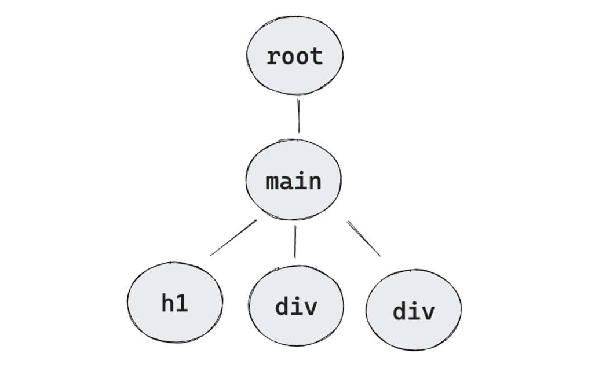
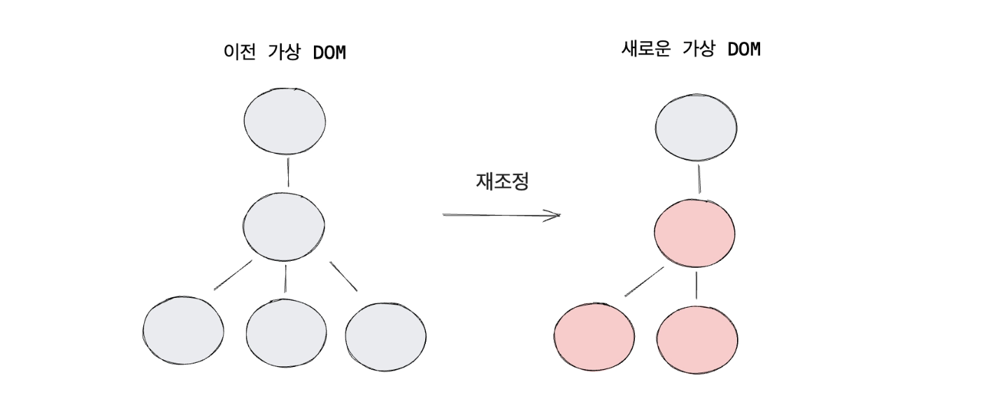
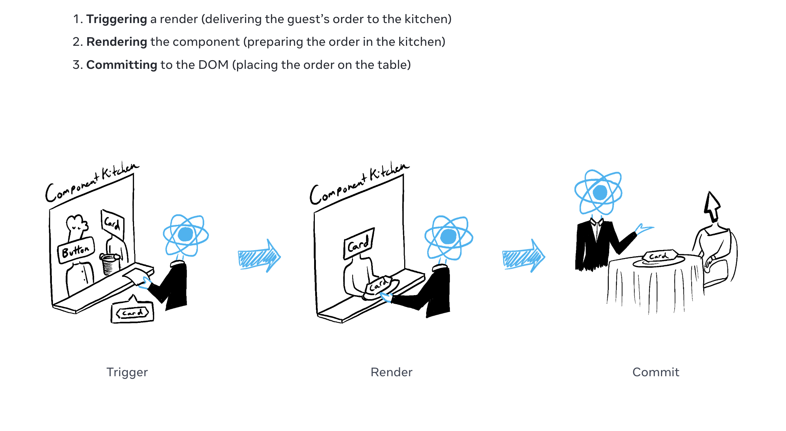

# 리액트 렌더링 단계

컴포넌트를 화면에 표시하기 이전에 React에서 렌더링을 해야 합니다. React 렌더링 단계를 3가지로 나눌 수 있습니다.

## 1. Trigger Phase

리액트가 렌더링을 일으키게 하는 트리거 발생 단계

- 초기 렌더링

- 리렌더링(상태 업데이트)
  - state의 변화
  - props의 생성 및 변화

## 2. Render Phase

화면에 컴포넌트를 그려서 반영하는 과정인 브라우저 렌더링과는 다른, 화면에 표시할 <b>컴포넌트를 호출하는 작업</b> <br/>
즉, `재조정 단계`를 거쳐 가상 DOM요소의 변화를 `감지`하고 `필요한 업데이트를 결정`하는 단계

- 초기 렌더링
  <br/>
  초기 렌더에서 렌더 단계는 render() 메소드의 루트 컴포넌트를 호출합니다.

  ```
  function App() {
    return (
      <main>
        <h1>hello world</h1>
        <Item />
        <Item />
      </main>
    );
  }

  function Item() {
    return <div>I am a Child</div>;
  }

  ReactDOM.createRoot(document.getElementById('root') as HTMLElement).render(
      <App />
  );
  ```

대상 DOM 노드로 createRoot(React 18부터 새로 도입된 루트 api)를 호출한 다음 render() 메소드를 호출하고 루트 컴포넌트를 화면에 그리는 동작을 진행합니다. <br/>
render() 메소드가 호출되면 리액트는 createElement()로 `<main>, <h1>, <div>` 태그명의 HTML 요소들을 생성합니다.



- 리렌더링(상태 업데이트)
  <br/>
  이전에 생성한 가상 DOM 트리와 새로 만든 가상 DOM 트리를 비교해 실제 DOM에 반영할 변경 사항들을 파악합니다. 최소한의 변경 사항만 파악하기 위해 상태 업데이트가 발생한 컴포넌트를 호출하고 새로운 가상 DOM 트리를 만듭니다. 리액트가 이전 렌더와 다음 렌더의 변화를 비교하는 과정을 `재조정`이라고 합니다.



리렌더가 발생하면 리액트는 렌더 간 어떤 요소와 속성들이 변했는지를 파악하고, 이 정보를 커밋 단계에서 사용합니다.

리액트는 컴포넌트를 호출하고 모든 자식 요소들을 재귀적으로 처리해 트리의 구성 요소들을 파악합니다. 여기서 재귀적으로 처리한다는 것은 업데이트된 컴포넌트가 다른 컴포넌트를 반환하면 React는 다음으로 해당 컴포넌트를 렌더링하고 해당 컴포넌트도 컴포넌트를 반환하면 반환된 컴포넌트를 다음에 렌더링하는 방식입니다. 중첩된 컴포넌트가 더 이상 없고 React가 화면에 표시되어야 하는 내용을 정확히 알 때까지 이 단계는 계속됩니다.
<br/>
함수가 연쇄적으로 호출될 때 내부의 JSX는 React.createElement() 함수로 JSX를 리액트 요소로 변환하는데요, 재귀적으로 생성된 리액트 요소들은 UI의 구조를 나타내는 객체이자 DOM의 가상 복사본인 가상 DOM으로 유지됩니다. 트리를 따라 호출을 반복하다가 최종적으로 더 이상 컴포넌트가 반환되지 않으면 비로소 가상 DOM 트리가 그려집니다.

## 3. Commit Phase

- 초기 렌더링
  <br/>
  렌더 단계에서 호출 된 모든 컴포넌트들을 DOM 노드에 배치(반영)하게 되는 작업<br/>
  appendChild() DOM API를 사용하여 생성한 모든 DOM 노드를 화면에 표시

- 리렌더링(상태 업데이트)
  <br/>
  이전 단계에서 계산한 차이점이 발견된 경우에만 DOM 노드를 변경하는 작업<br/>
  React는 필요한 최소한의 작업(렌더링하는 동안 계산된 것)을 적용하여 DOM이 최신 렌더링 출력과 일치하도록 합니다.

  

  React는 렌더링 간에 차이가 있는 경우에만 DOM 노드를 변경합니다. 예를 들어, 매초 부모로부터 전달된 다른 props로 다시 렌더링하는 컴포넌트가 있습니다. `<input>`에 텍스트를 입력하여 value를 업데이트 하지만 컴포넌트가 리렌더링될 때 텍스트가 사라지지 않습니다.

<br/>
<br/>

## 전체적인 플로우 비유



1. 렌더링 트리거 (손님의 주문을 주방으로 전달)
2. 컴포넌트 렌더링 (주방에서 주문 받기)
3. DOM에 커밋 (테이블에 주문한 요리 내놓기)

<br/>
<br/>

> ref. <br/> > https://www.moonkorea.dev/React-%EB%A0%8C%EB%8D%94%EB%8B%A8%EA%B3%84-%EC%BB%A4%EB%B0%8B%EB%8B%A8%EA%B3%84#%ED%8A%B8%EB%A6%AC%EA%B1%B0-%EB%8B%A8%EA%B3%84(trigger-phase)<br/> > https://react.dev/learn/render-and-commit
