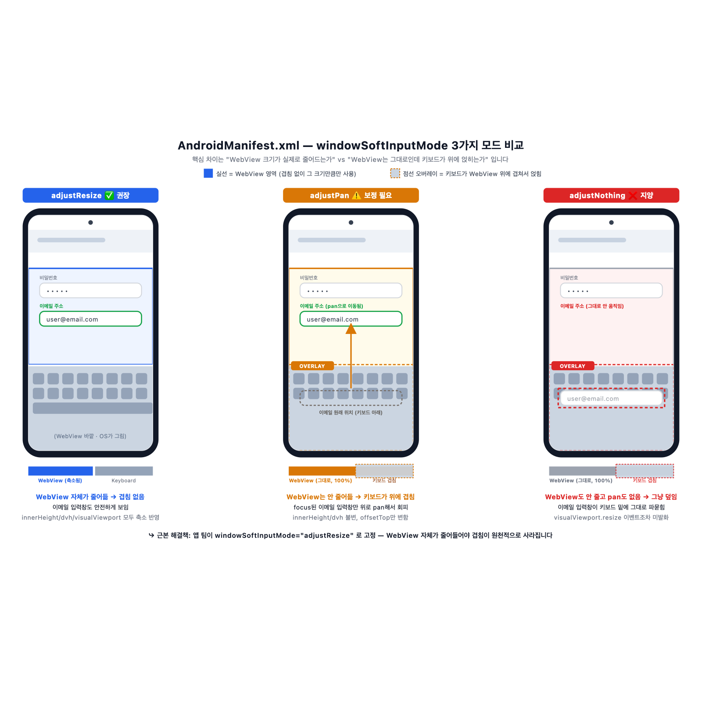
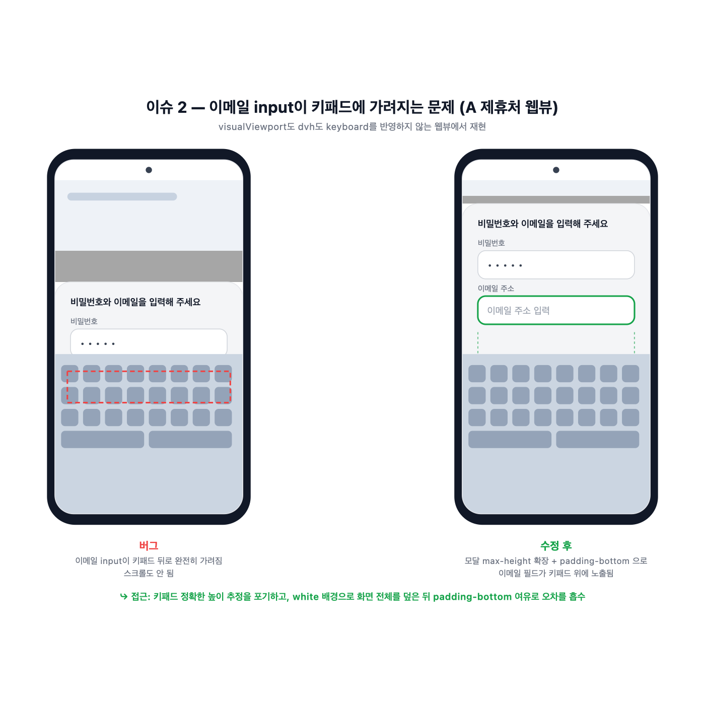

# 안드로이드 웹뷰의 키패드 이슈

## 배경

특정 제휴사 앱 서비스 안에 탑재된 가입 플로우 웹뷰에서 비밀번호&이메일 입력 모달에 키패드가 화면을 가려서 입력창이 안 보이는 문제가 있었습니다. (안드로이드 기기 한정)

같은 웹 서비스인데 타제휴 서비스앱에서는 정상 작동하고 특정 앱에서만 문제가 발생했습니다.

## 특정 제휴사 앱에서만 발생했던 이유(가설)

Android 앱이 WebView를 임베드할 때 `AndroidManifest.xml`에 `windowSoftInputMode`를 설정합니다. 이 설정에 따라 키보드 등장 시 WebView의 동작이 달라집니다.

### windowSoftInputMode

키패드 노출 여부에 따른 화면변화 모드

| 모드                | 키패드 등장 시 동작     | `window.innerHeight` | `100vh` / `100dvh` | `visualViewport.height` |
| ------------------- | ----------------------- | -------------------- | ------------------ | ----------------------- |
| `adjustResize`      | WebView 자체가 리사이즈 | ↓ 축소               | ↓ 축소             | ↓ 축소                  |
| `adjustPan`         | 컨텐츠를 위로 pan       | 그대로               | 그대로             | ↓ 축소                  |
| **`adjustNothing`** | **아무 처리 안 함**     | **그대로**           | **그대로**         | **그대로**              |


_같은 웹 코드라도 `windowSoftInputMode` 값에 따라 focus된 입력창이 보이는 방식이 달라집니다._

- **정상작동했던 앱은**은 `adjustResize`로 추정 → WebView가 자동 리사이즈해서 브라우저가 알아서 잘 처리 → 문제 없음
- **일반 브라우저 (Chrome, Samsung Internet)**는 `adjustResize`가 기본 → 정상
- iOS Safari는 keyboard 뜨면 fixed 요소를 자동으로 위로 pan → 정상
- **화면 가림 현상이 있었던 제휴처 앱**은 `adjustNothing` 설정으로 추정 → WebView도, `visualViewport`도, 어떤 CSS 유닛도 keyboard 반영하지 않음 → **웹에서 keyboard 상태를 감지할 수 있는 요소가 없음**

즉 웹 코드에 문제가 있는 게 아니라, 특정 앱의 WebView 설정이 웹 관점에서 keyboard 상태를 알려주지 않기 때문에 발생하는 이슈였습니다.

## 이메일 input이 키패드에 가려지는 문제

### 증상

- 비밀번호 input: 모달 상단에 위치해서 어떻게든 보임
- 이메일 input: 그 아래라서 키패드 뒤에 완전히 가려짐
- 사용자가 스크롤을 시도해도 스크롤 자체가 안 됨(전체 화면의 90% 고정으로 된 모달 높이에서 그 컨텐츠 높이가 그 이하였기 때문)


_좌: 이메일 input이 키패드 뒤로 완전히 가려지는 버그. 우: 모달을 화면 전체로 확장하고 padding-bottom으로 키패드 위 여백을 확보한 수정 후 모습._

### 원인

`visualViewport.height`\*를 감지해서 값이 바뀌면 모달의 `max-height`를 이 값 기반으로 계산 하려고 했지만 `adjustNothing` 웹뷰에서는 `visualViewport.resize` 이벤트 자체가 발생을 안함.

### 해결 방법

근본적인 해결 방법은 제휴처에서 설정을 변경해주는 것이지만, 당장 대응을 하기위해서 모달 높이를 화면 전체를 채우도록 수정했습니다.

```js
// focus 시
scrollContainer.style.setProperty("max-height", "100dvh", "important");
scrollContainer.style.setProperty(
  "padding-bottom",
  `${kbHeight}px`,
  "important",
);
```

- **`max-height: 100dvh`**: 모달의 최대 높이를 뷰포트 전체로 확장 → `align-items: flex-end`인 부모에서 화면 전체를 채움
- **`padding-bottom: kbHeight`**: 하단에 padding을 넣어 컨텐츠는 padding 위쪽으로 정렬 (=키패드 위)

### 결과

- 모달의 화면 전체를 덮어서 높이가 부족해보이는 현상 개선
- 컨텐츠는 padding 위(=키패드 위)에 정렬됨 → 이메일 필드 노출
