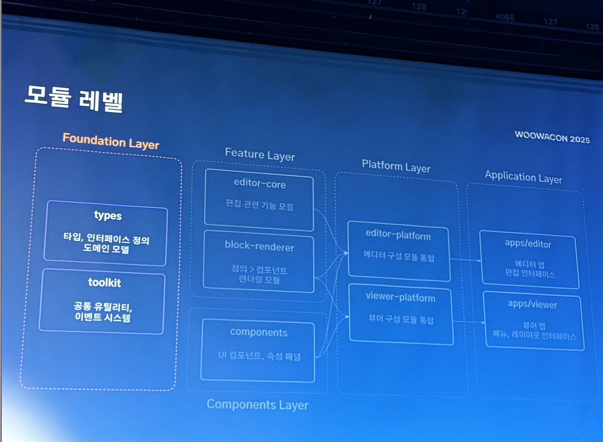
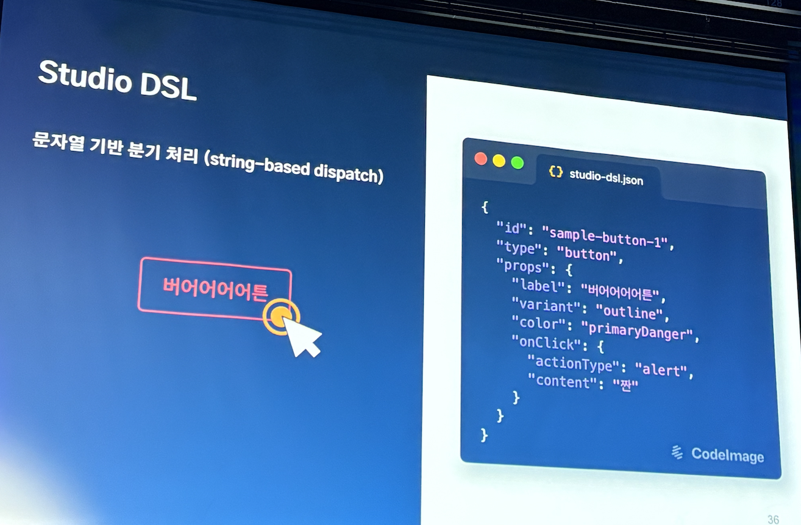
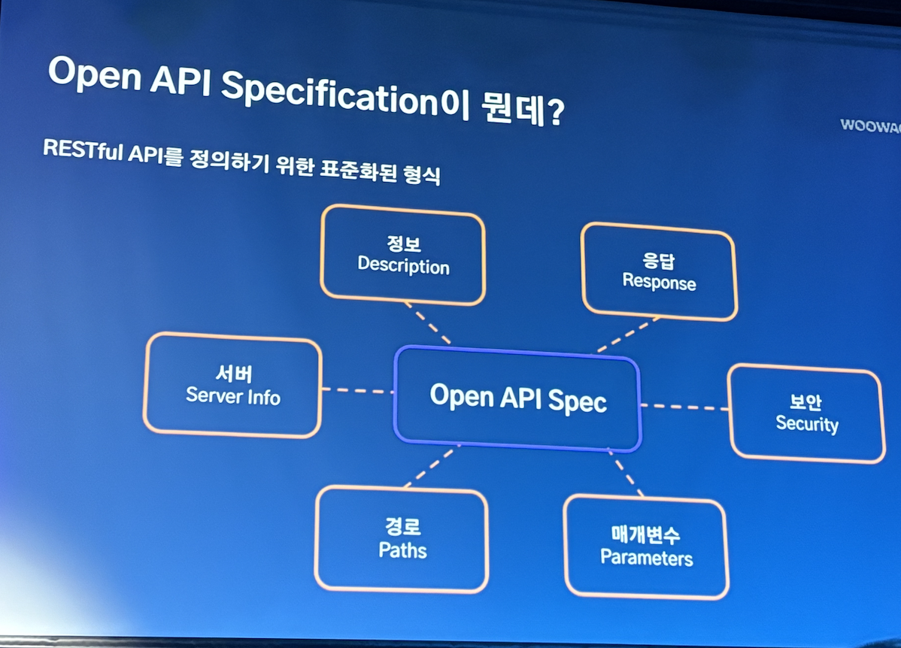
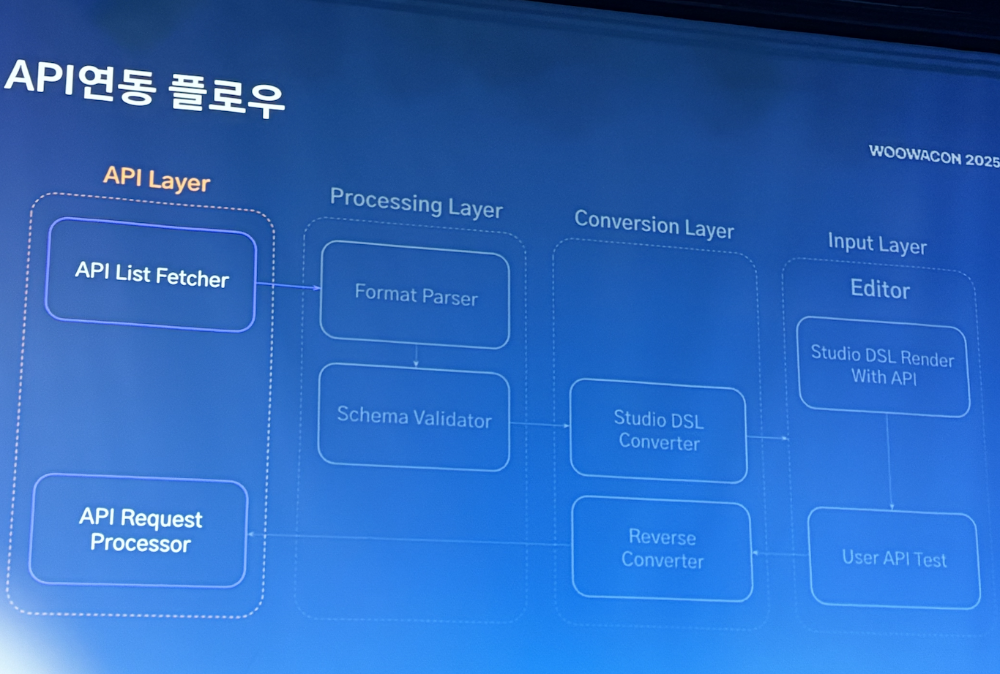
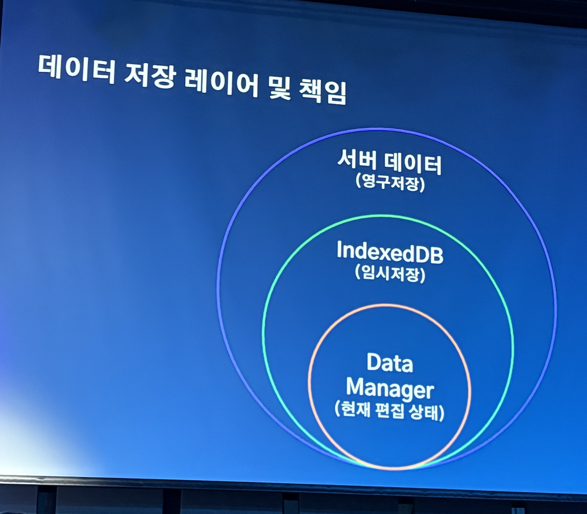

# 어드민 스튜디오(Admin Studio) -2025 우아콘

## 개념

기획자가 개발자 없이도 어드민 화면을 만들 수 있게 하는 도구

## 왜 어드민 스튜디오인가?

현실적으로 **대고객 서비스보다 우선순위가 낮은 어드민 개발**은

- 속도가 중요하고
- 픽셀 완성도보다 기능 전달이 핵심이며
- 유지보수·기능 수정·기획자 러닝커브 문제까지 존재한다.

기획자도 스튜디오 위에서 어드민을 만들 수 있다면?

→ 프런트엔드 개발자를 대체하는 도구를 만들자. ⇒ 즉 어드민 스튜디오

UI를 정의(\*DSL)하고 조합하여 화면을 생성하는 에디터.

> \*DSL이란?
> 어드민 화면을 정의하기 위한 전용 언어(또는 전용 JSON 스키마)

## 전체 구조 — 모듈 레벨 아키텍처

어드민 스튜디오는 **4개의 계층(Layer)** + **컴포넌트 레벨**로 구성됨.



### Foundation Layer

- **types**
  - 타입/인터페이스 정의
  - 도메인 모델
- **toolkit**
  - 공통 유틸리티
  - 이벤트 시스템

### Feature Layer

- **editor-core**
  - 편집 관련 기능 모듈
- **block-renderer**
  - DSL 정의 → UI 컴포넌트 렌더링
- **components**
  - UI 컴포넌트, 속성 패널

### Platform Layer

- **editor-platform**
  - 에디터 구성 모듈 통합
- **viewer-platform**
  - 어드민 뷰어 구성 모듈 통합

### Application Layer

- **apps/editor**
  - 어드민 편집 앱(Studio)
- **apps/viewer**
  - 뷰어 앱, 레이아웃/메뉴

→ 이 구조 덕분에 기능·UI·플랫폼이 물리적으로 분리되어 유지보수와 확장성 ↑

## Studio DSL — 정의로 만드는 화면



### DSL의 특징

- **문자열 기반 dispatch 처리**
- JSON 구조로 UI를 정의
- 예시:

```json
{
  "id": "sample-button-1",
  "type": "button",
  "props": {
    "label": "버튼",
    "variant": "outline",
    "color": "primaryDanger",
    "onClick": {
      "actionType": "alert",
      "content": "짠"
    }
  }
}
```

**“정의(DSL) → 렌더링 → 상호작용”**

기획자가 버튼 추가 → DSL 생성 → 렌더러(block-renderer)가 컴포넌트로 변환

DSL 장점:

- 간결한 정의
- 효율적
- 관리 용이
- API나 UI 변경이 정의 기반이므로 유지보수 쉬움

## 렌더링 레이어와 인터랙션 레이어의 분리

### 왜 분리하는가?

UI 컴포넌트의 렌더링과

마우스/포커스/드래그 등 인터랙션 로직을 분리해야

- 유연성 확보
- 유지보수 간단
- 독립성 증가

### 구조

1. **캐시 스토어 생성 (Zustand)**
2. **Wrapper 컴포넌트로 감싸 렌더링**
   - ref, MutationObserver로 위치/크기 추적
3. **마우스 위치에 있는 블록 검사**
   - intersecting blocks 계산
4. 해당 블록을 인터랙션 대상(Target)으로 설정

### 인터랙션 레이어 동작 방식

1. **캐시 스토어 생성 (Zustand 사용)**
2. **Wrapper 컴포넌트로 감싸 렌더링**
   - ref + MutationObserver로 컴포넌트 위치/크기 추적
3. **마우스 위치에 있는 블록 검사**
   - 교차되는 요소(intersecting blocks) 중 타겟을 선택

→ 코드 예시(이미지 내용 기반):

```tsx
class InteractionLayer {
  // ...
  private findPointerTargetBlock = (event: PointerEvent) => {
    const intersectingBlocks = this.findPointerIntersectingBlocks(event);

    if (intersectingBlocks.length <= 1) return null;
    return intersectingBlocks[0];
  };
}
```

---

## Event Bus로 정의 수정하기

### Event Bus란?

- Event 발행자와 구독자를 중개하는 버스
- 발행자와 구독자가 직접 참조하지 않음 (디커플링)

### 왜 필요한가?

Event Bus를 쓰지 않을 경우:

- 모듈 간 강한 의존성
- 코드 중복 증가
- 기능 변경에 취약한 구조

어드민 스튜디오처럼 다양한 레이어가 있는 시스템에서는

**느슨한 결합(Loose Coupling)** 을 위해 반드시 필요함.

### Event Bus의 장점

- 독립적인 모듈들 간 통신 가능
- 정의 변경(헤더 수정, 블록 속성 변경 등)에 즉각 반응 가능
- 구조적 유연성 확보

---

## API 연동 — Open API Specification



### OAS(Open API Spec)란?

RESTful API를 표준화해 기술하는 형식

포함 요소:

- Description (정보)
- Response (응답)
- Security(보안)
- Parameters(매개변수)
- Paths(경로)
- Server Info(서버)

API 구조가 명확하므로 **에디터가 자동으로 변환/사용 가능**

API 구조가 표준화되어 있으므로:

1. 스튜디오에서 API Fetch
2. 스펙 변환
3. DSL로 자동 연결
4. 유저 테스트까지 수행 가능

---

## API 연동 플로우



어드민 스튜디오에서 API가 화면에 연결되는 전체 흐름:

### 1) API Layer

- **API List Fetcher**
  – 서버에서 API 목록 가져옴
- **API Request Processor**
  – 실제 API 호출 처리

### 2) Processing Layer

- Format Parser
- Schema Validator

### 3) Conversion Layer

- Studio DSL Converter
- Reverse Converter
  → API 스펙 ↔ Studio DSL 양방향 변환

### 4) Input Layer

- Editor
  → Studio DSL + API 연동 렌더링
  → 사용자 API 테스트 가능

---

# 데이터 저장 구조 및 책임



### 3계층 저장 구조

1. **Data Manager (현재 편집 상태)**
   - Zustand
   - 단일 진실의 원천(Single Source of Truth)
2. **IndexedDB (임시 저장)**
   - 브라우저 로컬 DB
   - 대규모/구조화 데이터용
3. **서버 데이터 (영구 저장)**
   - 버전 관리 시스템 기반
   - 프로젝트 버저닝 가능

---

## SSOT 단일 진실의 원천 — Single Source of Truth

### 왜 SSOT가 중요한가?

- 모든 데이터를 하나의 스토어에서 관리
- 상태 변경 흐름이 예측 가능
- 선택적 구독으로 렌더링 최소화
- 불필요한 사이드 이펙트 제거

---

## 결론: 어드민 스튜디오가 만들어낸 가치

**기획자와 개발자 간의 완전한 협업 구조 변화**

- 개발자가 UI를 직접 만들지 않아도 됨
- 기획자는 Studio에서 DSL 기반으로 구성 → 즉시 화면 생성
- 데이터/인터랙션/API 모두 레이어화되어 유지보수 간단
- 기능·화면의 확장이 유연

<br/>
<br/>
<br/>

> 출처 2025 우아콘
