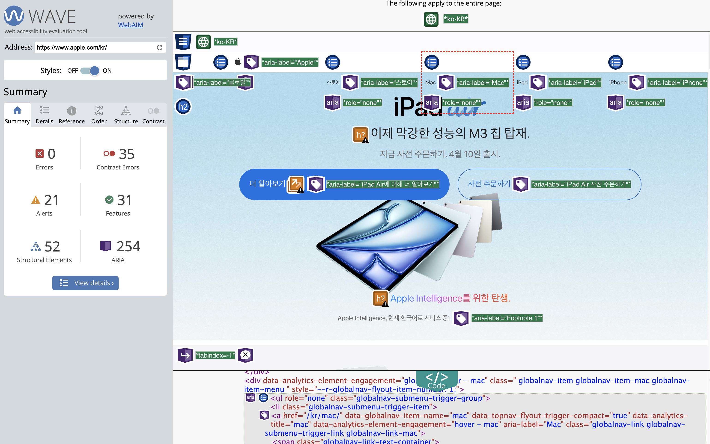
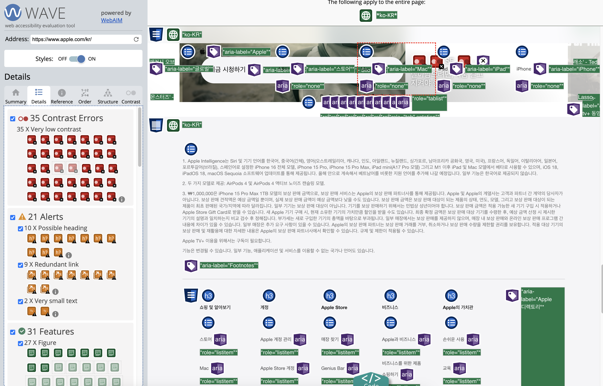
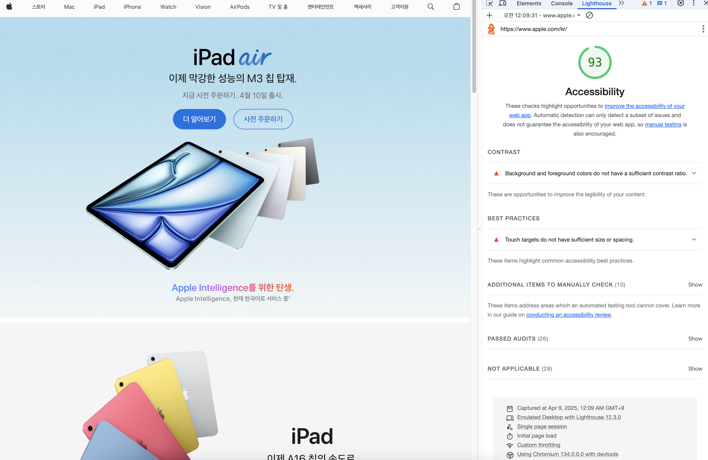
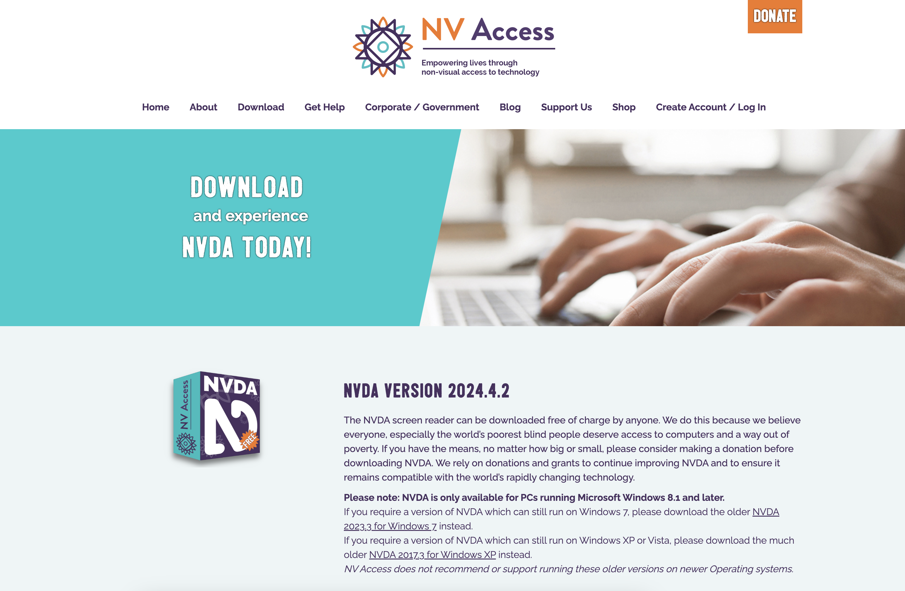

# 웹접근성

## 개념

정보통신접근성 (Web 접근성)은 「지능정보화기본법」에 따라 장애인이나 고령자분들이 웹 사이트에서 제공하는 정보를 비장애인과 동등하게 접근하고 이용 할 수 있도록 보장하는 것으로 웹 접근성 준수는 법적의무사항 입니다.

\*\* 보조기기중 하나인 <b>스크린 리더</b>는 컴퓨터 화면을 읽어주는 소프트웨어입니다. 스크린 리더는 화면에 출력된 텍스트, 이미지, 버튼 등을 음성으로 변환하여 사용자에게 전달합니다. 이를 위해 스크린 리더는 화면의 내용을 읽어주는 TTS(Text-To-Speech) 엔진과 사용자의 입력을 인식하는 인터페이스를 가지고 있습니다.

## 주요원칙

한국형 [웹 콘텐츠 접근성 가이드라인 (WCAG)](https://www.w3.org/WAI/standards-guidelines/wcag/)은 웹 콘텐츠 접근성 가이드라인(WCAG)을 표준으로 국내 실정에 맞게 반영되었습니다. WCAG는 인터넷을 위한 표준을 개발하고 장려하는 국제 조직 W3C(World Wide Web Consortium)에서 발표한 웹 콘텐츠 접근성 지침이자 국제 표준입니다.
<br/>
웹 접근성은 웹 사이트, 도구, 기술이 장애를 가진 사용자들이 사용할 수 있도록 설계 및 개발된 것을 말합니다.

- 목표: 웹 콘텐츠를 장애인이 보다 쉽게 접근할 수 있도록 만드는 것
- 적용 대상: 웹 개발자, 웹 접근성 평가 도구 개발자 등
- 범위: 시각, 청각, 신체, 언어, 인지, 학습, 신경 장애 등 광범위한 장애를 다룸
- 개발 과정: W3C 프로세스를 통해 전 세계 개인 및 단체와 협력하여 개발
- 업데이트: 기술과 트렌드가 변화함에 따라 W3C와 장애인 커뮤니티의 작업반이 정기적으로 평가하고 업데이트

## 적용

### 시맨틱 태그 사용

div 태그로 작성된 마크업은 스크린리더기가 태그의 명확한 의미를 알기가 어렵기 때문에
HTML5의 시맨틱 태그(ex: `<header>`, `<nav>`, `<footer>`, `<article>`, `<section>`)를 사용하여 콘텐츠의 구조를 명확하게 하고 적절한 제목 구조 ( `<h1>`, `<h2>`, ... ) 를 작성해 주는 것이 좋습니다.

### ARIA 사용

[WAI-ARIA](https://www.w3.org/TR/wai-aria-1.1/)는 HTML의 접근성 문제를 보완하는 W3C 명세입니다. WAI-ARIA는 HTML 요소에 role 또는 aria-\* 속성을 추가하여 콘텐츠의 '[역할(roles)](https://developer.mozilla.org/en-US/docs/Web/Accessibility/ARIA/Reference/Roles), [속성(properties)](https://developer.mozilla.org/en-US/docs/Web/Accessibility/ARIA/Reference/Attributes)' 정보를 보조기기에 제공합니다.

- ARIA는 Firefox, Safari, Opera, Chrome 및 Internet Explorer가 포함 된 모든 주요 브라우저의 최신 버전에서 지원됩니다.

#### [ARIA 역할(role)](https://developer.mozilla.org/en-US/docs/Web/Accessibility/ARIA/Reference/Roles)

특정 요소가 어떤 역할을 하는지 정의합니다.button, alert, form 등 다양한 역할들을 정의할 수 있습니다. 예를 들어, `role="button"`은 해당 요소가 버튼 역할을 한다고 브라우저에게 전달합니다.

```html
<div class="button" role="button">클릭!</div>
```

시맨틱 한 태그를 사용할 시에는 이미 의미론적(semantical)으로 설계되어 있기 때문에, HTML 요소에 추가적인 ARIA(Accessible Rich Internet Applications) 역할을 지정하지 않아도 접근성 목적을 충분히 달성할 수 있지만 반대로 `<div>`, `<a>`, `<span>` 등의 요소들에 역할을 부여할 시에 role 속성을 작성해 주어 접근성을 향상할 수 있습니다.

#### [ARIA 속성(attribute)](https://developer.mozilla.org/en-US/docs/Web/Accessibility/ARIA/Reference/Attributes)

화면 리더와 같은 보조 기술에 대한 정보를 제공합니다. 예를 들어 `aria-label`, `aria-hidden`, `aria-expanded` 등이 있습니다.

1. 버튼의 목적을 명확하게 알 수 있다.

```Html
<button onclick="search()"></button> // ❌
<button aria-label="검색" onclick="search()"></button> // ⭕
```

2. 링크의 목적을 알 수 있다.

```Html
<a href="/#">더 알아보기</a> // ❌
<a href="/#" aria-label="회사 소개 페이지로 이동">더 알아보기</a> // ⭕
```

#### ARIA 상태(state)

동적 페이지에서 상태를 나타내는 속성입니다. 위에 속성 개념에 속하는 종류입니다. 예를 들어 `aria-checked`, `aria-selected` 등은 해당 요소의 상태를 나타냅니다.

```Html
<span
  role="checkbox"
  id="checkBoxInput"
  aria-checked="false"
  tabindex="0"
  aria-labelledby="chk15-label"></span>
<label id="chk15-label">Subscribe to the newsletter</label>
<!--
 aria-checked = (true, false, mixed)
 true = 선택
 false = 미선택
 mixed = 결정되지 않음
 input 태그를 사용하게 되면 type을 지정해줘서 불필요.
  <input type="checkbox" />
 -->
```

### 키보드로 기능 사용가능하게 만들기

tabindex는 HTML 엘리먼트가 포커스를 받을 수 있도록 하는 글로벌 특성입니다. tabindex의 값에 따라 해당 엘리먼트가 포커스를 받을 수 있는 순서가 결정됩니다. tabindex의 값이 0이면, 해당 엘리먼트는 tab 키를 이용해 탐색이 가능해집니다. 보통 브라우저에서 tab을 클릭하게 되면 input, form, a 같은 관련 요소(element)와 같은 요소들이 차례대로 포커스가 됩니다. 그렇다면 포커스를 받지 않게 하거나 받게 하거나 포커스 순서를 정하고 싶다면 tabindex값을 특정 값으로 설정하면 됩니다.

tabindex는 0, -1, 양수 크게 3가지를 값으로 설정할 수 있는데 각각 알아봅시다.

```html
<h2 tabindex="0">제목</h2>
```

- tabindex=“0”
  상호작용하지 않는 `<div>`, `<span>` 태그와 같은 요소들도 키보드 포커스가 잡히게 하고 싶으면 해당 요소의 tabindex의 값을 0으로 설정해주면 tab을 클릭했을때 포커스가 가능해집니다.

- tabindex=“-1”
  default tabindex값이 0인 요소들(form,a..)을 키보드 포커스가 잡히지 않게 하려면 해당 요소의 tabindex값을 -1로 설정하게 된다면 어떠한 요소라도 해당 요소로 포커스가 잡히지 않게 됩니다.

- tabindex=“양수”
  양수값으로 지정하면 포커스 순서를 설정할 수 있습니다.예를 들어서 tabindex값이 각각 1,2,3,4 인 요소들이 존재한다고 가정했을 때 1 -> 2 -> 3 -> 4 순서대로 포커스가 됩니다.

### img 태그 속 대체 텍스트(alt) 작성

스크린 리더는 대체 텍스트(alt) 속성값으로 제공된 텍스트를 해석해서 음성으로 출력해줍니다.
대체 텍스트(alt) 작성하지 않으면 src를 음성으로 출력합니다.

```html

```

### 텍스트 크기 상대적으로 조절하기

- em 단위를 사용하여 폰트 크기를 지정하는 방법
  아래와 같은 CSS 코드를 작성하면, body 요소의 폰트 크기를 16px로 지정하고, h1 요소의 폰트 크기를 2em으로 지정하면 h1 요소의 폰트 크기는 32px이 됩니다. p 요소의 폰트 크기는 1em으로 지정하면 16px이 됩니다. 즉 부모 요소의 font-size를 기준으로 정해집니다. 이렇게 하면 사용자가 브라우저의 확대/축소 기능을 사용하여 폰트 크기를 조절할 때, 모든 요소의 폰트 크기가 함께 조절됩니다.

```css
body {
  font-size: 16px;
}

h1 {
  font-size: 2em;
}

p {
  font-size: 1em;
}
```

- rem 단위를 사용하여 폰트 크기를 지정하는 방법
  아래와 같은 CSS 코드를 작성하면, html 요소의 폰트 크기를 16px로 지정하고, h1 요소의 폰트 크기를 2rem으로 지정하면 h1 요소의 폰트 크기는 32px이 됩니다. p 요소의 폰트 크기는 1rem으로 지정하면 16px이 됩니다.
  rem 단위는 root em을 의미하며, html 요소의 폰트 크기를 기준으로 계산됩니다. 이렇게 하면 사용자가 브라우저의 확대/축소 기능을 사용하여 폰트 크기를 조절할 때, html 요소의 폰트 크기만 조절되고, 다른 요소의 폰트 크기는 그대로 유지됩니다.

```css
html {
  font-size: 16px;
}

h1 {
  font-size: 2rem;
}

p {
  font-size: 1rem;
}
```

### 적절한 색상 대비 사용

웹접근성을 위해서는 적절한 색상 대비를 사용해야 합니다. 대부분의 경우, 텍스트와 배경 사이의 대비가 4.5:1 이상이어야 합니다. 이를 위해서는 색상 대비 검사 도구를 사용하여 색상 대비를 확인할 수 있습니다. 대표적인 색상 대비 검사 도구로는 [Contrast-Finder](https://app.contrast-finder.org/result.html?foreground=rgb%2870%2C136%2C71%29&background=%23DFF0D8&ratio=4.5&isBackgroundTested=false&algo=Rgb&lang=ko)가 있습니다.

## 테스트

- [Wave](https://wave.webaim.org/)
  
  

- Lighthouse
  

- [NVDA](https://www.nvaccess.org/download/)
  

> ref.
> <br/> https://xxsxkz.tistory.com/entry/%ED%94%84%EB%A1%A0%ED%8A%B8%EC%97%94%EB%93%9C%EC%99%80-%EC%9B%B9-%EC%A0%91%EA%B7%BC%EC%84%B1Web-Accessibility >
> <br/>https://blog.naver.com/lovely237/223815828175 > <br/> https://github.com/gnuoy-oh/accessibility/tree/master/aria
