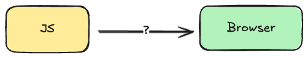
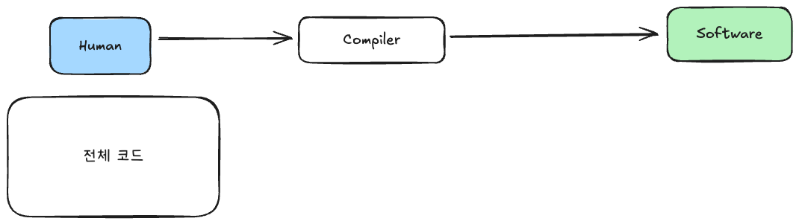
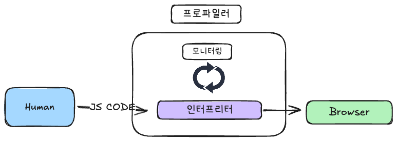
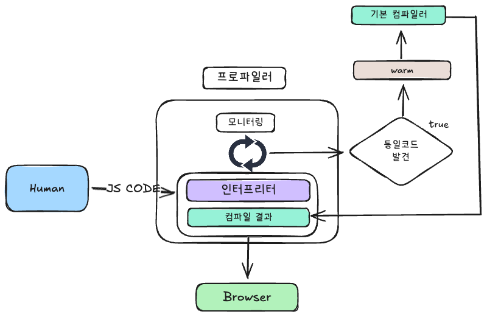

## 서론

Typescript의 타입 추론 속도를 개선하던 중 타입스크립트는 타입 추론 과정 즉 컴파일과정은 어떻게 진행되는 걸까? JS는 JIT 컴파일러를 사용한다는 말만 주구장창 들었는데 JIT은 어떤 동작원리를 가지고 있을까? 하는 궁금증이 생겨서 알아보게되었습니다.

## 브라우저의 언어

우리는 자바스크립트를 통해 브라우저와 대화합니다. 브라우저 즉 소프트웨어와의 대화를 하기위해서는 어떤 과정이 필요할까요?



프로그래밍에서는 기계어로 번역하는 방법이 일반적으로 두 가지 방식이 있습니다.

### 인터프리터(**Interpreter → 통역사**)

인터프리터는 소스 코드를 한 줄씩 저수준 즉 바이트코드로 번역하여 각 줄을 즉시 처리합니다.


<aside>
💡

ByteCode는 어셈블리어를 의미합니다.

**JS Code**

```jsx
function add(a, b) {
    return a + b;
}
console.log(add(2, 3));
```

**ByteCode(assembly)**

```jsx
0x01 load a
0x02 load b
0x03 add
0x04 return
```

</aside>

**장점**

- 실행 준비가 빠릅니다. 첫 번째 줄부터 바로 번역하고 코드를 실행합니다.
- 바로 실행하기 때문에 오류를 즉시 감지하여 디버깅이 더 쉬워지는 이점을 제공합니다.

**단점**

- 코드를 한 줄씩 처리하므로 번역하는 데 시간이 더 오래 걸립니다.
- **중복 번역**: 동일한 코드를 여러 번 실행해야 할 때, 매번 동일한 번역 과정을 반복해야 한다는 점이 단점입니다.

### 컴파일러(Compiler → 모으는, 편집하는)

인터프리터와 달리 컴파일러는 전체 프로그램을 저수준 언어로 한 번에 번역합니다. 한 번의 작업으로 전체 프로그램을 컴파일합니다. 



장점

- 초기에 코드를 한 번만 번역하기 때문에, 루프(loop)처럼 동일한 코드가 반복 실행되는 경우 더 빠르게 실행됩니다.
- 코드 번역 중 더 많은 시간을 들여 코드를 분석하고 수정하여 실행 속도를 높일 수 있습니다.(최적화)

단점

- 실행 전에 전체 컴파일 과정을 거쳐야 하기 때문에, 초기 실행 준비에 더 많은 시간이 걸립니다.
- 실시간 디버깅이 불가능합니다.

## **Just-In-Time Compiler (JIT)**

JIT은 기본적으로 인터프리터와 컴파일러의 역할을 동시에 수행합니다.

인터프리터의 비효율성, 즉 루프를 반복 실행할 때마다 코드를 재번역해야 하는 문제를 해결하기 위해 브라우저들은 컴파일러를 결합하는 방식을 도입했습니다.

JIT은 3단계의 과정을 거칩니다.

1. 프로파일러
2. 기본 컴파일러
3. 최적화 컴파일러

### 프로파일러

1. 인터프리터를 통해 코드 실행
2. 프로파일러가 코드 실행 패턴 관찰
    - **Warm 코드**: 동일한 코드가 몇 번 실행되면, 그 코드 부분을 “warm” 상태라고 부릅니다.
    - **Hot 코드**: 동일한 코드가 매우 자주 실행되면, 그 코드 부분을 “hot” 상태라고 부릅니다.
    
    이는 코드의 실행 빈도에 따라 최적화를 적용하는 기준으로 사용됩니다.
    



### **기본 컴파일러(Baseline Compiler)**

- Warm Code를 컴파일합니다.
- **컴파일 결과 저장**: 컴파일된 코드는 저장되어 이후 반복 실행 시 빠르게 실행될 수 있습니다.

이 과정은 코드 실행 성능을 개선하기 위해 자주 실행되는 함수를 효율적으로 최적화하는 방식입니다.



**최적화**

- **라인별 스텁 생성**:  “스텁(stub)“이라는 단위로 컴파일됩니다.
    - 스텁들은 줄 번호와 변수 타입을 기준으로 인덱싱됩니다.
    - 동일한 코드가 동일한 변수 타입으로 다시 실행되면, 모니터는 컴파일된 스텁을 가져와 사용합니다.
    - 결과 : 실행 속도를 크게 높입니다.

이러한 방식은 실행 성능을 극대화하면서도 초기 실행 시간을 최소화하는 데 도움을 줍니다.

### **최적화 컴파일러(Optimizing Compiler)**

- Hot Code를 컴파일합니다.
- 최적화 컴파일러는 해당 코드를 더욱 빠르고 효율적인 버전을 생성합니다.
- 최적화 컴파일러에서는 함수 전체를 한꺼번에 컴파일합니다

더 빠른 버전의 코드를 만들기 위해 최적화 컴파일러는 몇 가지 가정을 해야 합니다. 

1. 동일한 Shape 사용
    1. 객체가 가진 속성과 속성의 추가 순서에 따라 객체의 구조적 형태(Shape)가 정의됩니다.
    2. JavaScript 엔진은 같은 구조를 가진 객체들을 효율적으로 처리하기 위해 동일한 Shape을 공유하도록 최적화합니다.
    3. 같은 Shape을 가진 객체는 메모리 공간을 공유합니다.
    
    Shape 예제
    
    ```jsx
    function example() {
      // 객체 생성
      const obj1 = { a: 1 };
      const obj2 = { a: 2 };
    
      // obj1과 obj2는 동일한 Shape을 공유
      obj1.b = 3; // obj1의 Shape 변경 -> 새로운 Shape 생성
      console.log(obj1, obj2);
    }
    example();
    ```
    

1. **형태 기반 최적화**:
    
    동일한 생성자 함수로 만들어진 객체들이 항상 동일한 속성 이름과 순서를 가지면, JIT 컴파일러는 이를 기반으로 코드를 최적화합니다.
    
2. **모니터링과 추론**:
    
    JIT 컴파일러는 실행 중 코드를 모니터링하여, 반복문 등을 통해 수집된 정보를 바탕으로 특정 패턴(예: 객체의 형태가 변하지 않음)을 추론합니다.
    
    과거 실행에서 특정 조건이 항상 참이었다면, 이후에도 그럴 것이라 가정하고 최적화된 코드를 생성합니다.
    
3. **검증과 코드 폐기**
    
    JavaScript의 동적 특성상 99개의 객체가 모두 같은 형태를 가졌더라도, 100번째 객체에서 속성이 누락되거나 형태가 달라질 수 있습니다. 이 경우, 최적화된 코드는 실행 전에 가정을 검증합니다.
    
    가정이 유효하면 최적화된 코드가 실행되지만, 그렇지 않으면 JIT 컴파일러는 해당 코드를 “잘못된 최적화”로 간주하고 폐기합니다. 이 경우 이전 버전으로 돌아갑니다.(이를 **deoptimization** 또는 **bailout**이라고 함)
    

즉, JIT 컴파일러는 **동일한 패턴**을 최대한 활용하여 성능을 높이려고 하지만, 언제든 잘못된 가정이 발생할 수 있다는 점에서 신중하게 동작합니다.

**문제점**

만약 코드가 최적화와 디옵티마이제이션을 반복한다면, 오히려 기본 컴파일된 버전을 실행하는 것보다 더 느려질 수 있습니다.

대부분의 브라우저는 이러한 최적화/디옵티마이제이션 사이클에서 벗어나는 한계를 추가했습니다. 예를 들어, JIT 컴파일러가 10번 이상 최적화를 시도했지만 매번 폐기해야 하는 상황이 반복된다면, 더 이상 최적화를 시도하지 않도록 설계되었습니다.

**최적화의 예: 타입 특화 (Type Specialization)**

JavaScript의 동적 타입 시스템은 런타임에 추가적인 작업을 필요로하니다.

이를 최적화하기 위해 타입 특화(Type Specialization)가 사용됩니다. 아래 코드를 예로 들어 보겠습니다:

```jsx
function arraySum(arr) {
  var sum = 0;
  for (var i = 0; i < arr.length; i++) {
    sum += arr[i];
  }
}
```

**코드 분석: sum += arr[i]**

루프 내의 += 연산은 단순해 보이지만, JavaScript의 동적 타입 특성 때문에 예상보다 많은 단계가 필요합니다.

1. **기본적인 동작 원리**:
    1. sum과 arr[i]는 특정 타입(예: 숫자, 문자열 등)으로 고정되어 있지 않습니다.
    2. 동적 타입 시스템 때문에, += 연산은 **숫자 덧셈** 또는 **문자열 연결**이 될 수 있습니다.
2. **가정**: arr가 정수 100개로 이루어진 배열이라면:
    1. 코드가 웜업(warm-up)되면서, 기본 컴파일러는 sum += arr[i]에 대해 “정수 덧셈”으로 처리하는 기본 스텁(stub)을 생성합니다.
    2. 이 스텁은 정수 덧셈을 최적화하도록 설계됩니다.

**동적 타입의 특성**

sum과 arr[i]가 반드시 정수라는 보장은 없습니다. 이후 반복에서 arr[i]가 문자열이 될 가능성이 있습니다. 

이 경우:

- **정수 덧셈**과 **문자열 연결**은 완전히 다른 연산입니다.
- 각 연산은 서로 다른 기계어로 컴파일됩니다.

**JIT의 처리 방식: 다중 스텁 생성**

1. **모노모픽 코드(Monomorphic Code)**:
    
    특정 연산이 항상 동일한 타입으로 호출된다면(예: 모든 arr[i]가 정수), JIT는 하나의 스텁만 생성합니다.
    
2. **폴리모픽 코드(Polymorphic Code)**:
    - 같은 코드가 서로 다른 타입으로 호출된다면, JIT는 각 타입 조합에 대해 별도의 스텁을 생성합니다.
    - 예: 일부 arr[i]가 문자열이라면, JIT는 “숫자 덧셈” 스텁과 “문자열 연결” 스텁을 모두 생성합니다.

**최적화와 성능 이슈**

- 모노모픽 코드일 때 JIT는 최적화된 하나의 스텁으로 빠른 실행이 가능합니다.
- 폴리모픽 코드의 경우, 여러 스텁을 생성하고 런타임에 이를 전환해야 하므로, 추가 비용이 발생합니다.

코드가 지나치게 다양하게 호출된다면, 최적화 효과가 떨어지거나 디옵티마이제이션(deoptimization)이 발생할 수 있습니다.
