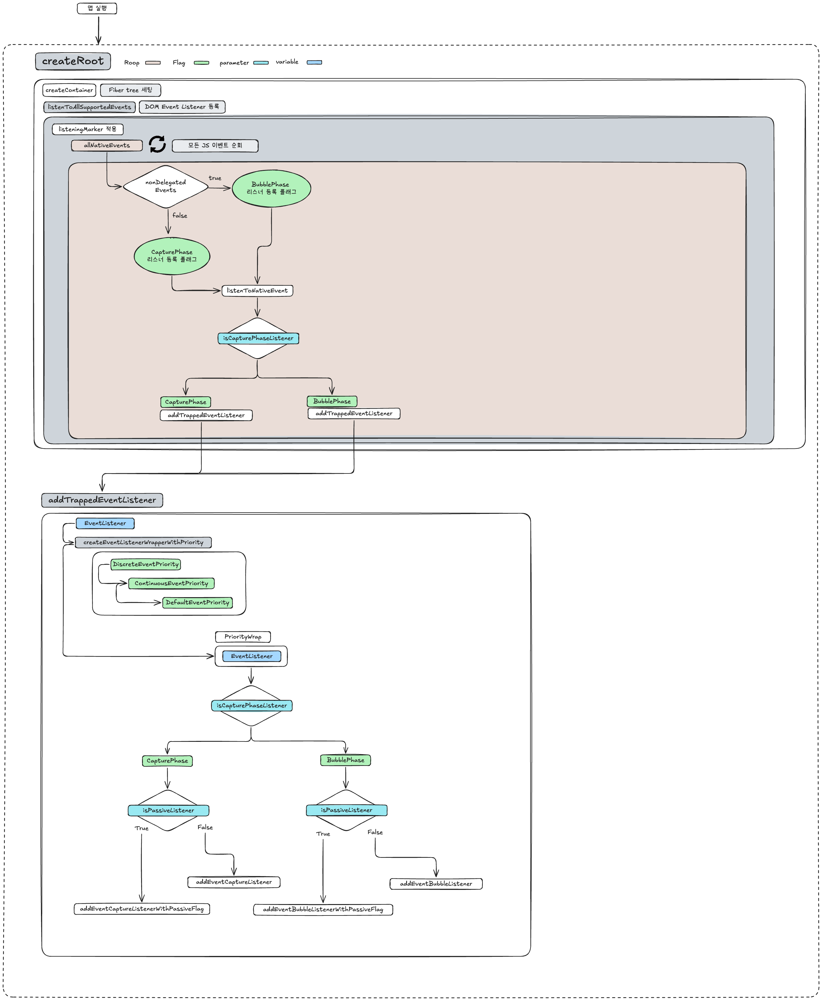

# 서론

최근에 에러바운더리에서 이벤트발생이 잡히지 않는 다는 것을 팀원이 알려줬어요. 그리고 이벤트의 isTrusted에 대해 몰라서 팝업 차단 이슈를 해결하는데 애를 먹은 경우도 있었어요. 둘의 공통점은 제가 이벤트 관리에 대한 이해도 부족이었습니다. 리액트를 사용하는 이상 이정도는 알아야했던 것 같아서 조금 부끄럽기도 하지만 이참에 확실하게 알고가기 위해 블로그를 쓰게되었습니다.

내용은 리액트에서 이벤트가 일어났을때. JS ~ React 이벤트 발생까지의 과정을 리액트 내부 코드를 해부하여 작성하였습니다. 실제 리액트 상태까지 도달하는 과정은 아마 다음 블로그에서 이어서 진행할 것 같네요.

# 리액트 버튼 클릭 시 생기는 일

## JS의 버튼 이벤트 동작

리액트의 버튼을 클릭 즉 onClick 이벤트가 발생한다면 무슨일이 일어날까요? 우리가 익히 아는 JS의 경우
버튼 클릭시 캡쳐 단계, 타겟 단계, 버블 단계를 거칩니다.


실제로 addEventListener를 이용하여 콘솔을 보면 캡쳐링 버블링을 하는 것을 볼 수 있습니다.

```
element.addEventListener("click", 클릭핸들러, true); // capture
element.addEventListener("click", 클릭핸들러, false); // bubble
```

**엘리먼트 구조**
perent
child
button


여기서 그럼 React는 어떻게 동작할까요?

## 리액트의 버튼 이벤트 개념

리액트는 이벤트 위임, 합성 이벤트, 이벤트 풀링 총 3가지의 개념이 존재하였는데 현재는 이벤트 풀링이 빠진 2가지 개념으로 동작합니다.

### 이벤트 위임 (Event Delegation)

https://blog.saeloun.com/2021/07/08/react-17-event-delagation/
https://legacy.reactjs.org/blog/2020/08/10/react-v17-rc.html

이벤트 위임이란 여러 요소에 각각 핸들러를 적용하는 것이 아닌 **공통 조상 핸들러**를 사용하는 것입니다.
특이점은 React17과 React16의 이벤트 위임 위치가 다릅니다.
16의 경우 document이며, 17의 경우 리액트를 사용하는 사람이라면 잘아는 createRoot(document.getElementById('root')) 입니다.
왜 root로 변경했는지 간단하게 알아보면 2가지 문제점이 있습니다.

#### 2가지 문제점

**호환성**

- document에서 사용할 경우 Jquery나 다른 프레임워크와 함께 사용하기에는 document는 너무 범용적.
  **Native Event**
- document에서 React Event를 받을 경우 stop.propagation 실행 시 Native Event가 이미 이벤트를 실행시키는 것.


출처 : https://legacy.reactjs.org/static/bb4b10114882a50090b8ff61b3c4d0fd/21cdd/react_17_delegation.png

이벤트 위임은 공통 조상 핸들러를 사용한다고 하였습니다. 그 방법은 JS의 핸들러를 Root에서 인터셉트하여 리액트 이벤트 전파로 이어지는 것입니다.
그럼 실제로 인터셉트하는 과정이 어떻게 이루어질까요?

#### 인터셉트를 콘솔로 확인한다면?

Code

```html
<div>
  <h1>React 내부 이벤트 시스템 분석</h1>
  <div ref="{containerRef}" onClick="{handleContainerClick}">
    <button onClick="{handleButtonClick}">클릭하여 이벤트 분석</button>
  </div>
</div>
```


- window - Capture
  - document - Capture
    - root - Capture
      - container - Capture
      - container - Bubble
    - **React Event - button**
  - **React Event - container**
- Root - Bubble
  document - Bubble

실제 코드로 확인해본 결과 Native Event가 root도달 직전(container)에 버블링이 끝나고 React 버블링이 시작됩니다. 이는 Root Element에 Native onclick이 도달하게되면 React onClick으로 변환한다는 것을 알 수 있습니다.

그럼 실제로 Native onclick이 도달하게 되었을때. 어떤 기준으로 React onClick인지 알고 실행하여서 React Bubbling으로 전달될까요?

### 합성 이벤트 (SyntheticEvent)

출처 : https://dev.to/lukewanghanxiang/react-understanding-reacts-event-system-dm7

합성 이벤트는 Native Event를 React Event로 변환해주는 역할을 진행합니다.
변환이 진행되며 모든 브라우저의 이벤트에 대해 호환되어 호환성에서 효과를 볼 수 있습니다.

그럼 실제로 리액트는 어떻게 이벤트를 관리할까요?

#### 이벤트 관리의 순서

1. 컴파일 타임 리스너 세팅
   1. createRoot
   2. listenToAllSupportedEvents
   3. listenToNativeEvent
   4. addTrappedEventListener
   5. createEventListenerWrapperWithPriority
2. 런타임 리스너 실행 및 캡쳐 버블링 진행.
   

**_정상 디스패치 진행사용자 시나리오 추가필요_**

#### createRoot

https://github.com/facebook/react/blob/main/packages/react-dom/src/client/ReactDOMRoot.js

```jsx
  export function createRoot
  container: Element | Document | DocumentFragment,
  options?: CreateRootOptions,
): RootType {

  ...

  const root = createContainer(
    ...
  );
    ...
  const rootContainerElement: Document | Element | DocumentFragment =
    !disableCommentsAsDOMContainers && container.nodeType === COMMENT_NODE
      ? (container.parentNode: any)
      : container;
  listenToAllSupportedEvents(rootContainerElement);


  return new ReactDOMRoot(root);
}
```

- createContainer : Fiber 트리를 설정합니다.
- listenToAllSupportedEvents : 모든 DOM 이벤트에 대한 리스너를 등록합니다.

#### listenToAllSupportedEvents

- React가 지원하는 모든 DOM 이벤트에 대해 리스너를 등록하는 함수입니다.

```jsx
export function listenToAllSupportedEvents(rootContainerElement: EventTarget) {
  if (!(rootContainerElement: any)[listeningMarker]) {
    // 마커가 없는 경우 마커 적용.
    (rootContainerElement: any)[listeningMarker] = true;
    allNativeEvents.forEach((domEventName) => {
      // 모든 네이티브 이벤트 순회
      if (domEventName !== "selectionchange") {
        if (!nonDelegatedEvents.has(domEventName)) {
          // nonDelegatedEvents
          listenToNativeEvent(domEventName, false, rootContainerElement); // false : 버블링 리스너 등록
        }
        listenToNativeEvent(domEventName, true, rootContainerElement); // true : 캡쳐링 리스너 등록
      }
    });

    const ownerDocument =
      (rootContainerElement: any).nodeType === DOCUMENT_NODE
        ? rootContainerElement
        : (rootContainerElement: any).ownerDocument;
    if (ownerDocument !== null) {
      if (!(ownerDocument: any)[listeningMarker]) {
        (ownerDocument: any)[listeningMarker] = true;
        listenToNativeEvent("selectionchange", false, ownerDocument);
      }
    }
  }
}
```

- listeningMarker : 이미 리스너가 등록되어있는지 확인.
- \_reactListening : 실제로 하나의 클릭이벤트에 여러 클릭이 담겨야하기 때문에 각 컨테이너마다 유니크한 이벤트 리스너 마커를 적용합니다.
- nonDelegatedEvents : scoll, media 같은 이벤트는 위임하지 않는 이벤트로 캡처하지 않고 버블링처리합니다.
  - 위임하지 않는 이유 : video의 경우 미디어 요소에만 있는 play, pause같은 이벤트가 존재하고 scroll의 경우 매우 자주 발생하여 루트까지 버블링할 경우 성능의 문제가 생깁ㄴ다.

#### listenToNativeEvent

```jsx

export function listenToNativeEvent(
  domEventName: DOMEventName,
  isCapturePhaseListener: boolean,
  target: EventTarget,
): void {
  if (__DEV__) {
    ...
  }

  let eventSystemFlags = 0;
  if (isCapturePhaseListener) {
    eventSystemFlags |= IS_CAPTURE_PHASE;
  }

  addTrappedEventListener(
    target,
    domEventName,
    eventSystemFlags,
    isCapturePhaseListener,
  );
}
```

- addTrappedEventListener : 실제 리스너 추가

#### addTrappedEventListener

"Trapped"은 이벤트를 "가둔다"는 의미로, React가 모든 이벤트를 가로채서 제어한다는 뜻입니다.

```jsx
function addTrappedEventListener(
  targetContainer: EventTarget,
  domEventName: DOMEventName,
  eventSystemFlags: EventSystemFlags,
  isCapturePhaseListener: boolean,
  isDeferredListenerForLegacyFBSupport?: boolean
) {
  let listener = createEventListenerWrapperWithPriority(
    // 1. 이벤트 리스너에 우선순위 추가.
    targetContainer,
    domEventName,
    eventSystemFlags
  );

  let isPassiveListener: void | boolean = undefined; // 2. Passive 이벤트 처리
  if (passiveBrowserEventsSupported) {
    // Browsers introduced an intervention, making these events
    // passive by default on document. React doesn't bind them
    // to document anymore, but changing this now would undo
    // the performance wins from the change. So we emulate
    // the existing behavior manually on the roots now.
    // https://github.com/facebook/react/issues/19651
    if (
      domEventName === "touchstart" ||
      domEventName === "touchmove" ||
      domEventName === "wheel"
    ) {
      isPassiveListener = true;
    }
  }

  // 3️⃣ 타겟 컨테이너 결정 (특수 케이스 처리)
  targetContainer =
    enableLegacyFBSupport && isDeferredListenerForLegacyFBSupport
      ? (targetContainer: any).ownerDocument
      : targetContainer;

  // 4️⃣ 실제 DOM 리스너 등록
  let unsubscribeListener;

  if (enableLegacyFBSupport && isDeferredListenerForLegacyFBSupport) {
    // 레거시 서포트
    const originalListener = listener;
    // $FlowFixMe[missing-this-annot]
    listener = function (...p) {
      removeEventListener(
        targetContainer,
        domEventName,
        unsubscribeListener,
        isCapturePhaseListener
      );
      return originalListener.apply(this, p);
    };
  }

  // TODO: There are too many combinations here. Consolidate them.
  if (isCapturePhaseListener) {
    // 캡처 단계
    if (isPassiveListener !== undefined) {
      // Passive 옵션과 함께
      unsubscribeListener = addEventCaptureListenerWithPassiveFlag(
        targetContainer,
        domEventName,
        listener,
        isPassiveListener
      );
    } else {
      // 일반 캡처
      unsubscribeListener = addEventCaptureListener(
        targetContainer,
        domEventName,
        listener
      );
    }
  } else {
    if (isPassiveListener !== undefined) {
      // 버블링 단계
      // Passive 옵션과 함께
      unsubscribeListener = addEventBubbleListenerWithPassiveFlag(
        targetContainer,
        domEventName,
        listener,
        isPassiveListener
      );
    } else {
      // 일반 버블링
      unsubscribeListener = addEventBubbleListener(
        targetContainer,
        domEventName,
        listener
      );
    }
  }
}
```

[Passive Event listener](https://developer.mozilla.org/ko/docs/Web/API/EventTarget/addEventListener#passive) : preventDefault를 호출하지 않는 이벤트로 touchstart, touchmove, wheel이 있습니다.
[EventListener](https://github.com/facebook/react/blob/main/packages/react-dom-bindings/src/events/EventListener.js) : addEventCaptureListenerWithPassiveFlag



#### createEventListenerWrapperWithPriority

- 이벤트 우선 순위 입력

```jsx
export function createEventListenerWrapperWithPriority(
  targetContainer: EventTarget,
  domEventName: DOMEventName,
  eventSystemFlags: EventSystemFlags
): Function {
  const eventPriority = getEventPriority(domEventName);
  let listenerWrapper;
  switch (eventPriority) {
    case DiscreteEventPriority:
      listenerWrapper = dispatchDiscreteEvent;
      break;
    case ContinuousEventPriority:
      listenerWrapper = dispatchContinuousEvent;
      break;
    case DefaultEventPriority:
    default:
      listenerWrapper = dispatchEvent;
      break;
  }
  return listenerWrapper.bind(
    null,
    domEventName,
    eventSystemFlags,
    targetContainer
  );
}
```

Native Event - 이벤트 캐치
-> 설명 추가하기

리액트의 경우 우선순위에 맞게 이벤트를 발송합니다.

##### 1순위 discreteEvent

출처 : packages/react-dom/src/events/ReactDOMEventListener.js

```
[클릭] ---- 시간 경과 ---- [클릭] ---- 시간 경과 ---- [클릭]
   ↑                          ↑                          ↑
  독립적                     독립적                     독립적

// 각 클릭은 완전히 분리된 개별 이벤트
```

- discreteEvent의 경우 click과 같은 연속적이지 않은 이벤트를 의미하며 가장 우선순위가 높습니다.

##### 2순위 ContinuousEvent

```
[move][move][move][move][move][move][move][move]
←―――――――――― 연속된 스트림 ――――――――――→
2
// 하나의 연속된 동작으로 볼 수 있음
```

- continuousEvent의 경우 mouse move와 같은 연속적인 이벤트를 의미합니다.

##### 3순위 DefulautEvent

- defaultEvent의 경우 즉각적인 반응이 필요하지 않은 이벤트들입니다. 예를 들면 css의 애니메이션, 트랜지션, video, image 와 같은 이벤트가 있습니다.

이벤트의 우선 순위가 정해졌다면 이벤트 발송을 진행합니다.

#### dispatchEvent

- 뜻 그대로 이벤트 발송이며 발송 전 이벤트 유효성검사를 진행합니다.

##### findInstanceBlockingEvent

- 블럭킹 이벤트인지 아닌지 판단하는 함수입니다. dispatchEvent의 실행중 첫단계로 실행됩니다.

```jsx
let blockedOn = findInstanceBlockingEvent(nativeEvent);
...
export function findInstanceBlockingTarget(
  targetNode: Node,
): null | Container | SuspenseInstance | ActivityInstance {
...
  if (targetInst !== null) {
    const nearestMounted = getNearestMountedFiber(targetInst);
    ...

```

- 블럭킹의 기준은 nearestMounted에 의해 결정됩니다. nearestMounted은 현재 이벤트 타겟의 가장 가까운 mounted된 타겟을 의미하며 동작 방식은 현재 이벤트에서 Mounted된 부모요소를 찾아나서는 것입니다.
- 예를 들면 button이벤트가 발생했을 때 button이 Mounted되지 않았을 경우 -> section -> div순으로 노드를 검색하게됩니다.

```html
<div>
  -- Mounted
  <section>
    -- unMounted
    <button>--> Event</button>
  </section>
</div>
```

- 만약 div가 Mounted되어있다면 nearestMounted는 div가 됩니다.

##### 블럭킹의 3가지 조건

**이벤트 블럭킹은 총 3가지로 처리되며 우선순위는 SuspenseComponent, ActivityComponent, HostRoot 순으로 진행됩니다.**

1. if (tag === SuspenseComponent)

```
<Suspense> -- Mounted
     <section> -- unMounted
         <button> -- unMounted
         </button>
    </section>
</Suspense>
```

- nearestMounted가 만약 Suspense에서 멈췄다면 이 조건문에 해당하게 됩니다.
- Suspense에서 멈춘경우 내부 컴포넌트가 아직 준비가 되어있지 않다고 판단하여 내부 컴포넌트를 Queue에 저장하고 잠시 대기합니다.

2. else if (tag === ActivityComponent)

   - react 19버전부터 적용된 ActivityComponent를 의미합니다.
   - ActivityComponent의 경우 mode가 hidden일 경우 DOM에는 있지만 숨겨지는 모드가 발생합니다. hidden은 이벤트 블럭킹을 진행합니다.

   ```
     <Activity mode="visible">
   ```

3. else if (tag === HostRoot)
   - HostRoot는 root 엘리먼트를 가리키며 HostRoot가 SSR환경에서 hydation되지 않았을 경우 블럭킹하는 조건입니다.
   ```
     if (isRootDehydrated(root))
   ```

#### 만약 이벤트가 블럭킹 된다면?

- continusousEvent라면 queue저장 후 전파 중지.
- 캡쳐단계 + 하이드레이션이 필요한이벤트인지 확인 (discrete Event)
- discrete event라면?

##### queueIfContinuousEvent

```js
if (
  queueIfContinuousEvent(
    blockedOn,
    domEventName,
    eventSystemFlags,
    targetContainer,
    nativeEvent
  )
) {
  nativeEvent.stopPropagation();
  return;
}
```

- 만약 ContinuousEvent(mouse move, scroll..)라면 queqe에 저장하고 이벤트 전파를 중지합니다.

##### isDiscreteEventThatRequiresHydration

```js
if (
  eventSystemFlags & IS_CAPTURE_PHASE &&
  isDiscreteEventThatRequiresHydration(domEventName)
) {
  while (blockedOn !== null) {
    const fiber = getInstanceFromNode(blockedOn);
    if (fiber !== null) {
      attemptSynchronousHydration(fiber);
    }
    const nextBlockedOn = findInstanceBlockingEvent(nativeEvent);
    if (nextBlockedOn === null) {
      dispatchEventForPluginEventSystem(
        domEventName,
        eventSystemFlags,
        nativeEvent,
        return_targetInst,
        targetContainer
      );
    }
    if (nextBlockedOn === blockedOn) {
      break;
    }
    blockedOn = nextBlockedOn;
  }
  if (blockedOn !== null) {
    nativeEvent.stopPropagation();
  }
  return;
}
```

- IS_CAPTURE_PHASE : 캡쳐단계인지.
- isDiscreteEventThatRequiresHydration(domEventName) : click, clickCapture, doubleClick..와 같은 우선순위가 높은 이벤트인지 확인.
- 조건이 성립될 경우 해당 이벤트 주변의 노드를 높은 우선순위로 하이드레이트를 진행합니다.
- [attemptSynchronousHydration](attemptSynchronousHydration)

#### 이벤트가 블럭킹되지 않는다면

**dispatchEventForPluginEventSystem**가 실행됩니다.

```jsx
let blockedOn = findInstanceBlockingEvent(nativeEvent);

if (blockedOn === null) {
  dispatchEventForPluginEventSystem(
    domEventName,
    eventSystemFlags,
    nativeEvent,
    return_targetInst,
    targetContainer
  );
  clearIfContinuousEvent(domEventName, nativeEvent);
  return;
}
```

#### dispatchEventForPluginEventSystem

root 컨테이너를 찾고 SyntheticEvent를 생성하기 위한 함수입니다.

**함수 시그니처**

```js
domEventName: DOMEventName, // 'click', 'change' 등
eventSystemFlags: EventSystemFlags, // 캡처/버블 플래그
nativeEvent: AnyNativeEvent, // 브라우저 원본 이벤트
targetInst: null | Fiber, // 타겟 Fiber 노드
targetContainer: EventTarget, // Root container
```

1. 일반적인 Event Delegation을 사용하는 이벤트인지 확인

```js
if (
    (eventSystemFlags & IS_EVENT_HANDLE_NON_MANAGED_NODE) === 0 &&
    (eventSystemFlags & IS_NON_DELEGATED) === 0
)
```

IS_EVENT_HANDLE_NON_MANAGED_NODE : 관리되지 않은 즉 직접 적용한 JS이벤트를 의미합니다.

- ex: document.body.appendChild(customButton);
  IS_NON_DELEGATED : scroll이벤트와 같이 버블링되지 않는 이벤트를 의미합니다.

2. 리액트 16이하 버전의 레거시 이벤트 호환성을 위한 코드.

```js
if (
  enableLegacyFBSupport &&
  domEventName === "click" &&
  (eventSystemFlags & SHOULD_NOT_DEFER_CLICK_FOR_FB_SUPPORT_MODE) === 0 && // 3. defer 가능
  !isReplayingEvent(nativeEvent)
) {
  // document로 이벤트 위임을 연기
  deferClickToDocumentForLegacyFBSupport(nativeEvent, targetContainer);
  return;
}
```

enableLegacyFBSupport : Facebook 빌드에서만 true이며 오픈소스에서는 false입니다. (facebook 내부 레거시 코드때문인듯?)
domEventName === 'click' : Facebook 레거시 코드가 주로 click 이벤트 위주 인듯합니다.
isReplayingEvent : 이미 처리된 이벤트를 다시 실행 중인지 확인

#### mainLoop: while (true) 실행

레거시가 아니며 호환되지 않는 이벤트가 아닌 경우 mainLoop를 진행합니다. mainLoop는 클릭된 이벤트(예를 들면 버튼 click)에서 최상위 root컴포넌트를 while문으로 찾기 시작합니다. 그 중간에 Portal컴포넌트 혹은 마이크로 프론트엔드 같은 여러개의 root의 경우 어느 위치에 이벤트를 등록 할지, SyntheticEvent를 생성하기 위한 작업을 진행합니다.

```jsx
//--Root 서치--
if (nodeTag === HostRoot || nodeTag === HostPortal) { // Root 혹은 Portal 노드 서치
    let container = node.stateNode.containerInfo; // 실제 DOM의 root 컨테이너
    if (isMatchingRootContainer(container, targetContainerNode)) { // Root일 경우 break
        break;
    }
    // --Portal의 서치--
    if (nodeTag === HostPortal) { // 포탈 서치.
        let grandNode = node.return; // 부모 fiber 참조
        while (grandNode !== null) { // 모든 부모 fiber 탐색
          const grandTag = grandNode.tag;
          if (grandTag === HostRoot || grandTag === HostPortal) { // 포달 혹은 루트 서치
            const grandContainer = grandNode.stateNode.containerInfo;
            if (
              isMatchingRootContainer(grandContainer, targetContainerNode) // Root일 경우 멈춤.
            ) {
             // 포탈은 버블링을 스스로하기 때문에 아무작업을 하지 않고 return합니다.
              return;
            }
          }
          grandNode = grandNode.return; //할아버지..fiber
        } // while 끝
    } // (nodeTag === HostPortal)


    // --Cross-Root 이벤트 처리--
    while (container !== null) { // Root가 아니며 Portal도 아닌 경우 -> Cross-Root로 인식
        const parentNode = getClosestInstanceFromNode(container); // DOM 노드에서 가장 가까운 React Fiber 찾기
        if (parentNode === null) { // react node가 없을 경우 종료
          return;
        }
        const parentTag = parentNode.tag;
        if (
          parentTag === HostComponent || // <div>, <button> 등
          parentTag === HostText ||      // 텍스트 노드
          parentTag === HostHoistable || // <link>, <style> 등
          parentTag === HostSingleton    // <html>, <body> 등
        ) {
          node = ancestorInst = parentNode;
          continue mainLoop; // 메인 루프로 점프!
        }
        container = container.parentNode; // Dom Tree 위로 이동
    }

} // nodeTag === HostRoot || nodeTag === HostPortal

  batchedUpdates(() =>
    dispatchEventsForPlugins(
      domEventName,
      eventSystemFlags,
      nativeEvent,
      ancestorInst,
      targetContainer,
    ),
  );
}
```

##### Root 서치

##### Portal의 서치 - Portal 처리를 분리해도될듯.

> 참고: Excalidraw 다이어그램 (Potal Search.excalidraw)

##### Cross-Root 이벤트 처리

- root, portal 서치가 끝난 시점에서도 아직 container가 존재한다면 다른 root가 존재한다는 것을 의미합니다.
  예시 상황

```jsx
// 문제 상황
<App>                           // React Root 1
  <Portal to={body}>
    <Modal>
      <NestedPortal to={tooltipRoot}>  // 다른 컨테이너
        <Tooltip />
      </NestedPortal>
    </Modal>
  </Portal>
</App>

<AnotherApp />                  // React Root 2 (독립적)
```

**node.stateNode.containerInfo?**

- 실제 DOM의 컨테이너로 Root, potal 두가지만 가지고 있습니다.

**포탈은 알아서 버블링을 처리하는데 부모노드를 찾는 이유는 뭘까?**

- 포탈의 Root인지, 다른 Root인지 알기 위해서입니다. 잘못된 Root라면 에러를 일으켜야합니다. 이렇게 하는 이유는 마이크로프론트엔드로 인해 Root가 여러개가 될 수 있기 때문입니다.


#### batchedUpdates

React 렌더링 최적화 함수로 이 함수 안에서 실행되는 모든 상태를 한번에 batch합니다.
리액트18버전부터 적용된 방식으로 여러개의 상태 변경을 일일이 리렌더하지 않고 모아서 처리한다는 개념이 바로 batchedUpdates입니다.

```jsx
batchedUpdates(() =>
  dispatchEventsForPlugins(
    domEventName,
    eventSystemFlags,
    nativeEvent,
    ancestorInst,
    targetContainer
  )
);
```

- 위의 코드의 경우는 이벤트를 배치에 추가하는 것입니다.

#### dispatchEventsForPlugins

**SyntheticEvent를 생성합니다.(드디어)**

```jsx
function dispatchEventsForPlugins(
  domEventName: DOMEventName,
  eventSystemFlags: EventSystemFlags,
  nativeEvent: AnyNativeEvent,
  targetInst: null | Fiber,
  targetContainer: EventTarget
): void {
  const nativeEventTarget = getEventTarget(nativeEvent); // 실제 이벤트를 가져옵니다.
  const dispatchQueue: DispatchQueue = [];
  extractEvents(
    dispatchQueue,
    domEventName,
    targetInst,
    nativeEvent,
    nativeEventTarget,
    eventSystemFlags,
    targetContainer
  );
  processDispatchQueue(dispatchQueue, eventSystemFlags);
}
```

##### extractEvents

```jsx
function extractEvents(
  dispatchQueue,  // 이벤트 큐 - 처리할 이벤트들을 저장
  domEventName,   // 'click', 'change' 등 DOM 이벤트명
  targetInst,     // React Fiber 인스턴스
  nativeEvent,    // 네이티브 DOM Event 객체
  nativeEventTarget, // 실제 DOM 엘리먼트
  eventSystemFlags, // 이벤트 시스템 플래그 (캡처/버블링 등)
  targetContainer,  // 루트 컨테이너
) {
  // SimpleEventPlugin: 대부분의 표준 이벤트 처리
  SimpleEventPlugin.extractEvents(
    dispatchQueue,
    domEventName,
    targetInst,
    nativeEvent,
    nativeEventTarget,
    eventSystemFlags,
    targetContainer,
  );

  // Polyfill 플러그인 처리 조건
  const shouldProcessPolyfillPlugins =
    (eventSystemFlags & SHOULD_NOT_PROCESS_POLYFILL_EVENT_PLUGINS) === 0;

  if (shouldProcessPolyfillPlugins) {
    // 각 플러그인이 특정 이벤트 유형 처리
    EnterLeaveEventPlugin.extractEvents(...);  // mouseenter/leave
    ChangeEventPlugin.extractEvents(...);       // onChange 정규화
    SelectEventPlugin.extractEvents(...);       // onSelect 처리
    BeforeInputEventPlugin.extractEvents(...);  // onBeforeInput
    FormActionEventPlugin.extractEvents(...);   // form 액션
  }
}

```

- 각 플러그인 함수의 역할은 각 이벤트를 처리하되 공통적으로 정규화, dispatchQueue 추가가 진행됩니다.

| **SyntheticEvent가 정규화를 담당하고 있는데 왜 ChangeEventPlugin또 정규화를?**

- SyntheticEvent[컴파일 타임 정규화]의 경우 이벤트 객체 그 자체를 정규화합니다.
  - this.preventDefault, this.stopPropagation 와 같은 속성을 어느 브라우저든 동일하게 사용할 수 있도록.
- ChangeEventPlugin[런타임 정규화]는 동적인 이벤트를 정규화합니다. onChange가 일어난 후 들어오는 속성은 브라우저마다 다른데 IE를 예로 들면 크롬의 'input' 이벤트가 IE9의 경우 이벤트 이름이 'propertychange'로 들어옵니다. 이것은 실제로 입력이 일어나야 알 수 있기 때문에 정규화가 나누어집니다.

##### processDispatchQueue

```jsx
export function processDispatchQueue(
  dispatchQueue: DispatchQueue,
  eventSystemFlags: EventSystemFlags
): void {
  const inCapturePhase = (eventSystemFlags & IS_CAPTURE_PHASE) !== 0;
  for (let i = 0; i < dispatchQueue.length; i++) {
    const { event, listeners } = dispatchQueue[i];
    processDispatchQueueItemsInOrder(event, listeners, inCapturePhase);
    //  event system doesn't use pooling.
  }
}
```

- dispatchQueue의 모든 큐를 실행합니다. **processDispatchQueueItemsInOrder**에서 inCapturePhase의 값에 따라 캡쳐 혹은 버블 단계가 진행됩니다.

##### processDispatchQueueItemsInOrder

- inCapturePhase에 따라 캡쳐를 할지 버블링을 할지 나뉩니다.
  inCapturePhase === true // **캡처 단계**

```jsx
    for (let i = dispatchListeners.length - 1; i >= 0; i--) {
      const {instance, currentTarget, listener} = dispatchListeners[i];
      if (instance !== previousInstance && event.isPropagationStopped()) { // isPropagationStopped를 발견할 경우 멈춤.
        return;
      }
      //...__DEV__ log
      } else {
        executeDispatch(event, listener, currentTarget);
      }
      previousInstance = instance;
    }

```

inCapturePhase === false // **버블 단계**

```jsx
    for (let i = 0; i < dispatchListeners.length; i++) {
      const {instance, currentTarget, listener} = dispatchListeners[i];
      if (instance !== previousInstance && event.isPropagationStopped()) { // isPropagationStopped를 발견할 경우 멈춤.
        return;
      }
      //...__DEV__ log
      } else {
        executeDispatch(event, listener, currentTarget);
      }
      previousInstance = instance;
    }
  }
```

다음 : 상태관리와의 연결
마지막 추가 필요. : 만약 내가 구현한다면?
