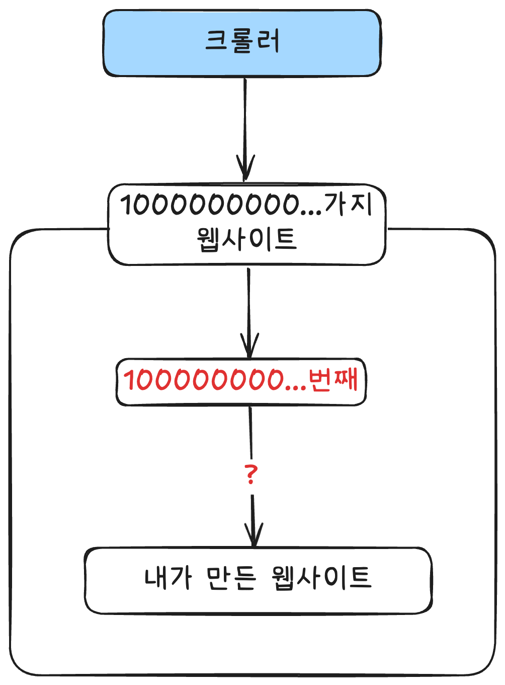
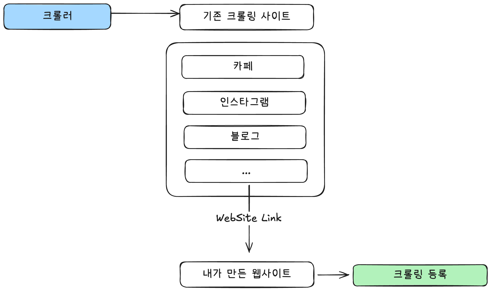
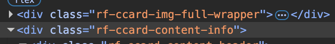
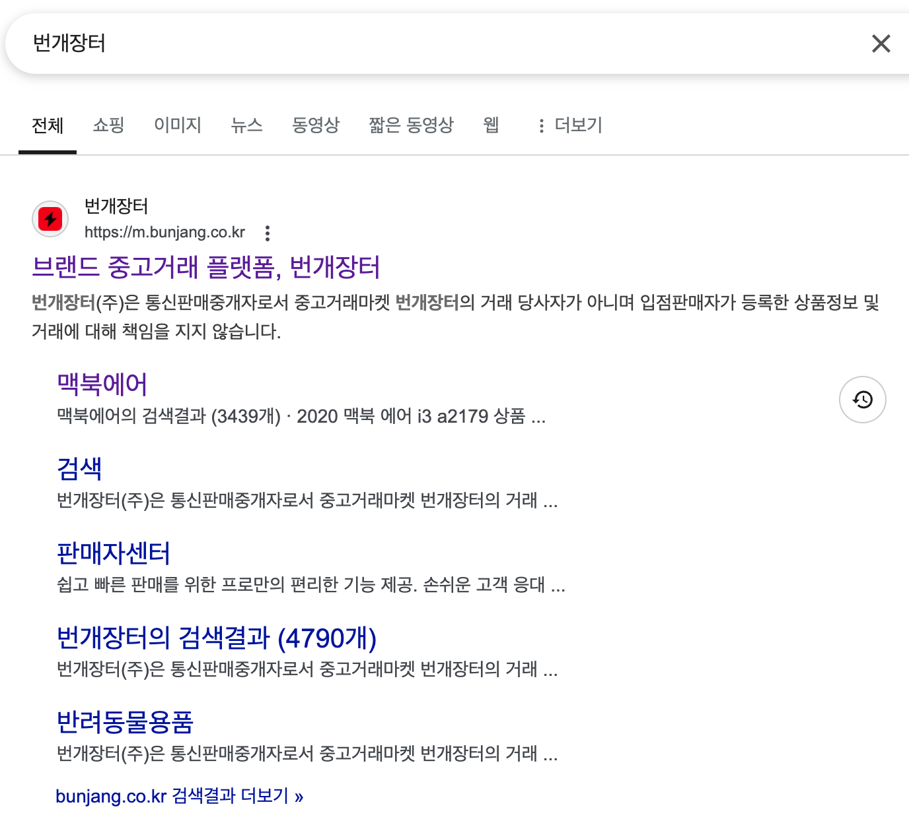
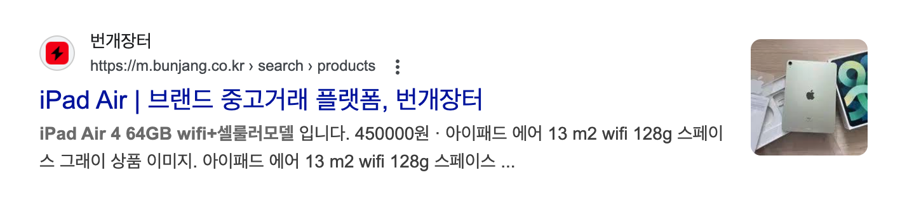

# 서론

사내 서비스의 매출 증가와 SEO 연관이 되어있고 불확실한 크롤러의 탐색으로 인해 검색엔진 노출이 적어질때면 매출도 함께 떨어지는 경우들이 있습니다. 만약 크롤러의 동작 방식을 이해하고 SEO에 대한 지식이 충분하다면 매출감소를 막고 더 질 높은 검색엔진 노출로 인해 매출증가까지 노려볼 수 있지 않을까? 하는 생각에 공부를 하게 되었습니다.

## 구글 검색 작동 방식

1. 크롤링
2. 색인(Indexing)
3. 서빙

### 크롤링 - 웹을 탐색하는 로봇

*새로운 웹페이지나 업데이트된 웹페이지를 찾고 수집하는 과정*

구글 크롤러는 Googlebot입니다.

인터넷에는 수 많은 URL이 존재하며 발견되지 않는 페이지도 존재합니다.

- 예를 들면 우리가 새롭게 등록 도메인의 경우.. 발견되지 못할 수 있습니다.
    
    
    

**Googlebot이 새로운 페이지를 탐색하는 방법.**

Googlebot은 이미 많은 양의 크롤링을 하고 있습니다.  그래서 새로운 페이지도 기존의 크롤링하는 웹사이트들에서 새로운 웹사이트 링크를 발견하면 해당 웹사이트에 접속하여 크롤링 데이터베이스에 등록합니다.

  

**모든 URL을 크롤링 하는가?**

- 요구되는 품질 임계값에 못미치는 사이트가 있다면 크롤링하지 않습니다.
- 크롤링을 차단하거나, 로그인을 해야하는 페이지
    
    → 공개적으로 액세스할 수 있는 URL만 크롤링합니다.
    

**크롤링 속도**

크롤링 속도는 사이트마다 다릅니다. 이 속도는 Googlebot의 개별적 요청에 의해서

1. 사이트가 반응하는 속도
2. 전반적인 콘텐츠 품질
3. 잠재적 서버 오류와 신호 

등에 따라 달라집니다.

- 우리는 높은 품질의 콘텐츠와 빠른 속도의 웹사이트, 그리고 오류없는 웹사이트를 만든다면 SEO도 함께 증가할 수 있습니다.

### 색인(Indexing) **– 페이지를 이해하고 분류하기**

*수집한 웹페이지의 내용을 정리하여 어떤 항목인지 분류하는 과정*

색인은 웹페이지의 내용을 읽고 어떤 웹페이지인지 분류를 하는 과정입니다.  총 3가지 과정을 가지며 Apple Store 사이트를 통해 알아보겠습니다.

1. **페이지 분석 (내용 파악)**
    
    Googlebot이 수집한(크롤링)한 페이지의 HTML 코드와 콘텐츠를 분석합니다.
    
    - Title : <title>Apple Store 온라인</title>
    - description : <meta description="Apple Store의 모든 매력이 온라인에서도 그대로… 혜택을 누리세요.">
    - Img, h1,h2…
        
      
        
        - img와 같은 레벨에 이미지 정보를 가지고 있습니다.
        - 이미지 정보
            - a태그 > MacBook Air > https://www.apple.com/kr/shop/buy-mac/macbook-air
            - Apple Intelligence
            - 1,590,000부터
        
        
        
    
    위와 같은 정보들을 토대로 색인 과정에서 “이건 애플 전자제품을 판매하는 쇼핑몰이네!” 하고 인식합니다.
    
2. 의미 분석 및 문제 해결
    
    HTML 구조가 잘못됐거나 이상한 태그가 있을 경우, 구글은 **자동으로 고치려는 시도**도 합니다.
    
    ex) 닫히지 않은 태그가 있으면 강제로 닫고 의미 있는 정보만 추출하려 합니다.
    
3. 신호(**Signals**) 수집
    
    : 페이지 정보 수집으로 색인 여부 판단.
    
    구글은 아래와 같은 **“신호(Signals)”** 들을 보고 대표 페이지를 결정합니다.
    
    - **rel="canonical" 태그** : 사이트에서 명시적으로 어떤 URL이 대표인지 알려주는 신호
    - **URL 구조** : 어떤 URL이 더 깔끔하고 의미 있는지
    - **콘텐츠의 위치와 품질** : 광고가 많거나 콘텐츠가 산만한 페이지는 선호되지 않음
    - **페이지 링크 구조** : 외부/내부 링크가 많이 연결된 페이지를 선호
    
    ex)
    
    | **URL** | **내용** |
    | --- | --- |
    | example.com/shoes?id=100 | 신발 제품 상세페이지 |
    | example.com/products/black-running-shoe | 같은 신발 상세페이지 |
    | example.com/ko/shoes?id=100 | 다국어용 같은 내용 |
    
4. **중복 클러스터링 : canonical을 결정**
    
    동일하거나 유사한 내용의 페이지가 여러 개 있으면, 하나만 대표로 표준 버전(canonical)으로 정해서 저장합니다. 보통 검색결과는 canonical 페이지가 노출됩니다.
    
    ex) 상품 상세페이지가 여러 URL로 접근 가능하면, 그 중 가장 대표적인 URL만 색인에 남깁니다.
    
    **중복 클러스터링**
    
    - 같은 내용의 페이지가 여러 URL에 존재할 때, 구글이 그룹화하고 대표 하나만 검색결과에 보여주는 과정입니다.
    
    
    
    URL 예시
    
    https://example.com/product?id=123
    https://example.com/products/shoes/running-shoe
    
    둘 다 같은 제품 상세페이지라면, 구글은 **“이건 중복된 페이지다”** 라고 판단해서 하나로 묶습니다. 그리고 그 중 가장 대표적인 것을 **“표준 버전(canonical page)”** 으로 선택합니다.
    
    - 각 페이지에 대해 이미 계산한 몇 가지 신호를 비교해 표준 버전을 선택.
    
    <aside>
    💡
    
    신호 : 검색 엔진이 페이지와 웹사이트에서 수집하는 정보 조각
    
    </aside>
    
    → 구글은 이 세 개를 **중복 클러스터**로 묶고, 하나를 **표준 버전**으로 정해 색인에 저장합니다.
    
    표준 버전 : example.com/shoes?id=100
    
    대체 버전 
    
    - example.com/products/black-running-shoe
    - example.com/ko/shoes?id=100
    
    표준 버전 예시 : 번개 장터
    
      
    
    대체 버전 : 아이패드를 키워드로 가집니다.
    
      
    
    **🔍** 검색 결과 :  [example.com/shoes?id=100](http://example.com/shoes?id=100) ⇒ 표준 버전
    
    대체 버전의 용도 : 특정 키워드 검색에서 노출
    
5. 색인 선택(index selection)
    
    : 구글이 크롤링한 수많은 페이지 중에서 실제로 검색 결과에 포함할 페이지를 선별하는 과정
    
    **프로세스**
    
    1. 신호를 수집하고 중복 페이지를 삭제
    2. 색인 생성 여부를 결정.
        1. 페이지의 품질 확인
        2. 수집한 신호 확인
    3. 표준 페이지 색인 생성
        1. 수집한 정보와 클러스터를 구글 색인에 저장

### 서빙(**Serving) – 검색 결과를 사용자에게 보여주는 과정**

**검색어 이해**

: 검색어를 해석하는것으로 시작

1. 검색어를 정리 후 특정 단어 확인
- ex)
    - a nice photograph of the moon → ~~a~~ nice photograph ~~of the~~ moon
        - a, of, the 는 필요없으므로 제거합니다.
    - The Statue of Liberty
        - of가 필요하므로 그대로 둡니다. 그리고  Statue of Liberty는 독립적인 개체로 인식됩니다.
1. 검색어는 비슷한 단어를 포함하도록 확장
    - car dealership의 경우
    - auto dealership을 포함 하여 검색합니다.
        - 이유 : car가 붙든 auto가 붙든 같은 의미를 가지기 때문
    

이제 검색어를 이해했다면 색인으로 보낼 수 있습니다.

구문분석된 검색어를 바탕으로 순위를 매겨야 하는 대량의 검색 결과를 반환합니다.

**순위 결정에 사용되는 주요 요소들**

1. 사용자와의 관련성 
    
    사용자의 정보에 따라 검색 결과가 달라집니다.
    
2. 페이지의 실제 콘텐츠
    
    제목, 설명, 실제 콘텐츠 등이 맥락상 일치해야합니다.
    
3. 사용자 정보
    
    사용자의 위치, 언어, 기기 유형 등도 중요합니다.
    
    ex) 홍콩의 사용자와 파리의 사용자가 같은 검색을 해도 다른 결과가 나옴.
    
4. 사이트 품질
    
    콘텐츠의 독창성, 페이지의 상대적인 중요성 등
    
    여러 도움말 페이지에 품질을 결정하는 방법
    
    - [페이지의 콘텐츠가 사용자의 검색어와 관련이 없음](https://developers.google.com/search/docs/fundamentals/seo-starter-guide?hl=ko#expect-search-terms)
    - [콘텐츠 품질이 낮음](https://developers.google.com/search/docs/essentials?hl=ko)
    - [Robots `meta`규칙으로 게재가 차단된](https://developers.google.com/search/docs/crawling-indexing/block-indexing?hl=ko)

### EEAT

**E-E-A-T**는 Google이 콘텐츠의 **품질과 신뢰도**를 평가할 때 사용하는 네 가지 핵심 기준입니다.

•	**E**xperience (경험)

•	**E**xpertise (전문성)

•	**A**uthoritativeness (권위)

•	**T**rustworthiness (신뢰성)

- 누가 콘텐츠를 만들었는가.
    
     독자가 작성자의 정보가 있을 것이라 예상하는 장소에 정확한 저자 정보를 추가하는 것이 좋습니다.
    
- 어떻게 콘텐츠가 만들어졌는가
- 왜 콘텐츠가 만들어졌는가.

1. **Experience (경험)**

이 콘텐츠는 **직접 해봤거나 실제 경험을 바탕으로 쓴 것인가?**

- 사용자가 **실제로 사용해 본 후기**, **직접 겪은 사례** 등을 공유한 콘텐츠는 더 높은 평가를 받습니다.

1. **Expertise (전문성)**

작성자가 해당 주제에 대해 **얼마나 잘 알고 있는가?**

- 주제에 대한 **지식과 이해도가 높은지**를 평가합니다.
- 특히 건강, 금융, 법률 등 **YMYL(Your Money Your Life)** 분야에서는 더 엄격하게 적용됩니다.

1. **Authoritativeness (권위)**

이 콘텐츠나 작성자는 **다른 사람에게 얼마나 신뢰받고 인용되는가?**

- 웹상에서의 평판, 외부 링크, 인용, 브랜드 인지도 등이 영향을 줍니다.
- 예: 위키백과, 언론사, 정부기관 사이트 등은 권위가 높은 사이트로 간주됨

1. **Trustworthiness (신뢰성)**

이 콘텐츠는 **정확하고 믿을 수 있는 정보인가?**

- 잘못된 정보, 클릭 유도형 제목, 과도한 광고 등은 신뢰도를 떨어뜨립니다.
- **사이트의 보안**, 개인정보 보호정책, **명확한 저자 정보 제공**도 신뢰성에 영향을 줍니다.
