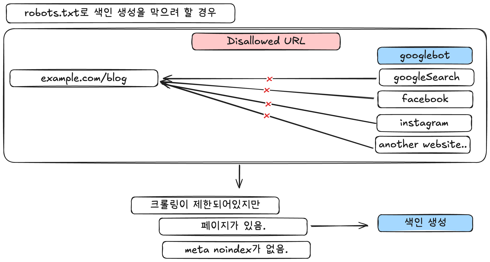

## 서식

1. URL
2. Link
3. SiteMap
4. robot.txt


## 1. URL

### **색인을 위한 URL 구조**

출처 : https://developers.google.com/search/docs/crawling-indexing/url-structure?hl=ko

ASCII 문자 혹은 UTF-8 인코딩을 사용합니다.

**권장 사항**

- 구체적인 단어를 사용
    - https://en.wikipedia.org/wiki/Aviation
- 잠재고객의 언어를 사용합니다. 독일인이 고객이라면 독일어를 사용
    - ex) https://example.com/**lebensmittel/pfefferminz**
- 필요에 따라 UTF-8 인코딩을 사용
    - https://example.com/%D9%86%D8%B9%D9%86%D8%A7%D8%B9/%D8%A8%D9%82%D8%A7%D9%84%D8%A9
- 국가별 도메인 사용
    - https://example**.de**
- gTLD(**Generic Top-Level Domain)**를 포함하는 국가별 하위 디렉터리를 사
    - https://example.com**/de/**
- 하이픈(-)을 사용
    - https://example.com/summer-clothing/filter?color-profile=dark-grey
- 등호(`=`)를 사용하여 키-값 쌍을 구분하고 앰퍼샌드(`&`)를 사용하여 매개변수를 추가합니다.
    - https://example.com/category?category=dresses&sort=low-to-high&sid=789
- 쉼표(`,`)를 사용하여 동일한 키의 여러 값을 나열하고, 등호(`=`)를 사용하여 키-값 쌍을 구분하고, 앰퍼샌드(`&`)를 사용하여 매개변수를 추가합니다.
    
    https://example.com/category?category=dresses&color=purple,pink,salmon&sort=low-to-high&sid=789
    

**권장하지 않는 URL**

- ASCII 문자가 아닌 문자 : https://example.com/**🦙✨**
- #(프래그먼트)를 사용 : https://example.com/**#/**potatoes
- 언더바(_)를 사용 : https://example.com/summer_clothing/filter?color_profile=dark_grey
- 단어 통합 : https://example.com/greendress
- 콜론(`:`)을 사용하여 키-값 쌍을 구분하고 괄호(`[ ]`)를 사용하여 매개변수를 추가합니다.
    - https://example.com/category?[category:dresses][sort:price-low-to-high][sid:789]
- 쉼표 한 개(`,`)를 사용하여 키-값 쌍을 구분하고 쉼표 두 개(`,,`)를 사용하여 매개변수를 추가합니다.
    - https://example.com/category?category,dresses,,sort,lowtohigh,,sid,789

느낀점

- Next14가 권장 URL구조로 가도록 어느정도 강제하는 부분이 있다. Next도 알고 만든듯 하다.

### 동적 URL의 문제

여러 개의 매개변수가 포함된 URL이 많아지면 **Googlebot이 불필요한 크롤링**을 하게 되고, 색인 생성에 문제가 생길 수 있습니다.

**원인**

아래와 같이 동적은 매개변수로 무한한 페이지가 생성될 수 있습니다. (ex:상세페이지)

예)

```
https://example.com/hotel-search?N=461
https://example.com/hotel-search?N=461+4294967240
https://example.com/hotel-search?N=461+4294967240+4294967270
// 세션아이디, 정렬 사용
https://example.com/products?sessionID=12345
https://example.com/results?search_query=shoes&sort=price
// 캘린더 날짜 관리
https://example.com/calendar.php?d=13&m=8&y=2023
// 잘못된 링크
https://example.com/index.shtml/discuss/category/health/070223/html/FAQ.htm
```

무한한 크롤링을 하면 안되는 이유

- 번개장터의 경우에는 상세페이지(상품갯수만큼100만개) > 접속 시에는 > 메인페이지로감.
- robot.txt에서 크롤링도 막았을 것으로 예측

📌 **해결 방법**

- 단순한 URL 구조
- robot.txt 설정
    - 일반적으로 검색 결과를 생성하는 URL과 같은 동적 URL이나 캘린더와 같이 무한대의 공간을 만드는 URL을 차단하는 것이 좋습니다.
    - robots.txt 파일에 정규 표현식을 사용하면 많은 수의 URL을 손쉽게 차단할 수 있습니다.
- 가능하면 URL에 세션 ID를 사용하지 말고 쿠키를 사용합니다.
- 가능하면 불필요한 매개변수를 삭제하여 URL의 길이를 줄입니다.
- 사이트의 캘린더가 무한대인 경우 동적으로 생성되는 미래의 캘린더 페이지로 연결되는 링크에 [`nofollow`](https://developers.google.com/search/docs/crawling-indexing/qualify-outbound-links?hl=ko) 속성을 추가합니다.
- 사이트에서 상대적 링크가 깨지지 않았는지 확인합니다.

## 2. Link

1. Google에서 페이지의 링크를 통해 사이트에 있는 다른 페이지를 찾을 수 있도록 링크를 크롤링 가능하게 만드는 방법
2. 앵커 텍스트를 개선하여 사용자와 Google이 페이지를 더 쉽게 이해할 수 있도록 하는 방법

`href` 속성을 갖고 있는 `<a>` HTML 요소(앵커 요소)인 경우에만 링크를 크롤링할 수 있습니다.

크롤링을 하지 못하거나 안정적이지 못한 경우

1. `<a>`요소에 `href`속성이 없을 경우
2. 스크립트 이벤트로 인해 링크처럼 작동하는 다른 태그

### 권장하는 경우
```
- <a href="https://example.com">
- <a href="/products/category/shoes">
- <a href="./products/category/shoes">
- <a href="/products/category/shoes" onclick="javascript:goTo('shoes')">
- <a href="/products/category/shoes" class="pretty">
- <a href="https://example.com/stuff">
- <a href="/products">
- <a href="/products.php?id=123">
```
### 권장 x : 파싱 시도는 할 수 있는 경우
```
- <a routerLink="products/category">
- <span href="https://example.com">
- <a onclick="goto('https://example.com')">
```
### 권장 x : Google이 문제를 해결하기 위해 “계속” 시도 할 수 있는 경우
```
- <a href="javascript:goTo('products')">
- <a href="javascript:window.location.href='/products'">
```
### 앵커 텍스트 배치

링크에 표시되는 텍스트를 앵커 텍스트라고 합니다. : <a>앵커텍스트<a/>

지금 접속하려는 페이지가 어떤 페이지인지 앵커 텍스트를 통해 알려주도록 합니다.

좋은 예

- <a href="https://example.com/ghost-peppers">**고스트 페퍼**</a>
- 앵커텍스트를 보여줄 수 없는 경우 title 적용
    - <a href="https://example.com/ghost-pepper-recipe" title="**고스트 페퍼**” />
- 이미지에 링크하는 경우 alt를 적용
    - <a href="/add-to-cart.html"></a>
    - <p>설명</p

나쁜 예

- 빈 링크 : <a href="[https://example.com](https://example.com/)"></a>
- 자바스크립트를 사용하여 앵커 텍스트 적용 : <a href="/add-to-cart.html"></a>

**더 좋은 앵커텍스트 배치 방법**

좋은 앵커 텍스트는 링크에 맥락을 제공하고 독자의 기대치를 설정합니다. 이는 Googlebot이 이해하기 쉽도록 해줍니다.

이 키워드가 다음에 표시될 페이지를 이해하는 데 필요한지 생각해 보세요. 앵커 텍스트에 키워드를 무리하게 집어 넣고 있다는 느낌이 든다면 이미 바람직하지 않은 상태일 수 있습니다.

링크 앞뒤에 있는 단어도 중요합니다. 전체 문장을 잘 살펴보세요. 여러 개의 링크를 연달아 배치하지 마세요. 독자가 링크를 구분하기 어려워지고 각 링크의 주변 텍스트가 사라집니다.

너무 일반적이라 나쁜 앵커 텍스트

- `<a href="https://example.com">`**여기를 클릭**`</a>`하여 자세히 알아보세요.
- `<a href="https://example.com">`**자세히 알아보세요**`</a>`
- `<a href="https://example.com">`**웹사이트**`</a>`에서 당사 치즈에 대해 자세히 알아보세요.
- 치즈 제조 방법에 대한 자세한 배경 정보를 제공하는 `<a href="https://example.com">`**도움말**`</a>`을 참고하세요.

좋은 예

- 구매할 수 있는 치즈의 전체 목록을 확인하려면 `<a href="https://example.com">`**치즈 유형 목록**`</a>`을 참고하세요.
- 다음 주 화요일부터 `<a href="https://example.com">`**Knitted Cow는 위스콘신 주민들을 재개장 행사에 초대**`</a>`합니다. 또한 소 모양의 얼음 조각을 선착순 20명에게 무료로 제공합니다.

안좋은 예

- 다음 주 화요일부터 `<a href="https://example.com">`**Knitted Cow는 위스콘신 주민들을 재개장 행사에 초대합니다. 또한 소 모양의 얼음 조각을**`</a>` 선착순 20명에게 무료로 제공합니다.

<aside>
💡

**주의 사항**

앵커 텍스트는 최대한 자연스럽게 작성해야합니다. 링크하려는 페이지와 관련된 모든 키워드를 전부 다 집어 넣을 경우 스팸 정책에 위배됩니다. 

스팸 정책 : https://developers.google.com/search/docs/essentials/spam-policies?hl=ko#keyword-stuffing

</aside>

## 3. SiteMap

참조 : https://www.sitemaps.org/protocol.html#escaping

구글이 어떤 URL로 사이트에 크롤링 할 것인지 알려주는 신호 역할.

최근에 생성, 수정된 URL 정보를 제공

**사이트 맵이 없다면?**

- 소규모 + 제대로 링크가 연결되어있다면 문제 없음.

**사이트맵이 도움이 되는 조건**

- 웹사이트가 굉장히 클 경우. → 사이트맵을 통해 수집 우선순위를 정할 수 있음.
- 페이지가 떨어져 있거나 서로 잘 연결이 안되어 있다면.
- 신규 사이트이거나, 빠르게 변하는 콘텐츠가 있을 경우
    - ex) 뉴스 웹사이트

### **사이트맵 크기 제한**

- 1개당 50MB, URL 50,000개, 사이트맵 파일은 최대 500개
    
    용량이 부족하다면 여러개의 사이트맵을 만들고 연결하면됩니다.
    
- 여러 사이트맵을 교차 제출하는 법
    
    https://site-a.com/sitemap.xml
    
    ```html
    <urlset xmlns="http://www.sitemaps.org/schemas/sitemap/0.9">
      <url><loc>https://site-a.com/page1</loc></url>
      <url><loc>https://site-b.com/page1</loc></url>
      <url><loc>https://site-c.com/page1</loc></url>
    </urlset>
    ```
    
    - 여러 사이트를 크롤링하도록 적용.
    
    ```html
    <sitemapindex xmlns="http://www.sitemaps.org/schemas/sitemap/0.9">
      <sitemap>
        <loc>https://site-a.com/sitemap-site-a.xml</loc>
      </sitemap>
      <sitemap>
        <loc>https://site-b.com/sitemap-site-b.xml</loc>
      </sitemap>
      <sitemap>
        <loc>https://site-c.com/sitemap-site-c.xml</loc>
      </sitemap>
    </sitemapindex>
    ```
    
    - 하나의 사이트맵에 다른  사이트맵 여러개를 포함

### **사이트맵 파일 인코딩 및 위치**

- UTF-8
- [Search Console](https://developers.google.com/search/docs/crawling-indexing/sitemaps/build-sitemap?hl=ko#addsitemap)을 통해 사이트맵 제출 필요
    - 제출하지 않을 경우?
        
        파일이 있는 위치 바로 아래의 경로에만 영향을 줍니다.
        
        ex) /blog/sitemap.xml → /blog/  에서만 영향을 줍니다.
        
    
    권장 위치 : https://example.com/sitemap.xml
    

### **참조 URL의 속성**

- 사이트맵에는 Google 검색결과에 보여주고 싶은 URL만 포함하도록 하자.
    
    : 구글은 사이트맵을 보고 어떤 페이지를 **중요하게 생각해야 하는지** 파악합니다.
    
- 사이트맵에 어떤 URL을 넣느냐에 따라서 구글이 어떤 걸 표준 URL로 인식할지에 영향을 줄 수 있습니다.
    - 표준 URL이란? (이전 블로그 링크)
- 모바일과 데스크톱 URL이 다르다면?
    - 둘 중 하나만 사이트맵에 넣는게 좋습니다.
    
    모두 연결해야한다면?
    
    - 주석을 이용하여 모바일인지, 데스크톱 URL인지 명시하여 알 수 있도록 합니다.

### XML 기본 포맷

시작 태그: <urlset>

요소:

- <url>: 각 페이지 정보
    - <loc>: 페이지의 URL (**필수**)
    - <lastmod>: 마지막 수정일 (선택)
    - <changefreq>: 변경 빈도 (선택)
    - <priority>: 중요도 (선택)
- 참고사항
    
    Google에서는 **`<priority>`** 및 **`<changefreq>`** 값을 무시합니다.
    

ex)

```html
<?xml version="1.0" encoding="UTF-8"?>
<urlset xmlns="http://www.sitemaps.org/schemas/sitemap/0.9">
  <url>
    <loc>https://www.example.com/</loc>
    <lastmod>2024-01-01</lastmod>
    <changefreq>monthly</changefreq>
    <priority>0.8</priority>
  </url>
</urlset>
```

**URL 작성 규칙**

- URL은 반드시 http:// 또는 https://로 시작
- 특수 문자(&, <, >)는 **entity escape 처리** 필요 → &amp;, &lt; 등
- RFC-3986 기준에 맞게 인코딩
    
    
    | **입력값** | **인코딩 전** | **인코딩 후 (RFC-3986 기준)** |
    | --- | --- | --- |
    | 한글 | https://example.com/안녕 | https://example.com/%EC%95%88%EB%85%95 |
    | 공백 | https://example.com/my page | https://example.com/my%20page |
    | 특수문자 & | https://example.com/?q=a&b=c | https://example.com/?q=a&b=c |

**주의사항**

- 페이지 변경 시점과 sitemap 생성 시점 구분
    
    ```html
    <url>
      <loc>https://example.com/about</loc>
      <lastmod>2024-12-01</lastmod> <!-- 이 페이지를 수정한 날 -->
    </url>
    ```
    
    검색 엔진은 <lastmod>를 보고 다음과 같이 판단합니다.
    
    - “이 페이지는 최근에 수정됐으니 다시 크롤링해야겠다!”
    - 반대로 오래 전에 수정된 페이지는 크롤링 우선순위를 낮게 줄 수 있음
    

## 4. Robots.txt

이 파일은 주로 요청으로 인해 사이트가 오버로드되는 것을 방지하기 위해 사용

출처 : https://developers.google.com/search/docs/crawling-indexing/robots/intro?hl=ko

### 사용 용도와 잘못된 사용

사용 용도 : 웹사이트 오버로드 방지.

잘못된 용도 : 웹사이트 크롤링으로 색인 생성 방지

robots.txt ⇒ 크롤링에서 제외 (페이지가 없는지는 모릅니다.)



만약 크롤러가 색인을 생성하지 않길 원한다면 meta태그를 적용하여야합니다.

```html
 <meta name="robots" content="noindex">
```

### 사용법

1. 형식
    - robots.txt는 사이트 루트(https://example.com/robots.txt)에 위치해야 합니다.
    - 해당 파일은 **같은 도메인과 프로토콜에만** 적용됩니다. (예: m.example.com 또는 http에는 미적용)
    - 파일은 **UTF-8 인코딩**이어야 하며, 그렇지 않으면 일부 규칙이 무시될 수 있습니다.
2. 작성법
    
    ```html
    ---Group1---
    User-agent: Googlebot
    Disallow or allow: /nogooglebot/
    ---Group1---
    
    ---Group2---
    User-agent: Googlebot
    Disallow or allow: /nogooglebot/
    ---Group2---
    
    Sitemap: https://www.example.com/sitemap.xml
    ```
    
    - user-agent : 크롤러 이름을 지정합니다.
        - 별표(**`*`**)를 사용하면 이름을 명시적으로 지정해야 하는 여러 AdsBot 크롤러를 제외한 모든 크롤러에 규칙을 적용할 수 있습니다.
    - disallow :  사용자 에이전트가 크롤링하지 않도록 하려는 루트 도메인 관련 디렉터리 또는 페이지입니다.
    - allow : 이는 **`disallow`** 규칙을 재정의하여 허용되지 않은 디렉터리에 있는 하위 디렉터리 또는 페이지를 크롤링할 수 있도록 합니다.
    - sitemap : 사이트의 사이트맵 위치입니다. Google은 http, https, www를 포함하는 URL과 포함하지 않는 대체 URL을 가정하거나 확인하지 않습니다.
        
        ```html
        Sitemap: https://example.com/sitemap.xml
        Sitemap: https://www.example.com/sitemap.xml
        ```
        

### 유용한 규칙

**특정 디렉터리 및 콘텐츠 크롤링 금지**

특정 디렉터리 내의 모든 파일 및 하위 디렉터리의 크롤링을 금지합니다.

```
User-agent: *
Disallow: /calendar/
Disallow: /junk/
Disallow: /books/fiction/contemporary/
```

**특정 크롤러만 제외하고 나머지 모두 허용**

예: Unnecessarybot만 크롤링하지 못하도록 설정하고, 다른 크롤러는 허용합니다.

```
User-agent: Unnecessarybot
Disallow: /

User-agent: *
Allow: /
```

**특정 웹페이지 크롤링 금지**

개별 파일이나 경로 하나만 크롤링을 막고 싶을 때 사용합니다.

```
User-agent: *
Disallow: /useless_file.html
Disallow: /junk/other_useless_file.html
```

**특정 하위 디렉터리만 허용**

전체 사이트는 크롤링 금지하지만, 특정 공개 디렉터리만 허용합니다.

```
User-agent: *
Disallow: /
Allow: /public/
```

**Google 이미지의 특정 이미지 크롤링 차단**

특정 이미지 파일에 대해서만 이미지 검색에서 제외합니다.

```
User-agent: Googlebot-Image
Disallow: /images/dogs.jpg
```

**와일드카드(*)와 정규표현($) 사용 예시**

특정 확장자로 끝나는 파일을 모두 차단할 수 있습니다.

```
User-agent: Googlebot
Disallow: /*.xls$
```

### Google에서 robots.txt 를 해석하는 방법

Googlebot은 사이트를 크롤링하기 전에 Google 크롤러는 사이트의 robots.txt 파일을 다운로드하고 파싱하여 사이트에서 크롤링할 수 있는 부분에 관한 정보를 추출합니다.( [로봇 제외 프로토콜(REP)](https://www.rfc-editor.org/rfc/rfc9309.html))

**캐싱**

- Google은 기본적으로 robots.txt 파일을 하루(24시간) 동안 저장해서 사용합니다.
- 문제가 생기면 더 오래 저장할 수 있습니다.
    - 서버가 느려서 시간 초과
    - 5xx 오류.
- 이 저장된 캐시은 다른 크롤러도 같이 쓸 수 있습니다.
- 서버 설정(max-age)에 따라 저장 기간이 달라질 수 있습니다. (http 헤더 max-age로 설정이 가능합니다.)

**파일 크기 제한**

- robot.txt 파일 크기를 최대 500KiB로 제한

<aside>
💡

KiB byte?

KiB는 **Kibibyte**(키비바이트)의 약자입니다.

| **단위** | **이름** | **1단위는 몇 바이트?** | **기준 방식** |
| --- | --- | --- | --- |
| KB | Kilobyte | 1,000 bytes | 10진수 (10^3) |
| KiB | Kibibyte | 1,024 bytes | 2진수 (2^10) |

**왜 KiB를 사용할까?**

컴퓨터의 메모리나 저장장치는 **2진수 기반**으로 동작하므로, **정확한 표기를 위해** KiB, MiB, GiB 같은 단위를 사용하는 경우가 많습니다.

robots.txt 파일 크기 제한처럼 기술 문서나 표준 문서에서는 더 명확하게 하기 위해 KiB를 사용합니다.

</aside>

[자세한 규칙 보러가기](https://developers.google.com/search/docs/crawling-indexing/robots/robots_txt?hl=ko#syntax) 

## 5. 메타 태그

여기서부터 다시 : https://developers.google.com/search/docs/crawling-indexing/robots-meta-tag?hl=ko
