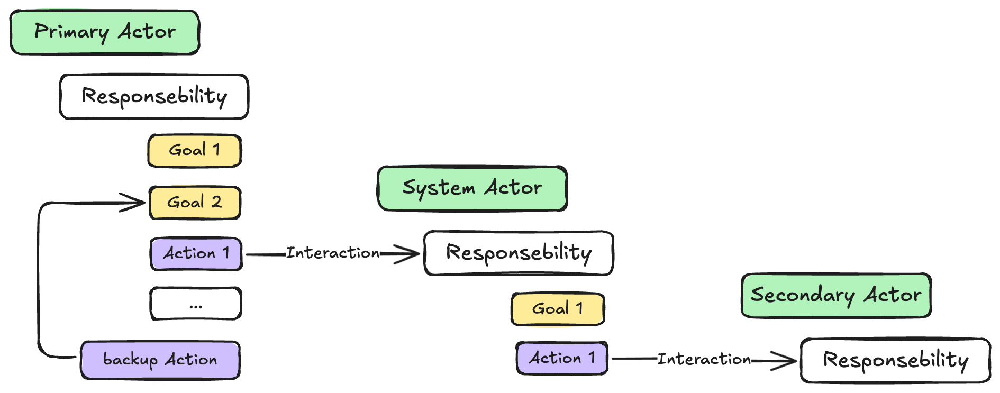
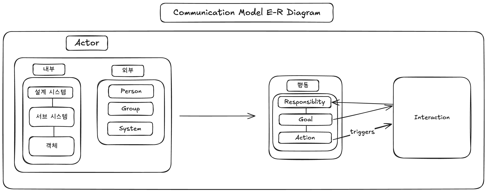
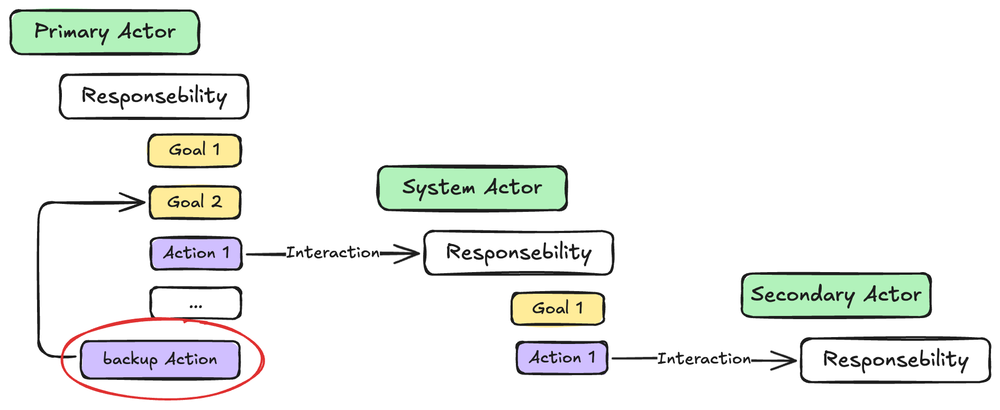
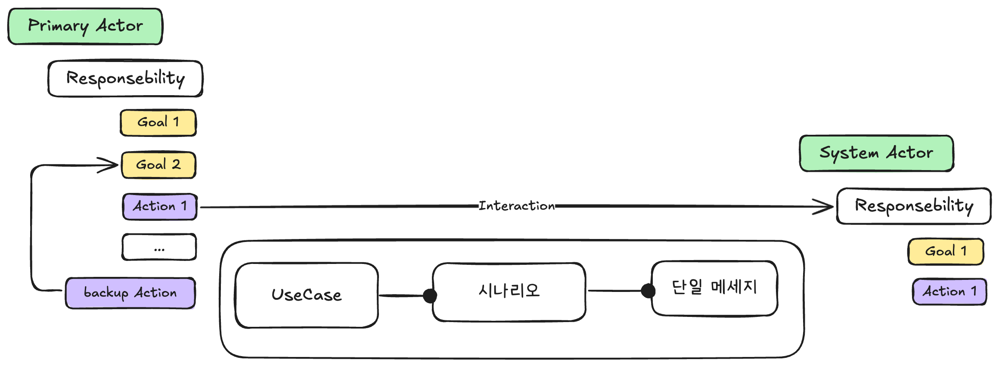
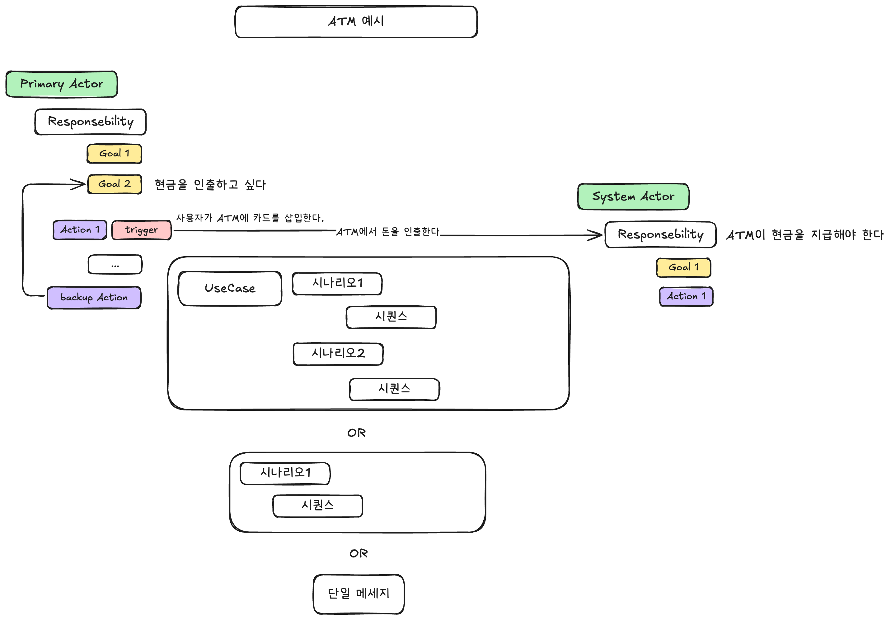
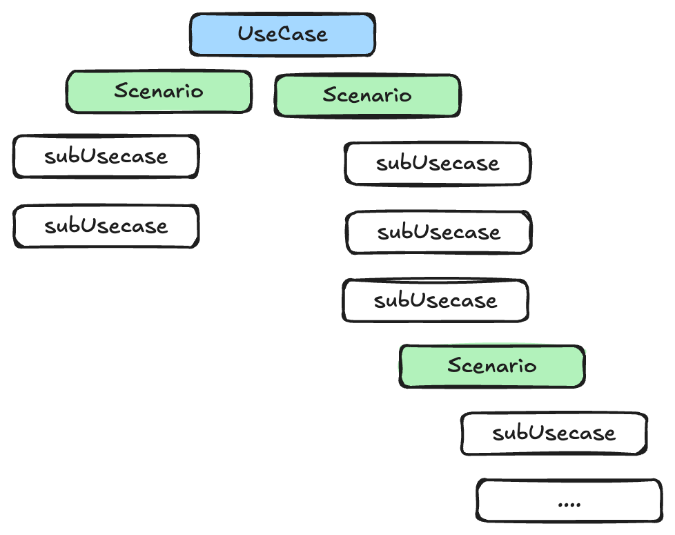
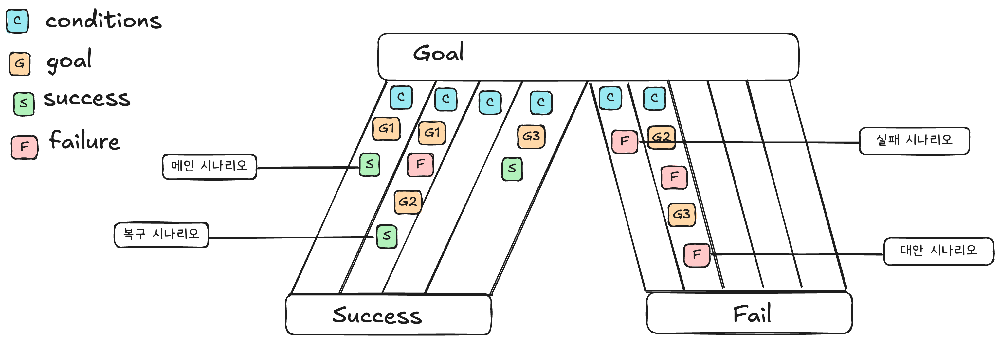

## Use Case 란?

---

정의 : “시스템과 외부 사용자들 간의 상호작용 시나리오들을 특정 목표를 중심으로 모은 것”입니다.

ex : 
- 사용자가 시스템으로 **무엇을 하고 싶은지** (목표)
- 그것을 **어떻게 달성하는지** (시나리오)
- **무엇이 잘못될 수 있는지** (대안 시나리오)
를 체계적으로 정리한 문서입니다.

### 핵심 구성요소

1. **Primary Actor** : 목표를 가진 사용자
2. **Goal** : 액터가 달성하려는 것
3. **Scenarios** : 목표 달성 과정의 여러 경로

### 왜 유스케이스가 필요한가? : 정리되지 않은 요구사항

예전의 요구사항 문서는 이런 식이었습니다:

```
- 사용자는 로그인할 수 있어야 한다
- 시스템은 빨라야 한다
- 관리자는 사용자를 관리할 수 있어야 한다
- 보안이 중요하다
- 사용자는 상품을 구매할 수 있어야 한다
```

이런 나열식 문서의 문제점:
- 🔴 **체계가 없음**: 어디서부터 개발해야 할지 모름
- 🔴 **연결고리 부재**: 기능들 간의 관계가 불명확
- 🔴 **우선순위 불명**: 무엇이 중요한지 알 수 없음

**해결: 목표 중심의 구조화**

유스케이스는 이를 **목표 중심으로 재구성**합니다:

```
목표: "고객이 상품을 구매한다"
├── 시나리오 1: 정상 구매
├── 시나리오 2: 재고 부족 시
├── 시나리오 3: 결제 실패 시
└── 관련 요구사항: 보안, 성능 등
```

## 개발자가 Use Case를 알아야하는 이유

---

### 객체지향 프로그래밍에서 UseCase의 역할과 중요성

**요구사항에서 객체로의 다리**

UseCase는 객체지향 분석(OOA)의 출발점입니다. Robert C. Martin은 Clean Architecture에서 UseCase를 **Application Business Rules의 핵심**으로 정의했습니다. UseCase는 시스템의 "what"을 정의하고, 객체지향 설계는 "how"를 구현하는 관계로, 사용자 요구사항을 객체 구조로 변환하는 체계적 접근법을 제공합니다.

**UseCase 기반 객체지향 설계(UCOOD)**

UCOOD 방법론은 모든 개발 활동이 UseCase를 중심으로 진행되는 **Use Case Driven Development**를 핵심으로 합니다. 이는 요구사항에서 구현까지의 **완전한 추적성**을 제공하며, UseCase 우선순위에 따른 **반복적 개발**을 가능하게 합니다. 특히 대규모 엔터프라이즈 시스템에서 이러한 체계적 접근은 프로젝트 성공의 핵심 요소가 됩니다.

## 문제 1 : 사람마다 다르게 해석된다.

---

Use Case는 사용자가 시스템을 어떻게 사용하는지를 암시합니다. 그러나 사용자의 사용법을 어느정도 구체적으로 정의할지, 어떤 종류까지 정의할지 규칙이 없기 때문에 사람마다 Use Case는 다른 방식으로 정의되었습니다.

실제로 논문에서는 각 전문가, 교사 및 컨설턴트가 제공하는 18가지 이상의 사용 사례 정의가 존재합니다.

### **해결**

18가지 이상의 사례를 분석한 결과 목적, 내용, 다원성, 구조 4가지 차원으로 나뉩니다.

**목적(Purpose)**

- 유스케이스의 **사용자 스토리**를 수집하는 것인가?
- 명확한 **요구사항**을 만드는 것인가?

**내용 (Contents)**

유스케이스의 내용은 일관되어야 하는가, 아니면 자기모순적일 수 있는가?

일관되어야 한다면, 그 내용은 평문(prose)으로 작성되어야 하는가, 아니면 형식적인 표기법(formal notation)을 사용해야 하는가?

- 자기모순적
    
    ```jsx
    사용자는 로그인하지 않고도 주문할 수 있다.
    하지만 주문 전 반드시 로그인을 해야 한다.
    ```
    
- 일관된 평문
    
    ```jsx
    사용자는 로그인 페이지에 접속하여 사용자명과 비밀번호를 입력한다.
    입력이 유효하면 시스템은 홈 화면으로 이동시킨다.
    ```
    
- 형식적 내용
    
    ```jsx
    State: 로그인 대기
    Event: 사용자명/비밀번호 입력
    → Action: 자격 증명 확인
    → State: 로그인 성공 / 실패
    ```
    

**복수성 (Plurality):**

- 유스케이스는 실제로 시나리오의 또 다른 이름에 불과한가?(하나의 시나리오)
- 여러 개의 시나리오를 포함하는가?

**구조 (Structure):**

---

유스케이스의 모음은

- 구조가 전혀 없는가? (비구조적)
    
    → 양식이 없음
    
- 준형식적인가?
    
    → 양식이 존재
    
- 형식적인 구조를 가지는가?
→ 상태(state), 이벤트(event), 액션(action) 등을 **모델링 수준에서 명확히 기술**함

**유스케이스의 목적이 사용자 스토리를 수집하는 것이라면?**

---

→ 자기모순적, 비공식적, 비구조적이어도  유용할 수 있습니다.

- 사용자 스토리의 경우 ‘발견’의 과정이기 때문에 처음부터 완벽한 논리나 구조를 기대할 수 없습니다.
    
    ex) 비공식적이고 자기모순적이지만 유용한 경우
    
    > “저는 이 앱에서 로그인 안 해도 그냥 상품을 보고 싶어요. 근데 어쩔 땐 로그인하면 더 편하긴 하죠. 예전엔 로그인했더니 오히려 더 복잡해졌어요.”
    > 

즉, 유스케이스는 상황에 따라 다양한 형태로 사용할 수 있으며, 총 24가지(3 x 2 x 4) 조합이 가능합니다. 그 모든 조합이 유효하며, **각자가 사용하는 유스케이스가 어떤 조합에 속하는지 명확히 인식할 것**을 권장하고 있습니다.

## 문제 2 : 시나리오와 같은 것으로의 오해.

---

### Use Case의 조건

정의 : 논의 중인 시스템과 외부 행위자들 간에 특정 목표에 관련된 상호작용 시퀀스들의 집합이 되어야합니다.

이 정의를 완전하게 하기 위해 두 가지 추가 조건이 필요합니다.

**조건 1 : Actor**

한 Actor의 목표(goal)를 다른 Actor의 책임(responsibility)과 연결하는 것 

- 행위자(Actors): 사람일 수도 있고, 컴퓨터 시스템일 수도 있습니다.
- 시스템(System): 하나의 단일한 개체로 간주되며, 외부 행위자들과 상호작용합니다.
- 유스케이스: 상호작용의 순서(sequence)들, 그리고 그 변형(variations)에 대해 다룹니다.

**커뮤니케이션 모델**

- 기본 행위자(primary actor): 목표 달성을 위해 시스템의 도움이 필요한 사람 또는 시스템
- 보조 행위자(secondary actor): 시스템이 자신의 책임을 다하기 위해 도움을 받아야 하는 외부 요소



- 각 Actor는 일련의 책임(Responsibilities)을 가지고 있습니다.
- 그 책임을 수행하기 위해 여러 목표(Goals)를 설정합니다.
- 목표를 달성하기 위해서는 행위(Action)를 수행하게 됩니다.

다른 Actor가 그 책임을 이행하면, Primary Actor는 **자신의 목표 달성에 한 걸음 더 가까워지게 됩니다**.



내부 행위자(internal actors), 외부 행위자(external actors)가 존재합니다.

**외부 행위자 :**  **개인, 사람들의 집단 혹은 시스템**일 수 있습니다.

**내부 행위자 :** 현재 설계 중인 시스템, 하위 시스템(subsystem), 또는 객체(object)일 수 있습니다.

설계 중인 시스템 :  **여러 하위 시스템**으로 구성되며, 이들 하위 시스템은 **객체들**로 이루어집니다.

Actor 

- 행동(behavior)을 가지고 있고, 그 최상위 수준의 행동은 책임(responsibility)입니다.
- 책임(Responsibility)은 목표(Goal)를 포함합니다.
- 목표(Goal)는 행위(Action)를 포함합니다.
- 행위(Action)는 상호작용(Interaction)을 유발합니다.
- 상호작용(Interaction)은 한 Actor의 목표가 다른 Actor의 책임을 요구하는 것입니다.

**목표 (Goal)**

목표는 프로그래밍할 때 **당연히 포함되는 요소**이지만, 이를 명시적으로 추적하는 방법론이나 언어는 아직 없습니다.

- 책임 ⇒ 함수의 이름
- 목표 ⇒ ??
- 행동 ⇒ 함수내부 코드

실제 코드로 보기.

- 함수 이름이나 주석에 **책임**을 나타냅니다.
    
    ```jsx
    function calculateTotalPrice(cartItems: Item[]): number {
      // 전체 장바구니 항목의 총 가격을 계산한다.
      return cartItems.reduce((total, item) => total + item.price * item.quantity, 0);
    }
    ```
    
- 주석을 통해 “가장 비용이 적은 경로를 찾아라”와 같은 목표(goal)를 비공식적으로 언급합니다.
    
    ```jsx
    function findShortestPath(graph: Graph, start: Node, end: Node): Path {
      // 최소 비용으로 출발 지점부터 도착 지점까지의 경로를 찾는다.
      // 목표: 전체 노드 중 가장 짧은 경로를 반환한다.
    }
    ```
    
- 그리고는 **해당 목표를 달성하기 위한 행동(action) 코드**를 작성합니다.

실제 우리의 경우 목표를 건너뛴다.

```jsx
// 사용자 정보를 갱신한다.
function updateUser(user: User): void {
  // ... 목표 없음.
  ...code -> 행동
}
```

**🔁 백업 액션(Backup Action)**

만약 두 번째 행위자가 어떤 이유로든 자신의 책임을 다하지 못한다면, Primary Actor는 자신의 목표를 달성할 수 있는 다른 방법을 찾아야 합니다.



프로그래밍에서는 아래와 같습니다.

- 예외 처리 (try-catch)
- 조건문 (if)
- 리턴 값 검사 등

**계층 구조로 이어지는 목표들**

시스템이 호출을 받아 책임을 수행하기 시작하면, 그 과정은 계층적인 목표와 행위의 흐름을 따르게 됩니다.

- 목표(goal) → 하위 목표(sub-goals) → 대체 목표(alternative goals) → 개별 행동(action)

이러한 목표의 다층 구조는, 곧 살펴보게 될 유스케이스 작성에서의 큰 혼란 요인 중 하나가 됩니다.

### 상호작용(Interaction)의 3가지 레벨



**UseCase : 하나의 목표(Goal)를 달성하기 위한 시나리오의 집합.**

설명

- **논의 중인 시스템과 외부 행위자들 간의 가능한 시나리오들의 모음**으로, 주 행위자가 시스템에 기대하는 목표(goal)와 **시스템이 공표한 책임**을 중심으로 구성되며, **그 목표가 어떻게 달성될 수 있는지 또는 실패할 수 있는지를 보여준다.**

Goal : ATM에서 돈을 인출한다

system의 책임 : ATM이 현급을 지급해야 한다.

**시나리오 : 특정 조건에서 일어나는 하나의 시퀀스**

- **시나리오 1:** 정상적으로 인출
    
    시퀀스
    
    1. 카드 삽입
    2. 비밀번호 입력
    3. 금액 입력
    4. 돈 수령
- **시나리오 2:** 잔액 부족
    - 시퀀스…
- **시나리오 3:** 비밀번호 오류
    - 시퀀스…
- **시나리오 4:** 카드 인식 실패
    - 시퀀스…

**단일 메세지 : 가장 단순한 상호작용**

- console.log(value)

### **시나리오, 시퀀스**

- **시나리오**
    
    설명
    
    - 특정 조건 하에서 발생하는 일련의 인터랙션 시퀀스로, **주 행위자의 목표를 달성**하기 위한 것이며, 해당 목표에 대한 특정 결과(성공 혹은 실패)를 가진다.
    - “잔액이 충분할 때” 아래의 시퀀스가 일어남
    (즉, 시나리오는 조건 + 시퀀스)
- **시퀀스**
    1. 카드 삽입 → 2. 비밀번호 입력 → 3. 금액 입력 → 4. 돈 인출
- 시퀀스 인터랙션
    
    인터랙션은 트리거 액션(triggering action)에서 시작하여, **목표가 달성되거나 포기될 때**, 그리고 시스템이 해당 인터랙션에 대해 수행해야 할 **책임을 완료했을 때** 종료된다.
    
- **트리거(Trigger)란?**
    
    **정의:**
    트리거는 시스템과 액터(사용자, 다른 시스템 등) 사이의 상호작용이 시작되는
    “특정한 사건” 또는 “행위(Action)”을 의미합니다.
    
    **역할:**
    트리거가 발생하면, 그에 따라 시나리오(또는 Use Case)가 실행되기 시작합니다.
    



**왜 이렇게 구조화할까?**

- 현실 세계의 시스템은 한 가지 상황만 있는 게 아니라, 다양한 조건과 결과가 있습니다.
- 각각의 시퀀스(시나리오)를 모아 하나의 UseCase로 묶으면, 시스템이 외부와 어떻게 상호작용하는지 전체적으로 파악할 수 있습니다.

## 시나리오나 유스케이스 작성을 언제 멈춰야 하는가?

시나리오(scenario)와 유스케이스(use case)는 **목표가 달성되거나 실패할때까지** 이어집니다.

시나리오나 유스케이스 작성을 언제 멈춰야 하는가?를 알기 위해서는, 두 가지 조건을 **명확히 명시해야 합니다**.

→ 이 두 조건은 유스케이스와 시나리오 모두에 동일하게 적용됩니다.

### **조건 1. 모든 상호작용은 동일한 목표와 관련이 있다.**

- **설명:**
한 시나리오(또는 UseCase) 안에 포함된 모든 단계(상호작용)는
반드시 “하나의 목표(Goal)”를 달성하기 위한 과정이어야 합니다.
- **예시:**
[현금을 인출한다] 라는 목표가 있다면,
카드 삽입, 비밀번호 입력, 금액 입력, 돈 수령 등
모든 단계가 현금 인출이라는 하나의 목표를 향해 진행되어야 합니다.
- **의미:**
만약 중간에 목표가 바뀐다면, 그 부분부터는 새로운 시나리오나 UseCase로 분리해야 합니다.

### **조건 2. 상호작용은 트리거 이벤트에서 시작하여, 목표가 달성되거나 포기될 때, 그리고 시스템이 그 상호작용과 관련된 책임을 모두 마쳤을 때 끝난다.**

- **설명:**
시나리오(또는 UseCase)는 “트리거”에서 시작해서 목표가 달성되거나(성공), 실패할때까지 이어집니다.
그리고 시스템이 그 상호작용과 관련된 모든 책임(예: 기록 남기기, 자원 해제 등)을 완전히 마쳤을 때 비로소 끝납니다.
- **예시:**
    - ATM에서 돈을 인출할 때,
        - 트리거: 사용자가 카드를 삽입함
        - 목표 달성: 돈을 받음
        - 목표 포기: 잔액 부족 등으로 인출 실패
        - 시스템 책임: 거래 내역 기록, 카드 반환 등
        
        이 모든 과정이 끝나야 시나리오가 종료됩니다.
        

단순히 목표 달성/실패로 끝나는 게 아니라, 시스템이 그 상호작용에 대해 해야 할 모든 후처리(책임)까지 마쳐야 시나리오가 완전히 끝난다는 뜻입니다.

### **정리 :**

- 조건 1: “하나의 목표”에 집중
- 조건 2: “트리거부터 목표 달성/실패, 그리고 시스템의 책임 완료”까지가 한 시나리오/UseCase 의 범위

## UseCase와 시나리오

**UseCase의 주요 정보**

1. 주 액터(들)
2. 목표
3. 사용된 시나리오들

**시나리오의 주요 정보:**

1. 주 액터
2. 목표
3. 시나리오가 발생하는 조건(trigger)
4. 시나리오 결과(목표 달성 또는 실패)

시나리오들은 만나는 조건에 따라 구분되고, 동일한 목표를 가지는 것끼리 묶입니다. 그리고 시퀀스들의 집합이 바로 시스템의 동작을 구성합니다.

**시나리오 예시**

시스템: 보험회사

주 액터: 나(청구인)

목표: 내 자동차 사고에 대한 보상을 받는다

조건: 모든 것이 정상임

결과: 보험회사가 청구를 지급함

1. 청구인이 증빙 자료와 함께 청구서를 제출한다.
2. 보험회사가 청구인이 유효한 보험에 가입되어 있는지 확인한다
(여기서 실패하면 목표 실패일 가능성이 높음)
3. 보험회사가 사건을 조사할 담당자를 지정한다.
4. 담당자가 모든 세부사항이 보험 약관 내에 있는지 확인한다
(담당자와 2차 액터 간의 상호작용)
5. 보험회사가 청구인에게 보상금을 지급한다
(이전 모든 목표가 성공적으로 달성되었음을 의미)

위와 같은 사용 사례와 시나리오의 구성은, 사용 사례와 시나리오의 차이, 무엇을 포함하고 제외해야 하는지, 언제 시작하고 끝내야 하는지에 대한 혼란을 해결해줍니다.

## **문제 3: 시나리오 폭발을 어떻게 제어할 것인가?**

수십 년간 시나리오 작업을 해온 많은 사람들이 시나리오 폭발에 대해 걱정해왔습니다. 시나리오 폭발은 세 가지 기법으로 방지할 수 있습니다: 하위 UseCase, 확장 그리고 변형입니다. 하위 사용 사례와 확장에 대해서는 아래에서 자세히 다룹니다.

### 변형

입력이나 출력 방식 등, 상황에 따라 달라질 수 있는 선택지를 정리해두는 것입니다.

예시 : ATM에서 돈을 인출할 때:

- **입력 방식의 변형:**
    - 현금카드
    - 모바일 인증
    - 생체 인식
- **출력(지급) 방식의 변형:**
    - 현금
    - 계좌이체
    - 포인트 적립

왜 필요한가?

- 모든 경우를 각각의 시나리오로 만들면 너무 복잡해지기 때문에, “이 부분은 나중에 여러 방식으로 구현될 수 있다”는 점만 간단히 변형(Variation) 항목으로 정리해두는 것입니다.

### 하위 UseCase

큰 목표(Use Case)를 달성하는 과정에서 “특정 단계”를 별도의 작은 UseCase 만들어 재사용하거나, 복잡한 과정을 단순하게 표현하는 방법입니다.

예시

상위 UseCase:

- “ATM에서 돈을 인출한다”

하위 UseCase:

- “사용자 인증을 한다”
- “계좌 잔액을 확인한다”
- “현금을 지급한다”

ATM에서 돈을 인출하는 과정에서

- “사용자 인증”이라는 단계가 여러 곳에서 반복된다면,
이 과정을 별도의 하위 UseCase로 만들어
여러 상위 UseCase에서 재사용할 수 있습니다.

왜 하위 UseCase를 사용할까?

- 복잡한 과정을 쪼개서 관리하기 쉽도록
- 여러 곳에서 반복되는 과정을 재사용하기 위해
- 각 단계별로 책임과 목표를 명확히 하기 위해

UseCase 예시

(시스템: 보험회사)

주 액터: 청구인

목표: 자동차 사고에 대한 보상 받기

1. 청구인이 증빙 자료와 함께 청구서를 제출한다.
2. 보험회사가 청구인이 유효한 보험에 가입되어 있는지 확인한다.
3. 보험회사가 사건을 조사할 담당자를 지정한다.
4. 담당자가 모든 세부사항이 보험 약관 내에 있는지 확인한다.
5. 보험회사가 청구인에게 보상금을 지급한다.

### 확장

시나리오의 각 단계는 “정상적으로 잘 될 것”이라고 가정해서 간단하게 쓰고, 실패나 예외는 따로 분리해서 다룹니다.

**설명**

- 시나리오(절차)를 쓸 때, 각 단계(예: “보험 약관 내에 있는지 확인한다”)는**일단 성공한다고 가정**하고,
가장 단순하고 자연스러운 흐름만 적습니다.
- 만약 그 단계에서 실패(예: “약관 위반”)가 생길 수 있다면, 실패 상황은 별도의 시나리오나 “확장 시나리오”로 따로 정리합니다.
- 이렇게 하면
    - 메인 시나리오는 읽고 쓰기 쉽고,
    - 예외나 대안 경로는 따로 관리할 수 있어
    - 복잡한 상황도 깔끔하게 정리할 수 있습니다.

예시

- **메인 시나리오: 해피케이스**
    1. 청구서 제출 → 2. 보험 확인(성공) → 3. 담당자 지정 → 4. 약관 확인(성공) → 5. 보상 지급
- **확장 시나리오: 실패&예외**
    1. 2번에서 보험이 없으면? → “청구 거절” 시나리오
    2. 4번에서 약관 위반이면? → “협상” 또는 “거절” 시나리오

### **정리:**

- 하위 Use Case: 복잡한 단계 분리/재사용
- 확장: 예외/대안 경로 분리
- 변형: 다양한 선택지 목록화
→ 이 세 가지가 시나리오 폭발(너무 많은 시나리오 발생)을 효과적으로 제어합니다.

### **UseCase와 시나리오는 재귀적 구조를 가진다.**

시나리오의 각 단꼐는 하위 UseCase가 될 수 있습니다.

특정 단계의 실패가 전체 UseCase의 실패로 이어지지는 않습니다.



핵심은  상위 UseCase → 여러 시나리오 → 각 하위 UseCase가 될 수 있고 이 구조가 반복적(재귀적)으로 쌓여, 복잡한 시스템도 체계적으로 표현할 수 있다는 것입니다. (Tree형태처럼)

### 하나의 목표중심의 여러 시나리오 - 줄무늬 바지 비유.



원본 출처 : https://atlas-project-tdaq-awg.web.cern.ch/Documents/StructuringUseCasesWithGoals.pdf

하나의 목표를 중심으로. 여러 시나리오가 [줄무늬]처럼 나란히 존재함을 보여줍니다.

바지의 허리띠: 목표(Goal)

각 줄무늬: 하나의 시나리오(Scenario)

- 왼쪽 줄무늬: 메인 시나리오(모든 것이 정상적으로 진행)
- 오른쪽 줄무늬들: 대안 시나리오(실패, 예외, 복구 등)
    - 복구 시나리오 : 성공으로 갈 수 있음.
    - 실패 시나리오 : 목표 포기.
    - 대안 시나리오 : 복구 + 실패

그림을 보면 왼쪽 줄무늬 + 복구 시나리오의 경우 Success Leg(성공 다리)에 속합니다.

### 시나리오 체인 : 시나리오가 세분화될수록 조건이 더 구체적이고 엄격해집니다.

**하위 UseCase 캡슐화**

상위 시나리오에서의 조건은 상위에서 관리하고

하위 UseCase의 시나리오에서는 내부적으로만 알고있는 의미의 새로운 조건들이 추가됩니다.

**하위 UseCase의 단순화**

하위 UseCase의 시나리오에서 내부적으로 조건을 추가 + 재귀적 기법으로 인해 시나리오는 단순화됩니다.

(tree 구조로 간다면 성공 or 실패 기준으로 분기처리하기 때문에 단순화)

이로서 시나리오 폭발이 방지 됩니다.

ex)

상위 시나리오 : 고객이 ATM에서 돈을 인출한다 — 어떤 고객이든, 어떤 상황이든 포함

하위 시나리오 : 잔액이 충분할 때”, “비밀번호가 3회 이상 틀렸을 때, …

참고

- 여러 하위 UseCase에서 공통적으로 쓰이는 하위 UseCase 라면, 상위 UseCase에서 언급된 조건 중 일부는 무시될 수도 있습니다.
- 액터(사용자)는 시나리오가 시작될 때 어떤 조건(어떤 경로로 진행될지)이 적용되는지 모르는 경우가 많습니다. 예를 들어, 은행 인출 시나리오에서 “잔액 부족”은 조건이지만, 사용자가 ATM에 다가갈 때는 자신이 잔액 부족 시나리오에 해당하는지 모릅니다. 하지만 실제로는 그 조건에 따라 해당 시나리오가 실행됩니다.

**정리**

재귀적 구조 : 계속 쪼갤 수 있는 계층 구조가 가능하다.

줄무늬 바지 : 여러 시나리오가 한 목표 아래 나란히 존재한다.

시나리오 체인 : 시나리오의 세분화, Tree 구조.

## 문제4 : UseCase와 시나리오가 여러 수준로 나뉘어 혼란이 생길 수 있다.

### **3가지 수준**

1. 시스템의 범위(경계)
    
    UseCase가 어디까지를 다루는지, 즉 시스템의 외부와 내부의 경계가 어디인지 정하는 것입니다.
    
    예를 들어, “ATM 시스템”이 경계라면, ATM이 처리하는 모든 기능이 이 범위에 포함됩니다.
    
    더 큰 범위(회사 전체, 조직 전체)에서 보면, 같은 목표가 더 넓은 맥락에서 다시 등장할 수 있습니다.
    
2. 목표의 구체성
    
    목표가 얼마나 큰지, 또는 얼마나 세부적인지에 따라 레벨이 나뉩니다.
    
    - 가장 상위 레벨 : 예를 들어, “고객이 상품을 구매한다”는 회사 전체의 전략적 목표
    - 중간 레벨 : “ATM에서 돈을 인출한다”는 시스템 수준의 사용자 목표
    - 하위(세부) 레벨 : “계좌 객체가 잔액을 확인한다”는 하위 기능
    
    목표가 상위에서 하위로 내려갈수록, 더 구체적이고 세분화됩니다.
    
3. 상호작용의 세부사항
    
    사용 사례를 얼마나 구체적으로 쓸지에 대한 레벨.
    
    - “주소를 입력한다”처럼 의미만 적을 수도 있고, “각 필드를 탭으로 이동한다”처럼 실제 UI 동작까지 상세히 적을 수도 있습니다.
    - 일반적인 패턴은 요구사항 단계에서는 의미 중심(semantic interface)으로, UI 설계 단계에서는 대화 중심(dialog interface)으로 작성하는 것입니다.
    

### **이렇게 레벨을 나누는 이유와 예시.**

실제 프로젝트에서는, 같은 시스템이라도 여러 레벨의 사용 사례가 필요함.

- 예를 들어, “고객이 상품을 구매한다”는 회사 전체의 전략적 목표로, 경영진이 읽고 검토함.
- “ATM에서 돈을 인출한다”는 시스템 개발자나 설계자가 읽고 구현함.
- “계좌 객체가 잔액을 확인한다”는 개발자가 실제로 코드를 짤 때 참고함.
- 각 레벨별로 누가 읽어야 하는지, 어떤 목표를 달성해야 하는지, 시스템이 조직에 어떤 기여를 하는지 명확히 할 수 있음.


### 세분화 차원의 세부사항(goal detail)

**사용자 목표(user goal)**

*사용자 작업 or 기본 비즈니스 프로세스 라고도함*

가장 중요한 레벨입니다. 이는 Primary Actor가 실제로 업무를 처리하려고 하는 목표에 해당합니다.

사용자 목표는 “오늘 이걸 몇 번 했는지가 당신의 업무 성과에 영향을 주나요?”라는 질문에 답할 수 있어야 한다. 

예시)

- 로그인은 사용자 목표인가? → 로그인만 43번 해도 업무 성과는 없으므로 아니다.
- 신규 고객 등록은 사용자 목표인가? → 신규고객 43명을 등록했다면 성과가 있다.

→ 사용자 목표는 트랜잭션과 자주 일치 한다는 것을 알 수 있다.

….블로그에서 계속
