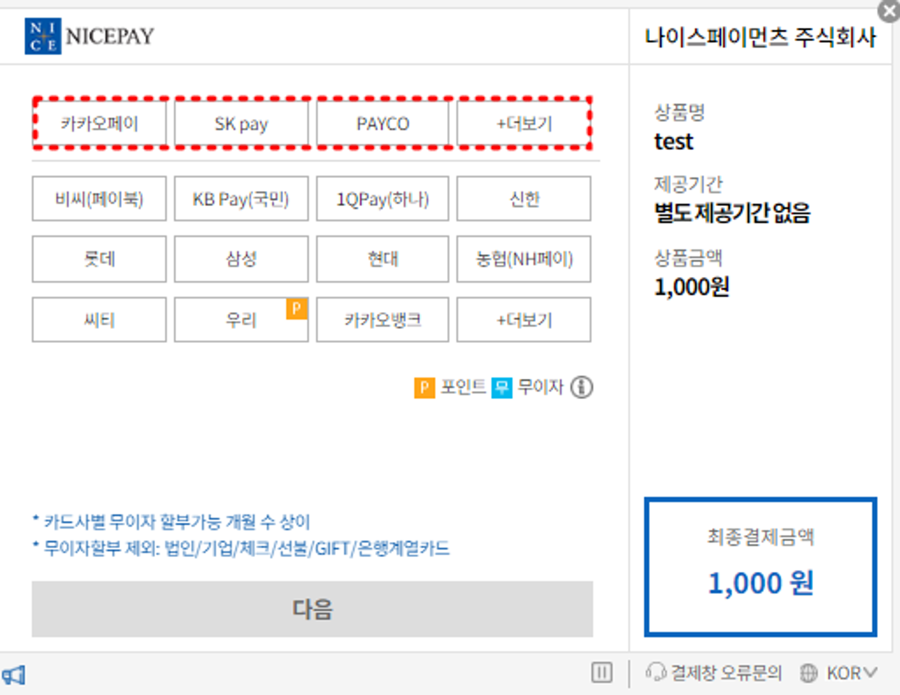

# 결제에서 쿠키 의존도가 높은 경우 생기는 이슈

# 개요

안드로이드 인스타그램 광고를 클릭 후 자사의 사이트에 접속했을 경우 결제가 되지 않는 문제가 발생하였습니다. 문제를 해결하기 위해 외부 브라우저 이동, middleware 캐싱, Url Query Parameter 사용과 같은 여러가지 방안을 모색하였고 최종적으로 cookie 정책으로 인한 원인으로 파악하여 이슈를 해결하였습니다.

해당 내용은 발견된 문제와 cookie 정책의 연관성, cookie 정책으로 인해 발생한 현상, 해결에 대한 내용입니다.

# 내용

**기존의 동작**

1. 네이버, 카카오, 국민카드 등등 나이스페이먼츠를 통해 결제합니다.
2. 결제 후 서버와 클라이언트의 중간서버인  `middleware` 에 도착합니다.
3. `middleware`에서는 로그인 정보(Cookie)를 확인 후 로그인 정보가 있다면 결제 승인 페이지 url과 결제정보(Header)를 NextJS 서버에 보낸 후 해당 페이지가 클라이언트에 출력됩니다.
4. 로그인 정보(Cookie)가 없다면 로그인 페이지 url을 NextJS 서버에 보낸 후 해당 페이지가 클라이언트에 출력됩니다.

 

**문제의 동작**

- 인스타그램 > 광고 클릭(인스타그램 인앱 브라우저) > 인앱 브라우저로 접속한 웹에서 결제 진행 > 결제가 되지 않고 로그인 페이지 출력.
  
 

>💡 **In App Browser**
>앱 내부에서 띄워주는 브라우저입니다. 
>안드로이드 앱의 경우 webview chrome 브라우저를,  IOS의 경우 webkit 브라우저를 사용합니다.
>일반 webview와는 다르게 쿠키는 기본 브라우저와 공유합니다.

 

**동작 중 예외 사항**

- PC에서는 문제가 일어나지 않습니다.
- IOS에서는 문제가 일어나지 않습니다.
- 간헐적으로 안드로이드 결제가 성공합니다.

 

### 문제 분석

결론부터 말하자면 브라우저 Cookie 정책의 문제입니다.

이번 이슈와 관련된 쿠키 정책과 위에서 말한 동작 중 예외 사항과 쿠키의 관련성은 다음과 같습니다.

**이번 이슈와 관련된 쿠키 정책**

 

**chrome**

---

SameSite 옵션을 따로 설정하지 않은 경우`SameSite='Lax'` 로 자동 설정이 됩니다.

| **상황** | **SameSite=None** | **SameSite=Lax** | **SameSite=Strict** |
| --- | --- | --- | --- |
| **사용자가 링크를 클릭하여 이동** | O | O | X |
| **GET 폼 서브미션** | O | O | X |
| **POST 폼 서브미션** | O | X | X |
| **AJAX 요청 (XHR, fetch)** | O | O | X |
| **이미지, iframe 등 포함된 요청** | O | X | X |
| **리디렉션 요청** | O | X | X |
| **동일 사이트 내 모든 요청** | O | O | O |

출처 : 

- [https://developer.mozilla.org/en-US/docs/Web/HTTP/Headers/Set-Cookie#samesitesamesite-value](https://developer.mozilla.org/en-US/docs/Web/HTTP/Headers/Set-Cookie#samesitesamesite-value)
- [https://web.dev/articles/samesite-cookies-explained?hl=ko#samesitelax_by_default](https://web.dev/articles/samesite-cookies-explained?hl=ko)

 

**webkit**

---

webkit의 경우 **Intelligent Tracking Prevention (ITP)** 라는 정책이 존재합니다.

해당 정책아래에는 이러한 내용이 존재합니다.

[**Actions Taken After Classification**](https://webkit.org/blog/7675/intelligent-tracking-prevention/)

- 사이트1, 사이트2가 있습니다.
- 사이트1을 최근 24시간 이내에 접속하였고 상호작용을 하였다는 기록이 있습니다.
- 사이트2에서 사이트1로 접속할 경우 24시간내에 접속하였다면 cookie접근을 허용합니다.

 

**동작 중 예외 사항과 쿠키의 관련성**

- **PC에서는 문제가 일어나지 않는 이유**
    
    ---
    
    PC에서 결제를 할 경우 나이스 페이먼츠의 모달창이 생깁니다. 이러한 경우는 크롬의 쿠키 정책에서 동일 사이트 내 모든 요청에 해당하므로 문제없이 쿠키가 전달됩니다.
    
    
    
    모바일 화면의 경우 ‘자사 사이트 ⇒ 나이스페이먼츠 ⇒ 자사 사이트’ 이런 방식으로 페이지를 이동합니다.. 그러므로 동일 사이트 내 모든 요청에 해당하지 않습니다.
    
- **IOS에서는 문제가 일어나지 않는 이유**
    
    ---
    
    위에서 설명한 webkit의 정책 중 Intelligent Tracking Prevention (ITP)에 해당하기 때문입니다.
    
    ITP의 경우 이전에 24시간 이내에 접속하여 상호작용을 했다면 쿠키를 받는다는 내용입니다.
    
    - 결제 이전에 이미 접속하여 상호작용하였기 때문에 문제가 없습니다.

- **간헐적으로 안드로이드 결제가 실패하는 이유**
    
    ---
    
    크롬의 SameSite 정책을 다시한번 살펴보면
    
    | **상황** | **SameSite=None** | **SameSite=Lax** | **SameSite=Strict** |
    | --- | --- | --- | --- |
    | **사용자가 링크를 클릭하여 이동** | O | O | X |
    | **GET 폼 서브미션** | O | O | X |
    | **POST 폼 서브미션** | O | X | X |
    | **AJAX 요청 (XHR, fetch)** | O | O | X |
    | **이미지, iframe 등 포함된 요청** | O | X | X |
    | **리디렉션 요청** | O | X | X |
    | **동일 사이트 내 모든 요청** | O | O | O |
    
    기존의 경우 SameSite 옵션을 따로 설정하지 않았으므로 Lax입니다. 
    
    Lax의 경우 
    
    - <form method=”POST”>
    - 리디렉션 요청
    
    위의 두가지 경우에서 쿠키를 전송하지 않는다는 것을 볼 수 있습니다.
    
    안드로이드에서 간헐적으로 결제가 안되는 문제는 나이스 페이먼츠의 네이버, 카카오, 은행사에서 form GET을 사용하는 곳과 form POST를 사용하는 곳이 섞여있기 때문입니다.
    

### 문제 해결

**해결 방법**

---

accessToken, refreshToken의 SameSite 속성을 None으로 변경하였습니다.

**None의 보안 문제**

- 현재 사용하는 토큰에 유저의 개인정보가 담겨있지 않기 때문에 보안상 문제없는 것으로 확인했습니다.

**추후 개선 방향**

---

1. 프론트에서 결제승인을 하는 방식을 변경합니다.
2. sameSite=’None’은 서드파티 쿠키를 무조건 허용하기 때문에 보안상 좋을 수는 없습니다. 구글에서도 서드 파티 쿠키 종료를 준비한다는 공지가 2023년 10월에 게시되었고 저희도 같이 준비할 필요가 있습니다. 구글에서 서드 파티 쿠키 종료를 준비하는 방법중 4가지 솔루션을 제안합니다.
    1. Cookies Having Independent Partitioned State (CHIPS)
    2. Storage Access API
    3. 관련 웹사이트 세트 (RWS)
    4. Federated Credential Management API 
    
    해당 방법들 중 1,4번을 MDN에서 찾아보면 실험적 기술로 아직 운영에 사용할 수는 없는 기술들 입니다. 그러니 당장 사용보다는 숙지해두고 구글의 업데이트 방향을 지켜보는 편이 좋을 것 같습니다.
    
    출처 : https://developers.google.com/privacy-sandbox/blog/cookie-countdown-2023oct?hl=ko
