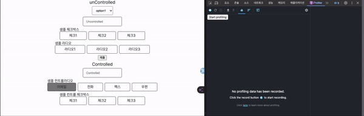

# React는 Uncontrolled Component를 어떻게 받아들일까?

## 배경

React에서는 controlled component 방식과 uncontrolled component라는 방식이 존재합니다. 이 방식은 단어와 같이 React에서 컨트롤하는 것인가 아니면 DOM의 기본 기능을 사용하는 것인가의 차이입니다. 이 포스팅의 목적은 uncontrolled 컴포넌트가 React에서 어떻게 렌더링 되고 어떨 때 사용하면 좋을까?에 대한 궁금증으로 시작하였습니다.

### React Controlled? Uncontrolled?

간단하게 생각해 보면

- uncontrolled 방식은 React 상태가 변경되지 않아서 실시간으로 데이터를 추적하지 않고 submit에서 모든 결과를 출력하는 경우에 좋다고 생각이 듭니다.
- controlled의 경우는 text를 예로 들면 한 번의 입력이 생길 경우 한 번의 상태 변경 렌더링이 발생하며 text 변경을 감시해야 할 경우 유용할 것 같습니다.

그러나 자세히 들여다보면 이야기 달라집니다. React는 DOM의 렌더링을 줄이기 위해 렌더링 세분화를 한 것입니다. 그럼 uncontrolled의 경우 리액트 렌더링이 안 일어나는 것일 뿐이지. DOM 렌더링은 일어나는 것으로 오히려 렌더링 세분화, 즉 재조정 과정에서 제외되어 더 성능이 나빠질 것이라는 생각이 듭니다.

## 비교를 위한 실제 사용

### Uncontrolled

**Form**

```jsx
<submit onSubmit={formActionHandler}>
  <Text placeholder="Uncontrolled" ref={textInput} />
</submit>
```

**Handler**

```jsx
const formActionHandler = (e: React.FormEvent<HTMLFormElement>) => {
  e.preventDefault();
  console.log("uncontrolled : " + textInput.current.value);
};
```

**실제 동작**


- text 입력 시 렌더링은 일어나지 않습니다.

**우려했던 문제**

- React의 데이터 추적 문제 : useRef를 사용하여 해결 가능합니다.

<aside>
💡 **useRef를 꼭 사용해야할까? (요약 : 사용해야한다!)**

**신뢰성**

html에서 요소를 가져올 경우 `querySelector` 혹은 `documentGetById`를 사용하게 되는데 이는 d를 사용하여 요소를 가져오게됩니다. 이것의 문제는 id가 유일해야한다는 점입니다. id는 전역적으로 사용되기 때문에 웹 어플리케이션의 크기가 커질 경우 id의 관리가 어려워지고 결과적으로 웹의 신뢰도 하락의 원인이 됩니다.

반면 Ref의 경우 컴포넌트 내부에서만 작동하여 관리가 수월합니다.

**정확성**

useRef는 렌더링을 발생시키지는 않지만 React의 라이프사이클 Commit 구간에서 설정됩니다. 그래서 useEffect로 ref의 추적이 가능합니다. 즉 React의 라이프 사이클과 함께 동작하기 때문에 사이드이펙트가 적어질 것입니다.

반면에 DOM을 직접 조작할 경우 React의 상태 관리 외부에서 동작하기 때문에 사이드 이펙트가 발생할 확률이 높아집니다.

**변수로도 사용하던데 굳이? (요약 : 굳이 써야 한다!)**

let과 별반 다르지 않을까 생각할 수 있는데, let은 컴포넌트가 리렌더링될 때마다 값이 초기화됩니다. 그러나 useRef는 컴포넌트의 라이프 사이클과 함께 동작하기 때문에 값이 유지됩니다.

**_주의_**

React는 렌더링 구간에서 ref를 조작하면 안 된다고 경고합니다. ref.current의 변경 시점을 알지 못하기 때문에 렌더링 중 조작하더라도 동작을 예측하기 어렵기 때문입니다.

</aside>

### Controlled

**TextInput**

```jsx
<Text placeholder="Controlled" value={text} onChangeHandler={onChangeText} />
```

**Handler**

```jsx
const onChangeText = (e: React.ChangeEvent<HTMLInputElement>) => {
  setText(e.target.value);
  console.log("controlled : ", text);
};
```

**실제 동작**



- 우리가 아는 동작 그대로 한 글자를 입력할 때마다 한 번의 렌더링을 합니다.

### 성능의 차이가 있을까?

### uncontrolled


### controlled


- controlled가 매번 렌더링을 하는 만큼 성능 면에서는 uncontrolled가 더 유리해 보입니다. 상황에 따라 uncontrolled를 적절히 사용한다면 성능의 이점을 볼 수 있을 것 같습니다.

## 최선의 방법은?

uncontrolled 방식이 성능 면에서 조금 더 좋지만 UX 면에서는 좋지 않습니다. 회원가입을 예로 들면 유저가 확인 버튼을 누르기 전까지는 유효성 검사 정보를 보여줄 수 없는 경험을 줄 수 있기 때문입니다. 그래서 주로 controlled 방식을 사용하게 될 것이라고 예상합니다. 예를 들면 input 값을 입력하는 도중에 유저에게 입력값에 대한 정보를 보여주는 것이 UX 적으로 좋기 때문입니다. 그렇다면 controlled 방식을 최적화하는 방법은 무엇이 있을까요?

### Controlled 최적화

**debounce 사용**

- lodash-es 혹은 setTimeout을 사용하여 150~100ms에 한 번씩 텍스트를 모아서 입력해 주는 것입니다.

```jsx
function debounce() {
  if (timeoutId.current) return;
  timeoutId.current = setTimeout(() => {
    setText(debounceText.current);
    clearTimeout(timeoutId.current);
    timeoutId.current = null;
  }, 100);
}
const onChangeText = (e: React.ChangeEvent<HTMLInputElement>) => {
  debounceText.current = e.target.value;
  debounce();
};
```

- 직접 만들어 보았지만 너무 느리게 느껴지고 가끔 글자를 씹는 현상도 생깁니다. (제가 못 만들어서)
- setTimeout을 100ms로 설정하더라도 여러 번 연속 사용할 경우 100ms보다 조금 더 길어지는 이슈가 있어서 신뢰도가 떨어지는 문제가 있습니다.

**memoization 사용**

- useCallback과 useMemo, React.memo를 사용하여 리렌더링을 방지하는 방법입니다.
- 이 방식의 어려운 점은 컴포넌트의 구조에 있습니다. 어느 정도 미리 계획하고 설계하지 않으면 memoization은 꿈도 못 꾸기 때문에 React 디자인 패턴과 렌더링 방식에 대한 이해가 필요합니다.

**react-hook-form 라이브러리 사용**

- 이 라이브러리는 이미 성능 개선을 위해 Form 입력과 컴포넌트의 렌더링 분리를 해놓았습니다.
- 유효성 검사를 직접 하지 않아도 되고 unControlled 기반이라는 특징이 있습니다.
- 해당 라이브러리 자료는 추후에 따로 올릴 예정입니다.

## 결론

unControlled보다 controlled를 사용할 경우가 많기 때문에 controlled를 최적화하는 것이 중요합니다.

최적화하는 방법 중에는 debounce를 사용하거나 memoization을 상용해서 최대한 렌더링이 덜 생기도록 할 수 있습니다. 그러나 직접 모두 작업한다면 시간과 노력이 들고 사이드이펙트가 발생할 확률이 높습니다. 이러한 부분을 이미 만들어진 react-hook-form 라이브러리를 사용한다면 비교적 쉽게 해결할 수 있을 듯합니다.

출처 :

ref 모범 사례

[https://react-ko.dev/learn/referencing-values-with-refs#when-to-use-refs](https://react-ko.dev/learn/referencing-values-with-refs#when-to-use-refs)

[React] ref란? (feat. DOM API를 사용하면 안되는 이유)

[https://headwing.tistory.com/53](https://headwing.tistory.com/53)

React useRef 사용하기

[https://jiiiihong.space/entry/useRef-란](https://jiiiihong.space/entry/useRef-%EB%9E%80)

**React Uncontrolled & Controlled Component, 프로처럼 사용하기**

[https://blog.leaphop.co.kr/blogs/33](https://blog.leaphop.co.kr/blogs/33)

**Controlled and uncontrolled form inputs in React don't have to be complicated**

[https://goshacmd.com/controlled-vs-uncontrolled-inputs-react/](https://goshacmd.com/controlled-vs-uncontrolled-inputs-react/)
