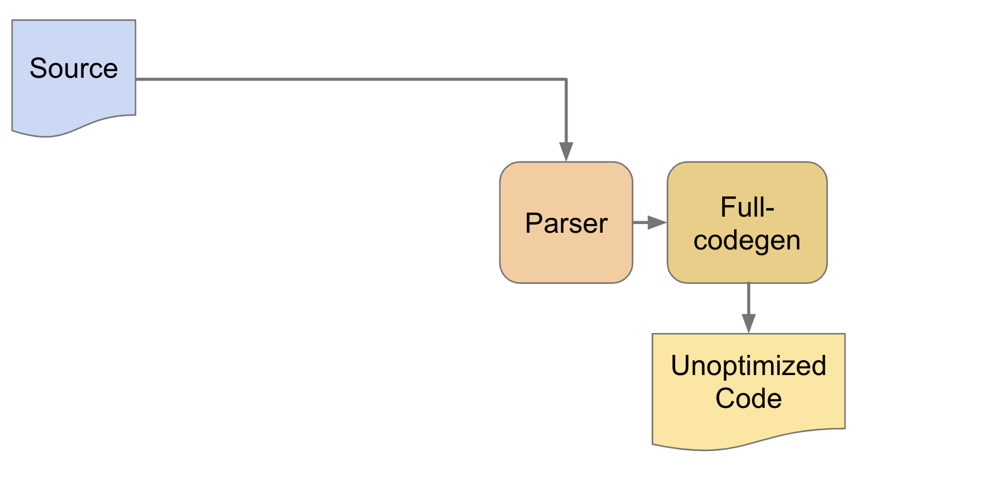
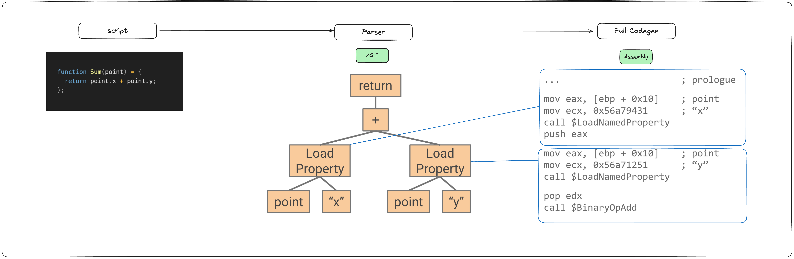

## 서론

자바스크립트는 인터프리터 언어라고 불립니다. 가장 처음 넷스케이프에서 JS를 실행한 엔진이 SpiderMonkey였고 이것이 인터프리터로 동작했기 때문입니다. 그때는 1995년이었고 13년뒤 크롬과 함께 V8엔진이 등장합니다. V8엔진은 2008~2015 7년동안 인터프리터 언어라는 이름속에 컴파일러를 탑재하고 있었습니다. 

JIT-Compiler에 대해 모르신다면 link

## Full-Codegen 등장



출처 : https://docs.google.com/presentation/d/1HgDDXBYqCJNasBKBDf9szap1j4q4wnSHhOYpaNy5mHU/edit#slide=id.g1453eb7f19_0_328

### Full-Codegen?

AST를 순회 후 빠르게 기계어로 변환하는 방식의 Fast JIT-Compiler입니다. 인라인 캐싱을 이용하여 간단한 캐싱도 제공합니다.

간단한 Sum함수를 통해 예를 들어보겠습니다.

```jsx
function Sum(point) = {
  return point.x + point.y;
};
```

### **AST 순회**

- Sum함수는 Parser를 통해 AST로 변환됩니다.


### **Full Codegen**

- full codegen은 AST를 순회하여 Assembly어로 변환합니다.



full codegen의 대표적인 캐싱 기능 두가지가 존재합니다.

- hidden class
- inline cache

### **Hidden Class**

Hidden Class라는 개념이 왜 필요할까?

**정적언어와 동적언어**

C++과 같은 **정적 언어**의 경우 변수를 선언하는 순간 속성의 메모리 위치가 고정되므로 탐색이 필요 없습니다.


- CPU가 해당 코드를 읽을 경우 0x102 메모리 주소에 곧바로 접근이 가능합니다.

JS의 경우 속성의 위치가 **동적으로 변하는 언어**입니다. 그래서 고정된 주소는 사용하지 못합니다.

V8의 경우 해시 테이블 기반 객체 저장 방식을 이용합니다.


- age의 값을 찾기 위해서는 age를 탐색해야 0x220이라는 메모리 주소를 얻게 됩니다. 이 과정에서 C++의 경우와 속도의 차이가 발생합니다.

**Hidden Class**

V8의 경우 매번 해시 테이블에서 찾으면 느리다는 것을 알았습니다.

그래서 객체 구조를 미리 정의하도록 합니다. C++의 메모리 주소 고정 방식을 채택한 것입니다.


- 이렇게 되면 C++ 수준의 최적화가 완성됩니다. 물론 런타임에서 동적으로 변경하지 않는다면이 전제 조건입니다.

실제 위의 Person 클래스의 p1을 확인해본 결과.


**Inline Caches (ICs)**

- 동적 타입을 최적화하는 기법 중 하나로 **자주 호출되는 메서드나 속성 접근의 결과를 캐싱**하여 성능을 향상시킵니다.


**Inline Caches의 경우 이전의 Hidden Class 즉 객체의 구조에서 메서드나 속성 접근 패턴이 반복될 경우 이를 감지하고 접근 결과를 인라인 캐시에 저장합니다.**

**UNINITIALIZED_LOAD_IC**

- 객체의 구조(히든 클래스) 확인
- Specialized IC가 생성되고 LoadNamedProperty는 **이 IC를 활용하여 빠르게 속성을 가져올 수 있도록 최적화**됩니다.


**MONOMORPHIC_LOAD_IC**

- 메모리에 다이렉트 접근이 가능하도록 만듭니다.


**... ; Check object's map is** 

- point 객체가 예상한 히든 클래스인지 확인합니다.
    - 예상한 타입이 아닐경우 bailout(최적화 해제)하여 일반적인 검색 방식으로 돌아갑니다.

**... ; Point type, or bailout**

- point 객체가 예상한 히든 클래스 구조를 가지는 경우 속성을 직접 로드합니다.
    - 예상한 타입과 다를 경우 bailout하여 일반적인 속성 조회 방식으로 돌아갑니다.

**mov eax, [eax + 0x4]**

- point.x의 값을 가져와서 eax 레지스터에 저장합니다.

**ret**

- 함수 종료

IC를 통해 달라진점

- 함수를 호출할 때 히든 클래스가 속성 위치를 고정하더라도 엔진은 point.x를 접근할 때마다 객체의 히든 클래스를 확인하고 오프셋을 가져와야합니다. 즉 메서드 내부에서 같은 속성을 여러 번 읽더라도,  매번 객체의 구조를 확인해야하는 오버헤드 발생합니다. IC의 경우 결과(x=4)의 메모리 위치를 캐싱하여 알려주기 때문에 검색 과정을 무시할 수 있습니다.


정리

- 히든 클래스의 경우 포인터 → 히든 클래스 → 값 총 3번의 메모리 접근이 필요합니다. 이로 인해 오버헤드를 발생 시킬 수 있습니다.
- IC의 경우 한번의 메모리 접근으로 값을 가져올 수 있습니다.

### **Crankshaft**


- Optimized 컴파일러가 추가되었습니다. 기존의 full-codegen의 경우 Baseline 컴파일러라고 하여 기본적으로 사용되는 컴파일러로 사용됩니다.
- Crankshaft의 경우 최적화 JIT-Compiler로 최적화 용으로 사용됩니다.


Crankshaft의 경우 여러번 호출되는 함수의 동작을 최적화합니다.

**최적화 과정**

객체의 타입 분석 (Type Analysis)

- Elide map checks : point가 항상 Point 객체로 고정이므로 객체의 구조(Map)를 검사하는 코드를 제거
- Inline property load :  IC를 컴파일하여 한번의 접근도 할 필요없이 바로 사용가능하도록 합니다.
    - ex) mov eax, [ecx + 0x10] - 값의 메모리 오프셋에서 값 로드

연산의 타입 결정 (Always a Number)

- Inline FP addition : point.x와 point.y는 항상 숫자(Number)이므로
    
    AS-IS
    
    ```jsx
    function add(a, b) {
      return a + b;
    }
    console.log(add(1.2, 2.3)); // 3.5
    ```
    
    TO-BE
    
    ```jsx
    console.log(1.2 + 2.3); // add() 함수 호출 없이 직접 연산 수행
    ```
    

<aside>
💡

- Floating Point(FP)?
    
    JavaScript에서 숫자는 기본적으로 **IEEE 754 64-bit 부동소수점(Floating Point) 형식**을 사용합니다.
    
    ```jsx
    let x = 1.2;
    let y = 2.3;
    let z = x + y; // Floating Point Addition
    ```
    
    - 위 코드에서 x + y 연산은 부동소수점 덧셈(FP Addition)이며,
    CPU의 FPU(Floating Point Unit)을 사용하여 수행됩니다.
</aside>

Escape analysis (탈출 분석) : 객체 탈출

- JavaScript에서는 일반적으로 객체가 **Heap(힙) 메모리**에 할당됩니다. 메모리할당을 줄임으로서 성능을 최적화합니다.
- 힙에 할당된 객체는 GC(Garbage Collector)에 의해 주기적으로 정리 → **성능 저하 발생**
    1. **객체가 함수 외부로 탈출하지 않는 경우**
    
    ```jsx
    function createPoint(x, y) {
      return { x, y }; // 객체가 createPoint() 내부에서만 사용됨
    }
    
    function compute() {
      const p = createPoint(1, 2); // Escape Analysis 수행
      return p.x + p.y; // p가 함수 외부로 탈출하지 않음
    }
    ```
    
    - { x, y } 객체가 compute() 함수 내부에서만 사용됨 → **Stack 할당 가능**
    - JIT 컴파일 시, { x, y }를 Stack 메모리에 저장하여 힙 할당을 방지
    
    1.  **Scalar Replacement (스칼라 치환)**
    
    객체의 필드를 **개별 변수(Scalar)로 변환하여 Heap 할당을 제거하는 기법**
    
    Crankshaft는 Escape Analysis를 통해 **객체를 구성하는 필드(속성)들을 개별 변수로 변환하여 최적화**할 수 있음.
    
    ```jsx
    function createPoint(x, y) {
      return { x, y }; // 객체 생성
    }
    
    function compute() {
      const p = createPoint(3, 4);
      return p.x * p.y;
    }
    ```
    
    최적화 결과
    
    - createPoint() 객체 자체를 제거하고, x와 y를 개별 변수로 변환하여 성능 최적화!
    - 객체가 없어지면서, Heap 메모리 할당과 GC 부담 제거
    
    ```jsx
    function compute() {
      const x = 3;
      const y = 4;
      return x * y; // 객체가 개별 변수로 변환됨
    }
    ```
    
    1. **Dead Object Elimination (불필요한 객체 제거)**

GVN (Global Value Numbering, 전역 값 번호 매기기)

- 중복 연산 제거(공통 부분식 제거, CSE; Common Subexpression Elimination) 최적화 기법입니다.
    
    
    

Inlining (인라이닝)

- 함수를 접근하기 위해서는 히든 클래스를 접근하고 내부의 변수 메모리, 값 메모리를 접근하는 과정들이 존재합니다. 이러한 과정을 줄이기 위해서 내용을 합치는 것입니다.
- 아래의 내용이 어셈블리어 단위에서 진행됩니다.
    
    AS-IS
    
    ```jsx
    function square(x) {
      return x * x;
    }
    
    function compute(a, b) {
      return square(a) + square(b);
    }
    
    console.log(compute(3, 4)); // 9 + 16 = 25
    ```
    
    TO-BE
    
    ```jsx
    function compute(a, b) {
      return (a * a) + (b * b); // square() 호출이 사라짐
    }
    
    console.log(compute(3, 4)); // 9 + 16 = 25
    ```
    

**Crankshaft의 Deoptimization**

- Crankshaft는 최적화를 시도하지만, 필요할 경우 다시 안전한 Base line code로 복귀할 수 있도록 백업을 유지함.

발생 원인

- Hidden Class 변경
    
    ```jsx
    add(10, 20);  // 숫자 연산 (최적화됨)
    add("10", "20"); // 문자열 연산 (예상과 다름) → Deopt 발생
    ```
    
- Speculative Optimization 실패
    
    ```jsx
    add(10, 20);  // 숫자 연산 (최적화됨)
    add("10", "20"); // 문자열 연산 (예상과 다름) → Deopt 발생
    ```
    
- OSR(온스택 교체, On-Stack Replacement) 중 예외 발생
    
    ```jsx
    function loop(n) {
      for (let i = 0; i < n; i++) {
        if (i === 1000) throw new Error("Break");
      }
    }
    loop(5000);
    ```
    
    - for 루프이므로 최적화를 수행합니다.
    - i === 1000에서 예외가 발생하면 Deopt가 발생합니다.

**Deoptimization 과정**

Crankshaft는 Deoptimization을 수행하기 위해 Full-Codegen의 스택 프레임을 다시 구성해야 합니다.

1. **Deopt points(디옵트 포인트) 삽입**
    - Crankshaft는 최적화된 코드 실행 전에 **Deopt points**를 추가하여 문제가 발생할 경우 복귀 가능하도록 준비함.
2. **최적화된 코드 실행**
    - Optimized Code가 정상적으로 실행되면 성능이 크게 향상됨.
3. **Deoptimization 감지**
    - 실행 도중 Hidden Class 변경, OSR 예외, Speculative Optimization 실패 등이 발생하면 **Deoptimization 트리거**가 감지됨.
4. **Baseline Code로 복귀**
    - Crankshaft는 Full-Codegen의 실행을 모델링하여 **Deopt point에서 기존 스택 프레임을 복원**하고, Baseline Code로 돌아감.

