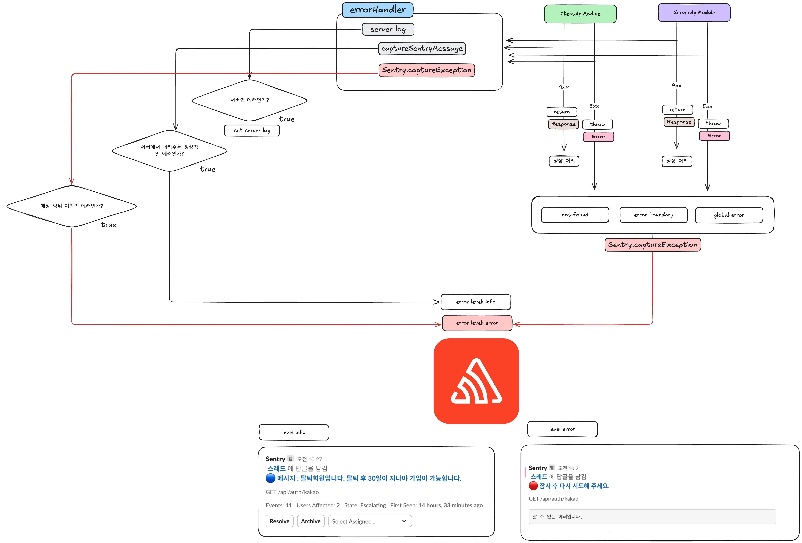
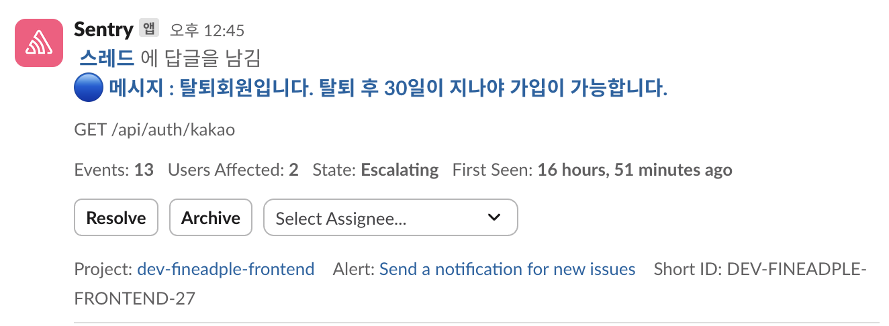

### 서론

새로 런칭한 서비스에서 에러 추적을 하기 위해 센트리를 도입했습니다. 에러 핸들링에 대해 “필요할 때 하면 되지”라며 제대로 시도해 본적이 없었던 것 같습니다. 하지만 이번에 센트리를 세팅하며, 자연스럽게 에러 핸들링을 다시 마주하게 되었고, 시행착오도 겪었습니다. 이 글에서는 그 과정에서 배운 점과 경험을 공유해보려 합니다.

### 센트리 기존 서비스와의 차이

기존 서비스에서의 센트리 로그는 제가 웹사이트에서 에러를 띄웠을 때 보는 콘솔창과 비슷했습니다. 에러가 띄워지는 것은 다행이지만 이게 무슨 문제인지 세심히 봐야하는 경우들이 생기거나 에러 트레이스를 보아도 문제 파악이 오래 걸리는 경우들이 있었습니다. 

그래서 새로운 서비스를 런칭하며 어떤 문제가 있고 어떻게 해결해야하는지 추려야할 필요가 있었습니다.

**기존 서비스의 에러 메세지**



### **기존 센트리 설정의 문제점**

1. 문제파악을 위한 데이터의 부재
    
    로그를 찍지 않아 어떤 값들이 오가며 에러가 발생했는지 알기 어려웠습니다.
    
2. 가독성이 안좋은 알림 메세지
    
    알림메세지를 보고 한눈에 어떤 에러인지 알기 어렵습니다.
    
3. 에러가 생긴 위치 파악의 어려움
    
    에러 트레이스를 추적하더라도 정확한 위치를 파악하기 힘들었습니다. 
    

### 문제 해결 과정

1. **NextJS AppRouter 센트리 기본 설정**
    
    sentry.server.config.ts
    
    - 서버 컴포넌트 설정
    
    sentry.edge.config.ts
    
    - 엣지 서버 설정
    
    src/instrumentaion-client.ts
    
    nextjs : https://nextjs.org/docs/app/api-reference/file-conventions/instrumentation-client
    
    - 클라이언트 컴포넌트 설정파일, nextJS에서 클라이언트 모니터링용으로지원해주는 파일.
    
    **각 설정 파일 구성**
    
    ```jsx
    import * as Sentry from '@sentry/nextjs'
    
    Sentry.init({
    	dsn: '센트리 토큰'
    	tracesSampleRate: process.env.NEXT_PUBLIC_RUN_MODE === 'production' ? 1 : 0.2,
    	debug: false,
    	beforeSend: (event, hint) => { // 에러를 센트리에 보내기 전에 확인가능한 콜백.
    		...
    	},
    })
    ```
    
    src/instrumentaion.ts
    
    nextjs : https://nextjs.org/docs/app/api-reference/file-conventions/instrumentation
    
    - 서버 컴포넌트 설정파일, nextJS에서 서버 모니터링용으로 지원해주는 파일.
    
    ```jsx
    export async function register() {
      if (process.env.NEXT_RUNTIME === "nodejs") {
        await import("./sentry.server.config");
      }
    
      if (process.env.NEXT_RUNTIME === "edge") {
        await import("./sentry.edge.config");
      }
    }
    ```
    

알림은 언제 띄울지.

- 예측하지 못하는에러

메세지는 어떻게 보여줄지…

# ⚠️ 에러 처리

### ✅ 전역 오류 페이지 (`app/global-error.tsx`, `error.tsx`)

- src/app/global-error.tsx
    - 전역/페이지 오류 시 에러 수집
    
    ```jsx
    
    import * as Sentry from '@sentry/nextjs'
    //추가
    	useEffect(() => {
    		Sentry.captureException(error)
    	}, [error])
    
    ```
    
- src/app/error.tsx
    - 전역/페이지 오류 시 에러 수집
    
    ```jsx
    
    import * as Sentry from '@sentry/nextjs'
    //추가	
    	useEffect(() => {
    		Sentry.captureException(error)
    	}, [error])
    ```
    

### ✅ 서버 액션 내 에러 수집

- 서버 액션 파일 (예: route.ts )
    - API 에러 수집

```jsx
'use server'

export const 서버액션함수 = async () => {
	return await Sentry.withServerActionInstrumentation(
		'서버액션 함수 이름', // The name you want to associate this Server Action with in Sentry
		{
		  formData,
			headers: await headers(), // Optionally pass in headers
			recordResponse: true, // Optionally record the server action response
		},
		async () => {
			//서버액션에 있던 내용물을 여기 적용.
		},
	)
}
```

# 📡 API 수집 상세 설정

- 전체 API 자동 수집: `autoInstrumentServerFunctions: true`
    
    ```jsx
    module.exports = withSentryConfig(nextConfig, {
    	...
    	autoInstrumentServerFunctions: true,
    	...
    }
    ```
    
- 특정 API만 수집:
    
    ```jsx
    import { wrapApiHandlerWithSentry } from "@sentry/nextjs";
    
    const handler = async (req: Request) => {
      return new Response(JSON.stringify({ name: 'John Doe' }), {
        status: 200,
        headers: {
          'Content-Type': 'application/json',
        },
      });
    };
    export const GET = wrapApiHandlerWithSentry(handler, '/api/myRoute')
    
    ```
    
- 일부 API 제외 :
    
    ```jsx
    export default withSentryConfig(nextConfig, {
      excludeServerRoutes: [
        "/some/excluded/route",
        "/excluded/route/with/[parameter]",
        /^\/route\/beginning\/with\/some\/prefix/,
        /\/routeContainingASpecificPathSegment\/?/,
      ],
    });
    ```
    

### middleware 에러 자동 수집

/next.config.js

```jsx
module.exports = withSentryConfig(nextConfig, {
	...
	autoInstrumentMiddleware: true,
	...
}
```

### 리액트 컴포넌트 이름 캡처

/next.config.js

```jsx
module.exports = withSentryConfig(nextConfig, {
	...
	reactComponentAnnotation: {
    enabled: true,
  },
	...
}
```

### 전송 전 이벤트 확인

Sentry.captureMessage, Sentry.captureException 모두 이곳에 전달됩니다.

```jsx

Sentry.init({
...
beforeSend: (event, hint) => {
		if (process.env.NEXT_PUBLIC_RUN_MODE !== 'production') {
			console.log('📛 예외 타입:', event.exception?.values?.[0]?.type)
			console.log('📛 예외 메시지:', event.exception?.values?.[0]?.value)
		}
		// 캐치
		return event
	},
...
})
```

- event 요소
    
    
    | **항목** | **예시 값** | **설명** | **활용 목적** |
    | --- | --- | --- | --- |
    | event.event_id | '4d2321119b5d4edb8f2c41611720d4ad' | 오류 이벤트의 고유 ID | Sentry 대시보드에서 추적 |
    | event.exception.values[0].type | 'Error' | 예외 유형 | 오류 분류 |
    | event.exception.values[0].value | 'CLIENT: 이메일 또는 비밀번호를 다시 확인해 주세요.' | 실제 예외 메시지 | 유저에게 보여줄 오류 메시지 확인 |
    | event.level | 'error' | 이벤트 심각도 | 필터링, 경고 레벨 지정 |
    | event.contexts.runtime.version | 'v20.18.0' | 실행중인 Node.js 버전 | 환경별 오류 추적 |
    | event.contexts.os.name | 'macOS' | 운영체제 | 플랫폼 관련 이슈 분석 |
    | event.contexts.device.cpu_description | 'Apple M3 Pro' | CPU 정보 | 디바이스 스펙 확인 |
    | event.contexts.culture.locale | 'ko-KR' | 로컬 언어 | 지역 기반 이슈 분석 |
    | event.sdkProcessingMetadata.normalizedRequest.url | 'http://localhost:3000/api/auth/login' | 요청한 URL | 어떤 요청 중 발생했는지 확인 |
    | event.sdkProcessingMetadata.normalizedRequest.data | '{"email":"marty1@test.xn--com-c2nasa9bbb","password":"test1234"}' | 요청 payload | 백엔드 디버깅에 활용 |
    | event.transaction | 'POST /api/auth/login' | 트랜잭션 경로 | 어떤 API에서 발생했는지 추적 |
    | hint.originalException | Response { status: 404, ... } | 실제 예외 객체 | 네트워크 응답 분석 |
    | event.breadcrumbs | [console.log ...] | 직전 동작 로그 | 사용자 흐름 파악 |

# 에러/메시지 수동 전송

## **🔹 예외 객체 전송**

 **Sentry.captureException(Error 객체) :** 의도적으로 에러를 센트리에 보냅니다. 

```jsx
const customError = new Error()
customError.name = "에러 타이틀";
customError.message = "에러 내용";
await Sentry.captureException(customError)
```

## **Breadcrumbs**

- Breadcrumbs는 모르는 길을 갈때 과자 부스러기를 뿌려 놓고 부스러기를 다시 찾아간다는 의미입니다. 문제가 발생하기 전에 이동 경로에 부스러기를 두어 에러 해결에 도움을 주도록합니다.

```jsx
Sentry.addBreadcrumb({
  category: "auth",
  message: "Authenticated user " + user.email,
  level: "info",
});

```

자동 등록도 가능합니다.

```jsx
Sentry.init({
  // ...
  beforeBreadcrumb(breadcrumb, hint) {
    return breadcrumb.category === "ui.click" ? null : breadcrumb;
  },
});

```

- 브라우저 JavaScript SDK는 DOM 요소에 대한 클릭 및 키 누름, XHR/fetch 요청, 콘솔 API 호출 및 모든 위치 변경을 자동으로 기록합니다.

**현재의 문제와 다음 액션**

예측하지 못하는 에러가 가끔 Error 메세지 이름이 빈객체로 오는 경우가 생김. 빈객체일경우 임의로 위치를 전송하거나 하는 방향으로 가독성을 높이는 것을 고려.

로그는 클라우드와치를 사용하고 있음. 센트리로 로그를 사용할지, 클라우드와치를 계속 사용할지 고민.

클라우드와치의 경우. 날짜 + 시간대를 url로 검색하여 



- 센트리 장단점
    
    센트리의 장점
    
    - 간단한 세팅
    - 많은 기능 존재
        - 슬랙 알림
        - 스택 트레이스
        - 코드상 에러 위치 확인
        - Breadcrumb
        - 등등..
    
    센트리의 단점
    
    - 높은 용량으로 인한 배포속도 저하.
    - 센트리 적용전 배포 시간은 2~3분이었습니다. 그러나 센트리 적용 후 곧바로 6분이상으로 늘어났습니다.
    -
