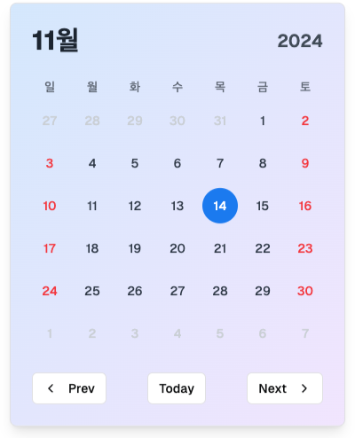

# 발표 진행 문서

## 서론

- 해당 세션의 주제는 모두 알다시피 프론트엔드를 개발하며 수정사항에 어떻게 기민하게 대처할 것인가..? 입니다.
- 이 주제는 제가 개발자 경력을 쌓아오며 지속적으로 고민해왔던 문제입니다.
- 많은 수정사항과 개선사항들이 존재했는데 꼭 개발을 완료하고 나면 수정이 너무 힘들다는 생각을 하였습니다. 그래서 수정이 쉬운 개발은 없을까? 처음부터 수정이 쉽게 개발하면 되는 것 아닌가? 하는 생각을 하며 수정이 쉬운개발은 무엇인지. 고민한 흔적을 여러분께 공유드릴 예정입니다.

방법론을 공유하기에 앞서서 제가 방법론에 도달하기까 어떤 문제들을 해결하여 여기까지 도달해왔는지에 대해 설명드릴 예정입니다.

## 나의 과거 파헤치기

### 2021

- 리팩터링을 해보겠다고 처음 생각해본 시기입니다. 하지만 금방 포기하게 되었던 이유가 Canvas를 통해 복잡한 UI를 보여주는 모듈이 1200줄짜리 코드였습니다. 이때부터 수정이 쉬운 개발을 찾기 시작했던 것 같습니다.


- 1200줄의 코드


<details>
  <summary>레이싱 웹소켓 연결 이라는 함수 </summary>

```jsx
const connectRacingWS = () => {
  rStatusWs = new WebSocket(racingStatusUrl);
  rStatusWs.onopen = () => {
    console.log("rStatusWs open");
  };
  rStatusWs.onmessage = (m) => {
    const messageJson = JSON.parse(m.data);

    if (messageJson.state) {
      console.log("state", messageJson.state);
      if (messageJson.state === "endCycle") {
        if (
          messageJson.user_id ===
          store.state.LocalStore.userLoginInfo.participant.email
        ) {
          store.dispatch("RACING_ENDCYCLE_BROADCAST", "Win");
        } else {
          store.dispatch("RACING_ENDCYCLE_BROADCAST", "Lose");
        }
        //마지막 도착 알림.

        const getInfo = {
          token: store.state.LocalStore.accessToken,
          status: 2,
          gamerID: store.state.LocalStore.userLoginInfo.participant.email,
        };
        store.dispatch("CHANGE_GAMER_STATUS", getInfo);
      }
      if (messageJson.state === "location") {
        //플레이어 배치
        if (
          messageJson.user_id ===
          store.state.LocalStore.userLoginInfo.participant.email
        ) {
          store.dispatch("GET_GAMER_WS", messageJson);
        }
      }
    }
    if (messageJson.action === "patch") {
      if (messageJson.field === "car") {
        if (
          messageJson.body.driver ===
          store.state.LocalStore.userLoginInfo.participant.email
        ) {
          console.log("배차");
          store.dispatch("CHANGE_GAME_FLOW", "ready");
          store.dispatch("GET_GAMER_WS", messageJson.body);

          //차 채널입력
          carChannel.value = messageJson.body.channelId;
          carChannel.value = store.state.LocalStore.gamer.car_channel;
        }
      } else if (messageJson.field === "gamer" && messageJson.body.car.driver) {
        if (
          messageJson.body.car.driver ===
            store.state.LocalStore.userLoginInfo.participant.email &&
          messageJson.body.status !== 3
        ) {
          if (messageJson.body.approved) {
            // 경기허가
            initPlayerPub(); //플레이어 화면 초기화
            console.log("playerPub", playerPub);
            startPlayerPub(); // 플레이어 화면 실행
            store.dispatch("SAVE_CYCLE", 0);
            store.dispatch("GET_GAMER_WS", messageJson.body);
            store.dispatch("RACING_ENDCYCLE_BROADCAST", ""); // 승리/패배 초기화
            store.dispatch("RACING_BROADCAST", "ready");
            store.dispatch("CHANGE_GAME_FLOW", "permission");

            document.getElementById("start_conut").style.display = "block";
            startCount.value = 3;

            // 출발 신호
            //경과시간 사이클 초기화
            store.dispatch("SAVE_CYCLE", 0);
            let object = {
              stTime: null,
              time: "",
            };
            store.dispatch("LOCAL_SAVE_END_TIME", "00 : 00 : 000");

            console.log("store.state.LocalStore.gameFlow");
            store.dispatch("GAME_START_SIGNAL", false); //게임 스타트
            store.dispatch("GAME_SENSOR_SIGNAL", false);
            store.dispatch("GET_ELAPSED_TIME", object);
          }

          store.dispatch("GET_GAMER_WS", messageJson.body);

          //차 채널입력
          carChannel.value = store.state.LocalStore.gamer.car_channel;
        } else {
          if (messageJson.body.approved) {
            //아이디가 다른 경기허가일때.
            if (
              //같은 채널을 사용한다면
              messageJson.body.car.channelName ===
              store.state.LocalStore.gamer.car_name
            ) {
              console.log(
                "다른 경기 허가",
                messageJson.body.car.channelName,
                store.state.LocalStore.gamer.car_name
              );
              const getInfo = {
                token: store.state.LocalStore.accessToken,
                status: 0,
                gamerID: store.state.LocalStore.userLoginInfo.participant.email,
              };
              store.dispatch("CHANGE_GAMER_STATUS", getInfo); //미경기 상태로 변환
              store.dispatch("CHANGE_GAME_FLOW", "wait"); //연습종료
              if (pub) {
                console.log(pub);
                // pub.init();
                pub.conn.close();
              }
            }
          }
        }

        if (messageJson.body.status === 3) {
          //경기 포기
          console.log("경기 포기");
          store.commit("SET_ISLOADING", false); //로딩제거.
          store.dispatch("RACING_ENDCYCLE_BROADCAST", ""); //경기 결과 제거
          if (
            messageJson.body.id ===
            store.state.LocalStore.userLoginInfo.participant.email
          ) {
            // 패배
            initPlayerPub();
            if (document.getElementById("start_conut")) {
              document.getElementById("start_conut").style.display = "none";
            }
            store.dispatch("RACING_ENDCYCLE_BROADCAST", ""); //경기 결과 제거
            store.dispatch("CHANGE_GAME_FLOW", "faild");
            // document.getElementById("start_conut").style.display = "none";
          }
        }
        if (messageJson.body.status === 2) {
          //spider.js에서 보냄.
          // store.dispatch("CHANGE_GAME_FLOW", "end");
          if (
            messageJson.body.id ===
            store.state.LocalStore.userLoginInfo.participant.email
          ) {
            // 경기완료
            // store.dispatch("CHANGE_GAME_FLOW", "practice");
            console.log("경기 완료");
            initPlayerPub();
            store.dispatch("GET_GAMER_WS", messageJson.body);
            if (document.getElementById("start_conut")) {
              document.getElementById("start_conut").style.display = "none";
            }
          }
        }
        if (messageJson.body.status === 0) {
          if (
            messageJson.body.car.driver ===
            store.state.LocalStore.userLoginInfo.participant.email
          ) {
            //재경기
            store.dispatch("RACING_ENDCYCLE_BROADCAST", ""); //경기 결과 제거
            store.dispatch("CHANGE_GAME_FLOW", "wait");
            store.commit("SET_ISLOADING", false); //로딩제거.
            // store.dispatch("RACING_ENDCYCLE_BROADCAST", "ready");
            console.log("재경기", messageJson.body);
            initPlayerPub();
            store.dispatch("GET_GAMER_WS", messageJson.body);
          }
        }
      }
    } else if (messageJson.action === "post") {
      //참여 요청
      console.log("참여 요청", messageJson.body.gamer.email);
      if (
        store.state.LocalStore.userLoginInfo.participant.email ===
        messageJson.body.gamer.email
      ) {
        store.dispatch("CHANGE_GAME_FLOW", "wait");
      }
    }
    if (messageJson.start) {
      //게임시작.
      // 경기 시작 카운트
      store.dispatch("PLAY_AUDIO", "gameStart");
      // store.dispatch("PLAY_AUDIO", "soundRemove");
      if (countInterval) {
        clearInterval(countInterval);
      }
      startCount.value = 3;
      countInterval = setInterval(() => {
        startCount.value--;
        if (startCount.value === 0) {
          //숫자0되고 끝나고 경기 시작.
          store.dispatch("PLAY_AUDIO", "outSideAudio"); //외부 사운드
          document.getElementById("start_conut").style.display = "none";
          store.dispatch("GAME_START_SIGNAL", true); //게임 스타트
          store.dispatch("SAVE_START_TIME"); //게임 시작시간 저장
          store.dispatch("RACING_BROADCAST", "start"); //시작 브로드캐스트
          clearInterval(countInterval);
          setTimeout(() => {
            store.dispatch("GAME_SENSOR_SIGNAL", true); //센서 스타트
            console.log("센서 스타트!");
          }, 10000);
        }
      }, 1000);
    }
    // store.dispatch("GET_GAMER_INFO", data);
  };
  rStatusWs.onclose = () => {
    console.log(route, store.state.LocalStore.accessToken);
    //로그인이 되어있다면.
    if (store.state.LocalStore.accessToken) {
      setTimeout(() => {
        if (route.name === "Controls" || route.name === "Login") {
          console.log("rStatusWs 재연결 시도");
          connectRacingWS();
        }
      }, 1000);
    }
    console.log("rStatusWs close");
  };
};
```

</details>

**모두 개발 후 깨달은 점**

1. 코드가 난해했습니다.
1. 객체가 너무 큽니다.
1. 한가지 함수가 너무 많은 일을 하고 있어서 함수를 수정할때 처음부터 읽어봐야합니다.
1. 코드를 작성하는데 규칙이 없어서 함수이름과 변수이름도 중구난방입니다.
1. 하나의 파일이 너무 많은 일을 하고 있어 코드가 너무 길어집니다.
1. if의 if의 if…if지옥입니다.

결과적으로 모든게 너무 크게 관리가 되어있습니다. 도메인과 코드의 분리가 시급해보였습니다.

### 2022 : 섣부른 아키텍처의 최후

좀 더 복잡한 로봇 게임을 제작하였습니다. 이번에는 이전과 같은 문제를 일으키지 않기 위해 책임을 여러파일로 나누고 아키텍처를 도입하여 코드 추적이 쉽도록 하려 했습니다.

**게이트웨이 도입**


**리팩터링을 통해 제거**


**이전보다 발전한 점**

- TypeScript를 도입하여 함수의 타입추론으로 인해 코드 추적이 용이해지도록 노력했습니다.
- 여러파일로 책임을 분산하여 이전 보다 각 파일의 코드가 짧아졌습니다.

  

- CSS 개발 속도 증가를 위해 Tailwindcss를 도입하였습니다.

**모두 개발후 깨달은 점**

아키텍처 도입

- 처음부터 아키텍처?를 도입한 것이 독이 되었습니다. 단순하게 파이프라인을 구축한다면? 모두 한곳을 통과한다면 추적이 쉽지 않을까? 하는 생각을 해버립니다.
- 모든 모듈이 해당 파이프라인을 통과해야하니 같은 코드를 두 번 만들어야하여 보일러플레이트가 심해지고 그에 따라 코드 추적이 더욱 어려운 현상이 일어났습니다.
- 결국 리팩터링을 통해 해당 파이프라인을 제거하여 문제를 해결하긴 하였으나 오히려 시간을 낭비한 셈입니다.

**여러파일로의 책임 분산**

- 파일을 찾는게 어려워지기 시작했습니다.
  ?? 파일이 어느 파일에 의존하지? 라는 생각을 자주했던 것 같습니다.
- page/login.vue
- components/login.vue
- module/login.ts
  예를 들면 위와같은 상황이 발생하는 것이 매번 폴더를 넘나들어야하고 login page에는 분명 login 의존성 이외에 다른 의존성도 존재했습니다.

### 2023 1분기

이제 해볼건 다해본 것 같습니다. msw, tailwindcss, playwright, jest, 컴포넌트 라이브러리 등등 여러 생산성 라이브러리를 도입하고 아키텍처를 적용해보고 파일분리, 함수분리도 해보았습니다.

하지만 결과적으로 수정에 용이한 개발은 하지 못했습니다.

무엇이 부족할까? 를 생각하며 패턴에 대한 공부가 부족하다는 생각에 디자인 패턴을 공부하였습니다.

- 디자인 패턴을 공부후 실제 적용한 패턴
- 싱글톤
- 옵저버

싱글톤, 옵저버를 배우며…

- Vue, React는 이미 싱글톤, 옵저버 등 다양한 디자인 패턴을 사용하여 개발되었습니다.
- 그 외의 팩토리 패턴, 프로토타입 패턴.. 모두 사용해야하는 도구에 불과했습니다.

이때까지 느낀 것은 도구에 대해 배운다. 라는 생각이 강하게 들었으며 분명 공부는 많이 했는데 발전이 없다는 생각에 약간 현타가 오기도 했습니다.

### 2023 2분기 ~

- 클린 아키텍처를 만나게 됩니다. 클린 아키텍처에서는 수정이 용이한 개발이 무엇인가. 어떻게 만들어내는가.를 알려줍니다. 바로 객체지향적 개발입니다.
- 디자인 패턴의 패러다임 등 유지보수에 관련한 코드의 패러다임은 거의 모두 객체지향을 따른다는 것을 알았습니다.

드디어 도구가 아닌 방법에 대한것을 찾게되었습니다. 뭔가 막혀있던 구멍이 뻥 뚫린 기분이었고 객체지향이라는 패러다임을 빠르게 습득하기 위해 여러번의 코딩테스트에 모두 도입해보며 빠르게 사용하고 리팩터링하여 객체지향 사용법에 대해 익히기 시작했습니다.

### 현재 그리고 대응법

- 객체지향을 적재적소 사용하는 것이 중요하다는 생각을 하고있습니다.
- 기획에서 변경될 요소, 변경이 될 수 밖에 없는 요소를 파악하는 것이 중요하다고 생각합니다.
- 변경요소 파악능력이 생겼을 때 객체지향의 시너지가 발휘됩니다.
- 변경요소를 파악하는 것은 불확실합니다. 때문에 먼저 변경을 각 책임으로 분리하여 레고의 형태로 코드를 제작함으로써 각 책임에 대한 변경사항은 수정할 수 있도록 합니다.

## 변경을 대응하는 자세

### 1. 변경될 요소를 미리 파악하자(기획)

---

- 기획에서 변경될 요소를 파악하는 것이 가장 먼저라고 말했습니다. 그럼 변경될 요소는 어떻게 파악할 수 있을까요?

**첫번째 예시 : SLASH 23 - 진유림님의 “쏟아지는 페이지 한 방에 관리하기”**


- 진유림님이 기획에서 변경을 파악한 결과는 다음과 같습니다.

1. 페이지의 순서가 변경될 수 있습니다.
2. 페이지가 3장이 아닌 5장 6장이 될 수 있습니다.

- 이러한 변경이 일어날 것을 대비한다면 어떻게 해야할까요?

useFunnel.tsx

```jsx
const [registerData, setRegisterData] = useState();
const [step, setStep] =
  (useFunnel < "가입방식") | "주민번호" | "집주소" | ("가입성공" > "가입방식");

return (
  <Funnel>
    <Funnel.step name="가입방식">
      <가입방식 onNext={() => setStep("주민번호")} />
    </Funnel.step>

    <Funnel.step name="주민번호">
      <주민번호 onNext={() => setStep("집주소")} />
    </Funnel.step>

    {/* Additional steps can be added here */}
  </Funnel>
);
```

- useFunnel이라는 컴포넌트를 작성하고 해당 페이지의 이름을 받아서 어떤 페이지인지 구분이 가능하도록 만들었습니다.
- onNext 콜백을 받음으로써 다음 스텝이 무엇인지도 확인이 가능합니다.

결과 : 파악한 변경이 해결되었을까요?

1. 페이지의 순서가 변경될 수 있습니다. ⇒ onNext 콜백만 조정한다면 순서변경은 문제가 없어보입니다.
2. 페이지가 3장이 아닌 5장 6장이 될 수 있습니다. ⇒ onNext 콜백과 페이지 네임이 외부로 노출되어있어 문제가 없어보입니다.

**두번째 예시 : SLASH 24 - 토스가 오프라인 결제를 빠르고 안정적으로 혁신하는 방법**

- 코드가 복잡해짐에 따라서 수정이 어려운 코드로 변화하기 시작했습니다.
- 해당 코드는 결제관련 코드입니다. 요구사항으로는 당연히 안정적이어야하고 수정도 안정적이어야할 것입니다.

그럼 안정적으로 코드를 관리하는 방법은 무엇일까요? - 선언적 프로그래밍


- 관심사별로 코드를 분리하여 주입하는 방식으로 변경에 대한 안정성을 잡았습니다.
- 이제 새로운 코드가 주입되더라도 기존의 코드를 걱정할 필요가 없어졌습니다. plugin에 코드를 추가하기만 하면 됩니다.

### 2. 데이터 - UI - 상호작용을 분리하여 변경에 유연한 컴포넌트 개발

---

**추상화를 하자 :** 한재엽님의 Effective Component : 유연하게 대응하는 컴포넌트 만들기

- 컨퍼런스 명언
  - 제품을 왜 변경해야할까?’라는 질문을 역전시켜버린 것입니다.
    **’제품이 변경되지 않아야할 이유는 뭘까?**
  - 사용자가 잘 사용해야 변경안될 수 있다.
  - 변화는 유저가 잘 사용하지 못하기 때문에 생기는 것.
  - 제품이 빠르게 변화한다면 우리는 제품을 성장시키고 있는것.

```jsx
<Item
	key={item_${filtered.length}}
	index={filtered.length}
	curIndex={index}
	item={{
		id: 'search_in_google',
		name: github: ${currentTargetValue},
		htmlUrl: currentTargetValue,
	}}
	onClickItem={onClickItem}
/>

```

해당 코드의 문제는 무엇일까요?

- 정답
  - Item이 어떤 컴포넌트인지 알 수 없습니다.
  - 어떤 데이터를 다루는지 모르겠습니다.
  - 데이터를 어떻게 보여주는지 알 수 없습니다.
    결론은 아무것도 알 수 없으므로 해당 코드의 동작을 이해하기 위해 index,onClickItem등을 직접 추적해야합니다.

위의 문제를 해결하기 위해 컴포넌트의 역할과 3가지 방법론을 제시합니다.

**컴포넌트의 역할 3가지**

데이터, UI, 상호작용


UI : 어떻게 보여질지 정의하기 때문에 디자인에 의존합니다.

데이터와 UI를 분리한다면? : **Headless 기반 추상화**

**변경에 유연한 컴포넌트를 만들기위한 3가지 단계**

1. Headless 기반의 추상화

   변하는 것 vs 상대적으로 변하지 않는 것.

2. 한 가지 역할만 하기

   또는 한가지 역할만 하는 컴포넌트의 조합으로 구성하기

3. 도메인 분리하기

   도메인을 포함하는 컴포넌트와 도메인을 포함하지 않는 컴포넌트 분리

**Headless 기반 추상화 :** 오로지 데이터에만 집중해서 모듈화하는 패턴을 Headless라고 합니다.

달력 컴포넌트를 Headless 기반으로 만들어본다면?

달력의 특징을 찾아본다면

- 달력을 구성하고 있는 데이터 자체는 변하지 않습니다.
- 달력의 UI는 언제든 바뀔 수 있습니다.

useCalender를 사용하여 여러가지 디자인에 빠르게 대응할 수 있습니다.

- 데이터만 떼어낸 useCalender.tsx

  ```jsx
  'use client'

  import { useState, useMemo } from 'react'

  interface CalendarDate {
    date: Date
    isCurrentMonth: boolean
    isToday: boolean
    isWeekend: boolean
  }

  interface UseCalendarProps {
    initialDate?: Date
  }

  export function useCalendar({ initialDate = new Date() }: UseCalendarProps = {}) {
    const [selectedDate, setSelectedDate] = useState(initialDate)
    const [currentMonth, setCurrentMonth] = useState(new Date(initialDate.getFullYear(), initialDate.getMonth(), 1))

    const dates = useMemo(() => {
      ...
    }, [currentMonth])

    const navigateMonth = (direction: 'prev' | 'next') => {
  		...
    }

    const goToToday = () => {
  		...
    }

    return {
      dates,
      selectedDate,
      currentMonth,
      setSelectedDate,
      navigateMonth,
      goToToday
    }
  }
  ```

- dates
- selectedDate : 현재 날짜
- currentMonth : 현재 월
- setSelectedDate : 날짜 선택
- navigateMonth : 날짜 이동
- goToToday : 오늘로 이동





- 만약 UI와 데이터를 분리하지 않았을 경우.

  ```jsx
  'use client'

  import React, { useState, useEffect } from 'react'
  import { Button } from "@/components/ui/button"
  import { Card } from "@/components/ui/card"
  import { ChevronLeft, ChevronRight } from 'lucide-react'

  interface CalendarDate {
    date: Date
    isCurrentMonth: boolean
    isToday: boolean
    isWeekend: boolean
  }

  export default function Calendar() {
    const [currentMonth, setCurrentMonth] = useState(new Date())
    const [selectedDate, setSelectedDate] = useState<Date | null>(null)
    const [dates, setDates] = useState<CalendarDate[]>([])

    useEffect(() => {
      const year = currentMonth.getFullYear()
      const month = currentMonth.getMonth()
      const firstDay = new Date(year, month, 1)
      const lastDay = new Date(year, month + 1, 0)

      const startDate = new Date(firstDay)
      startDate.setDate(startDate.getDate() - firstDay.getDay())

      const calendar: CalendarDate[] = []
      const today = new Date()

      for (let i = 0; i < 42; i++) {
        const date = new Date(startDate)
        date.setDate(startDate.getDate() + i)

        calendar.push({
          date,
          isCurrentMonth: date.getMonth() === month,
          isToday:
            date.getDate() === today.getDate() &&
            date.getMonth() === today.getMonth() &&
            date.getFullYear() === today.getFullYear(),
          isWeekend: date.getDay() === 0 || date.getDay() === 6
        })
      }

      setDates(calendar)
    }, [currentMonth])

    const navigateMonth = (direction: 'prev' | 'next') => {
      setCurrentMonth(prev => {
        const newDate = new Date(prev)
        if (direction === 'prev') {
          newDate.setMonth(prev.getMonth() - 1)
        } else {
          newDate.setMonth(prev.getMonth() + 1)
        }
        return newDate
      })
    }

    const goToToday = () => {
      setCurrentMonth(new Date())
      setSelectedDate(new Date())
    }

    return (
      <Card className="w-full max-w-2xl p-6 bg-gradient-to-b from-rose-50 to-transparent rounded-3xl">
        <div className="flex items-center justify-between mb-6">
          <div className="flex gap-4 text-sm font-medium text-gray-600">
            <span>M</span>
            <span>W</span>
            <span>D</span>
          </div>
          <div className="flex items-center gap-2">
            <Button
              variant="ghost"
              size="icon"
              className="h-8 w-8"
              onClick={() => navigateMonth('prev')}
            >
              <ChevronLeft className="h-4 w-4" />
            </Button>
            <div className="px-4 py-1 bg-amber-100 rounded-full text-sm">
              {currentMonth.toLocaleDateString('en-US', {
                year: 'numeric',
                month: '2-digit'
              }).replace('/', '.')}
            </div>
            <Button
              variant="default"
              size="sm"
              className="bg-teal-500 hover:bg-teal-600 text-white text-xs px-4"
              onClick={goToToday}
            >
              TODAY
            </Button>
            <Button
              variant="ghost"
              size="icon"
              className="h-8 w-8"
              onClick={() => navigateMonth('next')}
            >
              <ChevronRight className="h-4 w-4" />
            </Button>
          </div>
        </div>
        <div className="grid grid-cols-7 gap-1">
          <div className="text-center py-2 text-sm font-medium text-gray-600">SUN</div>
          <div className="text-center py-2 text-sm font-medium text-gray-600">MON</div>
          <div className="text-center py-2 text-sm font-medium text-gray-600">TUE</div>
          <div className="text-center py-2 text-sm font-medium text-gray-600">WED</div>
          <div className="text-center py-2 text-sm font-medium text-gray-600">THU</div>
          <div className="text-center py-2 text-sm font-medium text-gray-600">FRI</div>
          <div className="text-center py-2 text-sm font-medium text-gray-600">SAT</div>
          {dates.map((date, i) => (
            <div
              key={i}
              className={`
                relative p-2 text-center cursor-pointer text-sm
                ${!date.isCurrentMonth ? 'text-gray-300' : ''}
                ${date.isWeekend && date.isCurrentMonth ? 'text-red-400' : ''}
                ${date.isToday ? 'bg-teal-100' : ''}
                ${
                  selectedDate?.getDate() === date.date.getDate() &&
                  selectedDate?.getMonth() === date.date.getMonth()
                    ? 'bg-teal-500 text-white'
                    : ''
                }
              `}
              onClick={() => setSelectedDate(date.date)}
            >
              {date.date.getDate()}
            </div>
          ))}
        </div>
      </Card>
    )
  }
  ```

- 새로운 디자인을 적용하기에는 힘들어보입니다. 만약 해본다면
  1. 코드를 쭉 보고 파악해야합니다.
  2. 함수를 분리해야합니다.
  3. useEffect의 동작도 파악해야합니다. 데이터만 종속되어있을지는 모르는 일입니다.
  4. 상태관리인 state도 분리해야합니다.
  5. … 등 일이 많습니다.

**한 가지 역할만 하기** : 상호작용 추상화

```jsx
import React, { useState } from 'react'
import { Card } from "@/components/ui/card"

interface Item {
  id: string
  content: string
}

export default function DragDropList() {
  const [items, setItems] = useState<Item[]>([
    ...
  ])

  const [draggedItem, setDraggedItem] = useState<Item | null>(null)

  const onDragStart = (item: Item) => {
    ...
  }

  const onDragOver = (e: React.DragEvent) => {
	  ...
  }

  const onDrop = (targetId: string) => {
	  ...
  }

  return (
    <Card className="w-full max-w-md mx-auto p-4">
      <h2 className="text-2xl font-bold mb-4">Drag and Drop List</h2>
      <ul className="space-y-2">
        {items.map((item) => (
          <li
            key={item.id}
            draggable
            onDragStart={() => onDragStart(item)}
            onDragOver={onDragOver}
            onDrop={() => onDrop(item.id)}
            className="p-3 bg-gray-100 rounded cursor-move hover:bg-gray-200 transition-colors"
          >
            {item.content}
          </li>
        ))}
      </ul>
    </Card>
  )
}
```

- 해당 코드는 무엇이 문제일까요?
- 정답
  - Button 컴포넌트 내부에 여러가지 로직이 들어가서 컴포넌트가 복잡해집니다.
  - 새로운 DropDown 동작이 생길 경우 재사용하지 못합니다.

추상화 결과 코드

- useDragAndDrop

  ```jsx
  import { useState, useCallback } from 'react'

  interface Item {
    id: string
    content: string
  }

  export function useDragAndDrop(initialItems: Item[]) {
    const [items, setItems] = useState<Item[]>(initialItems)
    const [draggedItem, setDraggedItem] = useState<Item | null>(null)

    const onDragStart = useCallback((item: Item) => {
      setDraggedItem(item)
    }, [])

    const onDragOver = useCallback((e: React.DragEvent) => {
      e.preventDefault()
    }, [])

    const onDrop = useCallback((targetId: string) => {
      if (!draggedItem) return

      setItems(prevItems => {
        const newItems = [...prevItems]
        const draggedIndex = newItems.findIndex(item => item.id === draggedItem.id)
        const targetIndex = newItems.findIndex(item => item.id === targetId)

        newItems.splice(draggedIndex, 1)
        newItems.splice(targetIndex, 0, draggedItem)

        return newItems
      })

      setDraggedItem(null)
    }, [draggedItem])

    return {
      items,
      onDragStart,
      onDragOver,
      onDrop
    }
  }
  ```

- DragAndDrop

  ```jsx
  import React from "react";
  import { useDragAndDrop } from "./use-drag-and-drop";

  const initialItems = [
    { id: "1", content: "🍎" },
    { id: "2", content: "🍌" },
    { id: "3", content: "🍇" },
    { id: "4", content: "🍊" },
    { id: "5", content: "🍓" },
    { id: "6", content: "🍑" },
  ];

  export default function DragDropGrid() {
    const { items, onDragStart, onDragOver, onDrop } =
      useDragAndDrop(initialItems);

    return (
      <div className="w-full max-w-md mx-auto p-4 bg-white rounded-lg shadow">
        <h2 className="text-2xl font-bold mb-4">Drag and Drop Grid</h2>
        <div className="grid grid-cols-3 gap-4">
          {items.map((item) => (
            <div
              key={item.id}
              draggable
              onDragStart={() => onDragStart(item)}
              onDragOver={onDragOver}
              onDrop={() => onDrop(item.id)}
              className="aspect-square flex items-center justify-center text-4xl bg-gray-100 rounded cursor-move hover:bg-gray-200 transition-colors"
            >
              {item.content}
            </div>
          ))}
        </div>
      </div>
    );
  }
  ```

[드래그앤드롭 코드 실행 LINK](https://v0.dev/chat/B7MpGXIpEBp?b=b_iKDgkY9gNOi)

**도메인 분리하기** : UI 패턴 공통화

- 사람은 배경지식으로 무언가를 파악합니다.
- 그래서 일반적인 Props 네이밍을 할 필요가 있습니다.
- 결론은 컴포넌트 인터페이스가 표준에 가까울수록 이해하기 쉬워질 수 있습니다.

```jsx
function FrameworkSelect() {
  const {
    data: { frameworks },
  } = useFrameworks();
  const [selected, change] = useState();

  return (
    <MultiSelect // 공통 컴포넌트
      trigger={<Button value={selected.join()} />}
      value={selected}
      onChange={change}
      options={frameworks}
    />
  );
}
```

도메인을 모르는 컴포넌트와 아는 컴포넌트의 분리가 필요합니다.

- FrameworkSelect 내부에 도메인을 모르는 MultiSelect 컴포넌트를 사용합니다.비즈니스 로직은 스스로 처리하고 UI로직을 위임하여 분리합니다.
  FrameworkSelect ⇒ 비즈니스 로직
  MultiSelect ⇒ UI 로직

Headless 기반의 추상화, 한 가지 역할만 하기, 도메인 분리하기… 이 세가지를 당장 하기는 힘들 수 있습니다. 조금 쉽게 해보고 습관을 들이는 방법을 액션 아이템으로 소개해 드리겠습니다.

### 액션 아이템

1. 인터페이스를 먼저 고민

   1. 만들고자 하는 기능이 이미 모듈화되어 있다고 가정해봅니다. 아래의 코드는 아직 만들어지지 않은 컴포넌트로 임의로 작성하여 미리 고민한 코드입니다.

   ```jsx
   <Title>별점을 매겨주세요</Title><Stars /><Reviews /><AgreementButton
       show={rating !== 0}/>
   ```

2. 추상화 레벨 디자인

   1. 1번의 코드를 추상화 수준을 섞었을 경우 아래와 같은 코드가 됩니다. 이와 같은 코드는 전체적인 코드가 어느 수준으로 기술된 것인지 파악이 어렵기 때문에 추상화 수준을 레벨링하여 디자인합니다.

      ```jsx
      <Title>별점을 매겨주세요</Title><div>  {STARS.map(() => <Star />)}</div><Reviews>  {rating !== 0 && (
          <>      <Agreement />      <Button rating={rating} />    </>  )}</Reviews>
      ```

      - 저는 주로 3레벨로 디자인합니다.

3. 도메인UI, 공통UI, 비즈니스 로직을 구분하자.

   - 디자인을 이용한 예제

    

   image.png
   우리집, 회사, 직접입력 버튼을 만들경우 - Chip 컴포넌트 사용

   ```jsx
   // 도메인 UI
   function SelectLocation(locations: string[]) {
     // 비즈니스 로직
     const [currentLocation, setCurrentLocation] = useState(null);
     // 상호 작용
     const handleSelectLocation = (location: string) => {
       setCurrentLocation(location);
     };

     // UI 로직
     return (
       <Chip
         list={locations}
         current={currentLocation}
         onClick={handleSelectLocation}
       />
     );
   }

   export default SelectLocation;
   ```

4. 공통 컴포넌트를 사용할 때 비즈니스 로직을 분리하자.

   - 위의 도메인분리하기의 내용입니다.

   ```jsx
   function FrameworkSelect() {
     const {
       data: { frameworks },
     } = useFrameworks();
     const [selected, change] = useState();

     return (
       <MultiSelect // 공통 컴포넌트
         trigger={<Button value={selected.join()} />}
         value={selected}
         onChange={change}
         options={frameworks}
       />
     );
   }
   ```

<aside>
💡

추상화 패턴이나 한가지 책임만 가진다 라는 개념들은 어디서 발생했을까.
객체지향의 SOILD 개념에 모두 포함됩니다.

- SOILD 1.**단일 책임 원칙 (Single Responsibility Principle, SRP)**
  하나의 클래스는 하나의 책임만 가져야 하며, 클래스가 변경되어야 하는 이유는 하나뿐이어야 한다는 원칙입니다. 이를 통해 클래스의 역할을 명확히 하고 유지보수를 용이하게 합니다. 2.**개방-폐쇄 원칙 (Open/Closed Principle, OCP)**
  클래스나 모듈은 확장에는 열려 있고, 수정에는 닫혀 있어야 한다는 원칙입니다. 즉, 새로운 기능이 추가될 때 기존 코드를 수정하지 않고 기능을 추가하거나 확장할 수 있어야 합니다. 3.**리스코프 치환 원칙 (Liskov Substitution Principle, LSP)**
  서브 타입은 언제나 기반 타입으로 교체할 수 있어야 한다는 원칙입니다. 이를 통해 코드의 유연성을 높이고, 다형성을 활용하여 코드가 더 안전하게 동작할 수 있도록 합니다. 4.**인터페이스 분리 원칙 (Interface Segregation Principle, ISP)**
  하나의 일반적인 인터페이스보다는 여러 개의 구체적인 인터페이스를 만드는 것이 좋다는 원칙입니다. 이를 통해 불필요한 의존성을 줄이고, 필요한 기능만 구현하도록 하여 유연성을 높입니다. 5.**의존 역전 원칙 (Dependency Inversion Principle, DIP)**
  상위 모듈이 하위 모듈에 의존해서는 안 되고, 둘 다 추상화에 의존해야 한다는 원칙입니다. 이를 통해 모듈 간 결합도를 낮추고, 변경에 더 유연하게 대응할 수 있습니다.

</aside>

## 직접 겪은 사례

---

- 개발하며 가장 복잡도가 높은 코드를 개선한 결과입니다.

```jsx
const {
		...
		actions,
} = useServiceHistory() // 데이터, 상호작용 관리

const { refill, review, viewService, comment, inquiry } = actions // 상호작용 분리

// UI 로직관리
const dailyFeedOption = [inquiry, viewService]
const dailyFollowOption = [inquiry, viewService]
const multiUrlOption = [inquiry, viewService]
const commentOption = [comment, inquiry]
const singleOption = [inquiry]

const multiUrlCompleteOption = [review, viewService]
const dailyCompleteOption = [review, viewService]
const completeOption = [review, refill]

const multiUrlCanceledOption = [inquiry, viewService]
const canceledOption = [inquiry]

<ServiceHistoryContext.List
	isList={isList}
	isSkeleton={isSkeleton}
	historyList={historyList}
	skeletonUi={<SkeletonUi length={4} />}
	renderListItem={(history) => (
		<CardStyled key={'service-history-card-' + history.id}>
			<ServiceHistoryContext.Card
				history={history}
				type="single"
				option={[singleOption, completeOption, canceledOption]}
			/>
			<ServiceHistoryContext.Card
				history={history}
				type="singleMultiUrl"
				option={[multiUrlOption, multiUrlCompleteOption, multiUrlCanceledOption]}
			/>
			<ServiceHistoryContext.Card
				history={history}
				type="dailyFeed"
				option={[dailyFeedOption, dailyCompleteOption, canceledOption]}
			/>
			<ServiceHistoryContext.Card
				history={history}
				type="dailyFollow"
				option={[dailyFollowOption, dailyCompleteOption, canceledOption]}
			/>
			<ServiceHistoryContext.Card
				history={history}
				type="comment"
				option={[commentOption, completeOption, canceledOption]}
			/>
		</CardStyled>
	)}
/>
```

**변경 대응 사항**

- 복잡할 것을 우려하여 변경이 잦은 부분과 아닌 부분을 추적
  !https://prod-files-secure.s3.us-west-2.amazonaws.com/19f8680d-c65a-4a78-88a7-bdce97cc1d0c/316edf8d-344f-4c2b-b9a4-bd05e0008f5a/발표_진행_문서_13648de8e0ea80619261ce647e73950eimage_14.png
- 예측된 변경사항
  - 컴포넌트의 경우의 수(20가지)가 너무 많아 수정이 어려울 경우 개발이 늦어질 수 있겠다고 판단하였습니다.

**실제 수정 요청 사항**

1. 9/24 4가지
2. 9/26 1가지
3. 10/11 2가지

**요청사항 대응**

수정 코드 : 한 줄

```jsx
	multiUrlCompleteOption = [review, viewService] // 완료버튼옵션만 수정

	<ServiceHistoryContext.Card
		history={history}
		type="singleMultiUrl" // 다수 URL
		option={[multiUrlOption, multiUrlCompleteOption, multiUrlCanceledOption]}
	/>
```

**사용자 정보 불러오기 API 개선 : 리스코프 치환의 원칙**

```jsx
function useUserInfo() {
		...

	return {
		userInfo,
	}
}
```

- 이번에 사용자 정보를 불러오는 API를 개선하는데 크게 도움이 된 부분입니다.
- 바로 모든 페이지는 useUserInfo라는 함수를 통해 userInfo 객체를 받아서 사용한다는 부분이었습니다.
- 기존에 이렇게 만들어져 있었기 때문에 기존보다 30줄의 코드가 증가함에도 다른 코드에 영향을 주지 않았습니다.
- 30줄정도 추가된 코드지만 똑같이 userInfo를 반환

  ```jsx
  import ApiService from '@common/api/ApiService'
  import cookieHelper from '@common/helpers/cookie.helper'
  import { PublicUserInfoAtom, SensitiveUserInfoAtom, UserAtom, UserInfoSelector } from '@common/recoils/user.atom'
  import { useRecoilState, useRecoilValue, useSetRecoilState } from 'recoil'
  import type { PublicUserInfoType, SensitiveUserInfo } from '@common/models/User.model'

  function useUserInfo() {
  	const [userInfo, updateUserInfo] = useRecoilState(UserAtom)
  	const setPublicUserInfo = useSetRecoilState(PublicUserInfoAtom)
  	const useInfoSelector = useRecoilValue(UserInfoSelector)
  	const setSensitiveUserInfo = useSetRecoilState(SensitiveUserInfoAtom)

  	const fetchUserInfo = async () => {
  		const { decode } = await import('jsonwebtoken')
  		const token = await cookieHelper.get('token')
  		const { memberId } = (await decode(token as string)) as DecodedToken
  		const { data } = await ApiService.getMemberInfo(memberId, {})

  		const publicUserInfo: PublicUserInfoType = {
  			memberId: memberId,
  			point: data.point,
  			registrationType: data.registrationType,
  		}
  		const sensitiveUserInfo: SensitiveUserInfo = {
  			cellPhone: data.cellPhone,
  			email: data.email,
  		}

  		cookieHelper.set('userInfo', publicUserInfo)
  		return { publicUserInfo, sensitiveUserInfo }
  	}
  	const fetch = async () => {
  		if (useInfoSelector) return
  		const { publicUserInfo, sensitiveUserInfo } = await fetchUserInfo()

  		setPublicUserInfo(publicUserInfo)
  		setSensitiveUserInfo(sensitiveUserInfo)
  		updateUserInfo({ ...publicUserInfo, ...sensitiveUserInfo })
  	}
  	const clear = () => {
  		cookieHelper.delete('userInfo')
  		cookieHelper.delete('cartCount')
  		updateUserInfo(null)
  		setPublicUserInfo(null)
  		setSensitiveUserInfo(null)
  	}

  	return {
  		userInfo,
  		fetch,
  		clear,
  	}
  }

  export default useUserInfo

  ```
