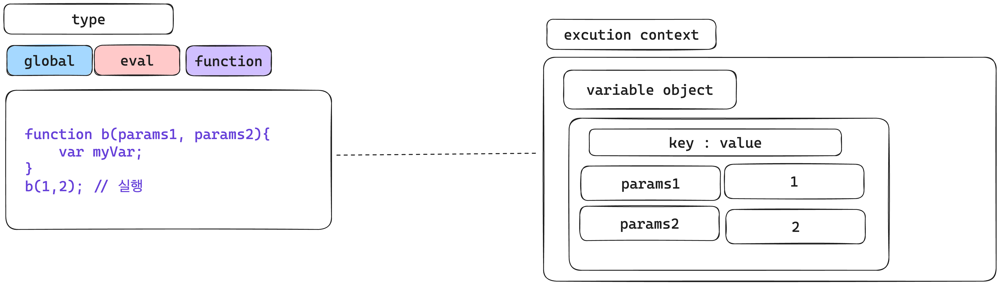
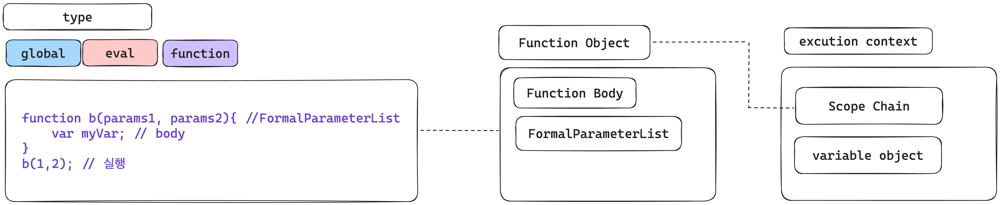
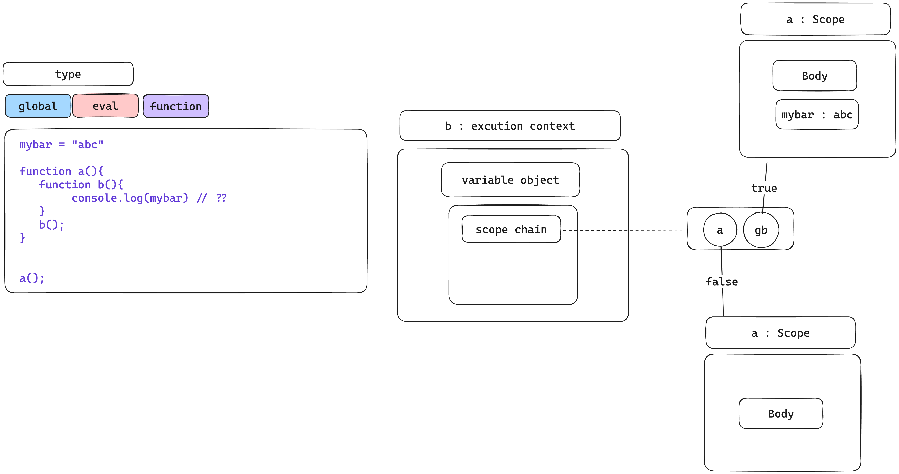

## 서론

Execution Context를 최근에 다시 공부하면서 정보가 엇갈리는 상황이 생겼습니다. Variable Object로 알고 있던 것이 Environment Record로 표현되고 있고 Scope Chain을 Outer Environment Reference로 한다던가 그러면 연결 리스트의 형태인 scope chain은 어디로 갔지? 하는 의문이 들었습니다.

문서들마다 설명이 조금씩 다르고 단어를 섞어쓰기도 하고 구글링을 하면 할 수록 점점 헷갈리기 시작하였고 결국 직접 ECMA Script Spec을 보고 판단해야겠다는 생각을 하게되었습니다.

이 글은 간단한 Execution Context의 설명과 es3부터 시작하여 es6까지의 Execution Context의 변화를 공식문서를 통해 확인하여 확실하게 알아가고자 합니다.

## **Execution Context?**

- **특정 부분이 실행되는 동안 필요한 모든 정보와 환경을 의미합니다.**
- 인터프리터는 순차적으로 실행하며 스코프단위로 실행 컨텍스트를 만듭니다.

```tsx
// 전역 컨텍스트 (1)
function onCount() {
	// 함수 컨텍스트
}
onCount()// (2)
// 전역 컨텍스트 (3)
```

직역하자면 문맥, 맥락, 전후사정(context) 실행(execution) 입니다. 한글로 직역하고 다시 보면 생각보다 쉽게 이해할 수 있습니다.


JS는 Call Stack에서 코드를 실행합니다. 이 과정은 맥락이 끊기는 시점(함수의 등장)에 따라 실행하는데, 맥락이 끊기고 새로운 주제의 글(함수)이 등장하면서 Call Stack이 추가되는 것을 볼 수 있습니다.

사람으로 치면 글의 맥락에 따라 읽어내려가며 이야기의 흐름속에 새로운 챕터(과거회상?)가 중간에 등장하여 해당 챕터를 읽고 다시 기존의 이야기 흐름으로 가는 것과 비슷하게 볼 수 있습니다.

Execution Context를 실행하는 Call Stack까지는 크게 문제가 되지 않았지만 Execution Context의 내용이 문제가 되었습니다. 이 내용이 문서마다 조금씩 다르게 표현되었고 정보를 엇갈리게 만들었습니다.

### Context Environment

실행 컨텍스트 내부에는 여러 정보가 존재합니다. 해당 정보들을 이용하여 변수의 값을 결정하거나 상위 스코프를 결정하고 참조하게됩니다.

컨텍스트 환경의 속성들은 여러단어로 불리고 있습니다.

- Environment : 컨텍스트 환경
- Variable Environment : 정적 환경
- Lexical Environment : 동적 환경
- this : this 결정
- Variable Object : 컨텍스트 구성요소
- Environment Record : 컨텍스트 구성요소
- Scope Chain : Scope 결정 요소
- OuterEnvironmentReference : 외부 환경 참조

겹치는 단어가 존재하고 동작이 헷갈리기도 합니다. 왜 이런 상황이 벌어졌을까요?

ECMA Script는 빠르게 발전해왔고 그 덕에 공식문서의 내용도 빠르게 변화해왔습니다. ES6를 넘어가고, 개발하며 기존에 사용하던 단어를 그대로 사용하거나 기존의 구조를 가져오거나 하는 일들이 생겼습니다.

빠르게 발전하고 네트워크에 방대한 정보가 존재하다보니 헷갈리는 경우가 더욱 많이 생긴 듯 합니다. 그렇다면 정확히 단어가 무엇을 의미하는 지 알 수 있는 방법은 무엇일까요?

## ECMAScript Specification

실행 컨텍스트에 관하여 ES3부터 천천히 살펴보겠습니다. ES3부터 알아보는 이유는 ES6부터 내려가던 중 처음으로 Variable Object라는 말이 등장하기 때문입니다.

직접 ECMAScript 문서를 보고 해석하여 작성한 것으로 틀린 해석이 있을 경우 댓글 부탁드립니다..!

## ES3

### Execution Conctexts

**Execution Context Type**

global - 전역 컨텍스트

eval - eval을 이용해 만든 코드는 외부 지역 변수에 접근가능합니다.

function code - 함수 기준 컨텍스트

- FormalParameterList : 함수의 매개변수를 분석하고 읽는 법.
    - 매개변수가 여러개일 경우 마지막 매개변수를 제외하고 모두 String으로 변환하고 comma를 기준으로 연결합니다.
    - 매개변수가 하나일 경우 따로 String으로 변환하지 않습니다.
    
    마지막 매개변수의 FunctionBody.FormalParameterList로 다른 매개변수를 해석합니다.
        
    - 위와 같이 매개변수가 2개 이상일 경우 마지막 매개변수를 제외하고는 문자열로 저장한다.
    - **문제 : 어떻게 문자열의 매개변수를 다시 가져올까?**
    - 추측 : param2로 FunctionBody 즉 자신의 함수에 접근하여 FormalParameterList를 mapping하여 params1과 같은 이름의 매개변수가 있을 경우 값을 불러오는 방식.

**예제 코드**

```tsx
function b(params1, params2){
  var myVar;
}

b(); // 실행
```

**Activation Object(활성 객체)**

arguments object를 이용하여 초기화합니다.

Variable Object의 초기 값은 Activation Object 입니다.

활성 객체는 순수한 값을 가지는 매커니즘이라고 할 수 있습니다. 불변하는 값이고 이것을 초기값으로 변수 객체가 사용합니다.

<aside>
💡 해당 객체의 멤버는 접근 가능하지만 객체 자체 접근은 불가능합니다.

</aside>

**변수 인스턴스화**

실행 컨텍스트가 선언한 변수나 함수의 매개변수를 해석하고 구조화한 결과를 Variable Object라고 하며 이것을  실행 컨텍스트에 입력하는 과정을 의미합니다.

- Variable Object : 변수나 함수를 선언했을 경우 변수 객체(variable object)의 속성에 추가됩니다. 변수 객체는 실행 컨텍스트의 내용물이라고 볼 수 있습니다. 함수의 매개 변수도 마찬가지로 변수 객체의 속성에 추가됩니다.

변수객체가 만들어지는 것을 조금 더 구체화해서 보면 다음과 같습니다.

1. **함수의 매개변수를 변수객체에 등록**
    - FormalParameterList로 매개 변수의 값을 분석하여  변수 객체에 속성을 추가합니다.
    - parameter가 같은 이름을 가질 경우 마지막 parameter의 값을 가집니다.
    - undefined 조건
        - parameter가 더 적은 값을 입력받은 경우 undefined로 출력됩니다.
        - 값이 제공되지 않은 경우 undefined로 초기화합니다.
    
    
    
2. **각각의 함수 선언**
    1. 해당 함수의 이름으로 함수 객체를 만듭니다.
    2. 변수 객체 속성에 같은 이름이 존재할 경우(같은지역변수) 덮어씁니다.
    3. 함수 객체(Function Object)
        1. FormalParameterList와 FunctionBody를 이용하여 함수 객체를 만듭니다.
        2. 함수 객체는 실행 컨텍스트의 Scope Chain에 등록합니다.
        
        
        

1. **변수 선언**
    1. 변수의 타입에 따라 다를 수 있지만 보통 undefined로 변수를 초기화합니다.

**Scope Chain**

객체를 연결 리스트형태로 보관하여 부모 함수나 전역 객체에 접근할 수 있도록 도와주는 매커니즘입니다.

- 실행 컨텍스트에서는 가장 먼저 변수의 값을 결정할 때 사용됩니다.

**변수 평가 알고리즘**

- Scope Chain을 따라 Root에 도달할 때까지 이동하고 HasProperty 메소드를 사용하여 해당 변수가 있는 지 확인합니다.
    - true : 해당 Scope Chain의 변수를 사용한다.
    - false : 이름은 그대로 사용하고 값은 null로 지정하여 리턴한다.



**Global Object(전역 객체)**

- 기본적으로 Math, String, Date, parseInt 와 같은 메소드를 내장 객체로 가지고 있습니다.
- global object에 직접 properties를 정의할 경우  전역 자체 객체에 정의됩니다.
    
    ```tsx
    window.hi = "hi"
    console.log(window.hi)
    > hi
    ```
    
- global object를 직접 변경할 경우 전역객체 그 자체가 변경된다는 것을 알고 있어야 합니다.

**this**

모든 실행중인 컨텍스트와 연관있으며 실행 컨텍스트를 조정할 때 this가 결정됩니다. 그래서 값이 고정적이지 않습니다.

**Arguments Object**

기본 메소드를 포함하는 객체입니다.

함수의 실행 컨텍스트가 실행되면 Arguments Object가 생성됩니다.

초기화는 다음과 같습니다.

- arguments.Prototype : Object.prototype의 초기 값입니다
- arguments.callee : function body 내부에서 현재 실행중인  함수를 참조하는데 사용합니다. 이로 인해 익명함수를 참조할 수 있습니다
- arguments.length : Number 혹은 입력된 값입니다..

<aside>
💡 Strict mode에서 callee 사용을 금지합니다. 
****- callee를 사용한 함수는 외부에서 접근이 가능해져서 보안상 문제가 생길 수 있습니다.

</aside>

**실행 컨텍스트의 생성과 종료**

- 생성
    
    모든 함수와 생성자 호출은 새로운 실행 컨텍스트를 생성하고 입력됩니다.
    
    - 재귀적으로 자신을 호출하더라도 같습니다.

- 종료
    
    모든 return 문은 실행 컨텍스트를 종료합니다. 
    
    던져진 예외가 잡히지 않은 경우, 하나 이상의 실행 컨텍스트를 종료할 수도 있습니다.
    

컨트롤이 실행 컨텍스트에 들어가면 스코프 체인이 생성되고 초기화 됩니다.

변수 인스턴스화가 실행되고 this값이 결정됩니다.

**Global Code**

scope chain을 만들고 global object를 포함하도록 초기화합니다.

변수 인스턴스화는 전역 객체를 변수 객체로 사용하여 수행합니다.

this value는 global object이다.

**Eval Code 설명x**

## ES4

문서 키워드 : execution model, Definitions, strict mode

**ES4 결론** 

- Execution Context라는 말이 존재하지 않습니다.
    - 추측해보자면 실행 컨텍스트의 방향성이나 변경사항은 크게 없기 때문에 언급하지 않는 것으로 보입니다.
- es4에서부터 Strict mode가 등장합니다.
- Execution Context 대신 Execution Model이 존재합니다.
    - 이유는 Strict mode가 추가되며 실행에 관련하여 변경된 부분을 설명하기 위해서로 보입니다.
- class 문법이 생겼습니다.

### Execution Model

 parsing, verification, evaluation 3단계로 진행됩니다.

유효하지 않을 경우 중간에 종료됩니다.

dialects? : 방언이라는 뜻의 영어단어가 나오는데 내부적으로 새로쓰이는 규칙의 언어를 뜻하는걸까?

이 언어의 사양은 용어의 설명에 두개의 방언이 존재합니다. 방언은 추가적인 검증 규칙이 있는 것이 다른 점입니다. 좀 더 관대한 검증 규칙이 있는 방언이 표준 방언(standard)이며 제한적인 것이 엄격방언(strict)입니다.

- strict mode를 의미하는 듯합니다.

**Parsing**

프로그램에 적합한 내부 형식으로 소스코드를 변환하는 작업입니다.

**verification(인증)**

이 단계는 엄격한 의미의 언어를 준수하는지 확인합니다.

standard dialect : 검증이 어떤 구문이 처음 평가되기 전 언제든지 수행될 수 있습니다.

strict dialect:  프로그램의 어떤 부분이 평가되기 전에 반드시 검증이 이루어져야 합니다.

지금부터는 표준언어, 엄격 언어로 사용하겠습니다.

표준언어 내에 엄격언어가 존재합니다. 그래서 표준언어를 사용하는 프로그램은 엄격언어의 룰안에서 사용할 수 없지만 엄격언어를 사용하는 프로그램은 표준언어의 룰안에서 사용할 수 있습니다.

**evaluation(평가)**

파싱, 검증단계를 거치고 평가하여 호스트 환경에서 Side Effect와 최종 값을 생성합니다. 

평가는 표준언어, 엄격언어 동일하게 진행됩니다.

**Compile time constant expressions**

프로그램의 한가지라도 실행되기 전에 compile time에 값이 결정될 수 있는 표현식입니다.

Compile time constant expressions 아래의 표현식들로 구성됩니다:

- null, Number, Boolean 및 String과 같은 리터럴
- 값이 컴파일 시간 상수인 속성에 대한 참조
- 컴파일 시간에 결과를 계산할 수 있는 연산자

특정 맥락에서의 표현식은 Compile time constant expressions이어야 합니다.

- 유형 주석
- 상속 절 참조
- 속성
- pragma 인수 (예: use namespace ns2)

이 중에서 상속 절 참조와 속성은 순환 참조를 가져서는 안 됩니다.

### **Strict Verification**

신뢰성 있는 프로그램을 만들기 위해 Standard언어의 subset으로 Strict 언어를 만들었습니다. Strick 언어는 신뢰성을 위한 3가지 제약 조건이 존재하며 아래와 같습니다.

- 인증에러는 타입에러와 정적 타입 표현식 에러가 있습니다.
- 추가된 인증 에러 룰에는 공통된 프로그래밍 에러도 잡힙니다.
- 인증 에러는 코드가 제출되기 전에 미리 알 수 있습니다.

**Type errors**

Standard 언어는 유효하지만 Strict 언어는 유효하지 않은 경우에 생기는 에러입니다.

```tsx
class A {}
class B extends A {}
var a : A = new B
var b : B = a

// type error, static type of ‘a’ is A,
// which is incompatible with B
```

Standard 언어일 경우 에러가 생기지 않습니다. 그 이유는 type error는 런타임에 생깁니다. 런타임의 A값은 B의 인스턴스이고 B는 A를 포함하고 있기 때문에 이미 런타임에서는 같은 값을 넣은 것으로 착각하게 됩니다. 

- 타이밍 이슈로 에러를 감지하지 못합니다.

**Strict errors**

엄격 언어는 호환성과 유연성을 위해 허용되는 일반적인 프로그래밍 실수를 잡기 위해 다양한 의미론적 오류를 추가합니다.

엄격 모드의 오류 종류입니다.

- function call signature matching : 함수 호출 시그니처 일치 오류
- duplicate definition conflicts : 중복 정의 충돌
- unbound references : 바인딩되지 않은 참조 오류
- dynamic addition of properties on sealed objects : 봉인된 객체에 대한 속성의 동적 추가
- writing to const variables : 상수 변수에 쓰기 시도
- deleting fixed properties : 고정된 속성의 삭제 시도
- comparison expressions with incompatible types : 호환되지 않는 유형의 비교 표현식
- unfound packages : 찾을 수 없는 패키지 오류

전편 끝.
