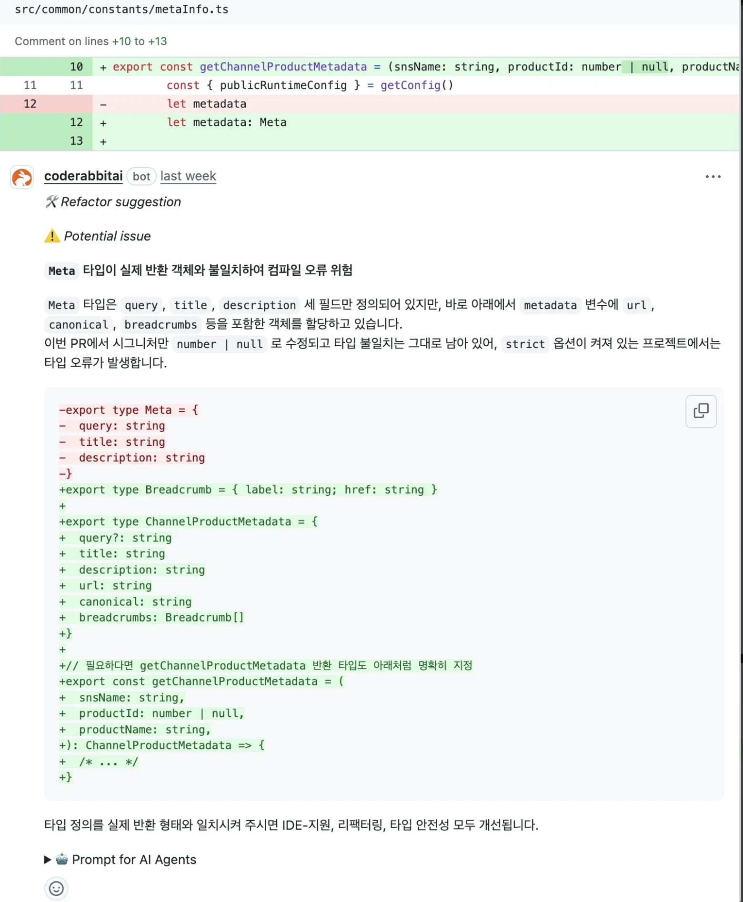
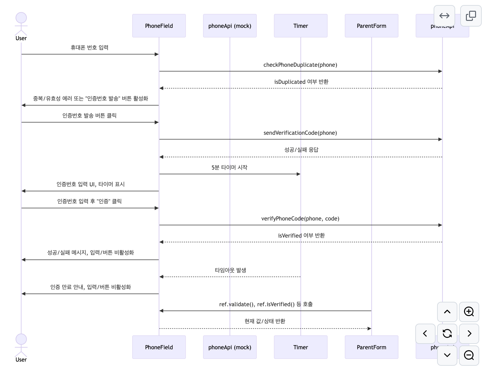
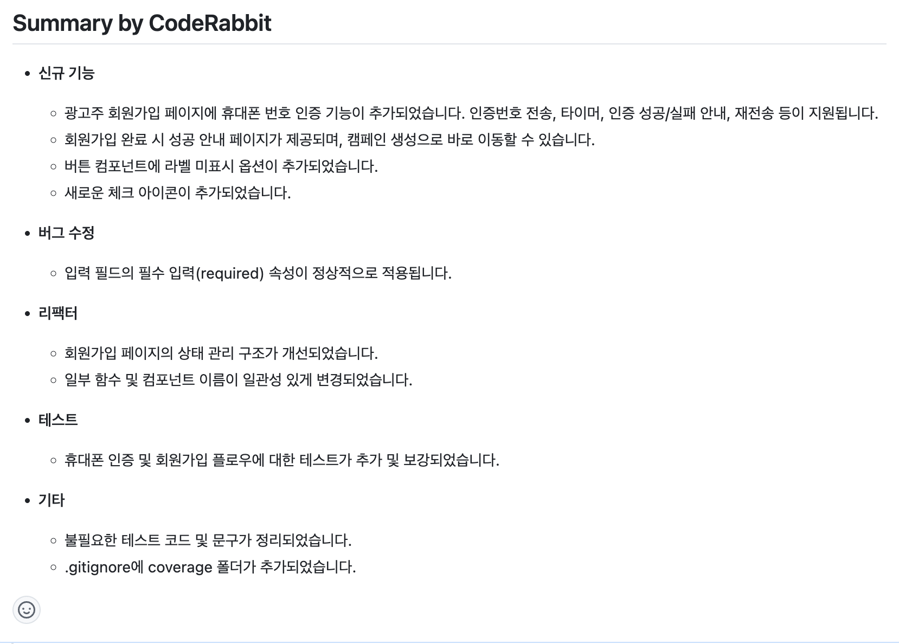
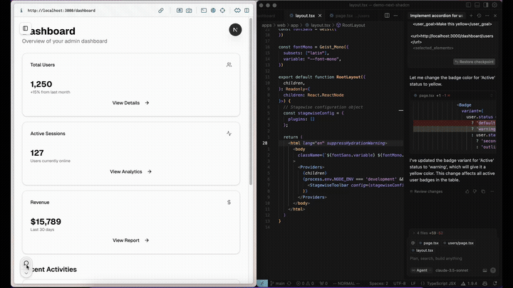

# AI 활용(Cursor, Stagewise, CodeRabbit)

## CodeRabbit
- 코드리뷰 AI!

### .coderabbit.yaml 설정

#### 기본 설정
- `language`: `ko-KR`
- `early_access`: `true` 또는 `false`  
  → 얼리액세스 기능 사용 여부
- `enable_free_tier`: `true` 또는 `false`  
  → 유료요금제가 아닌 경우 자동으로 무료 기능 사용

#### chat
- `auto_reply`: 챗봇이 자동으로 질문에 응답할지 여부

#### knowledge_base
- `opt_out`: true (조직의 지식 학습 기능 비활성화)
- `learnings.scope`: auto / full / minimal

### auto_review 설정
| 키 | 설명 | 예시 값 | 기본값 |
|----|------|--------|--------|
| enabled | 자동 리뷰 기능 활성화 여부 | true / false | true |
| auto_incremental_review | 변경된 부분만 점진적으로 리뷰할지 여부 | true / false | true |
| drafts | Draft PR에도 리뷰할지 여부 | true / false | false |
| path_instructions | 경로별 리뷰 지침 설정 | - | - |

### labeling_instructions
| 키 | 설명 | 예시 값 | 기본값 |
|----|------|--------|--------|
| label | PR/MR 라벨 이름 | "api", "fe" 등 | 없음 |
| instructions | 해당 라벨이 적용될 조건이나 설명 | "백엔드 관련" 등 | 없음 |

### reviews
| 키 | 설명 | 예시 값 | 기본값 |
|----|------|--------|--------|
| profile | 리뷰 톤 설정 | assertive, chill, friendly, formal | assertive |
| request_changes_workflow | 변경 요청 상태 여부 | true / false | false |
| high_level_summary | 전체 변경사항 요약 여부 | true / false | true |
| poem | 리뷰에 시 포함 여부 | true / false | false |
| review_status | 리뷰 상태 헤더 표시 여부 | true / false | true |
| collapse_walkthrough | 코드 설명 접기 여부 | true / false | false |
| sequence_diagrams | 시퀀스 다이어그램 생성 여부 | true / false | false |
| changed_files_summary | 변경 파일 요약 여부 | true / false | true |
| abort_on_close | PR 닫히면 리뷰 중단 여부 | true / false | true |

#### 예시 설정
```yaml
language: "ko-KR"
early_access: true

reviews:
  profile: "assertive"
  request_changes_workflow: true
  high_level_summary: true
  poem: false
  review_status: true
  collapse_walkthrough: true
  sequence_diagrams: true
  changed_files_summary: true
  abort_on_close: true
  review_process:
    auto_start: true
  labeling_instructions:
    - label: api
      instructions: "API 인터페이스 또는 호출 로직 변경 시"
    - label: fe
      instructions: "프론트엔드 기능, UI, UX 관련 변경 시"
    - label: test
      instructions: "테스트 코드 또는 테스트 설정 변경 시"
    - label: chore
      instructions: "빌드, CI/CD, 설정, 패키지 등 비즈니스 로직 외 변경 시"
    - label: docs
      instructions: "문서 파일이나 주석 변경 시"
  auto_review:
    enabled: true
    auto_incremental_review: true
    drafts: false
  path_filters:
    - "!**/swagger.json"
    - "!**/README.md"
  path_instructions:
    - path: "/e2e_tests"
      instructions: >
        E2E 테스트 디렉토리입니다. Playwright 기반 테스트 코드를 리뷰합니다.
        테스트의 목적, 사용자 플로우 커버 여부를 중점적으로 확인해주세요.
    - path: "src/**/*.ts"
      instructions: >
        TypeScript 코드 전반을 리뷰합니다. 타입 안정성, Solid 원칙 준수, 의존성 최소화를 검토해주세요.
    - path: "src/**/*.ts"
      instructions: >
        ### UI 컴포넌트 리뷰
        - 재사용 가능하도록 구성되었는지 확인
        - Props 최소화 및 명확성 유지
        - Tailwind / MUI 혼용 시 스타일 일관성 유지
        - 상태 관리는 상위 도메인에서 담당하는 구조인지 확인
    - path: "**/__tests__/*.spec.ts"
      instructions: >
        Jest 기반 테스트 코드를 리뷰합니다. 단위 테스트 범위와 의미 있는 커버리지를 중점적으로 확인해주세요.
    - path: "src/app"
      instructions: >
        ### 도메인 구조 리뷰 (Next.js App Router 기반)
        - URL 구조를 반영한 디렉토리 구조인지 확인
        - UI 컴포넌트와의 의존성이 잘 분리되어 있는지 확인
        - 도메인 로직이 분리되어 있고, 필요시 hooks/services로 추출되었는지 확인
        - 경로 규칙을 따르지 않는 경우 "_" prefix 사용 여부 확인
        - src/components 내부에 있는 파일인데 mui를 사용하고 있는지 확인.
chat:
  auto_reply: true
knowledge_base:
  opt_out: true
  learnings:
    scope: auto
```
<div>
  
  
  
</div>

## Stagewise + Cursor

https://github.com/stagewise-io/stagewise?utm_source=substack&utm_medium=email

### 장점
- UI상 정확한 지점에 명령 가능
- 스타일 명령이 정확히 동작 (Cursor 단독 사용 시 엉뚱한 지점 수정 문제 해결)


### 설치 방법
```bash
pnpm i -D @stagewise/toolbar
```

### Cursor 설정
1. Cursor에서 `CMD + Shift + P`
2. `setupToolbar` 입력
3. 명령 실행

### AppRouter 설정
`app/layout`에서 StagewiseToolbarClient 로드:

```tsx
import dynamic from 'next/dynamic'

const StagewiseToolbarClient = dynamic(() => import('./_components/StagewiseToolbarClient'), {
	ssr: false,
})


export default function RootLayout({
	children,
}: Readonly<{
	children: React.ReactNode
}>) {
	return (
		<html lang="en">
			<body id="__next">
				{process.env.NODE_ENV === 'development' && <StagewiseToolbarWrapper />}
				 ...
			</body>
		</html>
	)


```

### StagewiseToolbarClient 구성
```tsx
'use client'

import { useEffect } from 'react'
import { initToolbar } from '@stagewise/toolbar'

const stagewiseConfig = {
  plugins: [],
}

export default function StagewiseToolbarWrapper() {
  useEffect(() => {
    if (process.env.NODE_ENV === 'development') {
      try {
        initToolbar(stagewiseConfig)
      } catch (error) {
        console.error('Failed to initialize Stagewise toolbar:', error)
      }
    }
  }, [])

  return null
}
```

