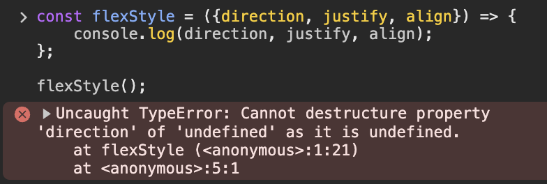

# RORO 패턴

## Preview

### 기존 코드

```javascript
// 선언부
export const flexStyle = (direction = 'row', justify = 'center', align = 'center') => css`
    display: flex;
    flex-direction: ${direction};
    justify-content: ${justify};
    align-items: ${align};
`;

// 호출부
${flexStyle()};
${flexStyle('', 'space-between', '')};
${flexStyle('column', 'flex-start', 'center')};
```

### RORO 패턴 적용 코드

```javascript
export const flexStyle = ({ direction = 'row', justify = 'center', align = 'center' } = {}) => css`
    display: flex;
    flex-direction: ${direction};
    justify-content: ${justify};
    align-items: ${align};
`;

${flexStyle()};
${flexStyle({ justify: 'space-between' })};
${flexStyle({ direction: 'column', justify: 'flex-start'})};
```

## RORO 패턴?

**"객체로 받고 객체로 반환한다(Receive an object, Return an object)"** 는 의미를 가지는 **Javascript 디자인 패턴**

## RORO 패턴의 장점

### 1. 유추하기 쉬운 인수 값

```javascript
${flexStyle('', 'space-between', '')}; // 첫 번째, 두 번째, 세 번째 인수가 각각 뭐지..?
```

- Preview의 기존 코드에서는 처음 보는 사람들은 각 인수가 어떤 값인지 유추하기 힘들다.

```javascript
const flexStyle = ({ direction, justify, align }) => css`
...
`

${flexStyle({
    direction: 'column',
    justify: 'space-between',
    align: 'center',
})};
```

- 함수 파라미터에 중괄호를 감싼 것을 제외하고 동일한 코드이다.
- **ES6의 구조분해할당**으로 인해 가능한 방법이다.
- 기존의 방식과 달리 각 인수값이 모호하지 않고 명확해졌다.

### 2. 명료한 인수 기본 값



- 인수를 전달하지 않고 함수를 호출하면 위와 같은 에러가 뜬다.

#### 빈 객체를 default로 설정

```javascript
const flexStyle = ({ direction, justify, align } = {}) => css`
...
`
```

#### 각 인자에 default 값 설정

```javascript
const flexStyle = ({ direction = 'row', justify = 'center', align = 'center' } = {}) => css`
...
`
```

### 3. 더 많은 정보 반환

- Javascript에서는 함수에서 한 가지 값만 반환할 수 있지만, 객체를 이용하여 더 많은 정보를 반환할 수 있다.

```javascript
const flexStyle = () => {
  return {
    info1,
    info2,
    info3,
  }
}

const { info1, info2, info3 } = flexStyle()
```

### 4. 용이한 함수 합성

```javascript
composeFunction(f, g)(x) = f(g(x))
```

- 합성 함수란 두 개 이상의 함수를 합성하여 만들어 낸 함수이다.

```javascript
function composeFunction(...fns) {
  return (param) => fns.reduce((result, fn) => fn(result), param)
}
```

- fns에는 합성할 함수 객체가 전달되고, reduce 메서드의 정의에 따라 전달된 함수는 순차적으로 실행된다.
- fn의 인수로는 바로 직전 함수의 결과가 전달되고, 마지막 fn 함수가 반환한 값이 composeFunction의 반환값이 된다.

```javascript
// 사용 예시
const example = composeFunction(func1, func2, func3)
example(info)
```

- example에 전달된 info 값은 순서대로 func1, func2, func3를 거친다.
- 만약, 합성 함수가 아니라면 다음과 같은 형태로 동일한 결과를 얻을 수 있다.

```javascript
func3(func2(func1(info)))
```

## 결론

- 기존에 사용한 방식에 비해 인자에 객체를 전달함으로써 함수 호출 시 빈 인수 값을 전달할 필요가 없어지므로 가독성이 올라간다.
- 구조 분해를 거치려면 함수 실행에 부하가 조금이라도 더 늘어나기 때문에 지나친 사용은 성능 문제를 일으킬 수 있다.
- [RORO 패턴의 원글](https://dev.to/billsourour/elegant-patterns-in-modern-javascript-roro-5b5i) 작성자는 모든 곳에 RORO 패턴을 적용시키는 것이 아닌 적재적소에 적용한다고 한다.
