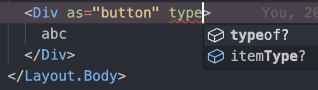
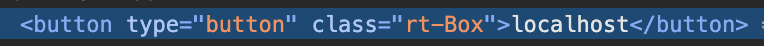

# asChild

# as

Styled-component에서, 렌더링되는 html 요소를 바꾸고 싶을 때 사용하는 prop

> To use styles from a styled component but change the element that's rendered, you can use the `as` prop.

```jsx
// button이 아닌 a 태그로 렌더링됨
<Button as="a" href="https://github.com/emotion-js/emotion">
  Emotion on GitHub
</Button>
```

# asChild

Radix에서, 렌더링된 html 요소를 바꾸고 싶을 때 사용하는 prop

> 개발자 경험 당사의 주요 목표 중 하나는 최상의 개발자 경험을 제공하는 것입니다. Radix 프리미티브는 완전한 타입의 API를 제공합니다. 모든 컴포넌트는 유사한 API를 공유하여 일관되고 예측 가능한 경험을 제공합니다. 또한 사용자가 **렌더링된 요소를 완벽하게 제어할 수 있도록** asChild 프로퍼티를 구현했습니다.

```jsx
import { Button } from '@radix-ui/themes';

function App() {
  return (
    // localhost라는 앵커 컴포넌트가 렌더됨
    <Button asChild>
      <a href="localhost">localhost</a>
    </Button>
  );
}
```

→ Radix의 `Button` 컴포넌트의 디자인을 사용하면서도, `button` 태그가 아닌 `a` 태그로 렌더할 수 있음

`as` prop과 달리 렌더링된 요소를 제어할 수 있다는 장점이 있음

- `as` prop을 사용하는 경우
  - `button` 태그로 렌더링되길 원하지만, `type=’button’` prop을 전달할 수 없음
  - 즉, 렌더링될 요소를 완벽히 제어할 수 없음



- `asChild` prop을 사용하는 경우
  - 렌더링되길 원하는 요소를 직접 작성하는 형식
  - 즉, 렌더링될 요소 제어 가능
    ```jsx
    <Box asChild>
      <button type="button">localhost</button>
    </Box>
    ```
  - 인스펙터에서 확인해보면
    

## asChild는 어떻게 구현되었나

- 예시 코드 - `Button` 컴포넌트
  ```jsx
  const BaseButton = React.forwardRef<BaseButtonElement, BaseButtonProps>((props, forwardedRef) => {
    const { size = baseButtonPropDefs.size.default } = props;
    const {
      className,
      children,
      asChild,
      color,
      radius,
      disabled = props.loading,
      ...baseButtonProps
    } = extractProps(props, baseButtonPropDefs, marginPropDefs);
    const Comp = asChild ? Slot : 'button'; // here
    return (
      <Comp
        // The `data-disabled` attribute enables correct styles when doing `<Button asChild disabled>`
        data-disabled={disabled || undefined}
        data-accent-color={color}
        data-radius={radius}
        {...baseButtonProps}
        ref={forwardedRef}
        className={classNames('rt-reset', 'rt-BaseButton', className)}
        disabled={disabled}
      >
  ```
  - `Slot` 컴포넌트를 사용한다는 것을 알 수 있음
- `Slot` 컴포넌트란? **props를 children에 머지하는 용도**

  ```jsx
  const Slot = forwardRef((props, ref) => {
    const { children, ...slotProps } = props;

    // ...

    return (
      <SlotClone {...slotProps} ref={ref}>
        {children}
      </SlotClone>
    );
  });

  const SlotClone = forwardRef((props, ref) => {
    const { children, ...slotProps } = props;

    if (React.isValidElement(children)) {
      return React.cloneElement(children, {
        ...mergeProps(slotProps, children.props),
        ref: ref ? composeRefs(ref, children.ref) : children.ref,
      });
    }

    return React.Children.count(children) > 1 ? React.Children.only(null) : null;
    // only: children이 유효한 엘리먼트라면 그 엘리먼트를 반환
  });
  ```

→ **polymorphic한 컴포넌트를 만들고 싶다면 Slot을 사용하는 것도 방법!**

- radix에서 slot을 패키지로 따로 제공 중 `@radix-ui/react-slot`

# Ref

- [https://github.com/radix-ui/primitives/blob/main/packages/react/slot/src/Slot.tsx](https://github.com/radix-ui/primitives/blob/main/packages/react/slot/src/Slot.tsx)
- [https://github.com/radix-ui/themes/blob/main/packages/radix-ui-themes/src/components/base-button.tsx](https://github.com/radix-ui/themes/blob/main/packages/radix-ui-themes/src/components/base-button.tsx)
