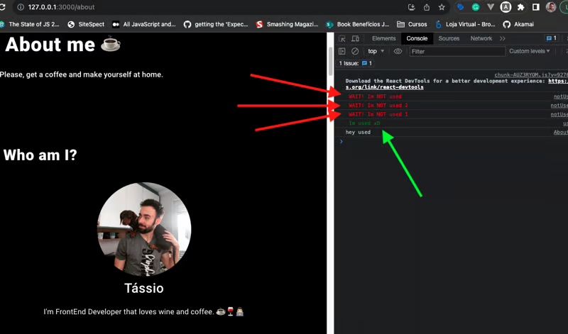
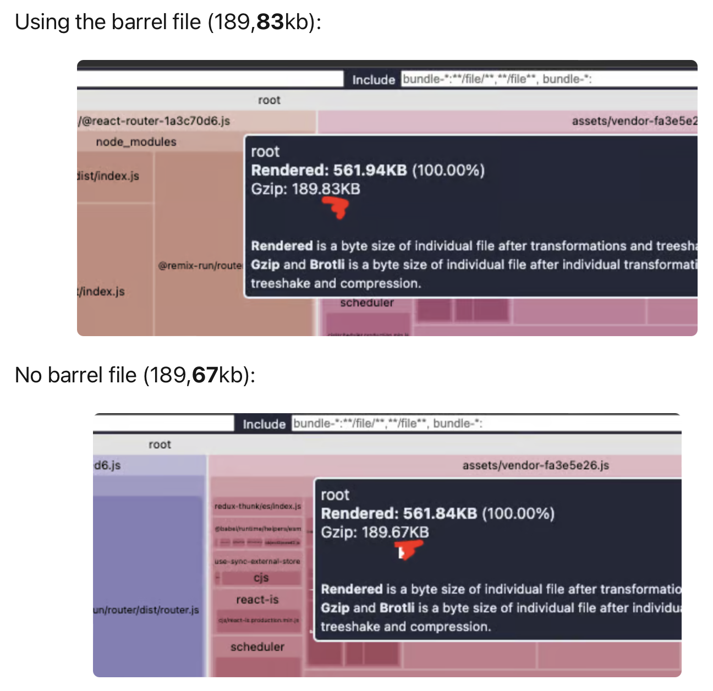
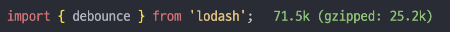
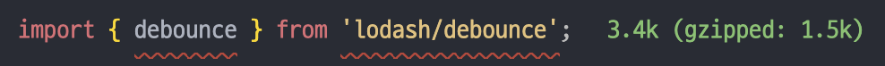

# Barrel 패턴을 사용하지 말아야 한다?

# Barrel이란?

여러 모듈을 하나의 모듈로 묶어 export 하는 방법을 barrel 패턴이라 부르고 이때, 하나의 모듈 파일을 barrel 이라고 합니다.

예를 들어 하나의 라이브러리 안에 다음과 같이 3개의 모듈이 있을 때,

```tsx
// demo/foo.ts
export class Foo {}

// demo/bar.ts
export class Bar {}

// demo/baz.ts
export class Baz {}
```

이 모든 모듈을 한 파일에서 import하여 사용하려면 다음과 같이 3개의 import 문을 작성해야 합니다.

```tsx
import { Foo } from '../demo/foo';
import { Bar } from '../demo/bar';
import { Baz } from '../demo/baz';
```

이때, 다음과 같이 export한 각각의 모듈을 barrel 파일을 만들어 re-export해주면

```tsx
// demo/index.ts
export * from './foo'; // re-export all of its exports
export * from './bar'; // re-export all of its exports
export * from './baz'; // re-export all of its exports
```

하나의 import 문으로 3가지 모듈을 불러올 수 있게 됩니다.

```tsx
import { Foo, Bar, Baz } from '../demo'; // demo/index.ts is implied
```

# Barrel 패턴이 app 번들에 미치는 영향

Barrel 패턴을 사용하면 import문이 깔끔해져 보기 좋다는 장점이 있지만, **barrel 파일의 모듈 중 하나라도 import한다면 해당 파일의 모든 모듈들이 import된다**는 단점이 있습니다.

예를 들어, 다음과 같이 4개의 모듈과 그 모듈을 re-export하는 barrel 파일이 있다고 가정해 봅시다.

```tsx
// now there are 4 files in barrelFiles folder

// ./barrelFiles/used.ts
export const HEY = 'hey used';
console.log('%c Im used xD', 'color: green;');

// ./barrelFiles/notUsed.ts
export const HEY_NOT_USED = 'hey NOT used';
console.log('%c WAIT! Im NOT used', 'color: red');

// ./barrelFiles/notUsed1.ts
export const HEY_NOT_USED_1 = 'hey NOT used 1';
console.log('%c WAIT! Im NOT used 1', 'color: red');

// ./barrelFiles/notUsed2.ts
export const HEY_NOT_USED_2 = 'hey NOT used 2';
console.log('%c WAIT! Im NOT used 2', 'color: red');
```

```tsx
// ./barrelFiles/index.ts
export { HEY_NOT_USED } from './notUsed';
export { HEY_NOT_USED_2 } from './notUsed2';
export { HEY_NOT_USED_1 } from './notUsed1';
export { HEY } from './used';
```

## barrel 파일에서 import

이 중 HEY를 사용하기 위해 barrel 파일에서 가져오는 경우, 기대와는 다르게 사용하지 않으려했던 모듈들도 함께 import 됩니다.

```tsx
import { HEY } from './barrelFiles';
```



## 모듈 자체를 import

반면 barrel 파일에서 가져오지 않고, 사용하려는 모듈에서 가져온다면 하나의 모듈만 import 됩니다.

```tsx
import { HEY } from './barrelFiles/used';
```


위 현상으로 미루어보았을 때, barrel 파일에서 export하는 모듈이 많으면 많을 수록 번들 사이즈가 커진다는 것을 알 수 있습니다.

번들 사이즈를 측정해 봤을 때, barrel 파일을 사용하는 것보다 사용하지 않는 것이 번들 사이즈가 더 작은 것을 확인할 수 있습니다.



(위 차이는 작은 규모의 앱이기 때문에 작은 편이고, 이는 앱의 규모가 클수록 커집니다.)

라이브러리에서 import할 때도, 최대한 barrel을 거치지 않는 것이 import 사이즈를 줄이는 데에 도움이 됩니다.





또한, barrel 파일을 사용할 때 [순환 참조 이슈](https://docs.nestjs.com/fundamentals/circular-dependency)가 발생할 수도 있으니 주의가 필요합니다.

# Barrel 패턴이 유닛 테스트에 미치는 영향

Vitest와 Jest와 같은 단위 테스트 엔진이 Vite와 Webpack과 같은 번들 최적화에 신경 쓰지 않는다면, barrel 패턴을 사용하는 것이 성능을 악화시킬 수 있다고 합니다.

helper와 helper2 모듈을 /helper라는 barrel 파일에서 re-export한다고 가정해 봅시다.

```tsx
// ./helper.ts
import { HEY } from './barrelFiles';
export const helper = () => {
  console.log(HEY);
};

// ./helper2.ts
import { HEY } from './barrelFiles';
export const helper2 = () => {
  console.log(HEY);
};
```

그리고 barrel 파일에서 테스트하려는 모듈을 import 합니다.

```tsx
// ./helper.epec.ts
import { describe, it } from 'vitest';
import { helper } from './helper';

describe('helper', () => {
  it('Should only use HEY', () => {
    helper();
  });
});

// ./helper2.epec.ts
import { describe, it } from 'vitest';
import { helper2 } from './helper2';

describe('helper2', () => {
  it('Should only use HEY', () => {
    helper2();
  });
});
```

위 코드로 테스트를 하면 사용하지 않는 모듈의 console.log가 모두 실행되며, barrel 파일을 사용하지 않는 경우보다 더 오랜 시간이 소요됩니다.

# 결론

barrel 파일을 사용할 때 발생할 수 있는 부수 효과에 대해 알아봤습니다.

일반적으로 빌드 시스템이 존재하는 아키텍처에서는 **트리 쉐이킹**을 통해 사용되지 않는 모듈을 제거하는 최적화를 진행하기 때문에 위와 같은 이슈에 대해서는 크게 걱정하지 않아도 될 듯하지만,

기본적으로 모듈이 이런 식으로 작동한다는 점을 알아둔다면 빌드 시스템이 없는 아키텍처를 사용할 때 도움이 될 것이라 생각합니다.

단, barrel 파일을 사용하면서 발생할 수 있는 순환 참조 문제에 대해서는 주의하는 게 좋을 듯 합니다!

# 참고

[https://basarat.gitbook.io/typescript/main-1/barrel](https://basarat.gitbook.io/typescript/main-1/barrel)

[https://dev.to/tassiofront/barrel-files-and-why-you-should-stop-using-them-now-bc4](https://dev.to/tassiofront/barrel-files-and-why-you-should-stop-using-them-now-bc4)
