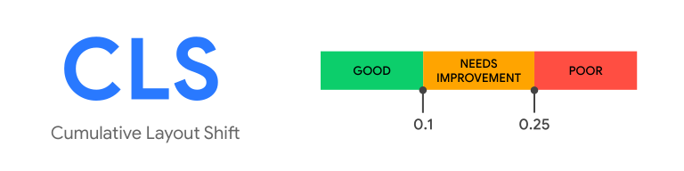

# 코어 웹 바이탈

코어 웹 바이탈은 웹사이트에서 뛰어난 사용자 경험을 제공하는 데 필수적인 지표를 일컫는 용어입니다.

이 지표는 구글에서 제시한 것으로, 어떤 것이 좋은 웹 사이트인지 일관되게 판단할 수 있도록 합니다.

구글에서 핵심적이라고 꼽은 지표는 다음과 같습니다.

- `LCP(Largest Contentful Paint)` - 최대 콘텐츠풀 페인트
- `FID(First Input Delay)` - 최초 입력 지연
- `CLS(Cumulative Layout Shift)` - 누적 레이아웃 이동

그리고 핵심은 아니지만, 특정 문제 진단에 사용할 수 있는 지표가 더 있습니다.

- `TTFB(Time To First Byte)` - 최초 바이트까지의 시간
- `FCB(First Contentful Paint)` - 최초 콘텐트풀 시간

각 지표가 무엇을 의미하는지 살펴보겠습니다.

# LCP: 최대 콘텐츠풀 페인트

LCP는 **페이지가 처음으로 로드를 시작한 시점부터 뷰포트 내부에서 가장 큰 이미지 또는 텍스트를 렌더링하는 데 걸리는 시간**을 의미합니다.

즉, 뷰포트 내부에서 가장 큰 요소의 렌더링에 초점을 맞춘 지표로 **뷰포트 밖에 있는 요소는 고려하지 않습니다.**

## 큰 이미지 또는 텍스트란 무엇인가?

최대 콘텐츠풀 페인트에 고려되는 요소는 다음과 같이 정의돼 있습니다.

- ``
- `<svg>` 내부의 `<image>`
- poster 속성을 사용하는 `<video>`
  - poster: 동영상이 로드되기 전에 표시할 이미지 파일 (썸네일)
- url()을 통해 불러온 배경 이미지가 있는 요소
- 텍스트와 같이 인라인 텍스트 요소를 포함하고 있는 블록 레벨 요소
  - 이 블록 레벨 요소에는 
, 
 등이 포함됨

## 좋은 LCP 점수는?

LCP에서 좋은 점수란 **2.5초** 내로 응답이 오는 것입니다. 4초가 넘어간다면 나쁨으로 판단합니다.

## 왜 핵심 지표가 되었을까?

사용자가 페이지 로딩을 체감하기 위해서는 반드시 페이지가 완전히 로딩될 필요는 없습니다. 페이지 전체가 로딩돼 있지 않더라도 일단 **사용자에게 노출되는 부분만 로딩돼 있다면** 사용자는 페이지 로딩을 체감할 수 있을 것입니다.

즉 ,사용자에게 노출되는 **뷰포트에 메인 콘텐츠가 화면에 완전히 전달되는 속도를 측정하면 페이지가 로딩이 완료됐다고 체감하게 되는 시간**을 비슷하게 측정할 수 있을 것입니다.

## 가장 큰 요소가 페이지에서 가장 중요한 요소가 아니라면?

페이지에서 가장 중요한 요소가 가장 큰 요소와 동일하지 않을 수 있습니다. 그럴 땐 [Element Timing API](https://wicg.github.io/element-timing/)를 사용해 직접 다른 요소의 렌더링 시간을 측정하면 됩니다.

## 어떻게 해야 점수를 높일 수 있나?

**뷰포트를 텍스트로 채우는 것**이 좋은 점수를 얻는 가장 확실한 방법입니다. 이미지를 아무리 최적화하더라도 텍스트 노출이 더 빠르기 때문입니다.

텍스트로 채울 수 없다면 **이미지 로딩을 최적화**해야 합니다.

# FID: 최초 입력 지연

FID는 **웹사이트의 반응성을 측정하는 지표**입니다. **사용자가 페이지와 처음 상호작용할 때 해당 상호 작용에 대한 응답으로 브라우저가 실제로 이벤트 핸들러 처리를 시작하기까지의 시간**을 측정합니다.

즉, 얼마나 빠르게 웹페이지와의 상호작용에 대한 응답을 받을 수 있는지를 측정하는 지표입니다. 이때 모든 입력이 아닌 최초의 입력에 대해서만 판단합니다.

## 입력에 해당하는 요소는 무엇인가?

다양한 입력 중 FID가 관심있는 입력은 다음과 같습니다.

- 클릭
- 터치
- 타이핑

그 외 핀치 투 줌, 스크롤 등은 사용자의 입력이 아닌 애니메이션으로 분류합니다.

## 좋은 FID 점수는?

FID에서 좋은 점수란 **100ms** 이내에 응답이 오는 것입니다. 300ms가 넘어간다면 나쁨으로 판단합니다.

## FID가 나쁘다면?

FID 점수가 나쁘면 사용자는 웹페이지가 멈춰있는 것처럼 느끼게 됩니다.

## 이벤트에 대한 반응은 왜 늦어질까?

대부분의 이유는 입력을 처리해야 하는 브라우저의 메인 스레드가 바쁘기 때문입니다. 대규모 렌더링이 일어나고 있거나, 대규모 자바스크립트를 분석하고 실행하는 등 다른 작업에 리소스를 할애하고 있으면 메인 스레드는 바쁜 상태가 됩니다.

이렇게 메인 스레드가 바쁘다면 자바스크립트 실행 환경은 싱글 스레드이기 때문에 자바스크립트가 이벤트 리스너 같은 다른 작업을 실행할 수 없어 지연이 발생합니다.

즉, **메인 스레드가 처리해야 하는 다른 작업이 많을 수록 이벤트에 대한 반응은 늦어집니다.**

## 이벤트 리스너가 없다면?

FID는 **이벤트 리스너가 등록되지 않은 경우에도 측정됩니다**. FID는 이벤트가 수신된 시점부터 메인 스레드가 유휴 상태가 되는 시점 사이의 시간을 측정하기 때문입니다. 따라서 리스너가 없더라도 측정이 가능합니다.

## 왜 첫 번째 입력만 측정할까?

첫 번째 입력은 사이트 반응성에 대한 사용자의 **첫인상**이기 때문입니다. 또한, 가장 큰 상호작용 문제는 페이지를 로드하는 중에 발생하기 때문입니다.

따라서 초기에는 사이트의 첫 번째 사용자 상호작용을 개선하는 데 집중하는 것이 웹의 전반적인 상호작용을 개선하는 데에 큰 영향을 미친다고 볼 수 있겠습니다.

## 이벤트가 발생하지 않는다면?

모든 사용자가 방문할 때마다 사이트와 상호작용하는 것은 아니며 모든 상호작용이 FID와 관련이 있는 것이 아닙니다. 즉, FID 값이 없는 사용자, 낮은 사용자, 높은 사용자가 있을 수 있습니다.

## 어떻게 해야 점수를 높일 수 있나?

FID를 개선하기 위해서는 메인 스레드에 이벤트를 실행할 여유를 줘야 합니다.

메인 스레드를 오래 점유해야 하는 작업을 분리하고 자바스크립트 코드를 최소화, 실행을 지연시키는 것이 좋습니다.

# CLS: 누적 레이아웃 이동

CLS는 **페이지의 생명주기 동안 발생하는 모든 예기치 않은 이동에 대한 지표를 계산하는 것**을 의미합니다. 사용자가 겪는 예상치 못한 레이아웃 이동이 적을수록 사용자가 원래 하려던 동작을 방해하지 않는 좋은 웹사이트입니다.

CLS는 사용자의 가시적인 콘텐츠에 영향을 미쳐야하기 때문에 **뷰포트 내부 요소에 대해서만 측정**합니다. 또한, 사용자 액션으로 인해 발생한 레이아웃 이동은 점수에 포함되지 않습니다.

## 좋은 CLS 점수는?

CLS에서 좋은 점수란 0.1 이하입니다. 0.25가 넘어간다면 나쁨으로 판단합니다.

### 점수 측정 방법

CLS 점수는 영향 비율과 거리 비율의 곱으로 계산합니다.

- `영향 비율`: 레이아웃 이동이 발생한 요소의 전체 높이와 뷰포트 높이의 비율
  - ex) 뷰포트가 100이고 높이가 10인 요소가 10만큼 이동했다면 `(10+10)/100=0.2`점
- `거리 비율`: 레이아웃 이동이 발생한 요소가 뷰포트 대비 얼마나 이동했는지
  - ex) 뷰포트가 100일 때 10만큼 이동했다면 `10/100=0.1`점

## 어떻게 해야 점수를 높일 수 있나?

CLS를 개선하기 위해서는 **삽입이 예상되는 요소를 위한 추가적인 공간을 확보**하면 됩니다.

누적 레이아웃 이동은 동적인 요소로 인해 발생하기 때문에 useEffect에서 레이아웃 변경을 발생시키진 않는지 확인하거나 스켈레톤 UI를 적용하여 공간을 미리 확보해 두는 것도 좋습니다.

또한, SSR을 적용하여 서버에서 동적인 요소의 유무를 사전에 판단해 클라이언트에 HTML을 미리 제공해 준다면 더 좋습니다.

그리고 **폰트** 또한 누적 레이아웃 이동의 원인이 되기 때문에 폰트 다운로드의 우선순위를 높여 빠르게 로딩하는 것이 좋습니다.

# 기타 지표

## TTFB: 최초 바이트까지의 시간

**브라우저가 웹페이지의 첫 번째 바이트를 수신하는 데 걸리는 시간**을 의미합니다. 페이지를 요청했을 때 최초의 응답이 오는 바이트까지가 얼마나 걸리는지 측정합니다. 600ms 이상 걸린다면 개선이 필요합니다.

특히 최초 페이지를 만들기 위해 서버에서 어느 정도 작업을 수행해야 하는 서버 사이드 렌더링을 할 때 주의 깊게 봐야 할 지표입니다.

## FCP: 최초 콘텐츠풀 페인트

**페이지가 로드되기 시작한 시점부터 페이지 콘텐츠 일부가 화면에 렌더링될 때까지의 시간**을 의미합니다. 텍스트, 이미지, svg 중 뭐라도 뜨면 됩니다. 1.8초 이내라면 좋고 3초 이상 걸린다면 개선이 필요합니다.

# 참고

- [LCP (web.dev)](https://web.dev/articles/lcp?hl=ko)
- [FID (web.dev)](https://web.dev/articles/fid?hl=ko)
- [CLS (web.dev)](https://web.dev/articles/cls?hl=ko)
