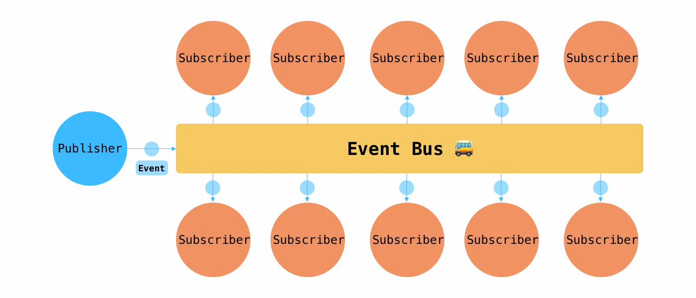

# Event bus

# Event bus pattern

- publish/subscribe 방식의 통신 패턴
- 컴포넌트 간 느슨한 결합 상태를 가짐
  - publisher: 메시지가 어디로 전송되는지 모른 채로 보냄
  - subscriber: 메시지가 어디서 왔는지 모른 채로 받음
  - publisher와 subscriber는 서로 모른 채 통신할 수 있음
    

## 메서드

- 기본적으로 구독/구독 취소 기능 메서드가 필요함
- e.g. Vue의 Events API
  - `on`: 이벤트 구독 (for subscriber)
  - `once`: 이벤트를 1회만 구독 (for subscriber)
  - `off`: 이벤트 구독 취소 (for subscriber)
  - `emit`: 이벤트 발생 (for publisher)

## 예제

```tsx
type EventCallback<T = any> = (data: T) => void;

class EventBus {
  private events: Map<string, EventCallback[]>;

  constructor() {
    this.events = new Map();
  }

  // 이벤트 구독
  on<T>(event: string, callback: EventCallback<T>): void {
    const listeners = this.events.get(event) || [];
    listeners.push(callback);
    this.events.set(event, listeners);
  }

  // 이벤트 발행
  emit<T>(event: string, data: T): void {
    const listeners = this.events.get(event);
    if (listeners) {
      listeners.forEach((callback) => callback(data));
    }
  }

  // 이벤트 구독 해제
  off<T>(event: string, callback: EventCallback<T>): void {
    const listeners = this.events.get(event);
    if (listeners) {
      this.events.set(
        event,
        listeners.filter((cb) => cb !== callback)
      );
    }
  }

  // 이벤트 한 번만 구독
  once<T>(event: string, callback: EventCallback<T>): void {
    const handler = (data: T) => {
      callback(data);
      this.off(event, handler);
    };
    this.on(event, handler);
  }
}

export const EventBusInstance = new EventBus();
```

```tsx
function App() {
  return (
    <>
      <Publisher />
      <Subscriber />
    </>
  );
}

const Publisher = () => {
  const handleClick = (name: number) => {
    EventBusInstance.emit('click_event', `${name}번 버튼`);
  };

  return (
    <>
      <button onClick={() => handleClick(1)}>1번 버튼</button>
      <button onClick={() => handleClick(2)}>2번 버튼</button>
    </>
  );
};

const Subscriber = () => {
  const [message, setMessage] = useState<string>('대기중');

  useEffect(() => {
    const callback = (data: string) => {
      setMessage(data);
    };

    EventBusInstance.on('click_event', callback);

    return () => {
      EventBusInstance.off('click_event', callback);
    };
  }, []);

  return <div>{message}</div>;
};
```

- Publisher가 이벤트 emit
- 이벤트가 emit됨에 따라 Subscriber에서 등록한 핸들러가 실행됨
- 이때 Publisher는 누가 이벤트를 받을지 모르고 Subscriber는 누가 이벤트를 발생시킨건지 모름

## 장단점

- 장점
  - 컴포넌트 간 결합도 낮음
  - 간단한 이벤트 발생/수신 방식
- 단점
  - 이벤트가 많아질 수록 추적이 어려워짐 (낮은 결합도로 인한 문제점)
  - 전역 상태 관리 도구와 함께 사용했을 때 복잡도 높아질 수 있음

## 용례

- 규모가 작거나 간단한 이벤트 처리가 필요한 경우 (상태 관리 도구보다 가벼운 선택지가 될 수 있음)
- Toast 알림, 모달/드롭다운메뉴 등등 UI 표현
- 특정 조건에서 트리거되는 이벤트가 있는 경우

# 참조

[https://dawchihliou.github.io/articles/event-bus-for-react](https://dawchihliou.github.io/articles/event-bus-for-react)
