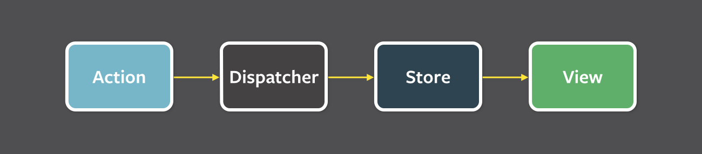

# Flux 패턴 잘 설명해 보자!

모든 리액트 Deep Dive 책의 상태 관리 파트를 읽고 있는데요.

Flux 패턴을 볼 때마다 **아는 것 같은데 말로 유려하게 설명하진 못하는 것 같아** 이 참에 제대로 정리해 보려 합니다.

# Flux 패턴의 등장 배경

Flux 패턴이 등장하기 전, 웹 앱이 비대해지고 상태도 많아짐에 따라 **어디서 어떤 일이 일어나 이 상태가 변했는지 추적하고 이해하기 어려운 상황**이었습니다.

페이스북 팀에서는 이러한 문제의 원인을 `양방향 데이터 바인딩`때문이라 봤는데요.

`뷰`(HTML)가 `모델`(Javascript)을 변경할 수도 있고, `모델`(Javascript)도 `뷰`(HTML)를 변경할 수 있어 코드를 작성할 땐 간단할 지 몰라도, **코드의 양이 많아지고 변경 시나리오가 복잡해질 수록 관리하기 어려워진다**는 문제점이 있었습니다.

그래서 페이스북 팀에서는 **단방향으로 데이터 흐름을 변경**하는 것을 제안하게 되고, 이 흐름이 Flux 패턴의 시작이 되었습니다.

# Flux 패턴이란

Flux 패턴을 한 줄로 설명하자면,

**단방향 데이터 흐름**을 따르며, 액션(Action), 디스패처(Dispatcher), 스토어(Store), 그리고 뷰(View)라는 4가지 핵심 요소로 구성된 소프트웨어 아키텍처 패턴입니다.



키워드는 단방향 데이터 흐름과 액션/디스패처/스토어/뷰라는 핵심 요소인 것 같습니다.

## 핵심 요소

Flux 패턴에는 4가지 핵심 요소가 있습니다.

### Action

처리할 작업과 새로운 데이터를 담고 있는 간단한 객체입니다.

### Dispatcher

Action을 Store로 보내는 역할의 함수입니다.

### Store

앱의 실제 상태 값과 상태를 변경할 수 있는 메서드를 가진 저장소입니다.

### View

Store의 상태 값을 바탕으로 화면을 렌더링하는 역할입니다.

> 결론적으로, `View`에서 `Action`을 생성하면 `Dispatcher`에 의해 `Store`로 전달되고, `Store`의 값이 바뀌면 `View`가 업데이트됩니다.

# 코드로 보는 Flux

다음 예시 코드를 통해 Flux의 데이터 흐름에 대해 살펴 보겠습니다.

```tsx
type StoreState = {
  count: number;
};
type Action = { type: 'add'; payload: number };

function reducer(prevState: StoreState, action: Action) {
  const { type: actionType } = action;
  if (actionType === 'add') {
    return {
      count: prevState.count + action.payload,
    };
  }
  throw new Error(`Unexpected Action [${actionType}]`);
}

export default function App() {
  const [state, dispatcher] = useReducer(reducer, { count: 0 }); // store 역할

  function handleClick() {
    dispatcher({ type: 'add', payload: 1 }); // action을 store로 전달합니다.
  }

  return (
    <div>
      <h1>{state.count}</h1>
      <button onClick={handleClick}>+</button>
    </div>
  );
}
```

코드의 흐름은 다음과 같습니다.

1. Store에 저장된 count 값으로 View를 그린다.
2. View의 버튼을 클릭하면 Action객체가 Dispatcher를 통해 Store로 전달된다.
3. Store는 상태 값 업데이트 함수(reducer 함수)에 따라 값을 업데이트한다.
4. 업데이트된 값을 바탕으로 새로운 View를 그린다.

다음 그림과 같은 형태로 데이터가 그려지는 것을 확인할 수 있고 이러한 데이터 흐름을 가지는 패턴을 Flux라고 합니다.


# Flux의 특징

이처럼 Flux 패턴을 활용하면 데이터 흐름은 모두 액션이라는 하나의 방향으로 줄어들기 때문에 데이터의 흐름을 추적하기 쉽고 코드를 이해하기 수월해진다는 장점이 있습니다.

물론 불편함도 존재하는데요. 사용자의 입력에 따라 데이터를 갱신하고 화면을 어떻게 업데이트해야 하는지 코드로 작성해야 하기 때문에 개발자에게 수고로운 점이 있습니다.

그렇지만 리액트는 대표적인 단방향 데이터 바인딩을 기반으로 한 라이브러리기 때문에 Flux 패턴과의 궁합이 잘 맞습니다.

# 정리

Flux 패턴이 무엇이냐고 묻는다면 다음과 같이 대답할 수 있을 것 같습니다.

단방향 데이터 흐름을 바탕으로 하는 소프트웨어 아키텍처 패턴으로 액션, 디스패쳐, 스토어, 뷰라는 4가지의 핵심 요소로 구성되어 있습니다.

액션은 처리하려는 작업의 종류와 새로운 데이터 값을 의미하고 디스패쳐는 이 액션 객체를 스토어에 전달해 주는 역할을 합니다. 스토어에서 관리하는 값은 액션과 스토어의 내부 값 업데이트 로직을 바탕으로 갱신되며 뷰는 변경된 데이터로 새로운 UI를 렌더링하게 됩니다.

이렇게 액션, 디스패쳐, 스토어, 뷰 순으로 단방향 데이터 흐름이 형성되는 패턴을 Flux 패턴이라고 합니다.

누가 묻는다면 잘 대답할 수 있길 바라며 글을 마칩니다.
