# hygen으로 공통 컴포넌트 템플릿 만들기 (컴포넌트 파일 생성 자동화)

# hygen이란

`hygen`은 **확장 가능한 코드 제너레이터**로 명령어를 통해 필요한 코드 파일을 빠르게 생성할 수 있도록 해 주는 라이브러리입니다.

이 라이브러리를 사용하면 컴포넌트 파일을 만들 때 필요한 액션들을 자동화하여 보일러 플레이트를 작성하는 데에 반복적으로 소요되는 시간을 줄일 수 있다는 장점이 있습니다.

또한, 일관된 파일 구조와 코드 스타일을 바탕으로 컴포넌트를 생성할 수 있습니다.

# 시작하기

라이브러리를 설치합니다.

```bash
npm i -g hygen
```

## 제너레이터

hygen에서는 **제너레이터**를 사용해 템플릿을 바탕으로 파일을 생성합니다.

다음과 같이 명령어를 입력하면 해당 제너레이터의 템플릿을 바탕으로 파일을 생성할 수 있습니다.

```bash
hygen [generator] [action] [name]
```

hygen 템플릿은 프로젝트 루트에 `/_templates` 폴더를 만들어 추가하면 됩니다.

또는 `hygen init self` 명령어를 입력해 기본적인 제너레이터를 만들 수 있으며, 명령어를 실행하면 다음과 같은 파일들이 생성됩니다.

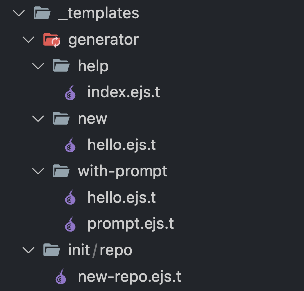

여기서 `/generator`는 `hygen init self` 명령을 통해 기본적으로 생성된 **제너레이터의 이름**을 의미합니다.

이때 제너레이터의 폴더 구조는 명령 구조와 동일합니다. 즉, `generator` 제너레이터는 `help`, `new`, `with-prompt`라는 **액션**을 가지며 해당 명령을 실행하면 각 액션 폴더 내부의 `ejs.t` 파일에 작성한 대로 파일을 생성할 수 있습니다.

### help

`generator`의 `help`는 제너레이터를 **문서화**할 수 있는 액션입니다.

`/help/index.ejs.t` 파일은 다음과 같이 generator 제너레이터가 제공하는 명령 사용법을 담고 있습니다.

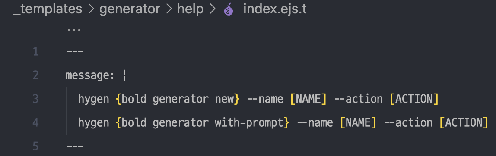

다음과 같이 help 명령을 입력하면 파일에 작성된 message를 확인할 수 있습니다.

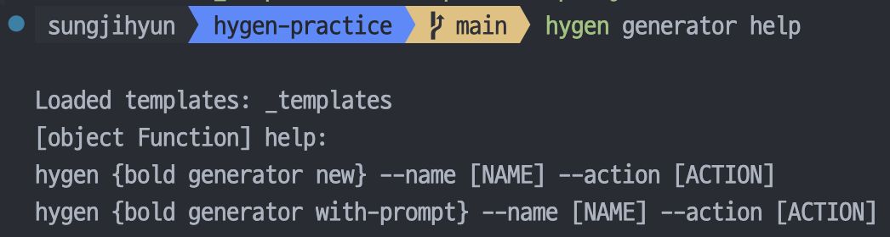

### new

`generator`의 `new`는 **새로운 제너레이터**를 만드는 액션입니다.

`/new/hello.ejs.t` 파일은 다음과 같이 `frontmatter`와 `body` 부분으로 구성되어 있는데요.

`frontmatter`는 액션을 정의하는 공간이고 `body`는 생성할 파일에 넣을 템플릿이 됩니다.

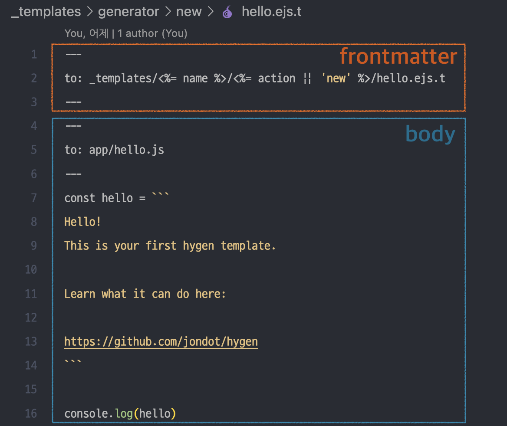

다음처럼 `generator new` 명령을 입력하면 `frontmatter`의 `to` 프로퍼티에 작성한 주소에 `body`를 담은 파일이 생성됩니다.

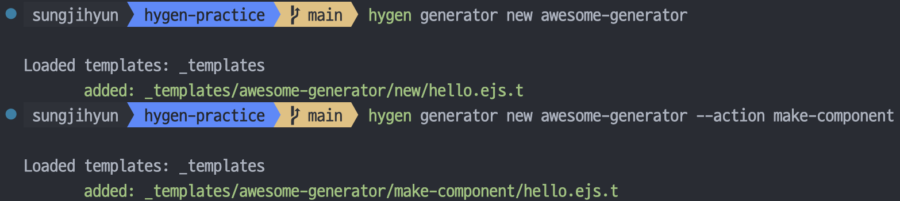

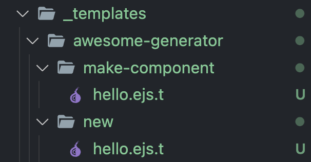

`generator`의 `new` 액션은 `_templates` 폴더에 파일을 생성하는 것이었기 때문에 **제너레이터를 생성하는 역할**을 했지만, `awesome-generator`의 `new` 액션은 단순히 `app/hello.js` 파일을 생성하는 역할을 합니다.

즉, 액션 폴더에 있는 `ejs` 파일로 해당 액션이 수행할 일을 작성할 수 있습니다.

### with-prompt

`generator`의 `with-prompt`는 프롬프트를 띄워 입력을 받은 다음 새로운 제너레이터를 만드는 액션입니다.

`new` 액션과 동일한 `/with-prompt/hello.ejs.t`파일과 더불어 `prompt.ejs.t` 파일을 가지고 있는데요.

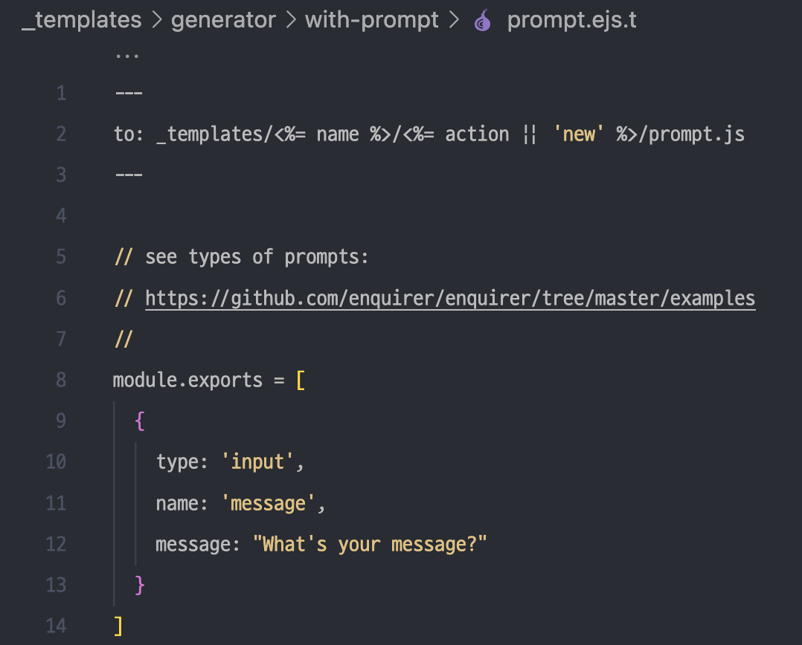

`prompt`는 **예약된 파일 이름**으로, 액션 폴더에 `prompt.js` 파일을 만들어주는 역할을 합니다.

`hygen generator with-prompt` 명령을 통해 만든 제너레이터를 실행하면 다음과 같이 프롬프트가 실행되고, 그 다음 `hello.ejs.t` 파일에 작성된 파일이 생성됩니다.

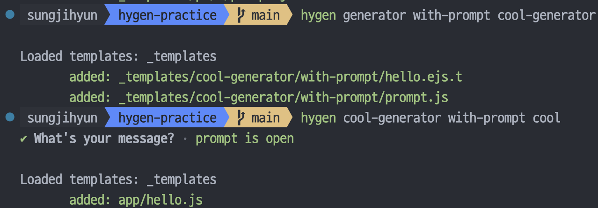

즉, 파일 생성에 필요한 값을 입력받는 데에 유용하게 사용할 수 있습니다.

# 공통 컴포넌트를 위한 제너레이터 만들기

이번에 간단한 디자인 시스템을 구축해 보려 하는데요. storybook과 공통 컴포넌트 테스트도 함께 진행하려니 몇 가지 작은 애로 사항이 있습니다.

- 컴포넌트 하나를 만들 때 생성해야 할 파일이 많음
- 비슷한 코드를 여러 번 작성해야 함
- 공동 작업인 만큼 일관된 코드 작성이 필요

이전에도 공통 컴포넌트를 만들 때 똑같은 일부 코드를 여러 번 작성해야 해서 파일 이름 기반으로 공통 컴포넌트를 작성해 주는 사용자 지정 snippet을 사용하기도 했었는데요.

파일 이름 형식과 컴포넌트 이름 형식이 다른 경우(예를 들어 파일 이름은 my-component인데 컴포넌트 이름은 MyComponent) 둘 중 하나는 다시 변경해 줘야해서 약간의 불편함이 있었습니다. 그리고 단순 snippet이기 때문에 파일 생성은 제가 직접 해야 하기도 하고요.

그래서 위 불편함들을 해결할 수 있는 hygen을 도입해 보려 합니다.

바로 공통 컴포넌트를 만드는 데에 필요한 제너레이터를 한 번 만들어 보겠습니다.

## 프롬프트 만들기

다음과 같은 파일 구조로 공통 컴포넌트를 관리하려 합니다.

```markdown
/
└── components/
├── button/
│ ├── Button.tsx
│ ├── Button.stories.tsx
│ └── Button.test.tsx
├── input/
│ ├── Input.tsx
│ ├── Input.stories.tsx
│ └── Input.text.tsx
└── index.ts
```

먼저, `hygen component common` 이라는 명령 구조를 사용하기 위해 `/_templates/component/common` 폴더를 생성합니다.

그리고 공통 컴포넌트의 이름과 컴포넌트 분류를 프롬프트로 받기 위해 `/_templates/component/common/prompt.js` 파일을 만들겠습니다.

프롬프트는 프로미스 체이닝 형식 처럼 구성할 수 있고, 직접 텍스트를 입력 받거나 옵션을 선택받는 것도 가능합니다.

또한, 입력에 유효성 검사도 수행할 수 있으며 다음과 같이 검사 후 error를 던지면 됩니다.

```jsx
module.exports = {
  prompt: ({ prompter, args }) =>
    prompter
      .prompt({
        type: 'input',
        name: 'component',
        message: '공통 컴포넌트 이름을 PascalCase로 입력하세요.',
      })
      .then(({ component }) => {
        if (!component) {
          throw new Error('컴포넌트 이름을 입력하세요.');
        }

        return prompter
          .select({
            type: 'input',
            name: 'folder',
            message: '해당 공통 컴포넌트의 분류를 선택해 주세요.',
            choices: ['button', 'input', 'typography', 'link', '직접입력'],
          })
          .then((choice) => {
            if (choice === '직접입력') {
              return prompter
                .prompt({
                  type: 'input',
                  name: 'folder',
                  message: '해당 공통 컴포넌트의 분류를 입력해 주세요.',
                })
                .then(({ folder }) => {
                  return {
                    component,
                    folder,
                    args,
                  };
                });
            }
            return {
              component,
              folder: choice,
              args,
            };
          });
      }),
};
```

위처럼 작성하면 `hygen component common`을 입력했을 때 다음과 같이 프롬프트가 실행됩니다.

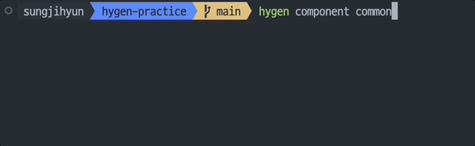

## 명령어로 생성하려는 파일 템플릿 만들기

저는 컴포넌트, 스토리북, 테스트 이렇게 3가지 파일을 생성하는 것과 components의 index 파일에 export 구문을 추가하는 것 이렇게 4가지 액션을 구성하려고 하는데요.

생성하려는 파일은 `ejs` 파일을 액션 폴더에 추가하고 작성하면 됩니다.

다음과 같이 `/_templates/component/common` 경로에 `component.ejs.t`, `stories.ejs.t`, `test.ejs.t` 파일을 만듭니다. (파일 이름은 어떤 걸로 지어도 상관 없습니다. 파일 내용이 중요할 뿐…!)

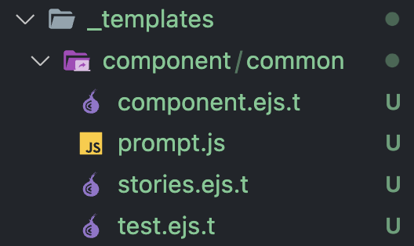

ejs 문법을 사용하면 프롬프트 실행을 통해 받은 정보인 `component`, `folder`를 활용해 템플릿을 구성할 수 있습니다. `<%= component %>` 형식으로 사용하면 됩니다.

프롬프트로 얻은 정보를 가지고 파일을 생성하려는 경로를 `frontmatter`의 `to` 프로퍼티에 작성하고, `body` 부분에 해당 파일을 채울 템플릿 코드를 작성해 줍니다.

지금은 동작만 확인하는 정도기 때문에 템플릿 코드는 대강 작성하도록 하겠습니다. 🤓

```perl
// component.ejs.t
---
to: app/components/<%= folder %>/<%= component %>.tsx
---
interface Props extends React.ComponentProps<''> {}

function <%= h.changeCase.pascal(component) %>({}: Props) {}

export default <%= h.changeCase.pascal(component) %>;
```

```perl
// stories.ejs.t
---
to: app/components/<%= folder %>/<%= component %>.stories.tsx
---
import <%= component %> from './<%= component %>'
```

```perl
// test.ejs.t
---
to: app/components/<%= folder %>/<%= component %>.test.tsx
---
import <%= component %> from './<%= component %>'
```

이렇게 작성하면 `to` 경로에 파일이 생성되고 그 내부는 `body`의 내용으로 채워지게 됩니다.

다음으로 index 파일을 구성해 보겠습니다.

저는 깔끔한 import문 정리를 위해 다음과 같이 한 모듈로 묶어 내보내는 index 파일을 자주 사용하는데요.

```tsx
// index.ts
export { default as Button } from './Button';
export { default as H1 } from './H1';
export { default as H2 } from './H2';
export { default as H3 } from './H3';
export { default as LinkItem } from './LinkItem';
export { default as NavLink } from './NavLink';
export { default as Paragraph } from './Paragraph';
```

컴포넌트를 만들 때마다 파일에 한 줄 추가하는 게 은근히 귀찮은 작업이더라구요. (까먹기도 하고..)

컴포넌트 만들 때마다 index 파일도 수정되게끔 자동화해 보겠습니다.

이번에는 `index.ejs.t` 파일을 만들고 다음과 같이 작성합니다.

```perl
---
inject: true
to: app/components/index.ts
append: true
---
export { default as <%= component %> } from './<%= folder %>/<%= component %>'
```

이번에는 `inject` 프로퍼티가 사용됐는데요, `to` 경로 파일에 `body` 내용을 추가하는 역할을 합니다. `append`는 마지막 줄에 코드를 추가하는 속성이에요. 저는 export문 정렬을 설정해놔서 코드를 어디에 삽입하던 상관없기 때문에 그냥 마지막 줄에 추가해줬습니다.

참고로 어디에 추가할지에 해당하는 프로퍼티(`append`, `prepend`, `at_line` 등)를 작성하지 않거나 `to`에 해당하는 파일이 존재하지 않는 경우 `inject`가 동작하지 않으니 유의해 주세요.

## 결과

`hygen component common`을 입력하고 프롬프트 응답을 완료하면 필요한 파일들이 한 번에 자동으로 생성됩니다.

index 파일까지 채워주니 너무 간편하네요…..🥹

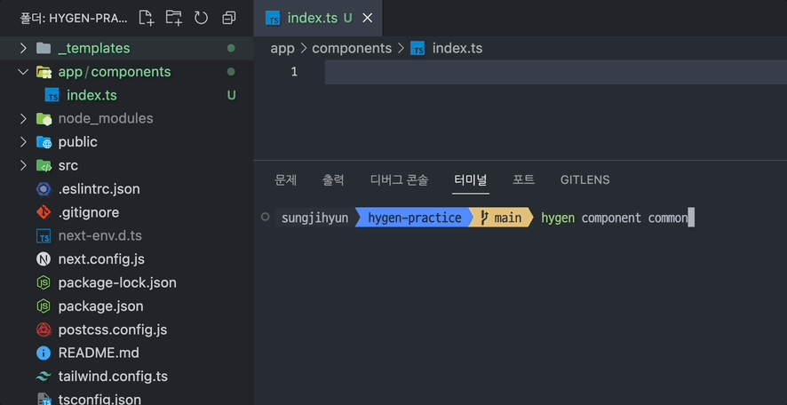

# 마치며

이렇게 은근히 시간이 많이 드는 파일 생성 부분을 자동화하여 CLI 기반으로 간편히 사용할 수 있는 방법에 대해 알아봤습니다.

중요한 것은 어떤 부분을 자동화할 것인지인 것 같다고 생각이 드네요.

자동화를 해 놓고 또 추가적인 수정이 들어간다면 또 다른 불편함이 생기니 프로젝트 셋팅 초반에 코드 컨벤션이나 파일 구조를 명확히 하고 자동화 작업에 들어가는 것이 좋겠습니다.
