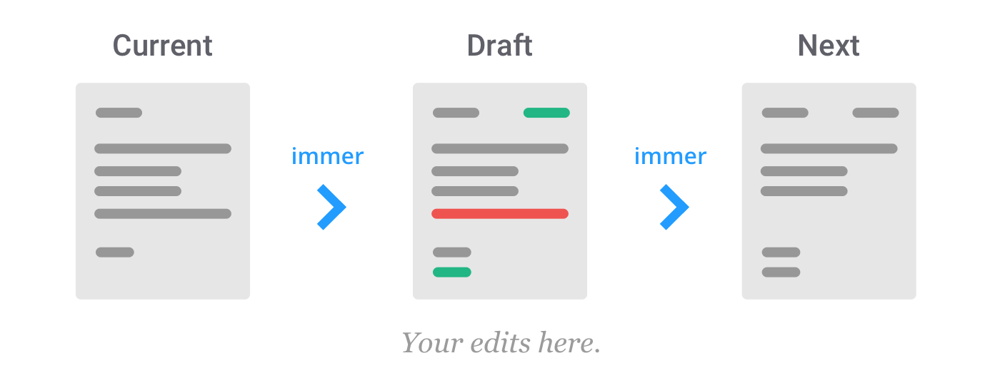

# Immer는 객체를 직접 조작하는 것 같은데도 어떻게 불변성을 유지하는걸까?

tags: immer, proxy
category: FAS
date: 2024/04/03
slug: immer-and-proxy
subtitle: 자바스크립트 내장 객체인 Proxy와 immer의 동작 원리 맛보기

Immer를 사용하면 상태 업데이트를 직접 조작하는 것처럼 보이지만, 실제로는 불변성이 유지된다는 특징이 있습니다.

다음과 같이 직접 속성을 변경하고, 객체를 직접 수정하는 메서드를 사용하더라도 원본을 훼손하지 않고 새로운 상태를 만들어 줍니다.

```tsx
import { produce } from 'immer';

const nextState = produce(baseState, (draft) => {
  draft[1].done = true;
  draft.push({ title: 'Tweet about it' });
});
```

어떻게 가능한 걸까요? 그에 대한 해답을 찾아 포스팅으로 풀어보려 합니다.

# How Immer works

Immer의 기본 아이디어는 **변경 사항을 현재 상태(currentState)의 프록시인 임시 초안(draft)에 적용하는 것**입니다. 모든 뮤테이션이 완료되면, Immer는 임시 초안을 바탕으로 새로운 상태(nextState)를 생성합니다.

즉, 초안(draft)을 조작함으로써 기존 상태는 건드리지 않고 새로운 상태를 만들게 되는 것입니다.



여담으로, 공식 문서에서는 Immer를 개인 조수(assistant)에 비유하고 있습니다. 내가 조수에게 A 편지를 주면, 조수는 변경 사항을 기록할 수 있는 A 편지의 사본을 내게 줍니다. 나는 사본을 수정하여 조수에게 넘겨주고, 조수는 나를 위해 불변의 최종 편지 A’를 만들어 줍니다.

# 여기서 Draft는 무엇일까?

Immer를 사용했을 때, 변경 사항이 적용되는 객체는 원본이 아닌 초안(draft)라는 것을 알았습니다. 그렇다면 이 초안의 정체는 무엇일까요?

## 프록시 (Proxy)

이전 챕터에서 초안은 **현재 상태의 프록시**라고 언급한 바 있습니다. 여기서 프록시는 자바스크립트 표준 내장 객체를 말합니다.

프록시는 **한 객체의 대한 기본 작업을 가로채고(intercept) 재정의(redefine)하는 객체**를 의미합니다. 프록시 객체는 `new Proxy(target, handler)`로 생성할 수 있으며, 각 매개변수는 다음과 같습니다.

- `target`: 프록시할 원본 객체
- `handler`: 가로채는 작업과 가로채는 작업을 재정의하는 방법을 정의하는 객체입니다.

예시로, target 객체의 프록시 객체를 만들어 보겠습니다. 이때 get이라는 작업을 다음과 같이 재정의하려 합니다.

```tsx
const target = {
  message1: 'hello',
  message2: 'everyone',
};

const handler = {
  get(target, prop, receiver) {
    return 'world';
  },
};

const proxy = new Proxy(target, handler);
```

target 객체의 프록시인 proxy를 만들어 다음과 같이 속성에 접근해 본다면 재정의에 의해 world를 출력합니다.

```tsx
console.log(proxy.message1); // world
console.log(proxy.message2); // world

console.log(target.message1); // hello
console.log(target.message2); // everyone
```

---

이번에는 set하려는 값이 숫자인 경우, 100을 곱한 값을 속성 값으로 사용하도록 set 작업을 재정의했습니다.

```tsx
const target = { a: 4 };

const handler = {
  set(obj, prop, value) {
    if (typeof value === 'number') {
      target[prop] = value * 100;
    } else {
      Reflect.set(...arguments); // 객체 속성의 값을 설정하는 정적 메서드 (기존 set과 동일하게 동작)
    }
  },
};

const proxy = new Proxy(target, handler);

target.b1 = 5; // 원본을 직접 수정
proxy.b2 = 5; // 프록시를 통해 수정

console.log(target); // > Object { a: 4, b1: 5, b2: 500 }
console.log(proxy); // > Object { a: 4, b1: 5, b2: 500 }
```

target을 직접 수정했을 때는 값이 그대로 적용되지만, 프록시 객체를 통해 수정할 때는 100을 곱한 값이 적용되는 것을 알 수 있습니다.

단, 재정의된 set 작업은 프록시 객체에만 유효합니다. 다음과 같이 c라는 속성에 객체를 할당하고, 할당한 객체에 속성을 넣어줄 때는 handler대로 동작하지 않습니다. → proxy.c는 프록시 객체가 아니기 때문입니다.

```tsx
proxy.c = {};
proxy.c.c1 = 5;
console.log(proxy); // > Object { a: 4, b1: 5, b2: 500, c: Object { c1: 5 } }
```

# 그래서 프록시를 어떻게 쓰는데?

그래서 Immer는 이 프록시를 어떻게 사용하고 있을까요? 라이브러리의 코드 몇 군데를 간단하게 확인해 보겠습니다.

## produce

Immer의 동작 원리를 알아보기 위해 produce 함수의 코드를 살펴 보겠습니다. 다음은 produce 함수의 핵심 로직만을 가져온 코드입니다.

```tsx
/**
 * @param {any} base - the initial state
 * @param {Function} recipe - function that receives a proxy of the base state as first argument and which can be freely modified
 */
produce: (base, recipe) => {
  const scope = enterScope(this);
  const proxy = createProxy(base, undefined);

  let result = recipe(proxy);

  return processResult(result);
};
```

로직을 정리하면 다음과 같습니다.

1. `produce` 함수는 현재 상태(`base`)와 현재 상태를 조작하는 함수(`recipe`)를 받습니다.
2. `scope`를 생성합니다.
3. 현재 상태를 바탕으로 `proxy`를 생성합니다.
4. `proxy`를 인수로 `recipe` 함수를 호출합니다.
5. 결과를 가공해 업데이트된 상태를 반환합니다.

즉, `recipe` 함수는 현재 상태(`base`)를 기반으로 생성한 `proxy`를 인수로 받아 조작함을 알 수 있습니다.

## [참고] immer 내부 메타 데이터 구성

```tsx
const state: ProxyState = {
  type_: isArray ? ArchType.Array : (ArchType.Object as any),
  // Track which produce call this is associated with.
  scope_: parent ? parent.scope_ : getCurrentScope()!,
  // True for both shallow and deep changes.
  modified_: false,
  // Used during finalization.
  finalized_: false,
  // Track which properties have been assigned (true) or deleted (false).
  assigned_: {},
  // The parent draft state.
  parent_: parent,
  // The base state.
  base_: base, // 원본 상태
  // The base proxy.
  draft_: null as any, // base의 프록시 객체
  // The base copy with any updated values.
  copy_: null, // base의 얕은 복사본
  // Called by the `produce` function.
  revoke_: null as any,
  isManual_: false,
};
```

## 프록시 핸들러

immer에서 프록시 객체 핸들러를 어떻게 구성했는지 살펴 보겠습니다.

### Get

접근하려는 객체의 프록시를 생성하는 역할을 합니다. recipe 함수는 base의 프록시를 인수로 받지만, base에 중첩된 객체들까지 프록시가 모두 생성된 것이 아니기 때문에 중첩된 객체를 조작하려면 프록시를 만들어야 합니다. 따라서 중첩된 객체에 동일한 핸들러를 적용하기 위해 중첩된 객체의 프록시를 생성하는 역할을 Get에서 수행합니다.

다음과 같은 조작을 한다고 가정했을 때, base는 target이기 때문에 target에 대한 프록시는 이미 만들어져 있지만, `target.nested1`에 대한 프록시는 없는 상황이기에 `target.nested1`에 대한 프록시를 만듭니다.

```tsx
target.nested1.att1 = 'newValue';
^^^^^^^^^^^^^^
// get이 호출되는 부분 -> target.nested1에 대한 프록시를 만든다.
```

코드로 살펴 보면 다음과 같습니다.

만약 recipe 함수에서 `target.nested1`에 접근한 적이 있거나, `target.nested1`이 원시 값이라면 프록시를 생성할 필요가 없습니다.

다만 첫 접근이고 원시 값이 아니라면 프록시를 만들어야 하고, 업데이트를 위한 복사본(`copy_`)을 만듭니다. 이때 복사본은 base를 얕은 복사한 것이며 실제로 조작이 발생하는 복사본입니다.

```tsx
get(state, prop) {
	if (prop === DRAFT_STATE) return state

	const source = latest(state)
	if (!has(source, prop)) {
		return readPropFromProto(state, source, prop)
	}
	const value = source[prop]
	if (state.finalized_ || !isDraftable(value)) {
		return value
	}
	if (value === peek(state.base_, prop)) {
		prepareCopy(state)
		return (state.copy_![prop as any] = createProxy(value, state))
	}
	return value
},
```

결론적으로, get 작업은 참조하는 값이 객체라면 프록시를 만들고 이미 참조한 적 있는 객체라면 이전에 만든 프록시를 재사용하는 역할을 합니다.

### Set

객체를 변경하고 객체가 변경되었다는 플래그를 설정하는 역할을 합니다.

원본의 복사본인 `copy_`를 변경함으로써 원본에 대한 불변성을 지키는 것을 확인할 수 있습니다. 이와 더불어 원본 값과 변경하려는 새로운 값이 동일하면 업데이트를 스킵하는 등의 대응을 하고 있습니다.

그리고 객체가 변경되었다면 `modified_` 값을 true로 변경합니다. 이때 `modified_` 값을 통해 객체가 변경되었다면 새로운 참조값을 사용하고, 변경되지 않았다면 기존 객체의 참조값을 그대로 사용하는 **structural sharing** 방식을 사용하는 최적화가 되어 있습니다.

```tsx
set(
	state: ProxyObjectState,
	prop: string,
	value
) {
	const desc = getDescriptorFromProto(latest(state), prop)
	if (desc?.set) {
		desc.set.call(state.draft_, value)
		return true
	}
	if (!state.modified_) {
		const current = peek(latest(state), prop)
		const currentState: ProxyObjectState = current?.[DRAFT_STATE]
		if (currentState && currentState.base_ === value) {
			state.copy_![prop] = value // 원본의 복사본을 변경
			state.assigned_[prop] = false
			return true
		}
		if (is(value, current) && (value !== undefined || has(state.base_, prop)))
			return true
		prepareCopy(state)
		markChanged(state) // modified_ = true로 변경
	}

	if (
		(state.copy_![prop] === value &&
			(value !== undefined || prop in state.copy_)) ||
		(Number.isNaN(value) && Number.isNaN(state.copy_![prop]))
	)
		return true

	// @ts-ignore
	state.copy_![prop] = value
	state.assigned_[prop] = true
	return true
},

export function markChanged(state: ImmerState) {
	if (!state.modified_) {
		state.modified_ = true
		if (state.parent_) {
			markChanged(state.parent_)
		}
	}
}
```

즉, set 작업은 객체가 변경되었는지 기록하는 역할을 수행합니다.

# 결론

결론적으로 **Immer는 객체를 직접 조작하는 것 같은데도 어떻게 불변성을 유지하는걸까?** 에 대한 답을 작성해 보자면,

**원본 상태에 대한 프록시 객체를 조작하는 것이며 프록시 객체의 핸들러에서 원본의 복사본을 조작하도록 기존 작업을 재정의해 두었기 때문에 원본을 건드리지 않는 업데이트가 가능하다**고 요약할 수 있겠습니다.

또한, structural sharing 방식을 사용함으로써 불필요하게 새로운 객체를 만들지 않도록 최적화가 되어 있다는 점도 알아가면 좋을 듯 합니다.

# 참고

[MDN Proxy](https://developer.mozilla.org/ko/docs/Web/JavaScript/Reference/Global_Objects/Proxy)

[deep-dive-to-immer](https://hmos.dev/deep-dive-to-immer)
