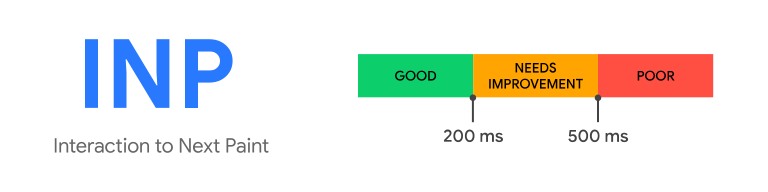

# 새로운 코어 웹 바이탈 항목: INP

## 기존 코어 웹 바이탈 항목

기존 코어 웹 바이탈은 다음과 같이 3가지 항목으로 구성되어 있었습니다.

- `LCP(최대 콘텐츠 페인트)`: 페이지의 주요 컨텐츠가 로드되기까지의 시간을 측정
- `FID(최초 입력 지연)`: 사용자가 페이지와 처음 상호작용할 때 느끼는 경험을 수치화
- `CLS(누적 레이아웃 변경)`: 시각적 안정성을 측정하고 표시되는 페이지 컨텐츠의 예상치 못한 레이아웃 변화량을 정량화

여기서 FID가 24년 9월 9일부터 지원이 종료될 예정이며, 이를 대체하는 INP라는 항목이 코어 웹 바이탈 항목에 새롭게 추가되었습니다.

첫 번째 입력만을 고려하는 등 FID의 한계점으로 인해 FID를 좀 더 발전시킨 항목이 추가되었다고 하네요.

즉, 이제 코어 웹 바이탈 항목은 `LCP`, `INP`, `CLS` 이렇게 3가지 입니다!

## INP: 다음 페인트에 대한 상호작용

INP는 페이지의 응답성을 평가하는 항목입니다. 사용자가 페이지를 방문하는 전체 기간에 발생하는 모든 클릭, 탭, 키보드 상호작용의 지연 시간을 관찰하여 사용자 상호작용에 대한 페이지의 전반적인 응답성을 평가합니다.

INP의 목표는 상호작용을 시작한 시점부터 다음 프레임이 그려질 때까지의 시간을 최소화하(기 위해 측정하)는 것입니다.

### 무엇이 “상호작용”에 해당하는가?

INP 측정을 위해 관찰하는 상호작용의 유형은 다음과 같습니다.

- 마우스 클릭
- 터치스크린 탭
- 물리적 키보드 또는 터치 키보드 누르기

### 좋은 INP 점수는?

INP는 사용자가 페이지를 떠날 때 계산되며 낮을 수록 좋은 점수입니다. 200ms 이하인 경우 양호, 500ms 초과하는 경우 나쁨으로 측정됩니다.

이때 상호작용이 많은 페이지의 경우 최악의 상호작용을 사용하면 잘못 해석될 소지가 있기 때문에 페이지 상호작용 수에 따라 특정 번째로 큰 상호작용을 INP로 기록합니다.

### INP는 FID와 어떻게 다른가?

INP는 FID의 후속 측정 항목이며, FID는 첫 번째 상호작용의 입력 지연만 측정하지만 INP는 **모든 상호작용을 관찰**하여 FID를 개선합니다.

FID는 사용자가 페이지에 느끼는 첫 인상을 평가하기 위한 항목이라면, INP는 페이지의 전반적인 응답성을 나타내기 위한 지표입니다.

### 상호작용이 발생하지 않는다면?

페이지가 로드되었지만 사용자가 INP 측정에 필요한 상호작용을 발생시키지 않았다면 INP 값이 반환되지 않을 수 있습니다.

### INP를 개선하려면?

#### 입력 지연 식별 및 감소

기본 스레드에서 발생하는 활동이 많은지 확인하여 가능한 빨리 이벤트 콜백 실행을 시작할 수 있도록 해야 합니다. 즉, 기본 스레드를 빠르게 비워야 합니다.

#### 이벤트 콜백 최적화

이벤트 콜백이 최대한 빠르게 완료될 수 있는지 확인해야 합니다. 콜백에서 가능한 적은 작업을 하도록 콜백을 작성하거나 이벤트 콜백의 작업을 별도의 작업으로 나누어 기본 스레드를 오래 차단하지 않도록 합니다. (ex. setTimeout 사용)

#### 프레젠테이션 지연 최소화

프레젠테이션 지연은 상호작용의 이벤트 콜백 실행이 완료된 시점부터 브라우저가 시각적 변경사항을 표시하는 다음 프레임을 그릴 수 있는 시점까지입니다.

일반적으로 페이지의 DOM이 작으면 렌더링 작업이 빠르게 완료되기 때문에, 페이지의 DOM을 작게 유지하거나 화면 밖 요소를 지연 렌더링하는 등의 최적화가 필요합니다.

# 참고

[https://web.dev/articles/inp?hl=ko](https://web.dev/articles/inp?hl=ko)

[https://web.dev/articles/optimize-inp?hl=ko#optimize_interactions](https://web.dev/articles/optimize-inp?hl=ko#optimize_interactions)

[https://ui.toast.com/posts/ko_20220512#최악의-상호작용-지연-시간을-선택하지-않는-이유](https://ui.toast.com/posts/ko_20220512#%EC%B5%9C%EC%95%85%EC%9D%98-%EC%83%81%ED%98%B8%EC%9E%91%EC%9A%A9-%EC%A7%80%EC%97%B0-%EC%8B%9C%EA%B0%84%EC%9D%84-%EC%84%A0%ED%83%9D%ED%95%98%EC%A7%80-%EC%95%8A%EB%8A%94-%EC%9D%B4%EC%9C%A0)
