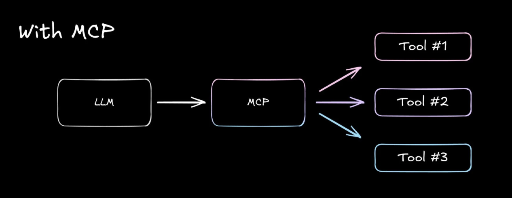

# MCP 쌩기초

# MCP가 해결하려는 문제

- 통제가 쉬운 AI 툴
  - 툴이란? LLM이 외부 세계와 상호작용하게 하는 코드 모듈. JSON 또는 함수매개변수를 모델에 노출하는 API 래퍼
    - 툴은 매우 많지만 연결하는 것은 어렵게 느껴짐

## 어렵게 느껴지는 이유

1. API 과부하, 컨텍스트 부족
   - API의 엔드포인트는 자체적인 도구가 됨 → 상세한 문서화가 필요
   - 언제 호출, 어떤 엔드포인트를 사용, 각 엔드포인트의 스키마/인증 헤더/페이지네이션 및 오류 등등.. 기억할 것이 많음
   - e.g. Q4 보고서에 대해 이메일 보냈어? 라고 물으면 AI는
     - 이것이 이메일 쿼리임을 인식 (Slack/docs 등이 아님)
     - `search_messages` 엔드포인트를 선택
     - `sender:"mohab@company.com"` 및 `contains:"Q4 report"`를 포함한 JSON으로 포맷
     - 결과가 많은 경우 페이지네이션 처리
     - 응답을 올바르게 파싱
   - 여기서 문제점 : LLM의 컨텍스트 윈도우가 제한적
     - 이 모든 정보를 시스템 프롬프트에 넣으면 과적합될 위험
     - 적응력있는 문제 해결 모델 → 융통성 없는 매뉴얼 기계
2. 단계별 API
   - 간단한 작업도 여러 개의 엔드포인트를 필요로함
   - e.g. crm 연락처를 업데이트하려면
     - `get_contact_id` 호출
     - `read_contact`로 현재 데이터 가져오기
     - `patch_content`를 통한 업데이트
   - 각 단계마다 매개변수가 잘못 인식되거나 잘못 라우팅된 호출의 위험 있음
3. 설계상 취약
   - API가 변경되면 새로운 엔드포인트가 개발되고 OAuth 플로우가 업데이트됨
   - 서비스가 업그레이드될 때마다, 현재 설정이 AI 에이전트의 머슬 메모리를 손상시킬 위험
4. 모델 고정
   - 모델을 변경하려면 툴 디스크립션을 다시 작성해야 함
   - API의 세부사항을 모델 프롬프트에 통합하여 업그레이드를 어렵게 함

→ 웹이 HTTP 메서드를 표준화한 것처럼, AI 툴도 모델이 어떻게가 아닌 무엇을 해야 하는지에 집중할 수 있게 하는 범용적인 프로토콜이 필요. 확장 가능하고 안정적일 수 있도록 표준화가 필요함

# MCP가 툴 호출 방식을 개선하는 방법

- MCP는 툴 통합의 복잡한 문제를 해결하기 위한 최초의 대규모 시도
- AI 모델과 외부 서비스 간 꼭 필요한 추상화의 역할

## 기능을 제한하지 않고 연결을 표준화하는 방법

1. 균일한 툴 디스커버리
   - API 스키마를 처리하도록 강제하는 대신, 모델이 검색할 수 있는 표준화된 툴 디렉토리 도입 (일종의 앱스토어)
   - 서비스는 일관된 JSON-RPC 형식을 사용하여 수행할 수 있는 작업과 이를 수행하는 방법을 설명
   - AI는 툴을 언제, 왜 사용해야하는지에만 집중할 수 있음
2. 효율적인 컨텍스트 관리
   - 툴은 모델 컨텍스트 윈도우 공간을 소모함
   - 아래 방법으로 시스템 프롬프트의 크기를 간소화
     - 매개변수 형식 표준화 (case 등등)
     - 도구 간 오류 처리 최소화
     - 자연어를 통해 모델이 이해하기 쉽고 간결한 버전 관리된 API 설명 사용
3. 추상화를 통한 명확한 분리
   - OAuth 2.0 플로우로 인증을 표준화하여 필요한 보안을 제공
   - 모든 MCP 기능에 대해 세분화된 권한 범위(read only, write only, …) 설정 가능
     - 즉, 예측 불가능한 시스템에 있어 필수적인 최소 권한 원칙을 강제

# MCP가 내부적으로 작동하는 방식

- 역할
  - 클라이언트
    - cursor, windsurf, cline, asari,claude desktop 등등
    - 시스템의 프론트엔드 간의 통신을 처리
  - 서버
    - 클라이언트/AI와 서비스 제공자 사이의 중재자이자 범용적인 어댑터
    - 표준화된 JSON-RPC 인터페이스를 통해 기능을 제공 → 모든 호환 클라이언트가 서치/액세스 가능
    - 자연어와 구조화된 형식으로 툴을 설명, 인증 핸드셰이크 처리, 동일한 MCP 언어를 사용하도록 보장
  - 서비스 제공자
    - slack, notion, github 등 실제 작업을 수행하는 플랫폼
    - 기존 API를 변경할 필요 없음. MCP 서버가 적응의 역할을 함
- 기능
  - 툴
    - LLM이 서버를 통해 작업을 수행하도록 활성화
    - 외부 시스템과 상호작용, 계산 수행, real world의 액션
  - 리소스
    - 서버의 데이터와 콘텐츠를 LLM에 노출. 지속적인 AI 경험 (채팅창이 닫힌다고 잊어버리지 않는)
    - 클라이언트가 읽을 수 있는 데이터를 서버가 보여줄 수 있게 하고 LLM 상호작용의 컨텍스트로 사용할 수 있는 개념
    - 새로운 개념은 아니고, (MCP를 사용하면) 클라이언트가 모델에 리소스 사용 방법을 한 번 보여주면, 모델은 그 중 하나를 읽고 쓸 수 있음
    - 현재 대다수의 MCP 클라이언트에 구현되어 있진 않은 상황
  - 프롬프트
    - AI가 필요에 따라 접근할 수 있는 사용 설명서 또는 스타일 가이드
    - 예를 들어 어떤 행동을 하기 전에 수행해야 하는 일이 있다면 프롬프트로 시킴
      - 미니 워크플로우

# MCP는 무엇을 바꿀 수 있나?

- 엔터프라이즈 AI. 내부 API를 AI 모델에 안전하게 연결
- 간편한 워크플로우 작성
- 플러그인 가능한 서버로 다양한 기능을 쉽게
- AI 친화적인 도구 개발 용이

## 현재의 한계점

- 제대로 작동시키려면 개발자 역량 필요
- 공식 서버 부족. 커뮤니티 중심
- 클라이언트 채택은 초기 단계
- 프로토콜 자체에 보완이 필요
- 제한적인 모델 지원
- 인적 감독 필요

→ 현재는 막 표준화된 툴 생태계를 만들어나가는 단계

# 출처

- https://velog.io/@surim014/model-context-protocol
- [https://www.builder.io/blog/model-context-protocol](https://www.builder.io/blog/model-context-protocol)
